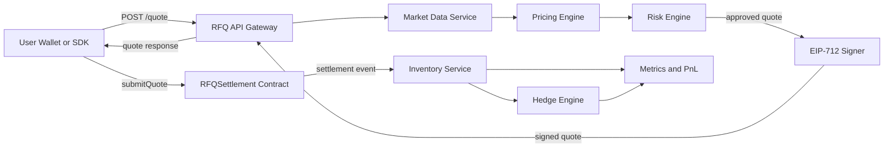
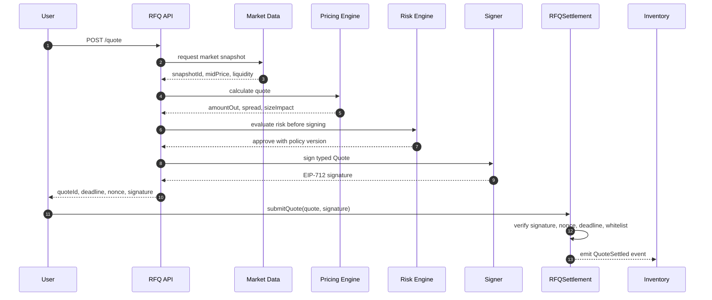
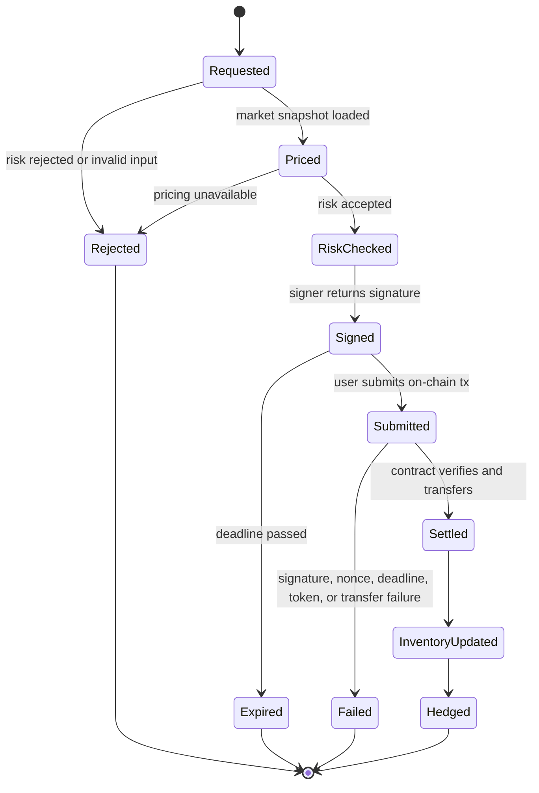

# Chapter 01: Why RFQ

## Abstract

本章讨论为什么一个生产级 Web3 做市系统不能只依赖传统 AMM 曲线，而需要采用 RFQ 与 Prop AMM 结合的架构。AMM 解决了链上交易最早期的可用性问题：任何人都可以向池子提供流动性，任何人都可以在无需许可的情况下完成兑换，价格由链上状态和确定性函数给出。然而，专业做市面对的不是“是否能成交”这一单点问题，而是“是否能在可解释、可风控、可对冲、可审计的条件下持续成交”。这要求系统在报价前理解市场、库存、风险、对冲成本和执行窗口，并在链上结算时保证用户提交的内容与做市商签名授权的内容完全一致。

RFQ，即 Request For Quote，是一种询价式交易模型。用户先提交交易意图，做市系统根据当前市场数据、内部库存和风险状态生成报价，再用 EIP-712 对报价进行签名。用户拿到 Signed Quote 后，在较短 TTL 内提交到链上合约结算。合约不重新计算复杂价格，也不执行链下风险逻辑，而是验证签名、nonce、deadline、chainId、token、amount 和最小成交约束。通过这种分层，系统把复杂策略留在链下，把最终授权和资产转移留在链上。

本项目选择 RFQ + Prop AMM，不是因为 AMM 不重要，而是因为专业做市需要比纯 AMM 更强的控制面。Prop AMM 作为链下报价模型，仍然保留自动化做市思想，但它不被单一链上曲线限制，可以纳入外部价格、订单簿深度、波动率、库存偏斜、风险限额、对冲路径和流动性成本。RFQ 则把这个链下决策封装成可验证、短生命周期、不可篡改的链上执行授权。

## Learning Objectives

读完本章后，读者应能够：

- 解释 AMM 为什么出现，以及它解决了链上交易的哪些基础问题。
- 说明纯 AMM 对专业做市的限制，包括 Price Impact、库存管理、风险管理、MEV 和报价执行不一致。
- 定义 RFQ、Signed Quote、TTL 和 EIP-712 在交易链路中的职责。
- 描述 RFQ 从询价到链上结算的完整流程。
- 比较 RFQ 与 AMM 的工程权衡。
- 解释为什么本项目采用 RFQ + Prop AMM 作为核心交易模型。
- 在高级 Web3 工程师面试中清晰表达该架构的设计边界和风险缓解方式。

## Background

AMM 的出现与链上环境的约束直接相关。早期去中心化交易系统很难照搬中心化交易所的订单簿模型，因为每一次挂单、撤单、撮合和状态更新都需要链上交易，成本高、延迟大，还会受到区块确认和 gas 市场影响。AMM 将交易抽象为与池子的交互：流动性提供者把资产注入池子，交易者按确定性公式兑换资产，价格由池内资产比例决定。最典型的恒定乘积模型使用 `x * y = k`，它让链上交易在没有中心化撮合引擎的情况下也能持续发生。

这种模式极大降低了链上流动性的启动门槛。对于长尾资产、小额交易和无许可市场，AMM 是非常有效的基础设施。它把做市能力从专业机构手中开放出来，让任何人都可以提供流动性，并通过 LP token 分享手续费收入。它还提高了 DeFi 的可组合性：借贷协议、聚合器、收益策略和衍生品协议都可以把 AMM 池当成公开价格和流动性来源。

但是，AMM 的优势来自简化，问题也来自简化。链上曲线只知道池内余额，不知道做市商的总库存，不知道外部中心化交易所深度，不知道当前波动率是否异常，不知道某个用户的订单是否有毒，也不知道执行之后应该怎样对冲。专业做市不是简单地把两种资产放进池子等待交易，而是在持续变化的市场中管理价格、库存、风险、延迟、流动性和对冲成本。

因此，当目标从“让交易能发生”升级为“让专业做市长期稳定运行”时，系统架构必须发生变化。RFQ 提供了一种更适合专业做市的分层：链下计算复杂报价，链上验证授权并结算资产。这个分层让做市商可以在签名前完成完整判断，也让用户可以拿到一个明确、有签名、有期限、有最小成交保护的报价。

## Problem Statement

本项目要解决的问题是：如何构建一个适合生产环境的 Web3 RFQ / Prop AMM 做市系统，使其既能利用链上结算的透明性和自托管优势，又能满足专业做市对报价质量、风险控制、库存管理和可观测性的要求。

如果只使用纯 AMM，系统会遇到以下关键问题。第一，价格由池内余额和固定函数决定，大额交易会产生明显 Price Impact。第二，库存管理被动发生，LP 或做市方只能在池子层面暴露资产，很难根据全局风险动态调整。第三，风险管理滞后，链上交易发生时系统无法先检查内部限额、对冲成本和市场异常。第四，交易暴露在公开 mempool 中，容易被 MEV 搜索者利用。第五，用户看到的前端 quote 与链上实际 execution 之间可能不一致，因为交易确认前池子状态已经变化。

RFQ 试图把这些问题拆开。用户不是直接与固定曲线交易，而是向做市系统发起询价。系统在链下读取市场数据、计算报价、检查风险、生成签名，再把结果返回给用户。用户提交交易时，链上合约只接受被授权的报价。这样，报价和执行之间有一个明确的密码学绑定关系：如果任何字段被篡改，签名验证会失败；如果报价过期，deadline 验证会失败；如果 quote 被重复提交，nonce 验证会失败。

## Requirements

### Functional Requirements

RFQ 系统至少需要满足以下功能要求：

- 支持用户通过 `POST /quote` 提交交易意图，包括 chainId、user、tokenIn、tokenOut、amountIn 和 slippageBps。
- 支持 Market Data Service 提供中间价、深度、波动率和流动性状态。
- 支持 Pricing Engine 计算 amountOut、spread、size impact 和 inventory skew。
- 支持 Risk Engine 在签名前判断交易是否超过库存、notional、token、chain、用户或流量风险限制。
- 支持 Signer Service 使用 EIP-712 对 Quote 结构签名。
- 支持用户在 TTL 内把 quote 和 signature 提交到 `RFQSettlement` 合约。
- 支持合约验证 trusted signer、nonce、deadline、chainId、token whitelist、amount 和 minAmountOut。
- 支持成交后通过事件驱动库存更新、对冲和指标记录。

### Non-Functional Requirements

系统还需要满足以下非功能要求：

- 报价延迟必须可控，特别是 p95 和 p99 延迟应纳入监控。
- 风控决策必须可解释，拒绝报价应记录 reason code 和 policy version。
- 签名密钥必须隔离，不能散落在普通业务服务中。
- 链上合约必须保持最小化，减少攻击面和审计复杂度。
- 所有关键状态变化必须可观测，包括 quote requested、quote rejected、quote signed、quote submitted、quote settled、inventory updated 和 hedge executed。
- 系统必须支持幂等消费链上事件，避免重放或链重组造成重复库存更新。
- 文档、图表和 ADR 必须能支撑面试和开源审查。

## Existing Solutions

纯 AMM 是最常见的链上兑换方案。它适合无需许可的公开流动性，但做市策略基本被池子公式限制。集中流动性 AMM 改善了资本效率，让 LP 可以在价格区间内提供流动性，但它仍然主要围绕池内状态运行，无法完整表达链下风险。

链上订单簿提供更接近传统交易所的市场结构，但在通用链上环境中，挂单、撤单、撮合和撮合后结算成本较高，也会引入复杂的状态管理。某些高性能链或 AppChain 可以改善这一点，但本项目目标是构建通用 Web3 RFQ 参考架构，而不是依赖特定链的撮合能力。

DEX Aggregator 可以为用户寻找多个池子的最优路径，但它本质上是在公开流动性之间路由，不能替代做市商内部定价、库存、风险和对冲系统。Aggregator 可以成为 RFQ 系统的一个输入或 fallback，但不应成为核心做市模型。

中心化 RFQ 系统在传统金融和部分机构加密交易中广泛存在。它们通常拥有强大的报价和风控能力，但链上可验证性弱，用户必须完全依赖平台记账。本项目采用 Web3 RFQ，是希望保留链上自托管和合约验证，同时吸收专业 RFQ 的工程优势。

## Trade-Off Analysis

RFQ 的最大优势是把报价决策前置。做市系统可以在签名前检查市场状态和内部风险，不需要等交易进入链上后才被动响应。它还可以把报价承诺限定在短时间窗口内，避免长时间暴露在市场波动中。通过 EIP-712，用户提交的结构化 quote 与做市商签名绑定，合约能确定这笔交易确实被授权。

RFQ 的代价是引入链下服务依赖。用户需要请求 API，报价服务需要在线，签名服务需要可用，风控服务不能成为瓶颈。如果这些服务不可用，交易就无法获得新报价。相比纯 AMM，RFQ 的无许可程度更低，透明性也不同：用户可以验证签名和链上结算，但不能看到完整私有定价模型。

专业做市系统通常接受这种权衡，因为它解决的是另一个层级的问题：不是只要任何价格都能成交，而是要在合理 spread、可控库存、可解释风险和可审计执行下成交。对大额订单、机构流量、跨 venue 对冲和多资产库存管理而言，RFQ 的工程收益通常高于链下依赖带来的复杂度。

## System Design

本项目采用 RFQ + Prop AMM 架构。用户通过前端或 SDK 调用 `/quote`，API Gateway 校验请求格式和资产支持范围，然后请求 Market Data Service 获取最新市场快照。Pricing Engine 使用该快照、内部库存、交易尺寸、波动率和对冲成本计算报价。Risk Engine 在报价签名前检查交易是否符合策略。如果风险通过，Signer Service 生成 EIP-712 signed quote，并返回 quoteId、snapshotId、amountOut、minAmountOut、deadline、nonce 和 signature。

用户随后调用 `/submit` 或直接通过钱包提交链上交易。`RFQSettlement` 合约根据 Quote 结构和 signature 进行验证。验证通过后，合约使用 SafeERC20 转移 token，并发出结算事件。链下 Execution 或 Indexer 监听事件，更新 Inventory Service，触发 Hedge Engine，对冲结果和 PnL 写入指标与分析存储。

系统关键点是职责分离。Pricing Engine 不持有签名密钥，Risk Engine 不执行链上转账，Signer Service 不决定业务风险，合约不重新计算复杂价格。每个组件都只做自己必须做的事情，组件之间通过明确字段和事件衔接。

## Architecture Diagram



## Sequence Diagram



## State Machine



## Data Model

核心 Quote 结构应保持稳定，方便链下签名和链上验证：

```solidity
struct Quote {
    address user;
    address tokenIn;
    address tokenOut;
    uint256 amountIn;
    uint256 amountOut;
    uint256 minAmountOut;
    uint256 nonce;
    uint256 deadline;
    uint256 chainId;
}
```

链下还应记录扩展字段，例如 `quoteId`、`snapshotId`、`pricingVersion`、`riskPolicyVersion`、`signer`、`requestLatencyMs`、`riskDecision`、`rejectReason`、`submittedTxHash`、`settlementStatus` 和 `inventoryDelta`。这些字段不一定都进入链上 Quote，因为链上结构越大，gas 和验证复杂度越高。链上字段只保留影响授权和结算的最小集合，链下字段用于审计和运营。

## API Design

第一阶段只固定 API 方向，不实现服务。未来 `POST /quote` 接收如下请求：

```json
{
  "chainId": 1,
  "user": "0xUser",
  "tokenIn": "0xUSDC",
  "tokenOut": "0xWETH",
  "amountIn": "1000000000",
  "slippageBps": 50
}
```

成功响应包含：

```json
{
  "quoteId": "q_abc123",
  "snapshotId": "s_98765",
  "amountOut": "332100000000000000",
  "minAmountOut": "330400000000000000",
  "deadline": 1730000000,
  "nonce": "12345",
  "signature": "0x..."
}
```

失败响应应区分输入错误、资产不支持、风险拒绝、市场数据不可用、签名服务不可用和系统限流。错误码需要对用户可理解，但不能泄露过多内部风控策略。例如可以返回 `RISK_REJECTED`，并附带通用说明，而不是暴露具体库存阈值。

## Engineering Decisions

第一个工程决策是选择 RFQ + Prop AMM，而不是纯 AMM。原因是本项目的目标是生产级专业做市，不是最小化链上 swap。专业做市需要在签名前完成风险判断，并在成交后更新库存和对冲。纯 AMM 难以表达这些流程。

第二个工程决策是采用 EIP-712 签名。相比简单签名 hash，EIP-712 提供 typed data、domain separator 和更好的钱包展示能力。domain 中应包含 name、version、chainId 和 verifyingContract，以降低跨合约、跨链和跨版本重放风险。

第三个工程决策是让合约保持最小化。合约只验证签名和执行转账，不接入复杂价格公式，不调用外部预言机计算动态价格，也不实现链下风险模型。这样可以降低攻击面，并让审计重点集中在授权、重放、过期、资产转移和权限控制上。

第四个工程决策是所有关键流程必须可观测。RFQ 系统的故障经常不是单个交易失败，而是报价延迟升高、风控拒绝率异常、签名队列积压、库存事件延迟或对冲失败。因此，系统必须从第一天就设计 quote funnel、latency、reject reason、settlement result 和 inventory exposure 指标。

## Failure Scenarios

第一类失败是市场数据不可用。如果 Market Data Service 无法提供可信快照，系统不应继续签名。缓解方式是返回明确错误、触发告警，并可在低风险场景使用降级价格源，但降级策略必须有更宽 spread 和更低 notional limit。

第二类失败是风控拒绝。风险拒绝不是系统错误，而是正常业务结果。系统应该记录原因和策略版本，向用户返回可理解的错误，并避免泄露内部阈值。

第三类失败是签名服务不可用。Signer Service 是关键依赖，必须有隔离部署、访问控制、限流和监控。签名服务不可用时，系统应停止返回可执行 quote，而不是绕过签名或使用不安全 fallback。

第四类失败是用户提交过期 quote。合约应根据 deadline 拒绝，用户端应提示重新询价。短 TTL 会提高失败率，但这是控制市场风险的必要成本。

第五类失败是链上事件消费延迟。成交已经发生但库存系统尚未更新时，后续报价可能基于过期库存。缓解方式包括事件消费延迟告警、库存保守扣减、quote notional limit 和幂等重放机制。

第六类失败是链重组。Indexer 必须根据确认数更新最终状态，库存系统需要能回滚或修正已消费事件。所有 inventory update 应绑定 transaction hash、log index 和 block number。

## Security Considerations

RFQ 系统的安全边界包括签名密钥、合约验证、链下 API 和事件消费。签名密钥必须被视为高价值资产。攻击者如果能获取签名权限，就可能制造恶意 quote。因此 Signer Service 应该只接受经过 Risk Engine 批准的请求，并限制 chainId、token、notional、deadline 和调用方身份。

EIP-712 domain 必须正确设计，避免跨链或跨合约重放。Quote 结构中的 `chainId`、`user`、`tokenIn`、`tokenOut`、`amountIn`、`amountOut`、`minAmountOut`、`nonce` 和 `deadline` 都是授权语义的一部分，不能在链上执行时被替换。合约必须先验证签名，再标记 nonce，最后执行转账，并确保失败时状态不会错误更新。

MEV 不能被 RFQ 完全消除。RFQ 可以减少价格在链上被曲线即时影响的风险，但用户提交交易仍可能暴露在 mempool 中。系统可以结合私有交易通道、短 TTL、合理 `minAmountOut`、对冲延迟监控和异常成交分析降低风险。

资产安全同样重要。系统应谨慎支持 fee-on-transfer、rebasing、黑名单或非标准 ERC20。默认 token whitelist 应从标准资产开始，任何新资产都需要安全评估、流动性评估和运营审批。

## Performance Considerations

RFQ 性能瓶颈通常出现在市场数据读取、定价计算、风险检查、签名和持久化。由于用户等待 quote 响应，`POST /quote` 的 p99 延迟直接影响体验。系统应使用 Redis 缓存短期市场快照，对高频数据采用流式更新，对风险限额使用本地缓存加事件同步，避免每笔请求都进行重型数据库查询。

Pricing Engine 需要在精度和延迟之间取舍。复杂模型可以提高报价质量，但过高延迟会让市场状态更容易漂移。生产系统通常会把模型拆成实时路径和离线路径：实时路径只执行必要计算，离线路径更新参数、训练风险模型或分析成交质量。

Signer Service 应避免成为单点瓶颈。签名吞吐应被监控，签名队列长度应进入告警。为了减少风险，不能简单地无限扩展签名服务而不加约束；扩展必须与权限、限额和审计一起设计。

## Testing Strategy

合约测试应覆盖签名验证、错误 signer、错误 chainId、deadline 过期、nonce 重放、token 不在 whitelist、pause 状态、reentrancy、SafeERC20 转账失败和 `minAmountOut` 保护。测试不应只验证 happy path，因为 RFQ 合约的核心价值正在于拒绝未授权或过期交易。

后端测试应覆盖 quote request validation、market data unavailable、pricing failure、risk reject、signer unavailable、quote persistence 和 metrics emission。Risk Engine 和 Pricing Engine 需要独立单元测试，因为它们承载核心业务逻辑。

系统测试应覆盖完整链路：用户请求 quote，系统签名，用户提交链上交易，合约结算，事件被消费，库存更新，对冲任务生成，指标可见。该测试可以从本地 Foundry 链和 Docker Compose 环境开始，后续扩展到测试网。

文档测试也很重要。Mermaid 图必须可渲染，OpenAPI 和实际接口应保持一致，ADR 应能解释关键设计选择。对于开源项目和面试项目，文档质量本身就是工程能力的一部分。

## Interview Notes

面试中解释 RFQ 时，不应只说“RFQ 更快”或“RFQ 更适合机构”。更准确的表达是：RFQ 将报价生成和风险判断放在链下，将授权验证和资产结算放在链上。它解决的是专业做市中的 quote / execute consistency、inventory-aware pricing、risk-before-signing 和 short-lived execution commitment。

当被问到为什么不用纯 AMM 时，可以从五个角度回答。第一，AMM 的价格由池子状态决定，大额交易 Price Impact 明显。第二，AMM 不能天然理解做市商全局库存和对冲成本。第三，AMM 难以在成交前执行复杂风险判断。第四，公开 mempool 中的 AMM swap 容易受到 MEV 影响。第五，用户看到的 quote 可能与链上执行结果因状态变化而不一致。

当被问到 RFQ 的风险时，也要诚实说明。RFQ 引入链下服务依赖，需要保障 API、风控、签名和事件消费的可用性。签名密钥是高价值资产，必须隔离和审计。短 TTL 会提高失败率，但它是控制市场风险的必要手段。RFQ 不会完全消除 MEV，只是改变风险形态并提供更多缓解手段。

当被问到 Prop AMM 时，可以说明它不是部署在链上的固定曲线池，而是做市商私有的自动报价模型。它继承 AMM 的自动化报价思想，但可以纳入外部市场价格、库存偏斜、风险限额、波动率和对冲成本。RFQ 把 Prop AMM 的输出变成短生命周期 signed quote，由链上合约验证执行。

## Summary

AMM 是 DeFi 的基础创新，它让链上交易在没有中心化撮合引擎的情况下成为可能。但生产级专业做市需要的不只是可交易性，还需要报价质量、风险前置、库存控制、对冲闭环、执行一致性和可观测性。纯 AMM 很难完整满足这些要求。

RFQ + Prop AMM 提供了更合适的架构分层。链下系统负责复杂决策，包括市场数据、定价、风险、签名、库存和对冲；链上合约负责最小且确定的验证与结算，包括 EIP-712 signature、trusted signer、nonce、deadline、token whitelist 和 SafeERC20 transfer。这个分层让系统既能保留链上结算的可验证性，又能支持专业做市所需的复杂策略。

本项目从第一章开始固定这一设计方向：Quote and execution consistency 是核心不变量；Risk must be evaluated before quote signing；Signed quotes must be short-lived；Smart contracts should be minimal and deterministic。后续章节会在此基础上展开 Prop AMM 演进、需求分析、系统总览、微服务拆分、失败恢复和架构审查。

## References

- EIP-712: Typed structured data hashing and signing
- OpenZeppelin Contracts: SafeERC20, ReentrancyGuard, Pausable, AccessControl
- Uniswap v2 whitepaper and constant product market maker model
- Uniswap v3 concentrated liquidity design
- CoW Protocol and intent based trading references
- 0x RFQ and market maker quote models
