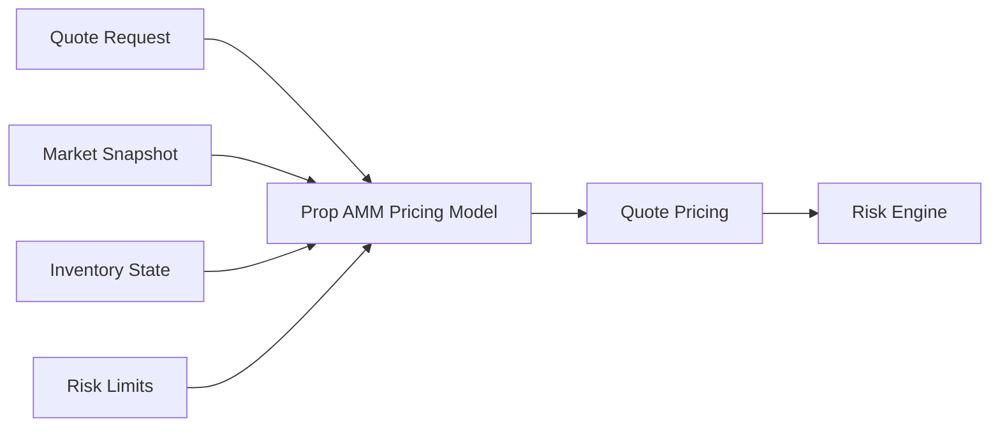
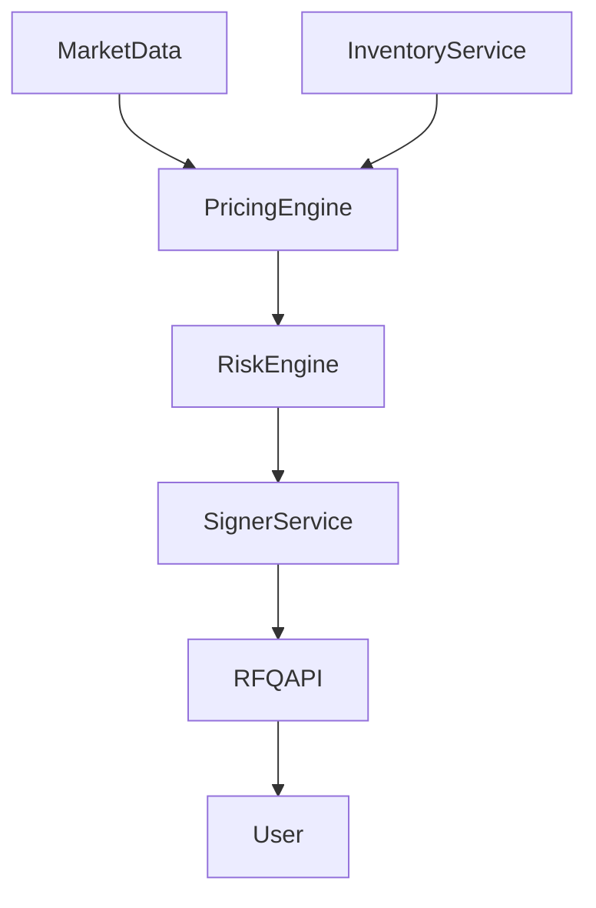
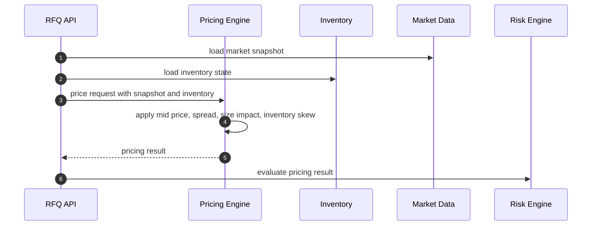
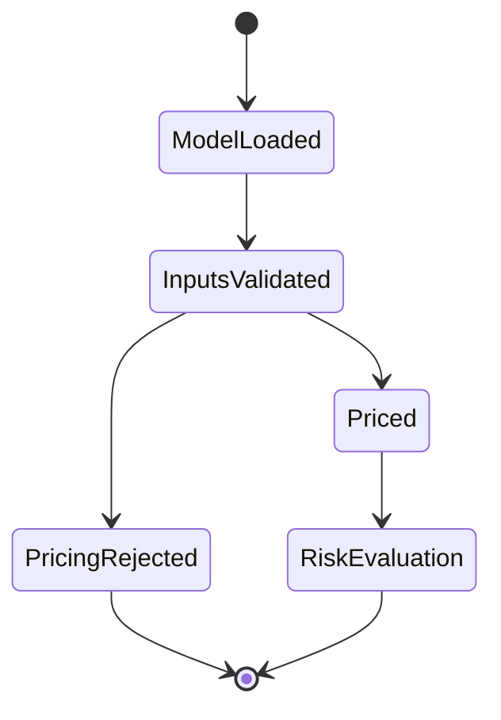

# Chapter 02: Prop AMM Evolution

## Abstract

Prop AMM 是本项目链下报价模型的核心概念。它继承 AMM 自动报价的思想，但不把做市策略限制在单一链上曲线中。传统 AMM 主要依赖池内余额和固定公式给出价格，Prop AMM 则由专业做市系统控制，可以把外部市场价格、订单簿深度、库存偏斜、风险限额、波动率、对冲成本和交易尺寸纳入同一个报价函数。它的输出不是直接改变链上池子状态，而是生成可被 RFQ 流程签名和结算的 quote。

本章解释从公开 AMM 到 Prop AMM 的演进路径，以及为什么 RFQ 系统需要一个链下、可风控、可审计、可版本化的自动报价模型。

## Learning Objectives

- 理解公开 AMM、集中流动性 AMM 和 Prop AMM 的差异。
- 解释 Prop AMM 如何处理库存、尺寸、波动率和对冲成本。
- 明确 Prop AMM 与 Pricing Engine、Risk Engine 和 Signer Service 的边界。
- 说明 Prop AMM 作为链下策略模型的收益和代价。

## Background

AMM 的核心价值是自动化报价。公开 AMM 使用确定性曲线，让任何用户都可以根据链上状态完成兑换。集中流动性 AMM 提高了资本效率，让 LP 可以把资金放在更窄的价格区间中。两者都适合公开流动性网络，但都不等同于专业做市商的完整报价系统。

专业做市商的报价不是单一池子状态的函数。它通常同时依赖多个交易场所的价格、当前库存风险、未来对冲难度、资产波动率、交易对手行为、资金成本和系统负载。Prop AMM 的定位是把这些因素变成可计算、可版本化、可审计的报价模型。

## Problem Statement

如果 RFQ 系统只使用简单 mid price 加固定 spread，会在真实市场中迅速失效。固定 spread 无法响应波动率变化，无法在库存偏离目标时主动调价，也无法覆盖大额交易的对冲滑点。相反，如果把所有策略都写入链上合约，系统会变得昂贵、僵硬且难以保护私有策略。

问题是：如何在链下构建一个自动化报价模型，使它既有 AMM 的连续报价能力，又有专业做市所需的风险感知能力。

## Requirements

### Functional Requirements

- 支持基于 market mid price 生成基础报价。
- 支持根据 amountIn 计算 size impact。
- 支持根据库存偏离目标调整 bid / ask。
- 支持根据 volatility 调整风险溢价。
- 支持根据 hedge venue 成本调整报价。
- 支持输出 pricing version、input snapshot 和可审计解释字段。

### Non-Functional Requirements

- 报价模型必须低延迟，适合 `/quote` 实时路径。
- 模型参数必须可版本化，便于回放和 PnL 归因。
- 模型不能直接持有签名密钥。
- 模型不能绕过 Risk Engine。

## Existing Solutions

公开 AMM 把报价逻辑放在链上，透明但表达能力有限。中心化做市系统把报价逻辑放在内部引擎中，灵活但链上可验证性弱。RFQ + Prop AMM 处于两者之间：报价策略链下执行，授权结果通过 EIP-712 签名，最终由链上合约验证。

## Trade-Off Analysis

Prop AMM 的好处是灵活、可控、可保护策略，并且能把库存和风险纳入报价。代价是用户不能完全从链上状态推导报价来源，系统也需要对模型版本、输入快照和风险决策建立审计机制。

在本项目中，这个代价是可接受的，因为目标是专业做市参考实现，而不是完全公开的无许可流动性池。

## System Design

Prop AMM 不作为单独链上合约存在，而是 Pricing Engine 的核心模型。它接收 `MarketSnapshot`、`InventoryState`、`RiskLimits` 和 `QuoteRequest`，输出 `QuotePricing`。

## Architecture Diagram

Prop AMM 位于链下实时路径中，不直接接触链上资产。

## Sequence Diagram

## State Machine

Prop AMM 自身不管理成交状态，它只管理模型版本和报价结果状态。

## Data Model

核心输入包括：

- `QuoteRequest`: chainId、user、tokenIn、tokenOut、amountIn、slippageBps。
- `MarketSnapshot`: midPrice、bid、ask、depth、volatility、timestamp。
- `InventoryState`: baseExposure、quoteExposure、targetExposure、maxExposure。
- `RiskLimits`: maxNotional、maxSize、maxSkew、tokenPolicy。

核心输出包括：

- `amountOut`
- `spreadBps`
- `sizeImpactBps`
- `inventorySkewBps`
- `volatilityPremiumBps`
- `pricingVersion`
- `snapshotId`

## API Design

Prop AMM 不暴露公开 API。它通过 Pricing Service 内部接口被 Quote Service 调用。公开 API 仍然是 `/quote`，用户不需要理解模型内部参数。

## Engineering Decisions

- Prop AMM 作为链下模型实现，避免把私有策略和复杂计算放进合约。
- 模型输出必须带版本号，便于回放同一笔 quote。
- Risk Engine 必须独立于 Pricing Engine，即使模型给出价格，也不能直接签名。

## Failure Scenarios

- 市场数据过期：拒绝报价或使用更保守的降级策略。
- 库存状态延迟：降低最大成交尺寸并提高 spread。
- 波动率异常：扩大 volatility premium 或暂停高风险交易对。
- 模型版本错误：通过版本化回滚并停止签名。

## Security Considerations

Prop AMM 参数可能透露做市策略，不能直接暴露给用户。外部响应只返回可执行 quote 和必要解释，不返回完整模型权重。模型变更需要代码审查、配置审查和审计日志。

## Performance Considerations

实时路径应避免复杂优化问题。复杂参数估计可以离线运行，实时模型使用已发布参数。模型计算必须有超时和 fallback，避免拖垮 `/quote`。

## Testing Strategy

测试应覆盖固定输入快照下的确定性输出、库存偏斜方向、size impact 单调性、极端波动率、无效 token、过期 market snapshot 和模型版本回放。

## Interview Notes

解释 Prop AMM 时，要强调它不是另一个链上 AMM 池，而是专业做市商链下自动报价模型。它的价值在于把 AMM 的连续报价能力与机构做市的库存和风险控制结合起来。

## Summary

Prop AMM 是 RFQ 系统中连接市场数据、库存和风控的报价模型。它让系统避免纯 AMM 的表达限制，也避免把复杂策略放入链上合约。后续章节会基于这个模型定义系统需求和整体架构。

## References

- Constant Product Market Maker
- Concentrated Liquidity AMM
- RFQ market making systems
- Inventory-based market making models
