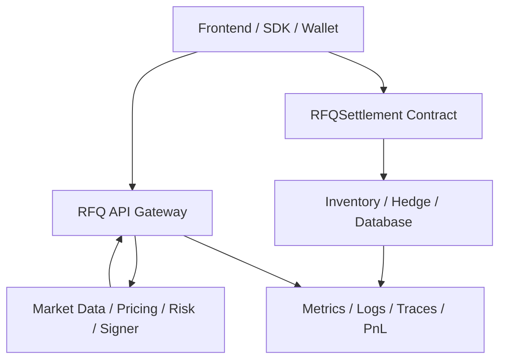
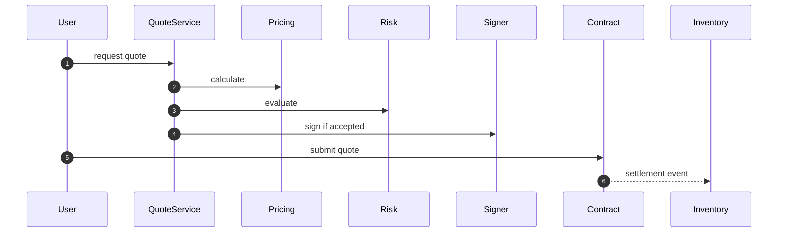

# Chapter 03: Requirements

## Abstract

本章定义生产级 Web3 RFQ / Prop AMM 做市系统的需求边界。需求不是功能列表的堆叠，而是系统不变量、组件职责、用户体验、风险控制、安全约束、观测性和可运维性的组合。对 RFQ 系统而言，最重要的需求是 quote 与 execution 的一致性，以及 risk before signing。

## Learning Objectives

- 明确系统的核心用户和使用场景。
- 定义报价、提交、结算、库存、对冲和观测的功能需求。
- 定义延迟、安全、可用性、审计和测试等非功能需求。
- 为后续 OpenAPI、数据库、合约和后端模块提供约束。

## Background

RFQ 系统跨越链下服务和链上合约。用户看到的是报价和成交，做市商关心的是库存、风险和 PnL，工程团队要保证服务可用、签名安全、事件可靠和指标完整。因此需求必须覆盖完整生命周期，而不是只覆盖 `/quote`。

## Problem Statement

如果需求只描述“用户输入 token 和 amount，系统返回价格”，实现会遗漏关键约束。例如签名是否可重放、quote 是否短生命周期、风险拒绝是否可解释、链上事件是否能驱动库存更新、对冲失败是否告警。这些遗漏会让 demo 可以运行，但无法进入生产。

## Requirements

### Functional Requirements

- Quote API 接收交易意图并返回短生命周期 signed quote。
- Submit API 或用户钱包提交 quote 到 `RFQSettlement`。
- Quote Service 编排市场数据、定价、风控、签名和持久化。
- Pricing Service 输出 amountOut、spread、size impact、inventory skew 和 pricing version。
- Risk Service 在签名前输出 allow/reject、reason code 和 policy version。
- Signer Service 使用 EIP-712 签名，且只签署经过批准的 quote。
- Settlement Contract 验证 signer、nonce、deadline、chainId、token whitelist 和金额字段。
- Inventory Service 消费链上事件并更新库存。
- Hedge Service 根据库存变化生成对冲动作。
- Metrics Service 暴露 quote latency、reject rate、settlement result、inventory exposure 和 hedge lag。

### Non-Functional Requirements

- `/quote` 实时路径必须低延迟，并监控 p50、p95、p99。
- 签名密钥必须隔离，业务服务不能直接读取私钥。
- 链上事件消费必须幂等，并能处理重放和链重组。
- 所有核心决策必须有可审计输入：snapshotId、pricingVersion、riskPolicyVersion。
- 合约逻辑必须最小化、确定性、可测试。
- 文档和 ADR 必须解释重大设计选择。

## Existing Solutions

普通 swap API 通常只关注成交路径，缺少专业做市的库存和风险要求。中心化交易系统拥有完整风险能力，但链上可验证性不足。本项目需要同时满足链下专业决策和链上确定性结算。

## Trade-Off Analysis

需求中最关键的取舍是开放性与控制能力。纯 AMM 更开放，但控制能力弱；中心化 RFQ 控制能力强，但链上验证弱。本项目选择中间路径：报价链下生成，执行链上验证。

## System Design

系统按职责拆分为 Client、API、Decision、Settlement、State 和 Observability 六个层次。

## Architecture Diagram

需求映射到组件时，Quote Service 是实时路径中心，Settlement Contract 是链上可信边界，Inventory Service 是成交后状态中心。

## Sequence Diagram

## State Machine

Quote 状态包括 requested、rejected、signed、expired、submitted、settled 和 failed。库存状态包括 pending、confirmed、hedging 和 hedged。

## Data Model

系统至少需要 quote、market_snapshot、risk_decision、settlement_event、inventory_position 和 hedge_order 六类数据。每类数据都应包含创建时间、更新时间和关联 ID。

## API Design

公开接口第一批固定为 `POST /quote`、`POST /submit`、`GET /quote/:id`、`GET /hedges/:id`、`GET /health`、`GET /ready`、`GET /metrics`。接口字段以字符串表示大整数，避免 JavaScript number 精度问题。

## Engineering Decisions

- 所有金额使用 base unit 字符串表示。
- Risk Engine 在 Signer 之前。
- Quote 过期由 deadline 强制。
- 所有事件消费逻辑必须幂等。

## Failure Scenarios

需求必须覆盖 market data unavailable、risk rejected、signer unavailable、quote expired、settlement reverted、event consumer lag、hedge failed 和 database degraded。

## Security Considerations

安全需求包括签名密钥隔离、trusted signer 权限控制、nonce replay protection、token whitelist、pausable contract、API rate limit 和审计日志。

## Performance Considerations

性能需求以 quote latency、signer throughput、settlement event lag 和 hedge lag 为核心。慢查询和阻塞外部调用不能进入实时路径。

## Testing Strategy

测试矩阵应覆盖 API validation、Pricing Engine、Risk Engine、EIP-712 signing、contract verification、event indexing 和 end-to-end settlement。

## Interview Notes

面试中可以把需求总结为三句话：签名前必须风控，执行时必须验证签名，成交后必须更新库存并可观测。任何缺一项的 RFQ 系统都只是 demo。

## Summary

本章将系统需求固定为可实现约束。后续实现不得绕过 risk-before-signing，不得让合约承担复杂风险逻辑，也不得让库存和事件消费成为不可审计的副作用。

## References

- EIP-712
- OpenZeppelin security patterns
- Event-driven inventory systems
