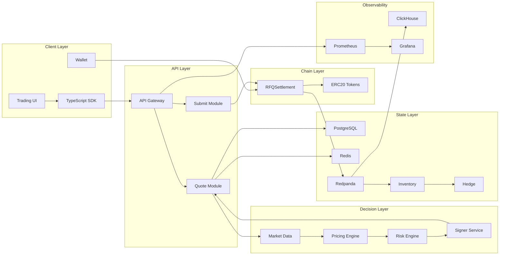
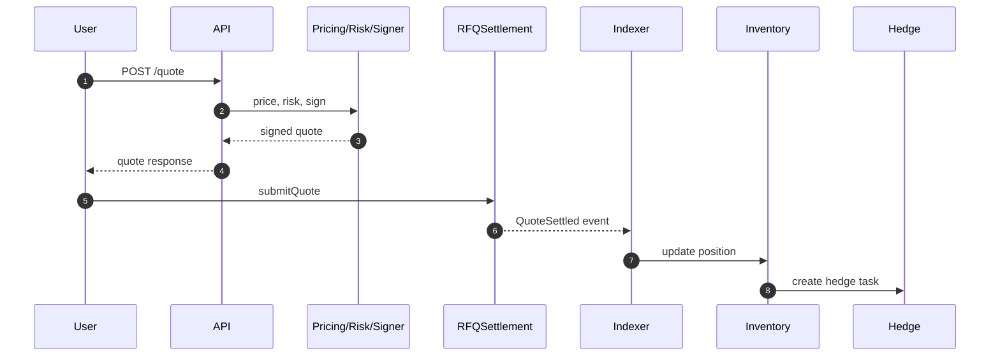

# Chapter 04: System Overview

## Abstract

本章给出 RFQ / Prop AMM 做市系统的整体视图。系统由链下决策平面和链上结算平面组成。链下负责市场数据、定价、风控、签名、库存、对冲和指标；链上负责验证签名和执行资产转移。该架构的目标是让复杂策略保持灵活，让最终结算保持确定。

## Learning Objectives

- 理解系统的层次划分和核心组件。
- 说明 `/quote` 和 `/submit` 如何串联链下与链上。
- 明确每个服务的职责边界。
- 识别系统关键不变量和可观测点。

## Background

RFQ 系统不是一个单体 API，也不是单个合约。它是由多个服务和合约共同维护的一条交易生命周期。任何一个环节缺少边界，都会导致报价不可解释、执行不可验证或库存不可控。

## Problem Statement

系统总览要解决的问题是：如何让用户、做市商、合约和运维系统看到同一条交易链路。用户需要清晰报价，做市商需要风险控制，合约需要确定验证，运维需要指标和告警。

## Requirements

### Functional Requirements

- Client 可以请求报价并提交交易。
- API Gateway 校验请求并编排内部服务。
- Market Data Service 提供实时市场快照。
- Pricing Engine 生成 Prop AMM 报价。
- Risk Engine 决定是否允许签名。
- Signer Service 生成 EIP-712 signature。
- RFQSettlement 完成链上验证和结算。
- Inventory 与 Hedge 服务处理成交后状态。
- Metrics 服务暴露系统健康和业务指标。

### Non-Functional Requirements

- 服务职责必须清晰，不能让单个模块同时掌握过多权限。
- 所有跨服务调用必须能记录 trace id 或 correlation id。
- 链上事件必须驱动库存真实状态。
- 关键服务必须能被独立测试。

## Existing Solutions

一些系统把报价、风控和签名放在同一个服务中，开发速度快，但密钥风险和职责混乱。另一些系统把所有逻辑链上化，透明但缺少灵活性。本项目采用分层架构，在工程复杂度和生产安全之间取得平衡。

## Trade-Off Analysis

分层架构增加了服务数量和部署复杂度，但换来了清晰职责、可测试性、安全隔离和可观测性。对于生产级做市系统，这是必要成本。

## System Design

## Architecture Diagram

上图是系统的第一版 C4 容器级视图。后续章节会细化每个服务的 API、数据模型和失败恢复方式。

## Sequence Diagram

## State Machine

系统状态围绕 quote 和 settlement 演进。Quote 可以被拒绝、签名、过期、提交和成交。Settlement 事件是库存状态的权威输入。

## Data Model

系统数据分为操作型数据和分析型数据。PostgreSQL 保存 quote、risk decision、settlement 和 inventory 的当前状态。ClickHouse 保存高吞吐事件和 PnL 分析。Redis 保存短期 quote cache、market snapshot cache 和限流状态。

## API Design

API Gateway 第一阶段包括 `/quote`、`/submit`、`/quote/:id`、`/health` 和 `/metrics`。公开 API 不暴露内部 pricing 参数，但响应必须包含 `quoteId` 和 `snapshotId`。

## Engineering Decisions

- Quote Service 编排，不直接实现所有业务逻辑。
- Signer Service 独立部署。
- Settlement Contract 是链上授权边界。
- Inventory Service 以链上事件为准。

## Failure Scenarios

系统必须处理 API 限流、market data 延迟、risk reject、signer timeout、chain revert、indexer lag、inventory mismatch 和 hedge venue unavailable。

## Security Considerations

API 需要限流和输入校验。Signer 需要最小权限。合约需要 AccessControl、Pausable、ReentrancyGuard 和 SafeERC20。事件消费需要防止重复处理。

## Performance Considerations

实时路径是 `/quote`，必须避免重型数据库查询和阻塞外部调用。成交后路径可以异步，但必须监控延迟。

## Testing Strategy

测试应覆盖服务单测、合约单测和端到端流程。系统级测试至少要证明一笔 quote 可以被签名、提交、结算、消费事件并更新库存。

## Interview Notes

系统总览可以用一句话概括：链下负责决定是否应该成交，链上负责验证是否被授权成交，成交后事件负责驱动库存和对冲。

## Summary

本章定义了系统整体结构。后续实现应保持这个职责边界，不把签名、风控、定价和结算混在一个不可审计的模块中。

## References

- C4 model
- RFQ settlement architecture
- Event-driven back office systems
