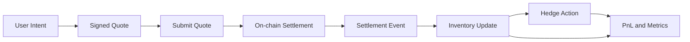
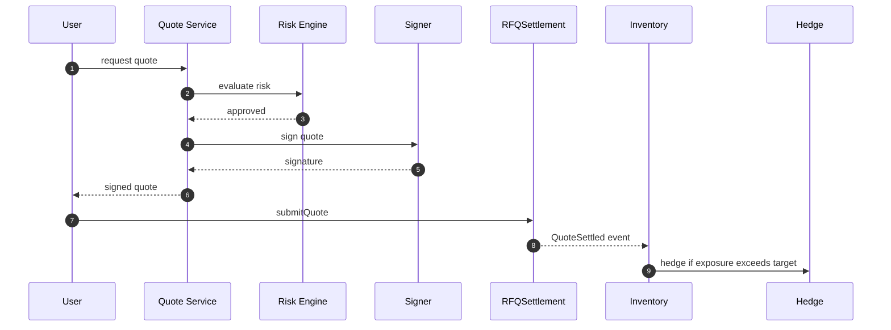
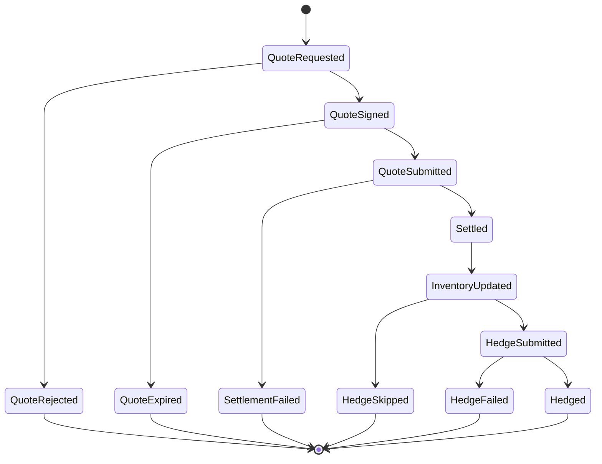

# Chapter 05: Business Flow

## Abstract

本章定义 RFQ / Prop AMM 做市系统的端到端业务流。系统不是单纯的报价 API，而是一条从用户意图、市场快照、定价、风控、签名、链上结算、库存更新、对冲到 PnL 归因的闭环。业务流设计的核心目标是让每一个阶段都有明确输入、输出、状态和失败处理。

## Learning Objectives

- 理解 `/quote` 和 `/submit` 如何构成完整交易生命周期。
- 明确 quote、settlement、inventory、hedge 和 metrics 的状态衔接。
- 识别业务流中的关键不变量和可观测点。
- 为后端服务、合约和前端交互提供统一流程语义。

## Background

RFQ 系统中的用户动作看起来很简单：请求报价并提交交易。但生产系统必须处理更多业务事实。报价可能被拒绝，签名可能失败，用户可能不提交，提交可能过期，链上可能回滚，事件可能延迟，对冲可能失败。业务流必须覆盖这些分支，否则系统只能处理 happy path。

## Problem Statement

需要解决的问题是：如何把一次 RFQ 交易拆成可审计、可恢复、可观测的业务状态机，而不是只依赖同步接口返回值。

## Requirements

### Functional Requirements

- 支持用户请求 quote。
- 支持系统记录 market snapshot、pricing result 和 risk decision。
- 支持 risk accepted 后生成 EIP-712 signature。
- 支持用户提交 signed quote 到链上。
- 支持 settlement event 驱动 inventory update。
- 支持 inventory delta 触发 hedge intent。
- 支持 PnL、latency 和 reject reason 归因。

### Non-Functional Requirements

- 每个业务阶段必须有 correlation id。
- 所有异步事件必须幂等。
- 用户可见状态与内部状态应保持可解释映射。
- 失败状态必须可恢复或可明确终止。

## Existing Solutions

简单 swap 系统通常把流程简化为 route、approve、swap。RFQ 系统多了签名前风控和签名授权，因此业务流必须更明确。传统中心化 RFQ 系统有完整交易状态，但缺少链上事件作为最终结算来源。本项目结合两者：链下记录决策，链上事件确认成交。

## Trade-Off Analysis

将业务流拆细会增加状态数量和实现复杂度，但能换来更好的可观测性和故障恢复能力。对于做市系统，无法解释的状态比复杂状态机更危险。

## System Design

业务流分为三段：

1. Quote path：用户询价，系统定价、风控、签名。
2. Settlement path：用户提交签名报价，合约验证并转账。
3. Post-trade path：事件索引、库存更新、对冲和指标归因。

## Architecture Diagram

## Sequence Diagram

## State Machine

## Data Model

业务流至少需要关联以下 ID：

- `quoteId`: RFQ 请求和响应的业务 ID。
- `snapshotId`: 市场数据快照 ID。
- `riskDecisionId`: 风控决策 ID。
- `txHash`: 链上交易 ID。
- `settlementEventId`: 链上事件消费 ID。
- `hedgeOrderId`: 对冲动作 ID。

## API Design

`POST /quote` 返回 signed quote。`POST /submit` 可以作为 relay 或 tx payload 生成入口，并在模拟执行路径返回 `hedgeOrderId`。`GET /quote/:id` 返回 quote 当前状态，`GET /hedges/:id` 返回对冲意图状态。内部事件接口不对用户公开。

## Engineering Decisions

- Quote 签名前必须持久化可回放输入。
- Signed quote 不等于成交，成交以链上事件为准。
- Inventory update 只由 settlement event 驱动。
- Hedge failure 不回滚链上 settlement，但会影响后续报价和告警。

## Failure Scenarios

- 用户请求 quote 后不提交：quote 最终 expired。
- 用户提交过期 quote：合约 revert，状态 failed。
- 链上成交后事件消费延迟：库存短暂滞后，触发 lag 告警。
- Hedge failed：记录失败原因，收紧 risk limit。

## Security Considerations

业务流中最敏感的是 signer 与 settlement。任何绕过 risk decision 直接签名的路径都必须禁止。任何不经过链上事件直接更新库存的路径都必须被视为高风险。

## Performance Considerations

Quote path 是同步实时路径，应优化延迟。Post-trade path 是异步路径，应优化吞吐、幂等和可重放。

## Testing Strategy

测试应覆盖 quote accepted、quote rejected、expired quote、settlement success、settlement revert、duplicate event、hedge success 和 hedge failure。

## Interview Notes

面试中可以强调：RFQ 的业务流不是“报价后立即成交”，而是“签名授权后等待链上确定成交”。这一区分决定了系统必须以 settlement event 作为库存权威来源。

## Summary

本章将 RFQ 系统拆成 quote、settlement 和 post-trade 三段业务流。该拆分为后续微服务、数据库和监控设计提供统一语义。

## References

- RFQ trading lifecycle
- Event-driven settlement systems
- Inventory and hedge workflows
