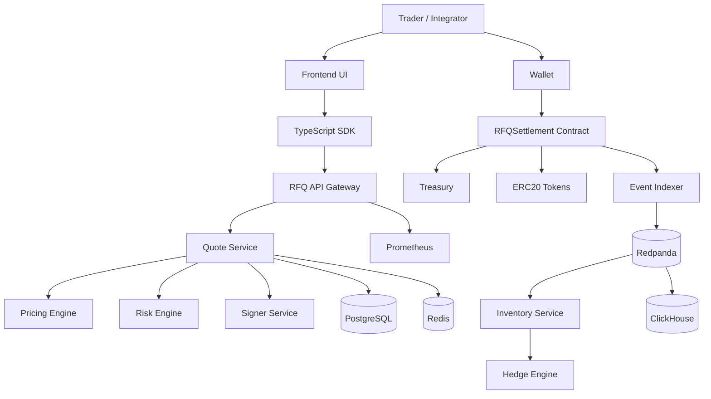
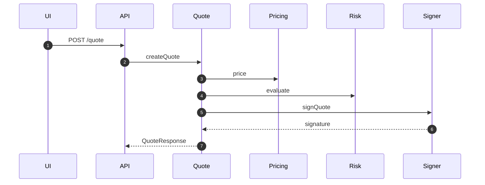

# Chapter 06: C4 Architecture

## Abstract

本章用 C4 模型描述 RFQ / Prop AMM 做市系统。C4 帮助我们从不同抽象层次表达架构：系统上下文、容器、组件和代码边界。对于一个跨链下服务和链上合约的系统，C4 能减少讨论歧义，让业务、合约、后端和运维团队使用同一张地图。

## Learning Objectives

- 使用 C4 Context 解释系统与外部参与者关系。
- 使用 C4 Container 描述主要服务和存储。
- 使用 C4 Component 描述 Quote Service 内部职责。
- 明确哪些边界是信任边界和故障边界。

## Background

Web3 系统常把架构图画成一条交易时序，但时序图无法完整表达服务边界、数据存储和外部依赖。C4 模型补充了结构视角，有助于说明“谁调用谁”“谁拥有状态”“谁是可信边界”。

## Problem Statement

本项目需要同时面向 GitHub 读者、面试官和实现者。没有结构化架构图时，读者很难判断 Quote Service、Risk Engine、Signer Service、Settlement Contract 和 Inventory Service 的边界。

## Requirements

### Functional Requirements

- 描述用户、做市商、链和外部 hedge venue。
- 描述 API、Pricing、Risk、Signer、Settlement、Inventory、Hedge 和 Metrics。
- 描述 PostgreSQL、Redis、Redpanda、ClickHouse 的用途。
- 描述 Quote Service 内部组件。

### Non-Functional Requirements

- 图表必须可用 Mermaid 复现。
- 信任边界必须显式标识。
- 架构图不能隐藏 signer 和 event indexing 风险。

## Existing Solutions

传统后端 C4 图通常不包含链上合约。智能合约架构图通常不描述链下服务。本项目需要把两者放在同一个模型中。

## Trade-Off Analysis

C4 图增加了文档维护成本，但能显著提升设计沟通质量。对于开源面试项目，清晰的架构分层本身就是重要交付。

## System Design

系统分为四类容器：Client、Off-chain Services、On-chain Contracts、Data and Observability。Signer Service 和 RFQSettlement 是关键安全边界。

## Architecture Diagram

## Sequence Diagram

## State Machine

C4 本身不是状态机，但系统状态可映射到组件所有权：Quote 状态由 Quote Service 管理，Settlement 状态由合约事件确认，Inventory 状态由 Inventory Service 投影。

## Data Model

- Quote Service owns `quotes` and `risk_decisions` writes.
- Indexer owns `settlement_events` writes.
- Inventory Service owns `inventory_positions`.
- Hedge Engine owns `hedge_orders`.
- ClickHouse stores derived analytics.

## API Design

C4 图中的公开 API 只在 API Gateway 暴露。内部服务接口不应直接暴露给用户，尤其 Signer Service 不能被公网访问。

## Engineering Decisions

- Signer 独立容器化，作为安全边界。
- Event Indexer 独立于 API，避免链上事件消费阻塞用户请求。
- PostgreSQL 和 ClickHouse 分离，避免分析查询影响实时业务。

## Failure Scenarios

- API 可用但 Signer 不可用：系统可健康检查通过，但 `/quote` 无法签名。
- Contract 正常但 Indexer lag：用户成交成功，库存更新延迟。
- Hedge venue 不可用：成交不回滚，但后续 risk limit 收紧。

## Security Considerations

C4 图中所有跨边界调用都需要鉴权、限流或审计。Signer 和 Treasury 是最高风险容器，必须有最小权限和应急停用路径。

## Performance Considerations

实时路径只包含 API、Quote、Pricing、Risk、Signer 和缓存。事件分析、ClickHouse 写入和 hedge 不应进入 quote 同步路径。

## Testing Strategy

测试按容器边界组织：API contract tests、Pricing unit tests、Risk policy tests、Signer EIP-712 tests、contract tests、event indexing tests。

## Interview Notes

面试中使用 C4 图可以展示系统边界意识。重点不是画得复杂，而是能说明哪些组件拥有状态、哪些组件可信、哪些组件可以异步。

## Summary

C4 架构图为 RFQ 系统提供稳定结构视角。它补充业务流和时序图，帮助实现者在后续开发中保持职责边界。

## References

- C4 Model
- Event-driven architecture
- Web3 settlement system design
