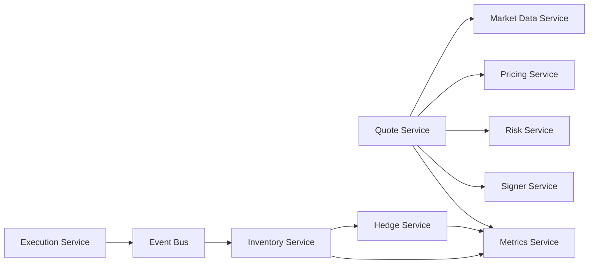
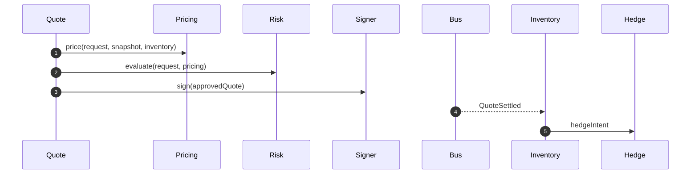
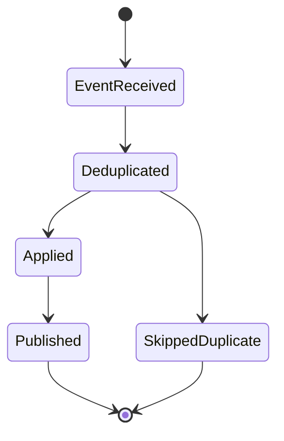

# Chapter 07: Microservices

## Abstract

本章定义 RFQ / Prop AMM 系统的微服务拆分。微服务不是为了增加复杂度，而是为了隔离职责、权限、故障和扩展方式。对于 RFQ 系统，最重要的拆分是 Quote、Pricing、Risk、Signer、Execution、Inventory、Hedge 和 Metrics。

## Learning Objectives

- 明确每个服务的职责和非职责。
- 理解服务之间的同步和异步调用关系。
- 确定 signer、risk 和 inventory 的边界。
- 为后续后端实现提供模块划分依据。

## Background

做市系统的核心路径低延迟且高风险。如果把报价、风控、签名、库存和对冲放在一个服务里，早期开发简单，但权限过大、测试困难、故障隔离差。微服务拆分可以让高风险能力被明确隔离。

## Problem Statement

需要回答的问题是：哪些能力应该作为独立服务，哪些能力可以作为模块存在，以及服务之间应该通过同步 API 还是异步事件通信。

## Requirements

### Functional Requirements

- Quote Service 编排 `/quote`。
- Pricing Service 提供 Prop AMM 报价。
- Risk Service 提供签名前风险决策。
- Signer Service 只负责 EIP-712 签名。
- Execution Service 处理 submit 或 relay。
- Inventory Service 维护成交后库存。
- Hedge Service 执行对冲。
- Metrics Service 暴露业务和系统指标。

### Non-Functional Requirements

- Signer Service 必须最小权限。
- Quote path 必须低延迟。
- Post-trade path 必须幂等和可重放。
- 每个服务必须有清晰接口和测试边界。

## Existing Solutions

单体服务适合 demo，但不适合隔离签名密钥。完全分布式系统适合大规模团队，但增加部署复杂度。本项目采用“模块化单仓库 + 可演进为服务”的方式：代码先按服务边界组织，部署可以逐步拆分。

## Trade-Off Analysis

拆分服务会增加网络调用和运维成本，但能降低安全风险和故障影响。对于 Signer、Risk 和 Inventory 这类关键能力，拆分收益明确。

## System Design

## Architecture Diagram

服务边界分为实时同步路径和成交后异步路径。Quote、Pricing、Risk、Signer 是同步路径；Inventory、Hedge、Metrics 是异步路径。

## Sequence Diagram

## State Machine

服务级状态重点在消息处理：

## Data Model

每个服务只拥有自己的写模型。Quote Service 写 quote，Risk 写 decision，Indexer 写 settlement event，Inventory 写 position，Hedge 写 hedge order。跨服务读取应尽量通过事件投影或明确 API。

## API Design

内部接口应稳定但不一定公开到 OpenAPI。Signer 接口必须最小化，只接受结构化 quote 和审批上下文，不接受任意 payload signing。

## Engineering Decisions

- 先在 monorepo 中按模块组织，后续可独立部署。
- Signer 从第一天按独立服务设计。
- Event bus 是 post-trade 服务的主要集成方式。
- Metrics 横切所有服务。

## Failure Scenarios

- Pricing 超时：Quote Service 返回 `PRICING_UNAVAILABLE`。
- Risk 拒绝：Quote Service 返回 `RISK_REJECTED`。
- Signer 超时：Quote Service 返回 `SIGNER_UNAVAILABLE`。
- Inventory 消费失败：事件保留并重试。
- Hedge 失败：不影响已成交状态，但触发风控收紧。

## Security Considerations

服务间调用需要身份认证。Signer Service 不允许公网访问。Risk policy 和 signer policy 必须有审计日志。Hedge venue credentials 必须隔离。

## Performance Considerations

同步路径必须控制调用链长度。Pricing 和 Risk 可以使用本地缓存。异步路径关注吞吐、重试和延迟告警。

## Testing Strategy

每个服务有单元测试，服务边界有 contract tests，事件消费者有幂等和重放测试，端到端测试覆盖完整业务流。

## Interview Notes

解释微服务拆分时不要只说“为了扩展”。更专业的答案是：为了隔离签名权限、风险决策、库存状态和对冲副作用。

## Summary

本章给出服务边界。后续后端实现应保持这些边界，即使早期运行在同一个进程内，也不能混淆职责。

## References

- Microservice boundaries
- Event-driven systems
- RFQ service architecture
