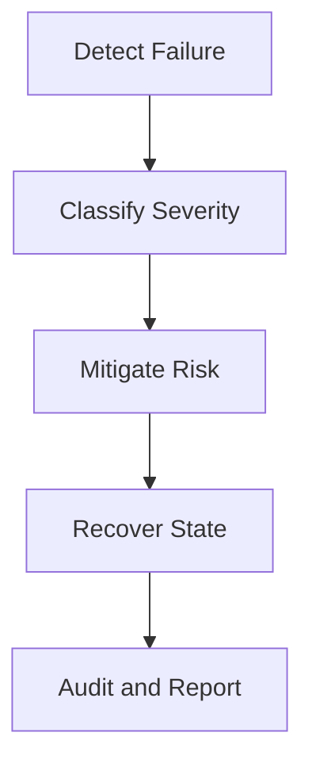
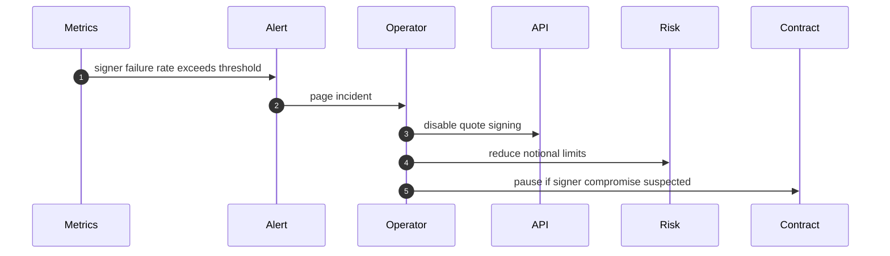
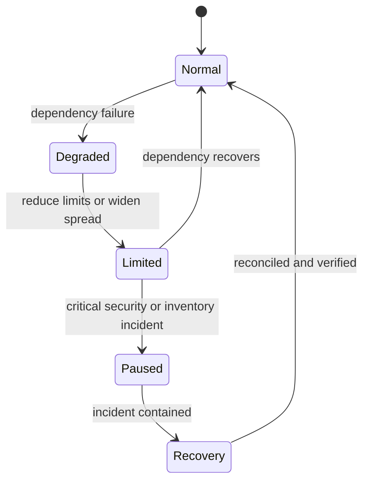

# Chapter 08: Failure Recovery

## Abstract

本章讨论 RFQ / Prop AMM 系统的失败恢复。生产级做市系统必须接受失败是常态：市场数据会延迟，签名服务会不可用，链上交易会回滚，事件索引会落后，对冲 venue 会失败。系统设计的重点不是避免所有失败，而是让失败被检测、限制、恢复和审计。

## Learning Objectives

- 识别 RFQ 系统的主要失败类型。
- 理解同步路径和异步路径的恢复策略。
- 设计事件幂等、重放和链重组处理。
- 明确 runbook 和指标的关系。

## Background

DeFi 系统的失败经常跨越链下和链上。链下服务可以重试，链上交易一旦确认就不能回滚。库存和对冲必须以链上事件为准，同时又要在事件延迟时保护后续报价。

## Problem Statement

需要解决的问题是：当任一组件失败时，如何保护资金、控制库存风险、避免重复处理，并让运维人员知道应该采取什么动作。

## Requirements

### Functional Requirements

- 检测 market data stale。
- 检测 signer unavailable。
- 检测 settlement revert。
- 检测 indexer lag 和 chain reorg。
- 检测 hedge failure。
- 支持 quote 降级、暂停和恢复。

### Non-Functional Requirements

- 故障恢复必须可审计。
- 重试必须幂等。
- 高风险故障必须可触发 pause。
- 指标和告警必须覆盖关键路径。

## Existing Solutions

普通 Web2 API 可以依赖重试和数据库事务。Web3 settlement 系统还需要处理不可逆链上状态和最终性延迟。RFQ 系统必须把链上事件作为最终事实，同时允许链下投影回放。

## Trade-Off Analysis

保守恢复策略会降低成交率，但能保护资金和库存。激进恢复策略能保持交易可用，但可能在市场异常时放大损失。本项目默认采用保守策略：不确定时拒绝签名或降低限额。

## System Design

## Architecture Diagram

故障恢复横跨所有服务。Metrics 和 logs 不是附属功能，而是恢复流程的输入。

## Sequence Diagram

## State Machine

## Data Model

故障恢复需要记录 incident、affected service、start time、end time、mitigation、operator、linked metrics 和 postmortem。后续可建立 `incidents` 表或使用外部 incident platform。

## API Design

`GET /health` 只表示 liveness，`GET /ready` 表示 readiness 和关键组件状态。`GET /metrics` 暴露延迟、错误率、依赖状态和业务风险指标。管理员使用 `GET/PUT /admin/quote-control` 管理全局开关，使用 `GET/PUT /admin/quote-control/pairs/:chainId/:tokenA/:tokenB` 管理无方向 pair 开关；写操作都携带 `expectedVersion` 和强制 reason，读写分别要求 `admin:read` 和 `admin:write`。Pair 首次写入从 version 1 开始，之后与全局状态一样通过 CAS 防止并发覆盖并留下不可变审计记录。PostgreSQL 或任一控制表不可用时 `POST /quote` fail closed，已签发 quote 的 submit、链上索引、库存、对冲和 reconciliation 继续运行。动态调整 pair/chain 风险数值限额仍属于后续风险策略能力。

## Engineering Decisions

- 不确定市场数据时不签名。
- Signer 异常时返回错误，不使用未审计 fallback。
- Indexer lag 时降低 quote notional。
- Hedge failure 影响后续 pricing 和 risk。

## Failure Scenarios

- Market data stale：停止相关交易对报价。
- Signer unavailable：返回 503，保留 API health。
- Signer compromise：pause contract，rotate key。
- Settlement revert spike：检查合约、token 和签名字段。
- Indexer lag：启动 replay，收紧库存相关限额。
- Hedge venue down：暂停相关资产或扩大 spread。

## Security Considerations

故障恢复动作本身是高权限操作。暂停合约、轮换 signer、修改 whitelist 和降低风险限额都需要审计和多签或受控流程。

## Performance Considerations

恢复流程不能依赖慢查询。关键指标应预聚合，事件 replay 应支持从 offset 或 block range 恢复。

## Testing Strategy

测试应注入依赖失败：market data timeout、signer timeout、duplicate settlement event、chain reorg、hedge order reject。每个测试都应验证系统进入预期降级状态。

## Interview Notes

面试中讨论失败恢复时，要强调“链上成交不可回滚”。因此恢复策略不是撤销成交，而是修正链下投影、限制后续风险和执行对冲补救。

## Summary

失败恢复是生产级 RFQ 系统的核心能力。系统必须默认失败会发生，并通过指标、状态机、幂等和 runbook 控制损失。

## References

- Incident response
- Chain reorg handling
- Event replay systems
