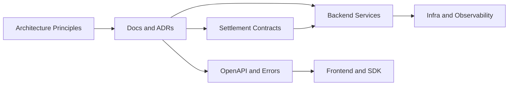
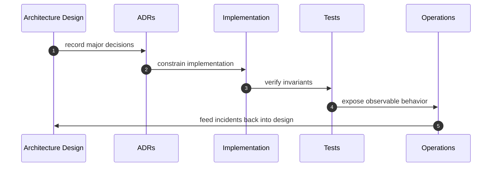
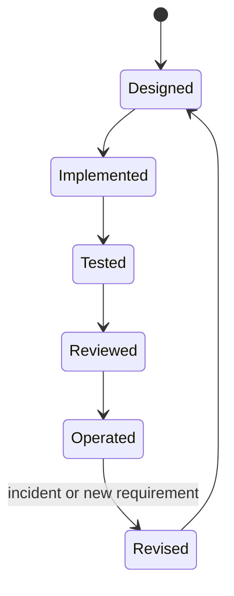

# Chapter 09: Architecture Review

## Abstract

本章对 Volume 1 的架构进行审查，确认 RFQ / Prop AMM 系统是否满足项目目标。架构审查不是形式化总结，而是用明确问题检验系统边界、核心不变量、安全假设、失败恢复和后续实现优先级。

## Learning Objectives

- 回顾 RFQ + Prop AMM 的核心设计选择。
- 检查系统是否满足 quote / execution consistency。
- 识别后续实现中的最高风险区域。
- 为下一卷 Market Data and Pricing 建立输入。

## Background

前八章已经定义 RFQ 原理、Prop AMM、需求、系统总览、业务流、C4、微服务和失败恢复。架构审查需要把这些内容收束成可执行准则，避免后续实现偏离目标。

## Problem Statement

需要回答的问题是：当前架构是否足以指导一个生产级参考实现，哪些地方仍是假设，哪些地方必须在代码中被强制验证。

## Requirements

### Functional Requirements

- 确认 `/quote -> /submit -> settlement -> inventory -> hedge -> metrics` 链路完整。
- 确认 Risk Engine 在 Signer 之前。
- 确认 Settlement Contract 最小化。
- 确认事件驱动库存更新。
- 确认 ADR 覆盖关键决策。

### Non-Functional Requirements

- 架构应可测试、可观测、可恢复。
- 文档应能支撑面试和开源审查。
- 后续实现应能从当前设计直接展开。

## Existing Solutions

许多示例项目只实现单点 demo，缺少架构审查，因此很难判断哪些部分是刻意简化，哪些是遗漏。本项目要求每个简化都可见，并通过 ADR 和章节说明后续演进路径。

## Trade-Off Analysis

当前架构选择牺牲部分纯链上透明性，换取专业做市所需的风控前置、库存感知和策略灵活性。该取舍与项目目标一致，但要求链下服务质量必须达到生产标准。

## System Design

架构审查矩阵如下：

| Area | Decision | Review Result |
| --- | --- | --- |
| Trading model | RFQ + Prop AMM | Matches professional market making |
| Signing | EIP-712 | Supports typed authorization |
| Contract | Minimal settlement | Reduces audit surface |
| Risk | Before signing | Preserves core invariant |
| Inventory | Event-driven | Aligns with on-chain truth |
| Observability | Metrics and ClickHouse | Supports audit and PnL |
| Recovery | Degrade or pause | Conservative by default |

## Architecture Diagram

## Sequence Diagram

## State Machine

## Data Model

架构审查不新增业务数据模型，但确认现有模型覆盖 quote、snapshot、risk decision、settlement event、inventory position 和 hedge order。

## API Design

OpenAPI 已定义 `/quote`、`/submit`、`/quote/:id`、`/settlements/:id`、`/hedges/:id`、`/pnl`、`/health`、`/ready` 和 `/metrics`。后续实现必须避免 API 与文档分叉。

## Engineering Decisions

- 后端保持 Fastify composition root，并已按 market data、pricing、risk、signer、execution、inventory、hedge、indexer 与 analytics 边界拆分；是否进一步拆成独立进程由故障域和扩缩容需求决定，而不是框架偏好。
- `RFQSettlement` 已使用固定版本 OpenZeppelin 的 `SafeERC20`、`ReentrancyGuard`、`Pausable` 与 `AccessControl`，并通过 Foundry、SDK ABI 和 EIP-712 跨层一致性测试约束结算面。
- React/Vite 前端已经接入 Wagmi、Viem、RainbowKit 与共享 SDK；API relay 路径由真实浏览器 E2E 覆盖，钱包路径由组件级 contract-write 测试覆盖。
- 文档、实现、部署清单和 CI 检查共同维护同一组生产不变量，过期的阶段性描述不得继续充当架构事实。

## Failure Scenarios

架构审查识别的最高风险是 signer compromise、inventory mismatch、market data stale、hedge failure 和 chain reorg。这些风险必须在后续测试和 runbook 中持续覆盖。

## Security Considerations

安全审查重点包括签名权限、合约验证、token whitelist、treasury 权限、事件幂等和管理操作审计。任何实现若绕过这些边界，都应视为架构违规。

## Performance Considerations

性能审查重点是 quote p99 latency、signer throughput、event lag 和 hedge lag。后续基准测试应围绕这些指标建立。

## Testing Strategy

现有测试矩阵覆盖 EIP-712/ABI 跨层一致性、Risk-before-Signing、幂等 settlement/indexer/reconciliation、API schema 与错误契约、前端组件路径，以及真实 Chromium 中的 quote-to-settlement 生命周期。生产上线仍需在目标链和目标 CEX 沙箱补充外部依赖验收，因为本地 E2E 不伪造钱包签名、链重组或交易所成交。

## Interview Notes

架构审查适合在面试结尾使用。候选人可以用它说明：项目不是只会写合约或 API，而是能从业务不变量推导系统边界、数据模型、失败恢复和测试策略。

## Summary

Volume 1 定义的 RFQ / Prop AMM 核心不变量已经落实到可运行后端、合约、前端、SDK、部署和验证链路。后续演进应以目标链、真实流量和外部 venue 的运行证据驱动，同时保持这些不变量不被绕过。

## References

- ADR documents in `docs/adr`
- OpenAPI draft in `docs/api/openapi.yaml`
- Database schema in `docs/database/schema.sql`
- Security docs in `docs/security`
