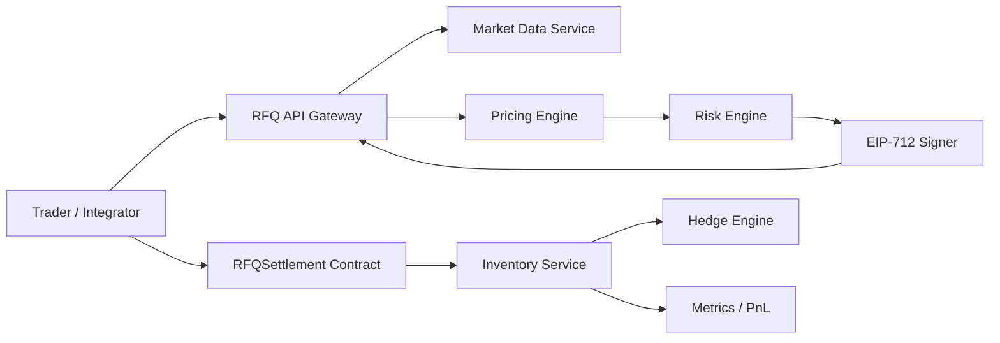

# Volume 1: System Architecture

本卷聚焦生产级 Web3 RFQ / Prop AMM 做市系统的系统架构。目标是先建立稳定的业务语义、工程边界和核心不变量，再进入合约、后端、前端和部署实现。

## 阅读目标

读完本卷后，读者应能回答以下问题：

- 为什么专业做市系统不能只依赖链上 AMM 曲线。
- RFQ 如何改善报价和执行的一致性。
- Prop AMM 在 RFQ 系统中承担什么角色。
- 报价、风控、签名、结算、库存和对冲之间如何协作。
- 哪些逻辑应放在链下，哪些逻辑必须由链上合约强制执行。
- 如何通过 Mermaid 图、ADR 和运行手册让系统设计可复现、可审查、可面试表达。

## Chapters

1. [Chapter 01: Why RFQ](Chapter01-Why-RFQ.md)
2. [Chapter 02: Prop AMM Evolution](Chapter02-Prop-AMM-Evolution.md)
3. [Chapter 03: Requirements](Chapter03-Requirements.md)
4. [Chapter 04: System Overview](Chapter04-System-Overview.md)
5. [Chapter 05: Business Flow](Chapter05-Business-Flow.md)
6. [Chapter 06: C4 Architecture](Chapter06-C4-Architecture.md)
7. [Chapter 07: Microservices](Chapter07-Microservices.md)
8. [Chapter 08: Failure Recovery](Chapter08-Failure-Recovery.md)
9. [Chapter 09: Architecture Review](Chapter09-Architecture-Review.md)

## Architecture Principles

本卷所有章节遵循以下原则：

- 报价和执行一致性是核心不变量。
- 风控必须发生在签名之前。
- 签名报价必须短生命周期化。
- 库存主要在链下管理，但通过报价、限额和合约校验体现约束。
- 合约保持最小化和确定性，复杂风险逻辑留在链下。
- 每个关键状态变化都必须可观测。
- 每个重大技术选择都应有 ADR。

## System Context

## Documentation Standard

后续章节应遵循统一技术设计文档模板，包含背景、问题陈述、需求、方案权衡、系统设计、图表、状态机、数据模型、API、工程决策、失败场景、安全、性能、测试、面试要点、总结和参考资料。
