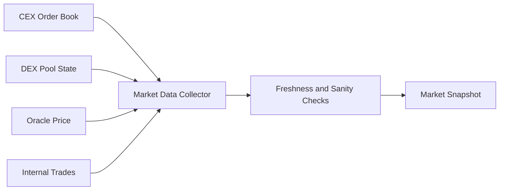
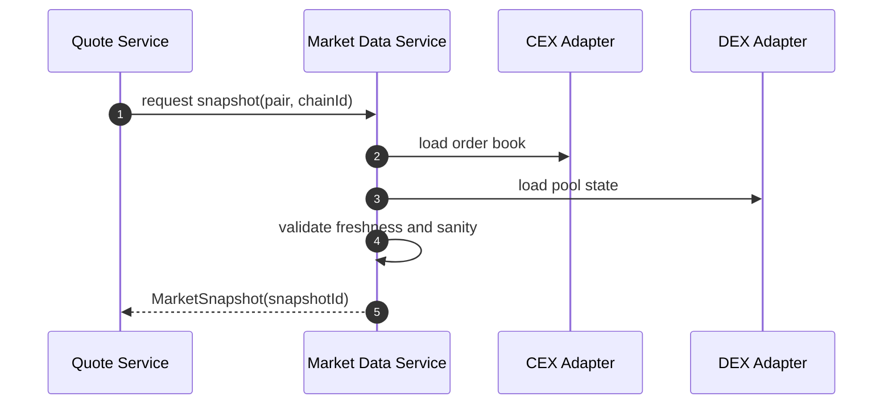
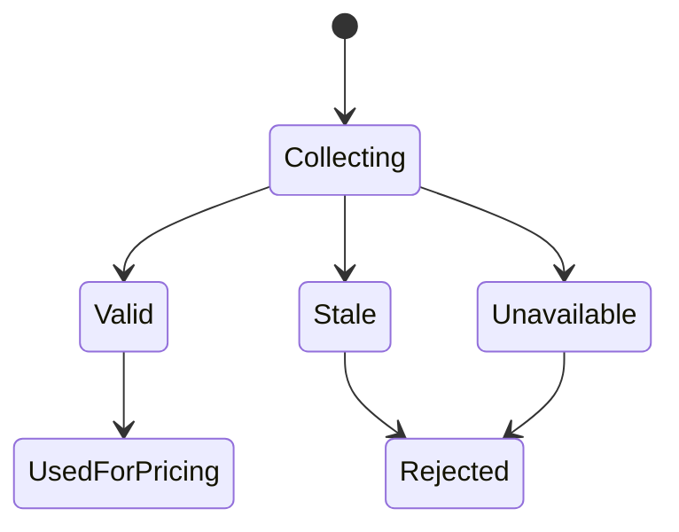

# Chapter 01: Market Data

## Abstract

市场数据是 RFQ 定价的输入边界。Pricing Engine 不能凭空生成价格，它必须基于可追踪的 market snapshot。该 snapshot 至少包含交易对、chainId、来源、bid、ask、mid、深度、波动率、时间戳和可信状态。市场数据质量直接决定报价是否可签名。

## Learning Objectives

- 理解 RFQ 系统需要哪些市场数据。
- 区分链上池数据、中心化交易所数据和聚合数据。
- 明确 `snapshotId` 在报价回放和审计中的作用。
- 定义 market data stale 时的处理策略。

## Background

Web3 做市系统通常需要同时读取链上 AMM 池、DEX aggregator、CEX order book、预言机和内部成交数据。不同来源的延迟、精度和可操纵性不同。RFQ 系统必须把这些输入统一成可审计快照，而不是在报价时临时散落读取。

## Problem Statement

如果 market data 没有版本和快照，后续无法解释为什么某一笔 quote 给出某个价格。更严重的是，过期或被操纵的数据可能导致错误签名，一旦 quote 被链上执行，损失不可逆。

## Requirements

### Functional Requirements

- 支持多来源 market data。
- 为每次报价生成 `snapshotId`。
- 记录 bid、ask、mid、depth、volatility、source 和 observedAt。
- 标记数据是否 stale 或 unavailable。
- 为 Pricing Engine 提供统一 `MarketSnapshot`。

### Non-Functional Requirements

- 实时路径读取必须低延迟。
- 数据源异常必须可观测。
- 快照必须可回放。
- 不可信快照不能进入签名流程。

## Existing Solutions

单一预言机适合低频价格参考，但不适合高频 RFQ。直接读取 AMM 池适合链上状态，但容易受瞬时操纵影响。CEX order book 深度好，但有 API 延迟和外部依赖风险。生产系统通常组合多个来源。

## Trade-Off Analysis

数据源越多，鲁棒性越强，但归一化和冲突处理更复杂。本项目采用多来源输入、统一快照输出的方式，将复杂性集中在 Market Data Service。

## System Design

## Architecture Diagram

Market Data Service 位于 Pricing Engine 之前，负责把多来源输入转换为统一快照。

## Sequence Diagram

## State Machine

## Data Model

`MarketSnapshot` 包含 `snapshotId`、`chainId`、`tokenIn`、`tokenOut`、`bidPrice`、`askPrice`、`midPrice`、`liquidityUsd`、`volatilityBps`、`source`、`observedAt` 和 `createdAt`。

## API Design

Market Data Service 是内部服务。公开 API 不直接暴露原始快照，但 quote response 返回 `snapshotId`。

## Engineering Decisions

- 每个 quote 必须关联 snapshotId。
- stale market data 默认拒绝签名。
- readiness 使用同一类 freshness 和 future clock-skew 约束检查 market data，stale 或明显来自未来的 snapshot 会让 `/ready` 返回 HTTP 503/degraded，避免编排层继续把 quote 流量导入坏实例。
- 数据源异常进入 metrics 和 alert。
- 当前后端实现中，`StaticMarketDataService` 只为显式配置的 chain/token pair 返回 snapshot，未配置 pair 直接返回 `MARKET_DATA_UNAVAILABLE`，避免 Pricing Engine 对没有市场数据的交易生成价格。服务启动时会校验静态配置：`supportedPairs` 不能为空，`chainId` 必须是正安全整数，token 必须是 20-byte hex address，同一个 pair 内 token 必须不同，且不允许大小写归一化后的重复 pair。每个 returned snapshot 使用 pair 前缀、观测时间和本实例递增序列生成唯一 `snapshotId`；同一交易对的多次报价不能复用同一个 market snapshot primary id。Quote Service 在 pricing 之前通过 `getMarketSnapshotIssue()` 校验 `MarketSnapshot` 的 required own `snapshotId`、`midPrice`、`liquidityUsd`、`volatilityBps` 和 `observedAt` 字段，其中 `midPrice` 必须是 canonical positive decimal string without leading zeros，`liquidityUsd` 必须是 canonical positive uint string without leading zeros，`volatilityBps` 必须是 `0..10000` bps 内的安全整数，`observedAt` 必须是 `Date.prototype.toISOString()` 生成的 canonical UTC ISO timestamp；默认 freshness window 为 5 秒，并只允许 1 秒以内的未来时间戳漂移；missing, inherited or malformed snapshot fields、unsafe freshness windows、超过窗口、时间戳明显来自未来、date-only/natural-language timestamp、会被 JavaScript 自动归一化的非法日期、价格非正数、流动性无效或 volatility 超出 bps 上限时返回 `MARKET_DATA_UNAVAILABLE`。
- `InMemoryMarketSnapshotRepository` mirrors the PostgreSQL market_snapshots contract：保存 `snapshotId`、`chainId`、`tokenIn`、`tokenOut`、`midPrice`、`liquidityUsd`、`volatilityBps`、non-empty `source`、`observedAt` 和 `createdAt`。`snapshotId` must be an own primitive-string `SafeIdentifier` with 1-128 characters matching `[A-Za-z0-9_:-]`, while `source` remains a non-empty source label and must be an own field when provided. Snapshot persistence rejects malformed root payloads, missing `request` / `snapshot` objects, inherited `request` / `snapshot` / `source` fields, and inherited snapshot fields before field access or state mutation; snapshot lookup validates `snapshotId` before reading the store. Direct repository callers cannot pass boxed `String` wrappers or inherited object properties and rely on JavaScript regex coercion before snapshot persistence or lookup. 同一 `snapshotId` 的完全相同写入是幂等重放，任何 price、liquidity、volatility、pair、source 或 observedAt 改写都会被拒绝。Quote Service 必须先保存 market snapshot，再进入 routing、pricing、quote persistence、risk 或 signer。
- `StaticMarketDataService` 在构造期校验并快照 `StaticMarketDataConfig`。Config 的 `supportedPairs` 必须是 own field，每个 supported pair 的 `chainId`、`tokenIn` 和 `tokenOut` 也必须是 own fields；外部调用方不能在服务创建后通过修改 `supportedPairs` 数组或 pair 对象来改变可报价交易对集合，避免实例运行中出现配置漂移。
- `StaticMarketDataService` rejects malformed config, inherited config fields, malformed `supportedPairs` entries and inherited pair fields before reading chain/token fields, so startup cannot hide a null config, inherited allowlist or array-shaped pair behind a later field-level validation error. Runtime `getSnapshot(request)` also requires request fields to be own fields and validates request chain, user, token pair, canonical positive amount and bounded slippage before pair lookup, so direct callers cannot rely on inherited object properties or JavaScript regex coercion before market snapshot creation.
- 可选的 `RFQ_CEX_PAIRS` 使用 `chainId:tokenIn:tokenOut:exchange:symbol` 声明 Level-2 数据源；同一链上交易对可分别配置 Binance 的 `ETHUSDT` 与 Coinbase 的 `ETH-USDT`。生产环境默认要求 `RFQ_CEX_MIN_SOURCES=2`，每个来源必须完成 full snapshot/增量同步、具有未过期的交易所事件时间、形成非交叉双边订单簿并满足最大 spread。监控器使用 18 位定点整数计算 best price、mid、spread 和深度，规范化同价位的不同字符串格式，任何畸形 level 都在整条消息修改状态前被拒绝。CEX 配置固定 `tokenOut` 为 USD reference，因此当前 RFQ 方向需要把收到的 tokenIn base inventory 卖到外部 bids；`liquidityUsd` 只累加 mid 下方 `RFQ_CEX_DEPTH_RANGE_BPS` 范围内的 bid notional，ask quantity 只属于反向交易，不能抬高本方向 size-impact 分母。
- 聚合先计算来源中位数，再剔除超过 `RFQ_CEX_MAX_SOURCE_DEVIATION_BPS` 的来源；剩余来源不足 quorum 时立即删除该交易对的高优先级 CEX cache，而不是继续服务旧快照。聚合快照的 `observedAt` 取已接受来源中最老的事件时间；没有新底层事件时不会生成新 snapshotId、刷新缓存时间或人为压低波动率。来源超过 `RFQ_CEX_MAX_SOURCE_AGE_MS` 或时间戳超出 future-skew 窗口时会主动重同步。
- Binance adapter 遵循官方 [Spot local order book synchronization](https://developers.binance.com/docs/binance-spot-api-docs/web-socket-streams#how-to-manage-a-local-order-book-correctly)：先建立 WebSocket 并缓冲增量，再读取 REST depth snapshot，丢弃不晚于 `lastUpdateId` 的事件，并要求后续 update-id 连续覆盖。Coinbase adapter 按官方 [Exchange level2 channel](https://docs.cdp.coinbase.com/exchange/websocket-feed/channels#level2-channel) 消费带 `time` 的 snapshot 与 `l2update`；断线、无效消息或 freshness 失败都会清空本地 book 后重新获取 full snapshot。
- 基础行情源可通过 `RFQ_MARKET_DATA_PROVIDER=chainlink` 与 `RFQ_CHAINLINK_CONFIG_JSON` 切换到 Chainlink AggregatorV3。实现只使用带完整 round metadata 的 `latestRoundData`，拒绝非正 answer、非法 round、超过 `maxPriceAgeMs` 的旧数据、未来时间戳和链上 decimals 与配置不一致的数据，并把 `updatedAt` 而不是 RPC 返回时刻写入 `observedAt`。Oracle 不提供可成交深度或短周期波动率，因此 `referenceLiquidityUsd` 与 `referenceVolatilityBps` 是显式风险输入，不能被解释为实时测量值。
- 每个 Chainlink network 显式声明 `networkType=l1|l2`。Base、Arbitrum 等 L2 配置必须同时声明 Sequencer Uptime Feed 与恢复 grace period，L1 则拒绝这两个字段；sequencer down、状态未初始化或恢复宽限期未结束时拒绝生成快照。该行为遵循 Chainlink 的 [AggregatorV3 API](https://docs.chain.link/data-feeds/api-reference) 和 [L2 Sequencer Uptime Feed](https://docs.chain.link/data-feeds/l2-sequencer-feeds) 指南。CEX 与基础源使用独立缓存，读取顺序固定为 `CEX -> base cache -> base provider`，避免低频 oracle/static updater 覆盖已经同步的订单簿。
- 每个内部 `MarketSnapshot` 携带不可枚举的来源标签，不改变 API schema；Quote Service 持久化时把它写入 `market_snapshots.source`。因此审计记录能区分 `static-market-data-v1`、`chainlink-aggregator-v3` 与实际参与聚合的 CEX 集合，而不会再把所有快照误记为静态源。

## Failure Scenarios

- CEX API 超时：使用其他来源或拒绝报价。
- DEX pool 状态异常：触发 sanity check。
- 来源价格偏离过大：拒绝该交易对报价。

## Security Considerations

链上池价格可能被闪电贷操纵，不能直接作为唯一价格。外部 API 返回值必须校验时间戳和偏离度。

## Performance Considerations

实时路径应读取预聚合快照，而不是每次 quote 都同步查询所有数据源。
PostgreSQL schema 为 `market_snapshots` 提供 `(chain_id, token_in, token_out, observed_at DESC)` 索引，服务按链和交易对读取最新快照时不需要全表扫描；quote 回放仍通过 `snapshotId` 精确定位历史快照。

## Testing Strategy

测试 unconfigured pair、unique snapshot id、snapshot store idempotency/conflict/defensive copy、stale snapshot、source divergence、missing depth、negative spread、timestamp drift 和 fallback 逻辑。

## Interview Notes

面试中强调 market data 不是价格字段，而是可回放决策上下文。没有 snapshotId，就无法解释 quote。

## Summary

市场数据是 RFQ 报价的第一层防线。系统必须先保证输入可信，再谈定价和签名。

## References

- Market data aggregation
- Oracle manipulation risk
- RFQ quote replay
