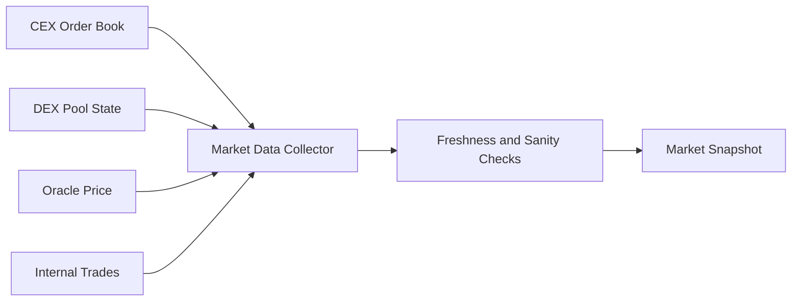
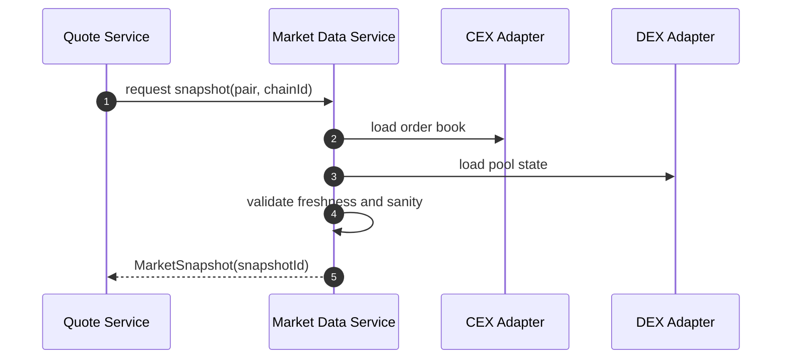
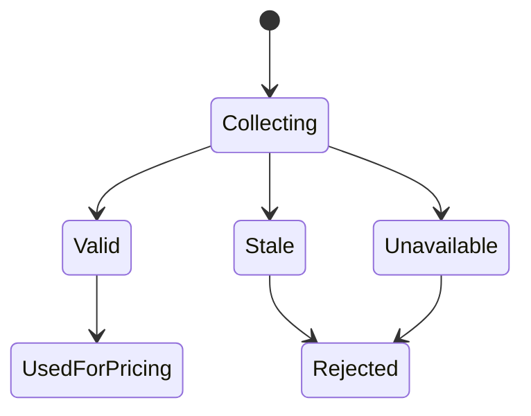

# Chapter 01: Market Data

## Abstract

市场数据是 RFQ 定价的输入边界。Pricing Engine 不能凭空生成价格，它必须基于可追踪的 market snapshot。该 snapshot 至少包含交易对、chainId、来源、bid、ask、mid、深度、波动率、时间戳和可信状态。市场数据质量直接决定报价是否可签名。

## Learning Objectives

- 理解 RFQ 系统需要哪些市场数据。
- 区分链上池数据、中心化交易所数据和聚合数据。
- 明确 `snapshotId` 在报价回放和审计中的作用。
- 定义 market data stale 时的处理策略。

## Background

Web3 做市系统通常需要同时读取链上 AMM 池、DEX aggregator、CEX order book、预言机和内部成交数据。不同来源的延迟、精度和可操纵性不同。RFQ 系统必须把这些输入统一成可审计快照，而不是在报价时临时散落读取。

## Problem Statement

如果 market data 没有版本和快照，后续无法解释为什么某一笔 quote 给出某个价格。更严重的是，过期或被操纵的数据可能导致错误签名，一旦 quote 被链上执行，损失不可逆。

## Requirements

### Functional Requirements

- 支持多来源 market data。
- 为每次报价生成 `snapshotId`。
- 记录 bid、ask、mid、depth、volatility、source 和 observedAt。
- 标记数据是否 stale 或 unavailable。
- 为 Pricing Engine 提供统一 `MarketSnapshot`。

### Non-Functional Requirements

- 实时路径读取必须低延迟。
- 数据源异常必须可观测。
- 快照必须可回放。
- 不可信快照不能进入签名流程。

## Existing Solutions

单一预言机适合低频价格参考，但不适合高频 RFQ。直接读取 AMM 池适合链上状态，但容易受瞬时操纵影响。CEX order book 深度好，但有 API 延迟和外部依赖风险。生产系统通常组合多个来源。

## Trade-Off Analysis

数据源越多，鲁棒性越强，但归一化和冲突处理更复杂。本项目采用多来源输入、统一快照输出的方式，将复杂性集中在 Market Data Service。

## System Design

## Architecture Diagram

Market Data Service 位于 Pricing Engine 之前，负责把多来源输入转换为统一快照。

## Sequence Diagram

## State Machine

## Data Model

`MarketSnapshot` 的实时定价契约包含 `snapshotId`、`midPrice`、`liquidityUsd`、`marketSpreadBps`、`volatilityBps` 和 `observedAt`；持久化记录额外绑定 `chainId`、`tokenIn`、`tokenOut`、`source` 和 `createdAt`。`marketSpreadBps` 表示当前 RFQ 方向从中间价到外部最优可执行价格的折价：卖出 exchange base 使用 best bid，使用 USD quote 买入 base 则使用 inverse best ask；它不等同于订单簿完整 bid/ask spread。

## API Design

Market Data Service 是内部服务。公开 API 不直接暴露原始快照，但 quote response 返回 `snapshotId`。

## Engineering Decisions

- 每个 quote 必须关联 snapshotId。
- stale market data 默认拒绝签名。
- readiness 使用同一类 freshness 和 future clock-skew 约束检查 market data，stale 或明显来自未来的 snapshot 会让 `/ready` 返回 HTTP 503/degraded，避免编排层继续把 quote 流量导入坏实例。
- 数据源异常进入 metrics 和 alert。
- 当前后端实现中，`StaticMarketDataService` 只为显式配置的 chain/token pair 返回 snapshot，未配置 pair 直接返回 `MARKET_DATA_UNAVAILABLE`，避免 Pricing Engine 对没有市场数据的交易生成价格。运行时从 `RFQ_MARKET_PAIRS` 构造该 allowlist，并用同一组 pair 派生默认 settlement verifier 的 chain/token policy，不能再由 hard-coded static pair 或默认 chain 列表覆盖运维配置。服务启动时会校验静态配置：`supportedPairs` 不能为空，`chainId` 必须是正安全整数，token 必须是 20-byte hex address，同一个 pair 内 token 必须不同，且不允许大小写归一化后的重复 pair。每个 returned snapshot 使用 pair 前缀、观测时间和本实例递增序列生成唯一 `snapshotId`；同一交易对的多次报价不能复用同一个 market snapshot primary id。Quote Service 在 pricing 之前通过 `getMarketSnapshotIssue()` 校验 `MarketSnapshot` 的 required own `snapshotId`、`midPrice`、`liquidityUsd`、`marketSpreadBps`、`volatilityBps` 和 `observedAt` 字段，其中 `midPrice` 必须是 canonical positive decimal string without leading zeros，`liquidityUsd` 必须是 canonical positive uint string without leading zeros，两个 bps 字段必须是 `0..10000` 内的安全整数，`observedAt` 必须是 `Date.prototype.toISOString()` 生成的 canonical UTC ISO timestamp；默认 freshness window 为 5 秒，并只允许 1 秒以内的未来时间戳漂移；missing, inherited or malformed snapshot fields、unsafe freshness windows、超过窗口、时间戳明显来自未来、价格或流动性无效、bps 超出上限时返回 `MARKET_DATA_UNAVAILABLE`。Static 和 Chainlink 没有方向化可执行订单簿，因此显式返回 `marketSpreadBps=0`，而不是伪造市场成本。
- `InMemoryMarketSnapshotRepository` mirrors the PostgreSQL market_snapshots contract：保存 `snapshotId`、`chainId`、`tokenIn`、`tokenOut`、`midPrice`、`liquidityUsd`、`marketSpreadBps`、`volatilityBps`、non-empty `source`、`observedAt` 和 `createdAt`。`snapshotId` must be an own primitive-string `SafeIdentifier` with 1-128 characters matching `[A-Za-z0-9_:-]`, while `source` remains a non-empty source label and must be an own field when provided. Snapshot persistence rejects malformed root payloads, missing `request` / `snapshot` objects, inherited `request` / `snapshot` / `source` fields before mutation, and snapshot lookup validates `snapshotId` before reading the store. 同一 `snapshotId` 的完全相同写入是幂等重放，任何 price、liquidity、market spread、volatility、pair、source 或 observedAt 改写都会被拒绝。Quote Service 必须先保存 market snapshot，再进入 routing、pricing、quote persistence、risk 或 signer。
- `StaticMarketDataService` 在构造期校验并快照 `StaticMarketDataConfig`。Config 的 `supportedPairs` 必须是 own field，每个 supported pair 的 `chainId`、`tokenIn` 和 `tokenOut` 也必须是 own fields；外部调用方不能在服务创建后通过修改 `supportedPairs` 数组或 pair 对象来改变可报价交易对集合，避免实例运行中出现配置漂移。
- `StaticMarketDataService` rejects malformed config, inherited config fields, malformed `supportedPairs` entries and inherited pair fields before reading chain/token fields, so startup cannot hide a null config, inherited allowlist or array-shaped pair behind a later field-level validation error. Runtime `getSnapshot(request)` also requires request fields to be own fields and validates request chain, user, token pair, canonical positive amount and bounded slippage before pair lookup, so direct callers cannot rely on inherited object properties or JavaScript regex coercion before market snapshot creation.
- 可选的 `RFQ_CEX_PAIRS` 使用 `chainId:baseToken:usdQuoteToken:exchange:symbol:role` 声明交易所原生 Level-2 数据源，`role` 只能是 `hedge` 或 `reference`。当前 hedge worker 只实现 Binance，因此每个市场必须包含至少一个 Binance hedge source，Coinbase 只能作为 reference source；错误角色在启动期失败。API 与 Hedge Worker 必须读取同一份 `RFQ_HEDGE_ROUTES_JSON`。API 对每个 hedge source 精确核对 route 的 `chainId`、base token、quote token、venue 和 symbol，并用共享 token registry 再校验两侧 decimals；缺失、错配或仅存在于行情配置中的执行市场都会导致启动失败。生产环境默认要求 `RFQ_CEX_MIN_SOURCES=2`，所有来源都参与价格中位数、偏离检查和保守 executable spread，但只有通过检查且已绑定执行 route 的 hedge source 深度进入 `liquidityUsd`。若 reference quorum 仍健康但 hedge source 过期、失联或被判为 outlier，监控器删除正反方向 cache，不能按不可路由深度继续报价。每个来源必须完成 full snapshot/增量同步、具有未过期的交易所事件时间、形成非交叉双边订单簿并满足最大 spread。监控器使用 18 位定点整数计算 best price、mid、spread 和深度，规范化同价位的不同字符串格式，任何畸形 level 都在整条消息修改状态前被拒绝。CEX 配置的 `usdQuoteToken` 必须是 USD reference；同一本 `BASE/USD` 订单簿同时发布 base-to-quote 与 quote-to-base 两个 RFQ cache key。前者的 `liquidityUsd` 只累加可对冲来源在 mid 下方范围内的 bid notional，后者使用可对冲来源在 mid 上方范围内的 ask notional，并把 mid 与 best ask 取精确定点倒数。两个方向的 depth 不相加，也不共享 snapshot freshness 指纹或波动率历史。
- 每个可用 CEX source 都按 RFQ 方向生成 mid 与 executable price；形成 accepted-source directional median 后，再计算每个来源 executable price 相对统一 median 的折价并向上取整，最大值成为该方向 snapshot 的 `marketSpreadBps`。Reference source 虽不贡献 `liquidityUsd`，仍参与这一保守价格与基差检查；hedge source 则同时贡献通过深度窗口计算的可路由流动性。完整 bid/ask `spreadBps` 仍只用于来源健康阈值，两者不能混用。剩余来源不足 quorum 或不存在 accepted hedge source 时立即删除正反两个高优先级 CEX cache；聚合 `observedAt` 取最老事件时间，没有新底层事件时不会生成新 snapshotId 或刷新缓存时间。
- Binance adapter 遵循官方 [Spot local order book synchronization](https://developers.binance.com/docs/binance-spot-api-docs/web-socket-streams#how-to-manage-a-local-order-book-correctly)：先建立 WebSocket 并缓冲增量，再读取 REST depth snapshot，丢弃不晚于 `lastUpdateId` 的事件，并要求后续 update-id 连续覆盖。Coinbase adapter 按官方 [Exchange level2 channel](https://docs.cdp.coinbase.com/exchange/websocket-feed/channels#level2-channel) 消费 snapshot 与 `l2update`；官方 snapshot 只有 `type/product_id/bids/asks`，没有交易所 `time`，因此连接器以受 10 秒初始快照期限约束的本地接收时刻初始化 freshness。首个 `l2update` 可以早于该本地接收时刻，之后才按交易所事件时间单调比较，避免把网络传输延迟误判成回退。两个 adapter 都为 WebSocket handshake 设置 10 秒硬期限，且 WebSocket 只接受不超过 1 MiB 的文本帧；Binance REST snapshot 以流式读取限制在 2 MiB，所有限制都在 JSON 解码前执行。二进制帧、超限或畸形 payload、真实事件时间回退、显式 socket error、断线或 freshness 失败都会关闭旧连接、清空本地 book，并通过最长 30 秒、带等抖动的有界指数退避重新获取 full snapshot，避免资源放大、旧状态继续报价或多副本同时冲击交易所。
- 基础行情源可通过 `RFQ_MARKET_DATA_PROVIDER=chainlink` 与 `RFQ_CHAINLINK_CONFIG_JSON` 切换到 Chainlink AggregatorV3 proxy。每个 network 首次读取前先调用 `eth_chainId` 并缓存成功结果，错链或 RPC 失败会清除缓存并 fail closed，不能仅依赖本地 viem chain 描述。每个 feed 配置必须绑定非零 proxy、链上 `description`、`decimals` 以及按 feed 原始精度表达的正数 `minAnswer/maxAnswer`；服务并发读取并缓存 metadata，任一不一致都拒绝快照，避免把同 decimals 的错误 feed 静默映射到目标 token pair。实现只使用带完整 round metadata 的 `latestRoundData`，拒绝非正或越过 circuit breaker 的 answer、非法 round/start/update timestamp、超过 `maxPriceAgeMs` 的旧数据和未来时间戳，并把 `updatedAt` 而不是 RPC 返回时刻写入 `observedAt`。远端 RPC 必须使用 HTTPS，只有 loopback fixture 可用 HTTP。Oracle 不提供可成交深度或短周期波动率，因此 `referenceLiquidityUsd` 与 `referenceVolatilityBps` 是显式风险输入，不能被解释为实时测量值。
- 每个 Chainlink network 显式声明 `networkType=l1|l2`。Base、Arbitrum 等 L2 配置必须同时声明 Sequencer Uptime Feed 与恢复 grace period，L1 则拒绝这两个字段；sequencer down、状态未初始化或恢复宽限期未结束时拒绝生成快照。该行为遵循 Chainlink 的 [AggregatorV3 API](https://docs.chain.link/data-feeds/api-reference) 和 [L2 Sequencer Uptime Feed](https://docs.chain.link/data-feeds/l2-sequencer-feeds) 指南。CEX 与基础源使用独立缓存。开发环境可按 `CEX -> base cache -> base provider` 降级；非本地 `static` provider 必须同时具备 non-empty `RFQ_CEX_PAIRS` 与 `RFQ_CEX_REQUIRE_LIVE_BOOK=true`，否则启动失败。强制模式下每个 CEX pair 的正反方向都必须命中主 CEX cache，冷启动、过期、跨源偏离或未同步状态直接拒绝报价。生产环境只有显式配置 `RFQ_MARKET_DATA_PROVIDER=chainlink` 时才允许把该开关设为 `false`，绝不允许从不可用订单簿回落到 `static`。readiness 在强制模式下探测受保护的 CEX 方向，而不是被健康的基础源掩盖。
- 每个内部 `MarketSnapshot` 携带不可枚举的来源标签，不改变 API schema；Quote Service 持久化时把它写入 `market_snapshots.source`。因此审计记录能区分 `static-market-data-v1`、`chainlink-aggregator-v3` 与实际参与聚合的 CEX 集合，而不会再把所有快照误记为静态源。

## Failure Scenarios

- CEX API 超时：使用其他来源或拒绝报价。
- DEX pool 状态异常：触发 sanity check。
- 来源价格偏离过大：拒绝该交易对报价。

## Security Considerations

链上池价格可能被闪电贷操纵，不能直接作为唯一价格。外部 API 返回值必须校验时间戳和偏离度。

## Performance Considerations

实时路径应读取预聚合快照，而不是每次 quote 都同步查询所有数据源。
PostgreSQL schema 为 `market_snapshots` 提供 `(chain_id, token_in, token_out, observed_at DESC)` 索引，服务按链和交易对读取最新快照时不需要全表扫描；quote 回放仍通过 `snapshotId` 精确定位历史快照。

## Testing Strategy

测试 unconfigured pair、unique snapshot id、snapshot store idempotency/conflict/defensive copy、stale snapshot、source divergence、missing depth、negative spread、timestamp drift 和 fallback 逻辑。Chainlink 还覆盖 proxy identity、raw answer 上下界、远端明文 RPC 拒绝和 L2 sequencer；上线前使用 exact release 执行 `RFQ_CHAINLINK_INTEGRATION_CONFIRM=read-live-oracle make chainlink-integration-check`，直接读取目标配置中的正反方向，fixture 通过不能替代该证据。CEX 上线还必须在目标出网环境执行 `RFQ_CEX_INTEGRATION_CONFIRM=yes make cex-orderbook-integration-check`：该验收直接驱动生产 `CEXOrderBookMonitor`，要求 Binance hedge 与 Coinbase reference 两个 Level-2 source 同时同步且新鲜、两方向均形成 `cex:binance+coinbase` snapshot、跨源偏差与 spread 在门限内，并核对最终 `liquidityUsd` 只来自 Binance bid/ask 可执行深度。单一 connector 连通不构成生产行情验收通过。

## Interview Notes

面试中强调 market data 不是价格字段，而是可回放决策上下文。没有 snapshotId，就无法解释 quote。

## Summary

市场数据是 RFQ 报价的第一层防线。系统必须先保证输入可信，再谈定价和签名。

## References

- Market data aggregation
- Oracle manipulation risk
- RFQ quote replay
