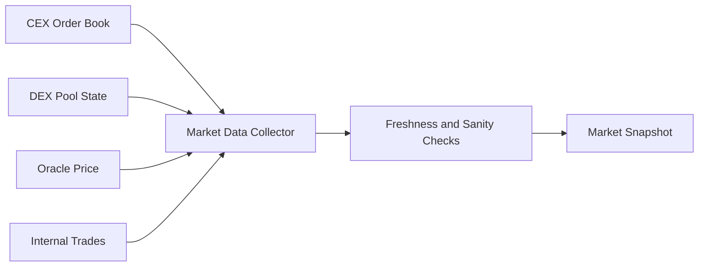
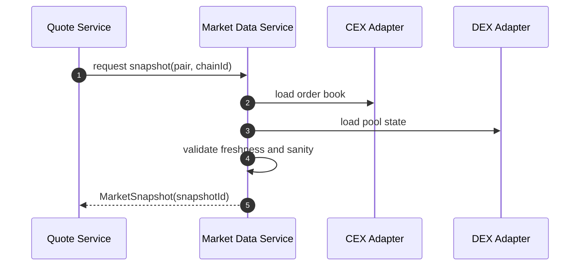
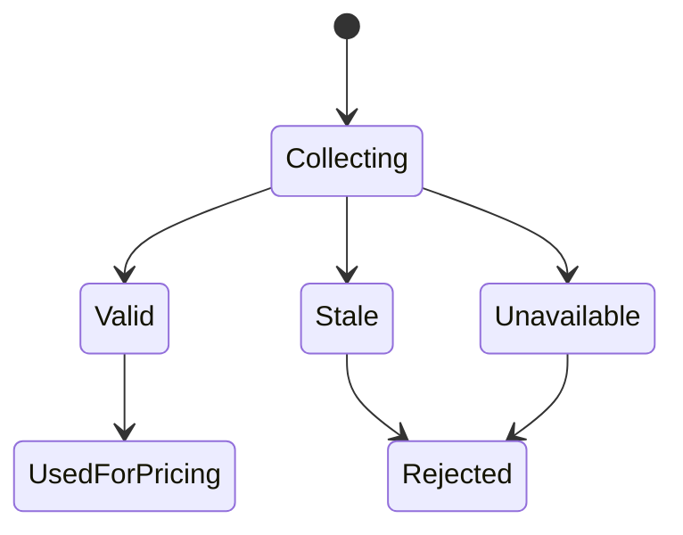

# Chapter 01: Market Data

## Abstract

市场数据是 RFQ 定价的输入边界。Pricing Engine 不能凭空生成价格，它必须基于可追踪的 market snapshot。该 snapshot 至少包含交易对、chainId、来源、bid、ask、mid、深度、波动率、时间戳和可信状态。市场数据质量直接决定报价是否可签名。

## Learning Objectives

- 理解 RFQ 系统需要哪些市场数据。
- 区分链上池数据、中心化交易所数据和聚合数据。
- 明确 `snapshotId` 在报价回放和审计中的作用。
- 定义 market data stale 时的处理策略。

## Background

Web3 做市系统通常需要同时读取链上 AMM 池、DEX aggregator、CEX order book、预言机和内部成交数据。不同来源的延迟、精度和可操纵性不同。RFQ 系统必须把这些输入统一成可审计快照，而不是在报价时临时散落读取。

## Problem Statement

如果 market data 没有版本和快照，后续无法解释为什么某一笔 quote 给出某个价格。更严重的是，过期或被操纵的数据可能导致错误签名，一旦 quote 被链上执行，损失不可逆。

## Requirements

### Functional Requirements

- 支持多来源 market data。
- 为每次报价生成 `snapshotId`。
- 记录 bid、ask、mid、depth、volatility、source 和 observedAt。
- 标记数据是否 stale 或 unavailable。
- 为 Pricing Engine 提供统一 `MarketSnapshot`。

### Non-Functional Requirements

- 实时路径读取必须低延迟。
- 数据源异常必须可观测。
- 快照必须可回放。
- 不可信快照不能进入签名流程。

## Existing Solutions

单一预言机适合低频价格参考，但不适合高频 RFQ。直接读取 AMM 池适合链上状态，但容易受瞬时操纵影响。CEX order book 深度好，但有 API 延迟和外部依赖风险。生产系统通常组合多个来源。

## Trade-Off Analysis

数据源越多，鲁棒性越强，但归一化和冲突处理更复杂。本项目采用多来源输入、统一快照输出的方式，将复杂性集中在 Market Data Service。

## System Design

## Architecture Diagram

Market Data Service 位于 Pricing Engine 之前，负责把多来源输入转换为统一快照。

## Sequence Diagram

## State Machine

## Data Model

`MarketSnapshot` 包含 `snapshotId`、`chainId`、`tokenIn`、`tokenOut`、`bidPrice`、`askPrice`、`midPrice`、`liquidityUsd`、`volatilityBps`、`source`、`observedAt` 和 `createdAt`。

## API Design

Market Data Service 是内部服务。公开 API 不直接暴露原始快照，但 quote response 返回 `snapshotId`。

## Engineering Decisions

- 每个 quote 必须关联 snapshotId。
- stale market data 默认拒绝签名。
- readiness 使用同一类 freshness 和 future clock-skew 约束检查 market data，stale 或明显来自未来的 snapshot 会让 `/ready` 返回 HTTP 503/degraded，避免编排层继续把 quote 流量导入坏实例。
- 数据源异常进入 metrics 和 alert。
- 当前后端实现中，`StaticMarketDataService` 只为显式配置的 chain/token pair 返回 snapshot，未配置 pair 直接返回 `MARKET_DATA_UNAVAILABLE`，避免 Pricing Engine 对没有市场数据的交易生成价格。服务启动时会校验静态配置：`supportedPairs` 不能为空，`chainId` 必须是正安全整数，token 必须是 20-byte hex address，同一个 pair 内 token 必须不同，且不允许大小写归一化后的重复 pair。Quote Service 在 pricing 之前校验 `MarketSnapshot` 的 `snapshotId`、`midPrice`、`liquidityUsd`、`volatilityBps` 和 `observedAt`，默认 freshness window 为 5 秒，并只允许 1 秒以内的未来时间戳漂移；超过窗口、时间戳明显来自未来、时间戳不可解析、价格非正数或流动性无效时返回 `MARKET_DATA_UNAVAILABLE`。

## Failure Scenarios

- CEX API 超时：使用其他来源或拒绝报价。
- DEX pool 状态异常：触发 sanity check。
- 来源价格偏离过大：拒绝该交易对报价。

## Security Considerations

链上池价格可能被闪电贷操纵，不能直接作为唯一价格。外部 API 返回值必须校验时间戳和偏离度。

## Performance Considerations

实时路径应读取预聚合快照，而不是每次 quote 都同步查询所有数据源。

## Testing Strategy

测试 unconfigured pair、stale snapshot、source divergence、missing depth、negative spread、timestamp drift 和 fallback 逻辑。

## Interview Notes

面试中强调 market data 不是价格字段，而是可回放决策上下文。没有 snapshotId，就无法解释 quote。

## Summary

市场数据是 RFQ 报价的第一层防线。系统必须先保证输入可信，再谈定价和签名。

## References

- Market data aggregation
- Oracle manipulation risk
- RFQ quote replay
