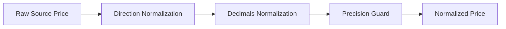
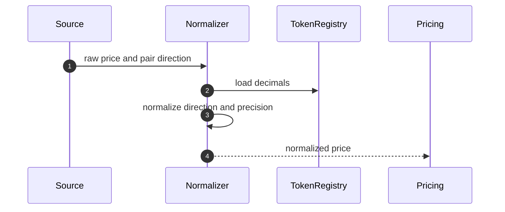
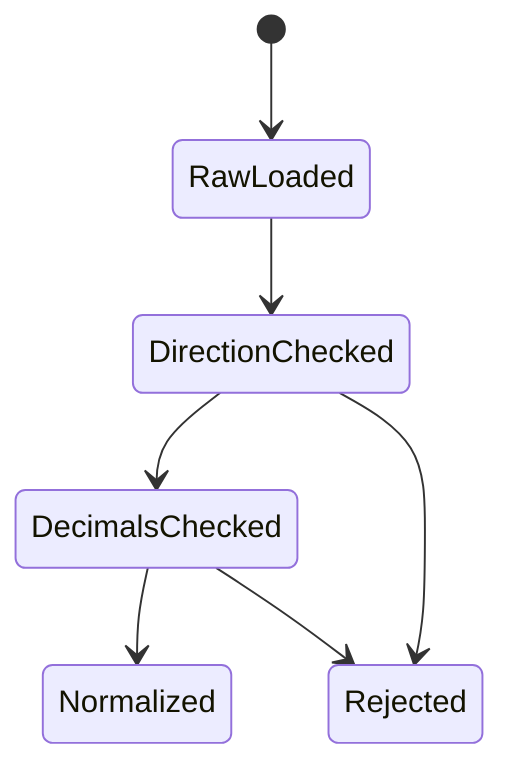

# Chapter 02: Price Normalization

## Abstract

价格归一化解决不同数据源之间单位、精度、方向和时间戳不一致的问题。RFQ 系统中的 token 使用不同 decimals，CEX 使用人类可读价格，链上池使用 reserve 或 sqrt price，订单簿使用 base/quote 方向。归一化错误会直接导致错误报价。

## Learning Objectives

- 理解 token decimals 和 base unit 的影响。
- 处理 tokenIn/tokenOut 方向转换。
- 统一 CEX、DEX 和 oracle 数据格式。
- 避免 JavaScript number 精度问题。

## Background

USDC 通常 6 decimals，WETH 通常 18 decimals。`1000000000` USDC base units 表示 1000 USDC，而 WETH 输出使用 wei。报价系统必须在计算和响应之间保持清晰转换。

当前实现把 `MarketSnapshot.midPrice` 定义为“每 1 个完整 tokenIn 可兑换的完整 tokenOut 数量”。它不是 base-unit ratio。例如 WETH/USDC 的 `midPrice=2000` 配合 18 位 WETH 和 6 位 USDC 时，`1e18` wei 的原始输出是 `2000e6`；反向 USDC/WETH 的 `midPrice=0.0005` 配合 `2000e6` USDC，原始输出是 `1e18` wei。方向和 decimals 在同一个公式中显式处理，不能靠调用者约定补偿。

## Problem Statement

如果系统在某一步把 base unit 当成人类单位，或把 WETH/USDC 价格方向反转，签名 quote 会在链上按错误金额执行。

## Requirements

### Functional Requirements

- 保存 token decimals。
- 支持 base/quote 方向转换。
- 支持整数 base unit 与 decimal price 分离。
- 输出 amountOut 使用 base unit 字符串。
- 市场价格最多接受 18 位小数，超出精度直接拒绝，禁止静默截断。
- size impact 使用 USD notional 与整数美元流动性比较，禁止把 token base units 当作美元。

### Non-Functional Requirements

- 不使用 JavaScript number 表示 uint256 金额。
- 所有转换必须可测试。
- 归一化规则必须版本化。

## Existing Solutions

很多前端 demo 直接使用浮点数计算价格，适合展示，不适合结算。生产 RFQ 必须使用 BigInt、decimal 库或数据库 numeric，并明确单位边界。

## Trade-Off Analysis

严格单位模型会让代码更啰嗦，但能避免资金级错误。RFQ quote 一旦签名，字段就是结算授权，因此必须优先保证精度。

## System Design

## Architecture Diagram

Price Normalization 是 Market Data Service 与 Pricing Engine 之间的转换层。

## Sequence Diagram

## State Machine

## Data Model

Token registry 包含 `chainId`、`tokenAddress`、`symbol`、`decimals`、`isWhitelisted`、`riskTier` 和 `usdReference`。`usdReference` 只表示该 token 已获治理批准，可在当前 size-impact 模型中按 1 USD 作为名义价值锚点；它不是对稳定币永不脱锚的保证。归一化价格内部使用 bigint numerator/denominator，逻辑上包含 `baseToken`、`quoteToken`、`price`、`scale` 和 `sourceTimestamp`。

## API Design

公开 API 的 amount 字段均为 base unit 字符串。内部 API 必须显式区分 `amountInBaseUnits` 和 `priceDecimal`。

## Engineering Decisions

- 金额字段使用字符串或 bigint。
- token decimals 来自 token registry，不从用户输入推断。
- direction normalization 必须有单元测试。
- `RFQ_TOKEN_REGISTRY_JSON` 在启动时进行 exact-field、重复地址、decimals、symbol、risk tier 和布尔字段校验；注册表实例复制配置，调用方后续修改原对象不会改变报价。
- `formula-v4` 继续使用 `amountInBase * priceNumerator * 10^tokenOutDecimals / (priceDenominator * 10^tokenInDecimals)` 并向下取整，做市方不会因小数舍入多付 tokenOut。
- USD 名义规模优先使用 tokenIn 的 `usdReference`；否则在 tokenOut 是 USD reference 时使用方向化 mid price 换算。两侧都不是 USD reference 时拒绝报价，直到接入独立的 USD valuation feed。
- CEX depth 当前由可执行 bid 的 `price * baseQuantity` 得到 quote notional，因此 CEX 配置要求 tokenOut 是 USD reference；否则 `liquidityUsd` 名称与单位不一致，启动直接失败。Ask depth 对应反向买入 base，不能与当前 tokenIn-to-tokenOut 方向的 bid depth 相加。

## Failure Scenarios

- token decimals 缺失：拒绝报价。
- token 未在 registry 白名单：拒绝报价。
- source pair 方向未知：拒绝归一化。
- price precision 超出 18 位：拒绝，绝不静默截断。
- decimals 换算后 amountOut 小于一个 tokenOut base unit：作为 dust 报价拒绝。
- 两侧都不是 approved USD reference：拒绝 size-impact 计算。

## Security Considerations

恶意 token 可能伪造 decimals 或行为不标准。whitelist 前必须在链上校验 token metadata、转账行为和代理升级权限，并记录治理审批。运行时只读取预先批准的 registry，不能信任 quote 请求中的 symbol 或 decimals。`usdReference` token 仍需脱锚监控和 kill switch；当前布尔标记不替代实时 depeg risk control。

## Performance Considerations

token metadata 应缓存，避免每次 quote 查询链上 decimals。

## Testing Strategy

测试 USDC/WETH、WETH/USDC、6 decimals、18 decimals、大额输入、小额输入、反向价格、19 位价格精度、dust 输出、缺失 metadata、禁用 token、重复 registry entry、非 USD pair 和 CEX 非 USD quote asset。API 集成测试还必须证明跨 decimals 的 `amountOut` 被写入并签名，而不只是纯函数返回正确。

## Interview Notes

价格归一化是很多 DeFi 系统 bug 的来源。高级工程师应主动提到 decimals、方向和精度。

## Summary

价格归一化是资金安全问题，不是格式问题。当前 `formula-v4` 已把 token registry、方向、精度、base-unit 输出、USD 名义规模和独立定价归因连成一条 fail-closed 路径；后续扩展非 USD cross 时，应新增可审计的 USD valuation snapshot，而不是恢复隐式单位假设。

## References

- ERC20 decimals
- BigInt accounting
- Fixed point arithmetic
