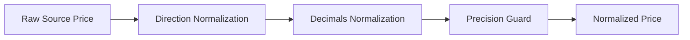
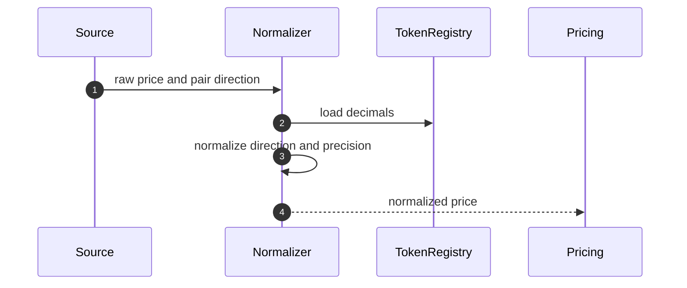
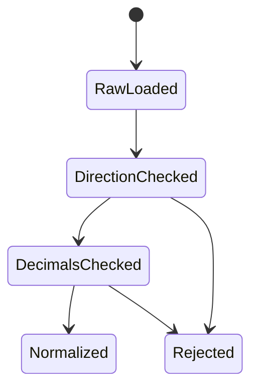

# Chapter 02: Price Normalization

## Abstract

价格归一化解决不同数据源之间单位、精度、方向和时间戳不一致的问题。RFQ 系统中的 token 使用不同 decimals，CEX 使用人类可读价格，链上池使用 reserve 或 sqrt price，订单簿使用 base/quote 方向。归一化错误会直接导致错误报价。

## Learning Objectives

- 理解 token decimals 和 base unit 的影响。
- 处理 tokenIn/tokenOut 方向转换。
- 统一 CEX、DEX 和 oracle 数据格式。
- 避免 JavaScript number 精度问题。

## Background

USDC 通常 6 decimals，WETH 通常 18 decimals。`1000000000` USDC base units 表示 1000 USDC，而 WETH 输出使用 wei。报价系统必须在计算和响应之间保持清晰转换。

## Problem Statement

如果系统在某一步把 base unit 当成人类单位，或把 WETH/USDC 价格方向反转，签名 quote 会在链上按错误金额执行。

## Requirements

### Functional Requirements

- 保存 token decimals。
- 支持 base/quote 方向转换。
- 支持整数 base unit 与 decimal price 分离。
- 输出 amountOut 使用 base unit 字符串。

### Non-Functional Requirements

- 不使用 JavaScript number 表示 uint256 金额。
- 所有转换必须可测试。
- 归一化规则必须版本化。

## Existing Solutions

很多前端 demo 直接使用浮点数计算价格，适合展示，不适合结算。生产 RFQ 必须使用 BigInt、decimal 库或数据库 numeric，并明确单位边界。

## Trade-Off Analysis

严格单位模型会让代码更啰嗦，但能避免资金级错误。RFQ quote 一旦签名，字段就是结算授权，因此必须优先保证精度。

## System Design

## Architecture Diagram

Price Normalization 是 Market Data Service 与 Pricing Engine 之间的转换层。

## Sequence Diagram

## State Machine

## Data Model

Token registry 包含 `chainId`、`tokenAddress`、`symbol`、`decimals`、`isWhitelisted` 和 `riskTier`。归一化价格包含 `baseToken`、`quoteToken`、`price`、`scale` 和 `sourceTimestamp`。

## API Design

公开 API 的 amount 字段均为 base unit 字符串。内部 API 必须显式区分 `amountInBaseUnits` 和 `priceDecimal`。

## Engineering Decisions

- 金额字段使用字符串或 bigint。
- token decimals 来自 token registry，不从用户输入推断。
- direction normalization 必须有单元测试。

## Failure Scenarios

- token decimals 缺失：拒绝报价。
- source pair 方向未知：拒绝归一化。
- price precision 超出范围：拒绝或截断前告警。

## Security Considerations

恶意 token 可能伪造 decimals 或行为不标准。whitelist 前必须校验 token metadata，并记录治理审批。

## Performance Considerations

token metadata 应缓存，避免每次 quote 查询链上 decimals。

## Testing Strategy

测试 USDC/WETH、WETH/USDC、6 decimals、18 decimals、大额输入、小额输入和反向价格。

## Interview Notes

价格归一化是很多 DeFi 系统 bug 的来源。高级工程师应主动提到 decimals、方向和精度。

## Summary

价格归一化是资金安全问题，不是格式问题。RFQ 系统必须在签名前保证单位和方向正确。

## References

- ERC20 decimals
- BigInt accounting
- Fixed point arithmetic
