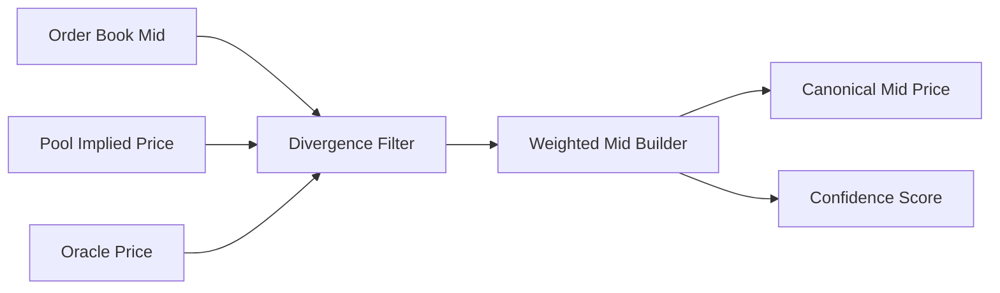
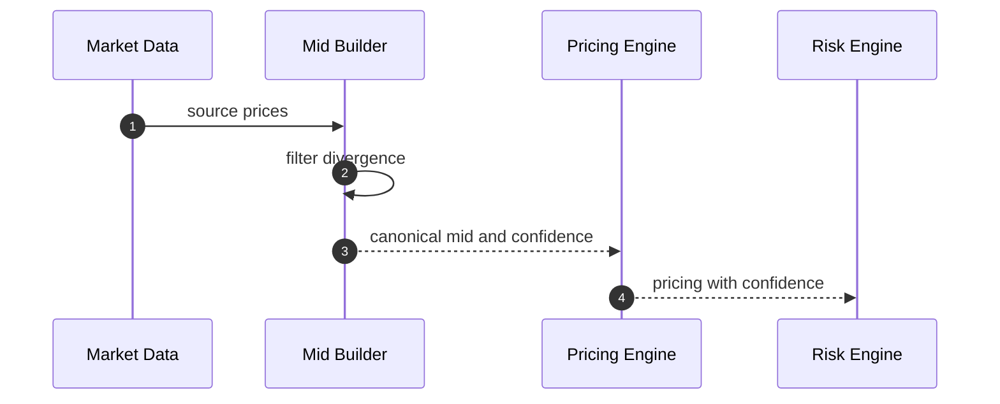
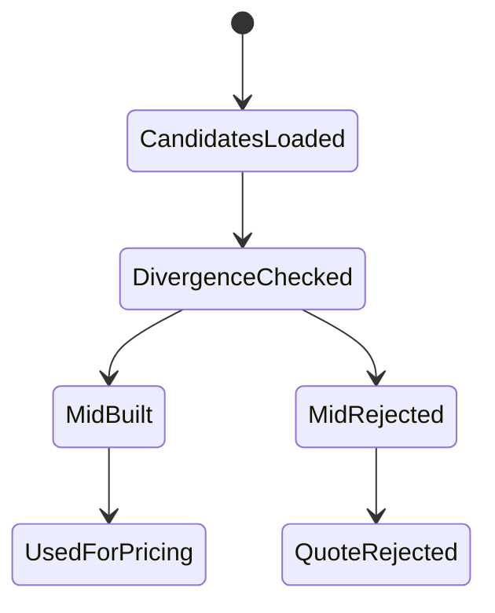

# Chapter 03: Mid Price

## Abstract

Mid price 是 Pricing Engine 的基础价格，但它不是简单平均。不同来源的 bid、ask、last price、oracle price 和 pool-implied price 都可能偏离。生产 RFQ 系统需要定义可解释的 mid price 构造方式，并为异常偏离提供拒绝或降级策略。

## Learning Objectives

- 理解 mid price 的作用和限制。
- 比较 order book mid、oracle price 和 pool-implied price。
- 定义来源权重和偏离检查。
- 明确 mid price 与最终 quote price 的区别。

## Background

mid price 通常表示当前市场的中间参考价。对于订单簿，常见计算是 `(bestBid + bestAsk) / 2`。对于 AMM 池，可以由 reserve 或 tick 推导。对于预言机，则通常是聚合后的外部参考价格。

## Problem Statement

单一 mid price 可能被延迟、操纵或代表性不足。如果 Pricing Engine 不区分 mid price 和 executable price，就会低估 spread、size impact 和对冲成本。

## Requirements

### Functional Requirements

- 支持多来源 mid candidate。
- 支持 bid/ask spread sanity check。
- 支持 source divergence check。
- 输出 canonical mid price 和 confidence。

### Non-Functional Requirements

- mid price 构造必须可回放。
- 异常偏离必须可观测。
- 低 confidence 不得进入无约束签名。

## Existing Solutions

简单系统直接使用 last trade price。该方法容易受到短期成交影响。Oracle price 更稳定，但可能滞后。订单簿 mid 更实时，但依赖外部 venue。生产系统通常组合多种来源。

## Trade-Off Analysis

使用多个来源可以提高鲁棒性，但增加延迟和冲突处理。本项目以 canonical mid + confidence 输出，让 Risk Engine 可以根据 confidence 收紧限额。

## System Design

## Architecture Diagram

Mid Price Builder 是 Pricing Engine 的前置组件，输出给 spread 和 size impact 模块。

## Sequence Diagram

## State Machine

## Data Model

Mid price 输出包括 `midPrice`、`sourceSet`、`confidenceBps`、`maxDivergenceBps`、`observedAt` 和 `snapshotId`。

## API Design

公开 quote response 不直接返回 mid price，但内部日志和分析事件必须包含 mid price。

## Engineering Decisions

- last trade price 不能作为唯一 mid。
- source divergence 超阈值时拒绝或降级。
- mid confidence 进入 Risk Engine。

## Failure Scenarios

- bid 大于 ask：拒绝该来源。
- oracle 滞后：降低权重。
- pool price 偏离过大：标记 potential manipulation。

## Security Considerations

AMM pool-implied price 容易被短期操纵，必须结合 TWAP、深度和外部来源检查。

## Performance Considerations

mid price 应预计算并缓存，quote 请求只读取最近有效快照。

## Testing Strategy

测试 source divergence、stale oracle、wide spread order book、single source fallback 和 confidence 输出。

## Interview Notes

Mid price 不是最终成交价。最终 quote price 还需要 spread、size impact、inventory skew 和风险溢价。

## Summary

Mid price 是定价基准，不是执行承诺。可靠 mid price 构造是 RFQ 报价质量的基础。

## References

- Order book mid price
- TWAP
- Oracle stale price checks
