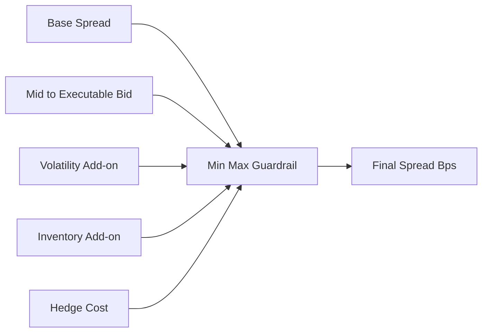
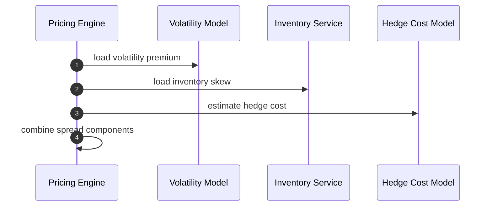
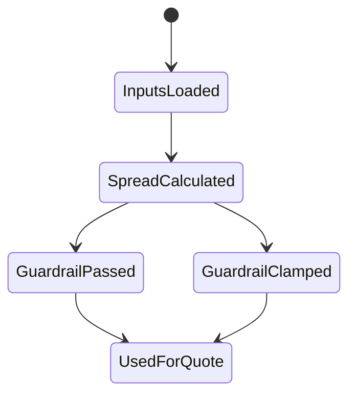

# Chapter 04: Spread

## Abstract

Spread 是做市商承担风险和提供流动性的补偿。RFQ 系统中的 spread 不是固定手续费，而是由市场状态、库存、波动率、对冲成本、用户流量和系统风险共同决定。Spread 过窄会放大损失，过宽会降低成交率。

## Learning Objectives

- 理解 base spread、dynamic spread 和 risk spread。
- 说明 spread 如何影响 bid / ask。
- 定义 spread 与风控的边界。
- 理解 spread 对成交率和 PnL 的影响。

## Background

传统做市通过 bid/ask spread 获得补偿。Web3 RFQ 中，用户通常请求某个方向的兑换，系统需要把 spread 体现在 `amountOut` 中。Spread 还应覆盖链上延迟、对冲滑点和库存风险。

## Problem Statement

固定 spread 无法适应不同资产、不同市场波动和不同库存状态。系统需要动态 spread，但又不能让模型变得不可解释。

## Requirements

### Functional Requirements

- 支持 base spread。
- 支持 volatility spread。
- 支持方向化 executable market spread。
- 支持 inventory spread。
- 支持 hedge cost spread。
- 输出 `spreadBps` 和组成解释。

### Non-Functional Requirements

- spread 计算必须确定性。
- 参数必须版本化。
- spread 下限和上限必须受 policy 控制。

## Existing Solutions

简单 swap 服务常使用固定 bps。专业做市系统使用动态 spread，并根据成交后表现持续调整参数。

## Trade-Off Analysis

动态 spread 更符合风险，但可能导致用户体验波动。本项目通过解释字段和 policy version 保持可审计。

## System Design

## Architecture Diagram

Spread 模块接收 mid price、方向化 executable market spread、volatility、inventory 和 hedge cost，输出 final spread。订单簿完整 bid/ask spread 用于判断来源是否健康；`marketSpreadBps` 只表示当前 tokenIn -> USD-reference tokenOut 方向从 mid 到 best bid 的成本，两者不能互相替代。

## Sequence Diagram

## State Machine

## Data Model

当前报价审计输出包括 `marketSpreadBps`、`sizeImpactBps`、`volatilityPremiumBps`、`inventorySkewBps`、`hedgeCostBps`、聚合 `spreadBps` 和 `pricingVersion`。base spread 与 internal route buffer 由 pricing version 和部署配置解释。

## API Design

公开 API 可不直接展示 spread 明细，但内部 quote record 必须保存。

## Engineering Decisions

- Spread 不是风控替代品。
- Spread 参数变更必须有版本。
- 极端风险应拒绝报价，而不是无限扩大 spread。

## Failure Scenarios

- hedge cost unavailable：使用保守 spread 或拒绝。
- volatility spike：扩大 spread 并降低 notional。
- inventory hard limit：Risk Engine 拒绝，而不是只调 spread。

## Security Considerations

Spread 参数属于做市策略，不应完整暴露给外部用户。对外只返回成交金额。

## Performance Considerations

Spread 计算必须轻量，复杂统计参数应离线更新。

## Testing Strategy

测试 spread 下限、上限、mid-to-bid 向上取整、多来源保守聚合、库存方向、波动率上升、hedge cost 缺失和参数版本。

## Interview Notes

Spread 是风险补偿，不是简单平台手续费。回答时要区分 base spread 和动态风险溢价。

## Summary

Spread 模块让 RFQ 报价能够反映市场和库存风险，同时需要 guardrail 防止模型失控。

## References

- Bid ask spread
- Market making inventory models
- Dynamic spread control
