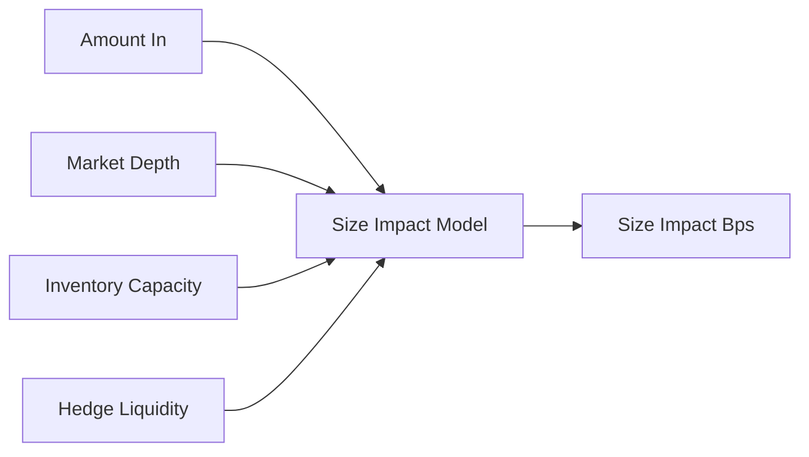
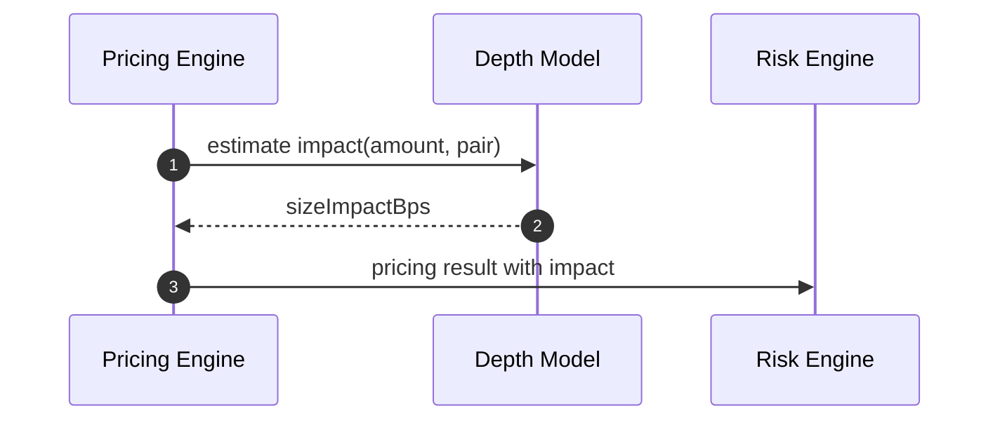
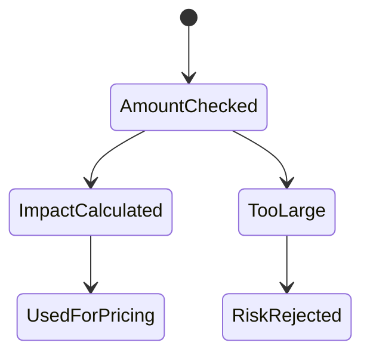

# Chapter 05: Size Impact

## Abstract

Size impact 描述交易尺寸对报价的影响。即使 mid price 不变，大额交易也会消耗更多流动性、增加对冲成本和库存风险，因此应获得更差的价格。RFQ 系统必须显式建模 size impact，而不是只用固定 spread 覆盖所有尺寸。

## Learning Objectives

- 理解 size impact 与 AMM price impact 的关系。
- 根据市场深度和对冲路径估算大额成本。
- 定义最大交易尺寸和分段报价。
- 说明 size impact 如何进入最终公式。

## Background

AMM 中 price impact 来自曲线。RFQ 中，即使最终不走 AMM 池，做市商仍然面对对冲和库存成本。交易越大，越可能推动外部市场价格或超过内部风险限额。

## Problem Statement

如果大额交易和小额交易使用相同 spread，做市商会低估大额成交风险。反过来，如果所有交易都按大额风险定价，小额成交率会下降。

## Requirements

### Functional Requirements

- 根据 amountIn 和 liquidity 计算 size impact。
- 支持分段曲线或阶梯 bps。
- 支持最大单笔 notional。
- 输出 `sizeImpactBps`。

### Non-Functional Requirements

- size impact 应单调不下降。
- 极端尺寸应由 Risk Engine 拒绝。
- 参数必须可回放。

## Existing Solutions

AMM 直接由池曲线产生 price impact。RFQ 可以使用订单簿深度、AMM 模拟、经验模型或固定阶梯模型。早期实现可用阶梯模型，后续演进为深度感知模型。

## Trade-Off Analysis

深度感知模型更准确，但依赖数据质量。阶梯模型简单可控，但不够精细。本项目文档定义接口，允许模型逐步升级。

## System Design

## Architecture Diagram

Size Impact Model 是 Pricing Engine 内部组件，与 Risk Engine 共享 max notional policy。

## Sequence Diagram

## State Machine

## Data Model

Size impact 输入包括 `amountIn`、`notionalUsd`、`liquidityUsd`、`depthBucket`、`hedgeVenueDepth`。输出包括 `sizeImpactBps` 和 `impactModelVersion`。

## API Design

用户只看到最终 amountOut。内部记录保存 size impact 明细。

## Engineering Decisions

- size impact 单独建模，不混入 base spread。
- 超过最大尺寸时拒绝报价。
- 当前 `formula-v4` 使用 `ceil(notionalUsd * 10000 / expectedLiquidityUsd)` 计算 size impact，并按配置上限截断；`expectedLiquidityUsd` 来自与报价方向一致的可执行深度。
- CEX `liquidityUsd` 必须使用报价方向对应的单侧可执行 depth：base-to-quote 使用 bids，quote-to-base 使用 asks。把两侧相加会高估可对冲流动性并系统性压低 size impact。

## Failure Scenarios

- 深度数据缺失：使用保守 impact 或拒绝。
- impact 计算为负：模型错误，拒绝。
- notional 超限：Risk Engine 拒绝。

## Security Considerations

大额询价可能被用于探测库存和策略。系统应限流并避免返回过多内部解释。

## Performance Considerations

深度模型应预聚合 bucket，避免 quote path 读取完整订单簿。

## Testing Strategy

测试 size impact 单调性、小额零影响、大额高影响、深度缺失和最大尺寸拒绝。

## Interview Notes

Size impact 是 RFQ 版的流动性成本表达。它不一定来自链上曲线，但经济含义类似。

## Summary

Size impact 让报价对交易尺寸敏感，是保护做市商免受大额订单错误定价的关键模块。

## References

- Market depth
- AMM price impact
- Order book slippage
