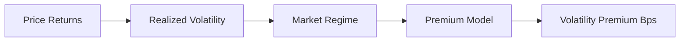
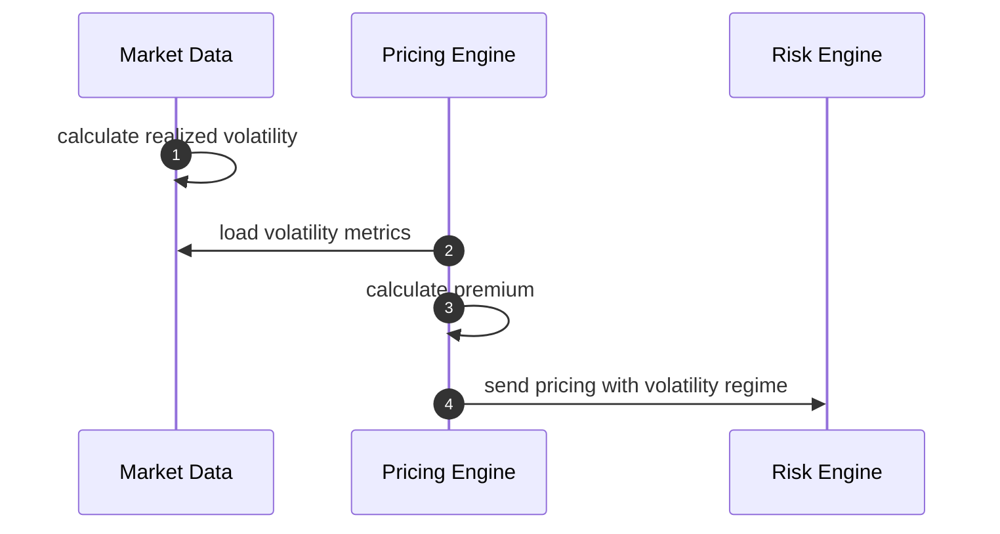
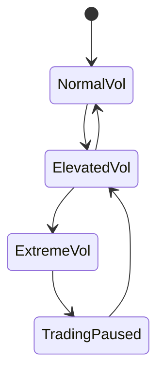

# Chapter 06: Volatility Premium

## Abstract

Volatility premium 是做市商为市场波动承担的风险补偿。RFQ quote 在签名后到链上执行前存在时间窗口，即使 TTL 很短，市场也可能变化。波动率越高，报价越容易在执行时变成对做市商不利的 stale quote。

## Learning Objectives

- 理解波动率与短生命周期 quote 的关系。
- 定义 volatility premium 如何进入 spread。
- 识别高波动时的拒绝和降级策略。
- 为 Risk Engine 提供 volatility-aware 限额。

## Background

传统做市在高波动市场会扩大 spread 或降低挂单尺寸。RFQ 系统也一样。由于 quote 一旦签名，用户可以在 TTL 内执行，做市商必须为这段时间的价格漂移收取补偿。

## Problem Statement

如果系统不考虑波动率，低波动和高波动市场会得到相似报价。高波动时，做市商更容易被 adverse selection 捕获。

## Requirements

### Functional Requirements

- 读取短周期和中周期 volatility。
- 根据 volatility 计算 premium bps。
- 支持高波动暂停或降低 notional。
- 输出 `volatilityPremiumBps`。

### Non-Functional Requirements

- volatility 输入必须有时间窗口说明。
- premium 模型必须有 guardrail。
- 高波动状态必须进入 metrics。

## Existing Solutions

简单系统使用固定 spread。专业系统根据 realized volatility、implied volatility、order book imbalance 和市场状态调整报价。

## Trade-Off Analysis

更灵敏的 volatility premium 能保护风险，但可能降低用户体验。系统应在 high volatility 下优先保护资金和库存。

## System Design

## Architecture Diagram

Volatility Premium 可以由 Market Data Service 预计算，Pricing Engine 读取结果。

## Sequence Diagram

## State Machine

## Data Model

Volatility data 包含 `pair`、`windowSeconds`、`realizedVolatilityBps`、`regime`、`observedAt` 和 `modelVersion`。

## API Design

公开 quote response 不暴露 volatility premium，但后台 quote record 保存。

## Engineering Decisions

- 高波动扩大 spread。
- 极端波动降低 notional 或拒绝。
- TTL 可根据 volatility regime 动态缩短。

## Failure Scenarios

- volatility 计算不可用：采用保守 premium。
- regime 从 normal 跳到 extreme：暂停高风险 pair。
- premium 超过上限：Risk Engine 拒绝。

## Security Considerations

攻击者可能在高波动窗口请求 stale quote。短 TTL、premium 和 risk limit 必须协同。

## Performance Considerations

volatility 应由流式任务预计算，不应在 quote request 中扫描历史数据。

## Testing Strategy

测试 normal、elevated、extreme regime，premium guardrail，TTL 调整和 unavailable fallback。

## Interview Notes

Volatility premium 的本质是为 quote 有效期内的价格漂移收费。它解释了为什么 RFQ quote 必须短生命周期。

## Summary

波动率溢价让 RFQ 定价对市场状态敏感，是防止高波动时期错误签名的重要保护。

## References

- Realized volatility
- Adverse selection
- Market making risk premium
