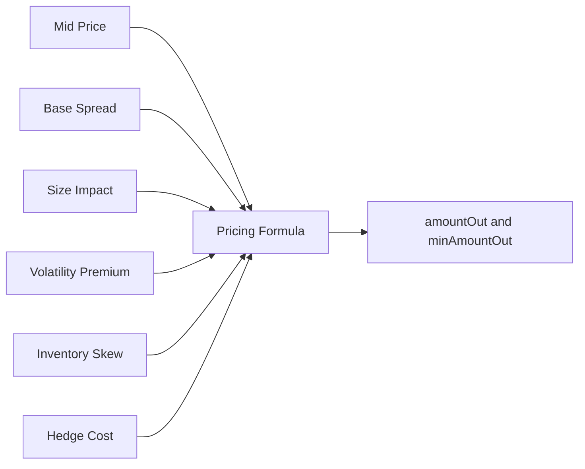
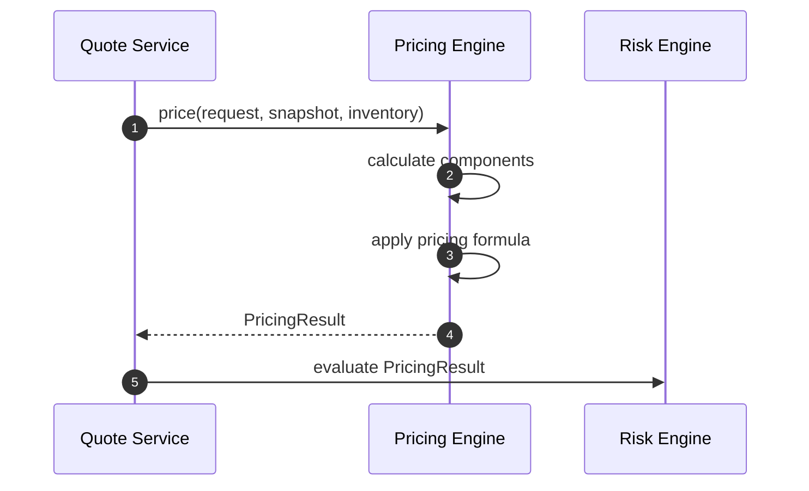
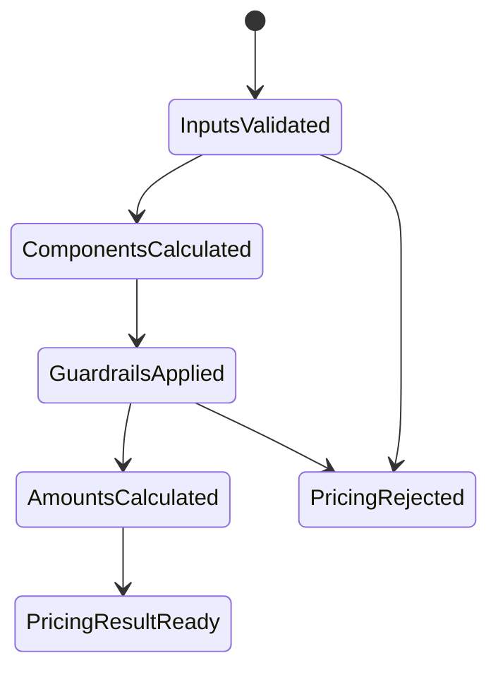

# Chapter 07: Pricing Formula

## Abstract

本章把前面章节的组件收束为第一版 RFQ pricing formula。该公式不是最终策略，而是可实现、可测试、可解释的初始模型。它将 mid price、base spread、size impact、volatility premium、inventory skew 和 hedge cost 组合成 signed quote 的 `amountOut` 与 `minAmountOut`。

## Learning Objectives

- 定义第一版 pricing formula。
- 明确每个 bps 组件的含义。
- 区分 output price、amountOut 和 minAmountOut。
- 定义公式的测试和审计字段。

## Background

RFQ pricing 需要在低延迟和风险表达之间平衡。公式过于简单会漏掉风险，过于复杂会难以测试和解释。第一版公式应保守、透明、可演进。

## Problem Statement

需要一个统一公式连接 Pricing Engine 的输入和输出，避免 spread、impact、volatility 和 inventory 在代码中以隐式方式叠加。

## Requirements

### Functional Requirements

- 输入 normalized mid price、amountIn 和 bps components。
- 输出 amountOut、minAmountOut 和解释字段。
- 支持 buy/sell 方向。
- 支持 slippageBps 计算 minAmountOut。

### Non-Functional Requirements

- 公式必须确定性。
- 所有中间值必须可记录。
- 参数变更必须通过 pricingVersion 追踪。

## Existing Solutions

简单系统使用 `amountOut = amountIn * price`。生产做市需要在 price 上叠加多种风险调整，并将调整项保存用于 PnL 归因。

## Trade-Off Analysis

线性 bps 叠加简单可解释，但不一定捕捉复杂非线性风险。第一版使用线性模型，后续可以在保持接口不变的情况下替换内部模型。

## System Design

第一版公式：

```text
totalAdjustmentBps =
  baseSpreadBps
  + sizeImpactBps
  + volatilityPremiumBps
  + inventorySkewBps
  + hedgeCostBps

effectivePrice = midPrice * (1 - totalAdjustmentBps / 10000)
amountOut = amountIn * effectivePrice adjusted for token decimals
minAmountOut = amountOut * (1 - slippageBps / 10000)
```

方向不同的交易对需要调整符号。库存偏斜可以为正或负，但最终必须经过 guardrail。

当前后端 `formula-v1` 先实现可测试的实时路径子集：`baseSpreadBps = 8`，`internalInventoryBufferBps = 2`，`volatilityPremiumBps = ceil(volatilityBps / 5)`，`sizeImpactBps = ceil(amountIn * 10000 / expectedLiquidity)` 且最高 250 bps，最终 `totalAdjustmentBps` 被限制在 0 到 2500 bps。`hedgeCostBps` 暂未进入公开结果字段，后续会在 Hedge Engine 和外部 venue 成本模型稳定后加入。

`FormulaPricingEngine` 在构造期验证 pricing config，避免错误参数进入报价路径。`baseSpreadBps`、`internalInventoryBufferBps` 和 `maxSizeImpactBps` 必须是非负安全整数；`volatilityDivisor` 必须是正安全整数；`maxTotalAdjustmentBps` 必须是 0 到 10000 bps 内的安全整数；`maxSizeImpactBps` 不得大于 `maxTotalAdjustmentBps`。这些约束保证 volatility premium 不会出现除零或 `Infinity`，也保证 `amountOut` 的 bps multiplier 不会因为总调整超过 10000 bps 变成负数。错误配置必须在服务启动或依赖注入阶段 fail fast，而不是等到用户 quote 请求触发运行期异常。

## Architecture Diagram



## Sequence Diagram



## State Machine



## Data Model

`PricingResult` 包含：

- `amountOut`
- `minAmountOut`
- `midPrice`
- `baseSpreadBps`
- `sizeImpactBps`
- `volatilityPremiumBps`
- `inventorySkewBps`
- `hedgeCostBps`
- `totalAdjustmentBps`
- `pricingVersion`

## API Design

OpenAPI 返回 `amountOut` 和 `minAmountOut`。解释字段写入内部数据库和分析事件，不默认返回给普通用户。

## Engineering Decisions

- 第一版使用 bps 线性叠加。
- amount 字段使用 base unit 字符串。
- 公式输出必须先进入 Risk Engine，再进入 Signer。
- `pricingVersion` 使用 `formula-v1:<venue>`，便于回放报价时定位参数版本和路由场所。

## Failure Scenarios

- total adjustment 超出 guardrail：拒绝报价。
- amountOut 为 0：拒绝报价。
- minAmountOut 大于 amountOut：输入或公式错误，拒绝。
- decimals 缺失：拒绝报价。

## Security Considerations

公式参数是做市策略，不应全部公开。签名 quote 只暴露执行所需字段。

## Performance Considerations

公式计算应为纯函数，避免 IO。所有 IO 在公式调用前完成。

## Testing Strategy

测试固定输入输出、bps 叠加、slippage 计算、decimals、边界值、负 inventory skew、guardrail rejection 和 pricing config fail-fast。配置测试至少覆盖负数 bps、零除数、超过 10000 bps 的总调整上限，以及 `maxSizeImpactBps` 大于 `maxTotalAdjustmentBps` 的倒挂配置。

## Interview Notes

优秀回答应说明公式只是策略表达之一，关键是输出可解释字段和保证 risk-before-signing。

## Summary

本章定义第一版 Pricing Engine 的公式边界。它足够简单，便于实现和测试；也足够明确，能支持后续扩展到更复杂模型。

## References

- Basis points pricing
- Inventory-based market making
- RFQ pricing engines
