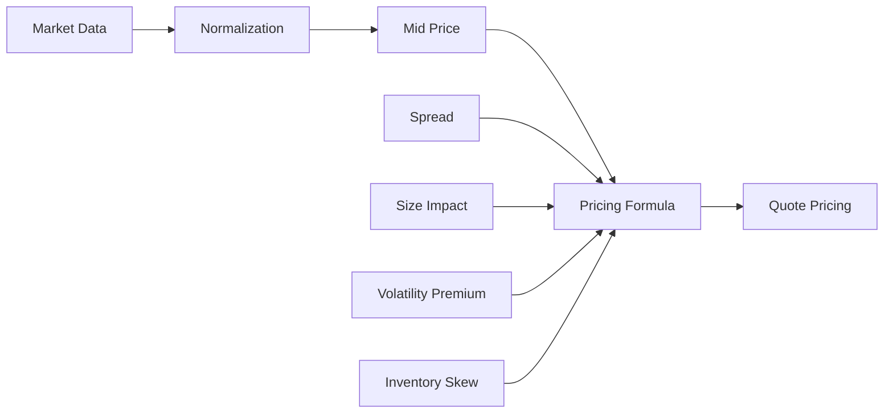

# Volume 2: Market Data And Pricing

本卷定义 RFQ / Prop AMM 系统的市场数据和定价设计。报价质量取决于市场数据可信度、价格归一化、中间价构造、spread、size impact、波动率溢价、库存偏斜和对冲成本。本卷的目标是把 Pricing Engine 从“返回一个价格”提升为可解释、可测试、可审计的报价系统。

## Chapters

1. [Chapter 01: Market Data](Chapter01-Market-Data.md)
2. [Chapter 02: Price Normalization](Chapter02-Price-Normalization.md)
3. [Chapter 03: Mid Price](Chapter03-Mid-Price.md)
4. [Chapter 04: Spread](Chapter04-Spread.md)
5. [Chapter 05: Size Impact](Chapter05-Size-Impact.md)
6. [Chapter 06: Volatility Premium](Chapter06-Volatility-Premium.md)
7. [Chapter 07: Pricing Formula](Chapter07-Pricing-Formula.md)

## Core Principle

Pricing Engine 必须输出价格，也必须输出解释字段：`snapshotId`、`pricingVersion`、`spreadBps`、`sizeImpactBps`、`marketSpreadBps`、`inventorySkewBps`、`volatilityPremiumBps` 和 `hedgeCostBps`。没有解释字段的报价无法用于生产审计和 PnL 归因。

