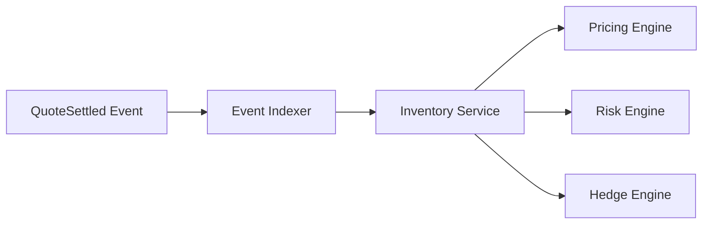
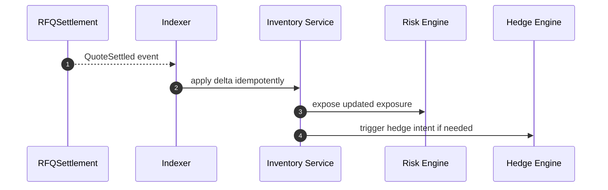
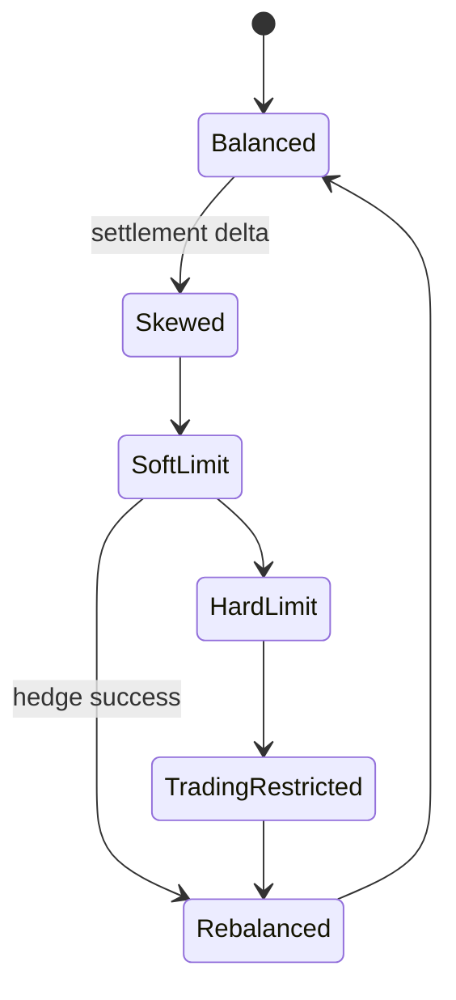

# Chapter 01: Inventory

## Abstract

库存是做市系统的核心风险来源。每一笔成交都会改变做市商持有的 token 暴露，如果后续报价不考虑库存，系统可能在单一方向上持续累积风险。RFQ 系统中的库存主要在链下管理，但必须通过定价、限额、风控拒绝和链上事件消费体现约束。

## Learning Objectives

- 理解库存为何影响报价和风控。
- 区分 target inventory、current inventory 和 available inventory。
- 说明 settlement event 如何驱动库存更新。
- 定义库存超限时的处理策略。

## Background

专业做市商不是无限资产池。做市商可能愿意卖出 WETH，但如果 WETH 库存过低，继续卖出会增加对冲和交割风险。做市商也可能愿意买入 USDC，但如果 USDC 已经过高，继续买入会降低资本效率。库存状态必须进入 Pricing Engine 和 Risk Engine。

## Problem Statement

如果库存更新滞后或库存没有进入风控，系统可能连续签出同方向 quote，最终导致库存失衡。链上成交不可逆，库存错误会直接变成资金风险。

## Requirements

### Functional Requirements

- 记录每个 chainId 和 token 的当前库存。
- 支持 target balance、max exposure 和 soft exposure。
- 根据 settlement event 更新库存。
- 向 Pricing Engine 提供 inventory skew。
- 向 Risk Engine 提供 hard limit 判断。

### Non-Functional Requirements

- 库存更新必须幂等。
- 库存状态必须可回放。
- 库存延迟必须可监控。
- 库存异常应能触发报价降级或暂停。

## Existing Solutions

纯 AMM 把库存体现在池子余额中，但专业做市系统通常跨多个 venue 和钱包管理库存。中心化系统有内部账本，但链上成交需要事件驱动同步。本项目使用链上事件作为成交事实，链下库存服务维护投影。

## Trade-Off Analysis

链下库存投影灵活，但必须处理事件延迟和链重组。直接依赖链上实时余额简单，但无法表达目标库存、待对冲状态和内部风险。

## System Design

## Architecture Diagram

Inventory Service 是 post-trade path 的核心状态服务。它不直接签名，也不直接决定价格，但为 Pricing 和 Risk 提供输入。

## Sequence Diagram

## State Machine

## Data Model

`InventoryPosition` 包含 `chainId`、`tokenAddress`、`balance`、`targetBalance`、`softLimit`、`hardLimit`、`pendingHedgeAmount` 和 `updatedAt`。

## API Design

Inventory Service 对内部提供 `getPosition(chainId, token)`、`projectSettlement(input)`、`calculateQuoteSkewBps(input)`、`applySettlement(event)` 和 `rebuildFromSettlements(events)`。公开 API 不暴露完整库存。

## Engineering Decisions

- Local development uses `InventoryService`; any non-local runtime requires PostgreSQL and uses `PostgresInventoryService`.
- PostgreSQL inventory replay includes canonical settlement deltas and every terminal `hedge_orders.filled_amount` delta. A chain reorg removes only the chain trade delta; an already executed CEX hedge remains real exposure and therefore remains in the rebuilt projection.
- Hedge terminal writes lock the triggering settlement row before the hedge row and inventory position. Reorg follows the same settlement-before-inventory order, so concurrent rebuild and venue terminal evidence serialize without losing either the canonical-chain decision or an irreversible CEX fill.
- Production skew, projection and position reads query shared `inventory_positions`, so API replicas cannot quote against divergent pod-local balances.
- Settlement ingestion updates both token legs in deterministic address order and in the same transaction as the canonical settlement event. This prevents partial inventory and reduces opposite-pair deadlock risk.
- Startup and reorg repair rebuild the projection only from `settlement_events.canonical=TRUE` while holding a transaction-scoped advisory lock and an inventory table lock; readers keep seeing the previous committed projection until repair commits.

- 库存以链上 settlement event 为准。
- Hedge 结果也应更新库存或 pending exposure。
- Hard limit 由 Risk Engine 强制拒绝签名。
- 当前后端实现中，成交后的库存会影响下一次 `/quote` 的 `inventorySkewBps`；本次 quote 的 projected inventory 会在签名前进入 Risk Engine。
- Inventory skew config 在构造期 fail fast：`skewUnit` 必须是正 `bigint`，`maxPositiveSkewBps` 和 `maxNegativeSkewBps` 必须是 0 到 10000 bps 内的安全整数。这样可以避免库存偏斜计算出现除零、负向封顶或超过 bps 语义的报价反馈。
- `calculateQuoteSkewBps` output is also validated by Quote Service before Pricing Service is called. A custom inventory adapter must return a safe integer whose absolute value is at most 10000 bps; malformed skew output is treated as `PRICING_UNAVAILABLE` because it makes the pricing adjustment untrustworthy.
- `projectSettlement` output is validated by Quote Service before Risk Service is called. A custom inventory adapter must return own `tokenIn` / `tokenOut` projected positions whose chain, token and bigint balance fields match the quote request; malformed projected inventory is treated as `RISK_ENGINE_UNAVAILABLE` because pre-trade risk can no longer trust the exposure input.
- `InventoryService` snapshots `InventoryServiceConfig` at construction after validation. `skewUnit` and skew bps caps must be own fields, and external callers must not be able to mutate them after construction and silently change quote skew.
- Inventory runtime inputs are validated before mutation or projection: required settlement delta, projection and skew fields must be own fields; chain id must be an own positive safe integer, token addresses must be own 20-byte hex addresses, token pairs must be distinct, and settlement amounts must be own real strings in canonical decimal form without leading zeros. Invalid settlement deltas must fail before they can pollute balances, replay state or quote skew.
- Malformed inventory config, settlement delta and skew root payloads are rejected before field access, balance mutation or replay clearing, so direct service callers cannot turn bad envelopes into unclassified `TypeError` failures or partial inventory rebuilds.
- Inventory replay validates the entire settlement delta batch before clearing balances, then rebuilds positions from the settlement event stream. This keeps inventory recovery deterministic and prevents one malformed replay event from leaving the service in a partially rebuilt state.

## Failure Scenarios

- Indexer lag：降低 quote notional。
- Duplicate event：通过幂等键跳过。
- Hedge failed：库存保持 skewed，后续 spread 扩大。

## Security Considerations

库存是敏感信息。外部用户不应看到完整余额和阈值，否则可能探测做市商弱点。

## Performance Considerations

Quote path 读取库存应走缓存或投影表，不能扫描事件账本。

## Testing Strategy

测试 settlement delta、duplicate event、hard limit、soft limit、hedge success、event replay 和 inventory skew config fail-fast。

## Interview Notes

库存管理是 RFQ + Prop AMM 与普通 swap 的关键区别。面试中要说明库存既影响定价，也影响风控拒绝。

## Summary

库存是风险引擎最重要输入之一。系统必须保证库存更新可回放、幂等且能影响后续 quote。

## References

- Inventory-based market making
- Event sourcing
- Hedge workflows
