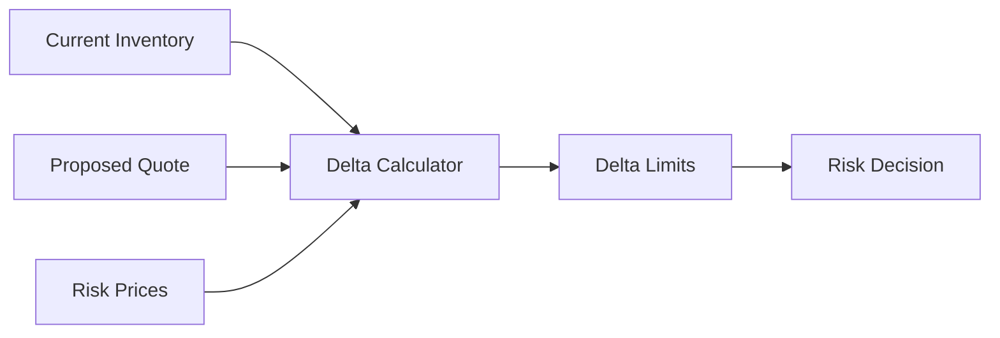
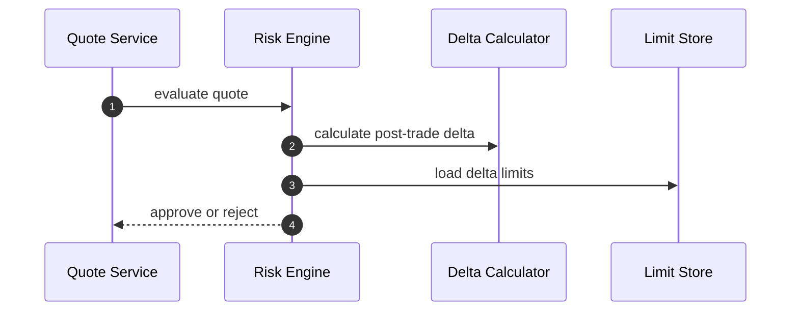
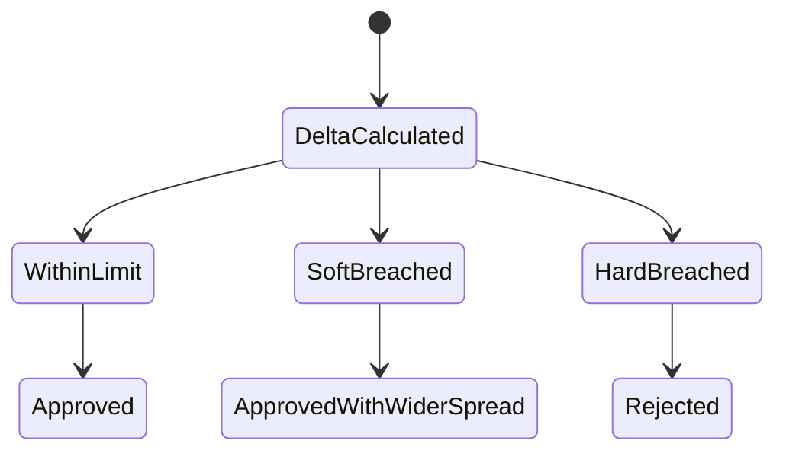

# Chapter 02: Delta

## Abstract

Delta 衡量资产价格变化对组合价值的线性影响。在 RFQ 做市系统中，每笔 quote 都会改变做市商对 token 的方向性暴露。Risk Engine 需要在签名前估算 quote 执行后的 delta，避免系统在单一资产或相关资产上累积不可接受风险。

## Learning Objectives

- 理解 delta exposure 的含义。
- 计算 quote 执行前后的 token delta。
- 将 delta 与库存和限额关联。
- 说明 delta 如何影响报价批准。

## Background

如果系统持续卖出 WETH 换取 USDC，做市商的 WETH delta 会下降。如果市场上涨，低 WETH 库存可能导致机会损失或对冲成本上升。Delta 是最基础的方向性风险指标。

## Problem Statement

只检查单笔 notional 不够。多笔小交易可以累积成巨大方向性风险。Risk Engine 必须基于执行后组合状态判断，而不是只看当前请求。

## Requirements

### Functional Requirements

- 计算 quote 执行后的 token exposure。
- 支持按 token、chain 和 portfolio 维度聚合 delta。
- 支持 delta soft limit 和 hard limit。
- 输出 risk decision reason。

### Non-Functional Requirements

- delta 计算必须使用统一价格源。
- 限额必须可版本化。
- 风险输出必须可回放。

## Existing Solutions

简单系统只使用 balance 检查。专业系统会把余额转换为 USD 或 base asset exposure，并考虑相关性和对冲资产。

## Trade-Off Analysis

精细 portfolio delta 更准确，但实现复杂。第一版可以按 token 和 USD exposure 控制，后续扩展相关资产分组。

## System Design

## Architecture Diagram

Delta Calculator 是 Risk Engine 内部组件，输入 Pricing Result 和 Inventory State。

## Sequence Diagram

## State Machine

## Data Model

`DeltaExposure` 包含 `tokenAddress`、`chainId`、`currentAmount`、`postTradeAmount`、`usdExposure`、`softLimitUsd`、`hardLimitUsd`。

## API Design

Risk Engine 内部输出 `reasonCode = DELTA_LIMIT_EXCEEDED` 或 `DELTA_SOFT_LIMIT`。公开 API 只返回通用 `RISK_REJECTED`。

## Engineering Decisions

- delta hard limit 拒绝签名。
- soft limit 可通过 pricing skew 缓解。
- delta 价格源必须与 market snapshot 可关联。

## Failure Scenarios

- risk price 缺失：拒绝报价。
- exposure cache stale：降级或拒绝。
- post-trade delta 超 hard limit：拒绝。

## Security Considerations

Delta limit 是敏感参数，不应暴露给用户。攻击者可通过询价探测库存边界，因此需要限流。

## Performance Considerations

delta 计算应为内存计算，库存和价格应预加载或缓存。

## Testing Strategy

测试买入、卖出、soft breach、hard breach、price missing 和多链聚合。

## Interview Notes

Delta 是方向性风险的第一层表达。回答时要说明“签名前看执行后风险”。

## Summary

Delta 控制让系统避免在同一方向持续签出 quote，是 Risk Engine 的基础能力。

## References

- Market making delta exposure
- Portfolio risk limits
