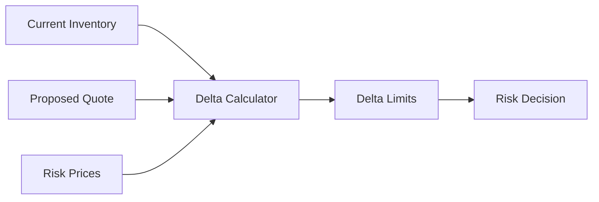
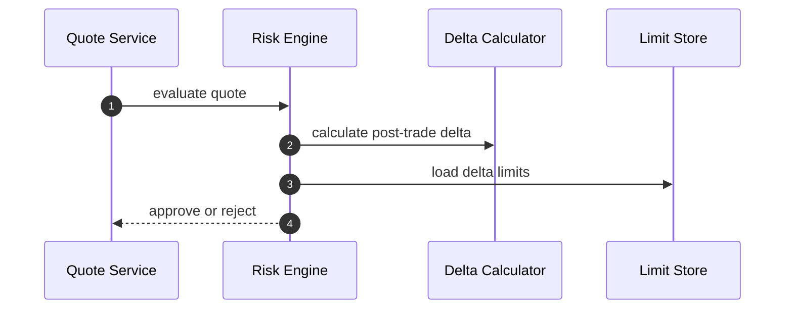
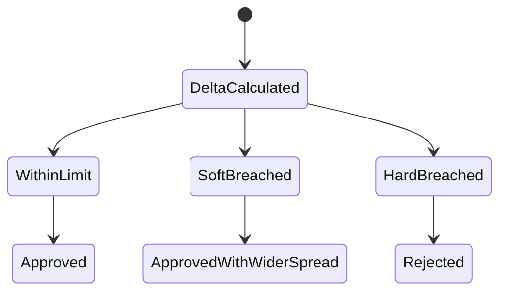

# Chapter 02: Delta

## Abstract

Delta 衡量资产价格变化对组合价值的线性影响。在 RFQ 做市系统中，每笔 quote 都会改变做市商对 token 的方向性暴露。Risk Engine 需要在签名前估算 quote 执行后的 delta，避免系统在单一资产或相关资产上累积不可接受风险。

## Learning Objectives

- 理解 delta exposure 的含义。
- 计算 quote 执行前后的 token delta。
- 将 delta 与库存和限额关联。
- 说明 delta 如何影响报价批准。

## Background

如果系统持续卖出 WETH 换取 USDC，做市商的 WETH delta 会下降。如果市场上涨，低 WETH 库存可能导致机会损失或对冲成本上升。Delta 是最基础的方向性风险指标。

## Problem Statement

只检查单笔 notional 不够。多笔小交易可以累积成巨大方向性风险。Risk Engine 必须基于执行后组合状态判断，而不是只看当前请求。

## Requirements

### Functional Requirements

- 计算 quote 执行后的 token exposure。
- 支持按 token、chain 和 portfolio 维度聚合 delta。
- 支持 delta soft limit 和 hard limit。
- 输出 risk decision reason。

### Non-Functional Requirements

- delta 计算必须使用统一价格源。
- 限额必须可版本化。
- 风险输出必须可回放。

## Existing Solutions

简单系统只使用 balance 检查。专业系统会把余额转换为 USD 或 base asset exposure，并考虑相关性和对冲资产。

## Trade-Off Analysis

精细 portfolio delta 更准确，但实现复杂。当前 `gross-net-asset-delta-v2` 同时实施 chain/token absolute USD exposure、portfolio gross 和 signed net 三层门禁；相关资产分组和 correlation netting 仍需独立模型版本，不能隐式加入当前保守求和语义。

## System Design

## Architecture Diagram

Delta Calculator 是 quote exposure reservation 的组合风险组件。它与 portfolio VaR 共用 canonical inventory、仍可执行的活动 quote、候选 quote 和同一批有界新鲜度 valuation snapshots；PostgreSQL 在 chain-scoped advisory lock 和 inventory `SHARE` lock 内完成计算与插入，本地模式使用 per-chain mutex。

## Sequence Diagram

## State Machine

## Data Model

`PortfolioDeltaPolicy` 包含版本化 portfolio gross/net soft/hard limits 和 `assetLimits[]`。每个 asset limit 由 canonical `(chainId, tokenAddress)` 唯一定位，保存 integer-USD `softLimitUsd` 与 `hardLimitUsd`，并且必须与 `portfolioVar.valuationPairs` 的非现金 valuation assets 一一对应。

`PortfolioDeltaEvaluation` 保存 pre/post gross delta、signed net delta、四个 portfolio limits、aggregate soft-breach flag 和 pre/post components。每个 component 保存 `chainId`、normalized token address、base-unit balance、signed `exposureUsdE18`、snapshot id、asset soft/hard limits 和 component soft-breach flag。接受的 reservation 将完整结果写入 `quote_exposure_reservations.delta_evaluation`；反序列化时重新计算 component sums、soft flags、limit ordering 和重叠资产 snapshot identity，畸形证据 fail closed。requested reservation 的幂等重放还必须匹配当前 model version、chain 和全部 active limits；策略已变更时不能拿旧预算证据继续进入 Signer。

## API Design

任一 post-trade chain/token、gross 或 signed net hard limit 被严格超过时，Risk Engine 内部输出 `PORTFOLIO_DELTA_LIMIT_EXCEEDED`。任一 soft limit 被严格超过时仍可批准，但记录 component/aggregate soft flag 和 `rfq_portfolio_delta_soft_breaches_total`。公开 API 只返回通用 `RISK_REJECTED`，不暴露限额。

## Engineering Decisions

- asset、gross 和 signed net delta hard limit 都在 Signer 前拒绝。
- soft limit 不隐式改写用户请求或报价；当前版本记录审计证据和告警，由既有 inventory skew、hedge 和运营 pause 流程缓解。自动 widen spread 需要独立、可归因的 pricing component 后再启用。
- delta 价格源必须与 market snapshot 可关联。
- USD-reference token 是 cash leg，不进入 delta components，但继续受 user/pair open notional 和 same-block Treasury output reservation 保护。

## Failure Scenarios

- risk price 缺失：拒绝报价。
- exposure cache stale：降级或拒绝。
- post-trade delta 超 hard limit：拒绝。

## Security Considerations

Delta limit 是敏感参数，不应暴露给用户。攻击者可通过询价探测库存边界，因此需要限流。

## Performance Considerations

delta 计算应为内存计算，库存和价格应预加载或缓存。

## Testing Strategy

测试正负 signed exposure、gross/net exact boundary、chain/token soft/hard 独立触发、policy duplicate/missing/extra asset、price missing、pre/post component 集合变化、snapshot 一致性、幂等重放和 PostgreSQL 并发原子预留。

## Interview Notes

Delta 是方向性风险的第一层表达。回答时要说明“签名前看执行后风险”。

## Summary

Delta 控制让系统避免在单一 chain/token 或组合方向上持续签出 quote，是 Risk Engine 的基础能力。生产正确性来自统一估值证据和原子 reservation，而不只是一个求和公式。

## References

- Market making delta exposure
- Portfolio risk limits
