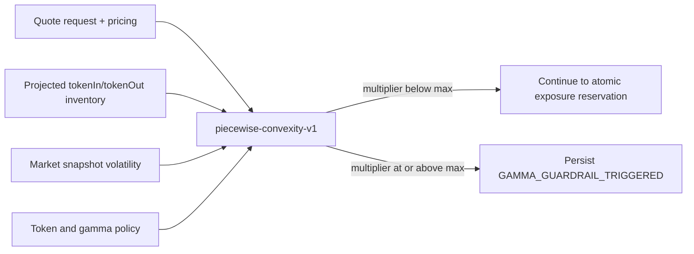
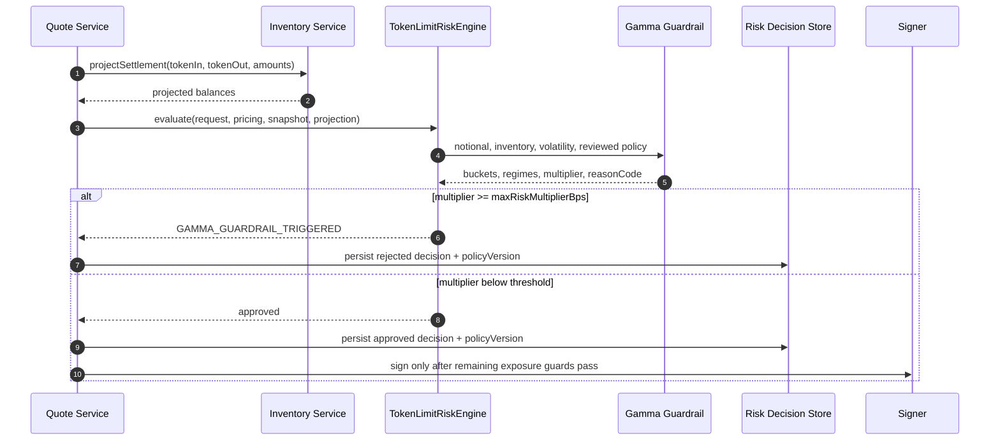
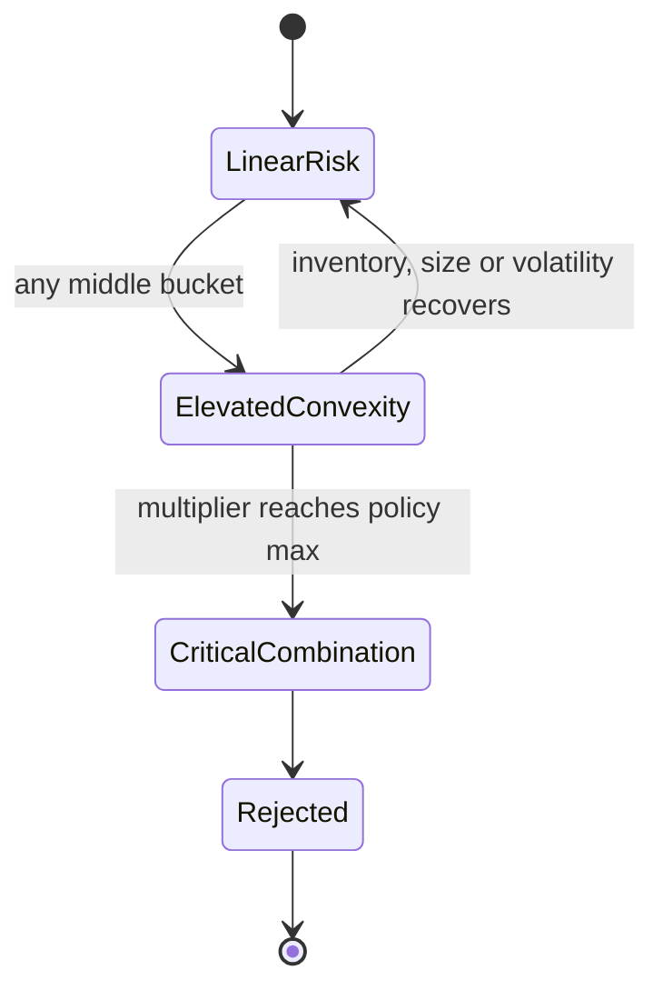

# Chapter 03: Gamma

## Abstract

传统衍生品中的 Gamma 描述 Delta 对标的价格变化的敏感度。本项目处理现货 RFQ，不伪造期权 Greeks，而是把“多个接近上限的线性风险叠加后产生非线性尾部风险”定义为 Gamma-like 风险。生产实现 `piecewise-convexity-v1` 同时观察投影库存、USD 名义金额和市场波动率的利用率，以可解释的分段乘数在签名前拒绝危险组合。

## Learning Objectives

- 区分期权 Gamma 与现货 RFQ 的 Gamma-like guardrail。
- 理解投影库存、订单尺寸和波动率如何形成非线性风险。
- 掌握 `GammaGuardrailPolicy`、整数利用率和分段乘数的边界语义。
- 理解 guardrail 与定价、position limit、Delta、VaR 的职责分工。
- 能够从稳定 reason code、policy version 和原始 quote evidence 重放拒绝决策。

## Background

单个风险维度接近上限不一定意味着必须停止报价。例如库存利用率达到 85% 时，一笔很小、低波动且有利于回归中性的订单仍可能安全；大额订单在库存平衡、市场平静时也可能由专业做市商承接。问题出现在多个维度同时恶化：接近库存硬上限的大额订单遇到高波动，adverse selection、滑点和无法及时对冲的概率不会简单线性相加。

Pricing Engine 已经通过 size impact、volatility premium 和 inventory skew 把正常风险计入价格。Position limit、Delta 与 VaR 则负责单维度和组合硬约束。Gamma-like guardrail 位于这些边界之间，用一个低延迟、确定性的组合检查捕获“每个维度尚未单独越界，但组合已经不可接受”的状态。

## Problem Statement

仅依赖线性硬限额会留下一个危险区域：投影库存、订单名义金额和波动率都分别低于 100%，但三者接近上限时仍可获得签名。系统需要满足以下不变量：

1. guardrail 必须在 EIP-712 签名前执行；
2. 不能用浮点数、隐式单位或不可解释模型；
3. token decimals 不得改变 size utilization 的经济含义；
4. 策略缺字段、阈值倒置或库存投影缺失时必须 fail closed；
5. 对外只返回通用 `RISK_REJECTED`，内部保留稳定原因码。

## Requirements

### Functional Requirements

- 对 tokenIn 与 tokenOut 的投影库存分别计算相对各自 `maxAbsoluteInventory` 的利用率，并采用较大值。
- 对报价中所有 USD-reference 侧计算相对较小 `maxNotionalUsd` 的利用率，并采用较大值。
- 以当前 snapshot 的 `volatilityBps / maxVolatilityBps` 计算波动率利用率。
- 三类利用率均使用向上取整整数除法，并限制在 `0..10000` bps。
- 分别输出 inventory regime、size bucket、volatility regime 和组合 `riskMultiplierBps`。
- 当乘数达到 `maxRiskMultiplierBps` 时返回 `GAMMA_GUARDRAIL_TRIGGERED`。
- 投影库存缺失时由 `TokenLimitRiskEngine` 返回 `RISK_ENGINE_UNAVAILABLE`。

### Non-Functional Requirements

- 计算必须是无 I/O 纯函数，报价路径只增加常数级 CPU 开销。
- 策略使用闭合 schema，拒绝 unknown field、prototype-backed field 和不合法边界。
- API 与隔离 Signer 必须解析同一份 `RFQ_RISK_POLICY_JSON`。
- reason label 必须有界，不能把 token、pair、utilization 或阈值写入 Prometheus label。
- exact-threshold、跨 decimals、双 USD-reference 侧和负库存必须可测试。

## Existing Solutions

完整衍生品平台通常计算解析 Greeks、情景 Greeks、相关性矩阵和压力损失。现货做市系统更常见的手段是分段限额、动态 spread、库存 skew、VaR 和 stress scenario。直接引入期权 Gamma 会制造错误精度和维护成本；只依赖单维硬限额则无法表达组合凸性。本项目选择分段 guardrail，保留可解释性并覆盖最重要的非线性区域。

## Trade-Off Analysis

`piecewise-convexity-v1` 不预测未来收益分布，也不替代 VaR。它的优点是确定、快速、容易重放，策略评审可以直接看到每个阈值。代价是分段边界会造成离散跳变，而且固定 `2500/5000` bps premium 无法表达所有资产差异。资产差异通过 token limit、VaR valuation 和部署级 policy version 管理；未来模型升级必须使用新的 `modelVersion`，不能悄悄改变 v1 语义。

## System Design



利用率计算统一为：

```text
utilizationBps = min(10000, ceil(abs(exposure) * 10000 / hardLimit))
```

名义金额使用 USD-reference token 的 raw amount 与 `maxNotionalUsd * 10^decimals` 比较，因此 USDC 6 decimals 与 WETH 18 decimals 不会共享错误单位。若交易两侧都标记为 USD-reference，则计算两侧并选择更高利用率。

默认分段如下：

| Dimension | Low | Elevated | Critical |
| --- | --- | --- | --- |
| Inventory | `< 6000` balanced | `6000..8499` elevated | `>= 8500` critical |
| Size | `< 2500` small | `2500..6999` large | `>= 7000` block |
| Volatility | `< 5000` normal | `5000..7999` elevated | `>= 8000` extreme |

低档增加 `0`，中档增加 `2500`，高档增加 `5000` bps。组合乘数从 `10000` 开始累加；默认 `maxRiskMultiplierBps=20000`，并使用 `>=` 作为拒绝边界。单独一个 critical 维度得到 `15000`，不会被 Gamma guardrail 拒绝，但仍受对应硬限额约束；critical inventory、large size 与 elevated volatility 的组合恰好得到 `20000`，因此拒绝。

## Architecture Diagram

Gamma guardrail 是 `TokenLimitRiskEngine` 内部的同步纯函数。Quote Service 先从 Inventory Service 获取 settlement projection，再调用 Risk Engine；Risk Engine 完成 token authorization、market regime、amount/notional、toxic-flow、slippage、spread 和 inventory hard-limit 检查后执行 Gamma guardrail。通过后才进入 PostgreSQL 原子 open-exposure、portfolio VaR 与 Delta 预占。

## Sequence Diagram



## State Machine



## Data Model

`GammaGuardrailPolicy` 包含 `modelVersion`、三组 elevated/critical threshold 和 `maxRiskMultiplierBps`。三组阈值都必须满足 `0 < elevated < critical <= 10000`；最大乘数必须在 `10001..25000`。

`GammaGuardrailResult` 包含：

- `modelVersion`
- `limitUtilizationBps` 与 `inventoryRegime`
- `sizeUtilizationBps` 与 `sizeBucket`
- `volatilityUtilizationBps` 与 `volatilityRegime`
- `riskMultiplierBps`
- nullable `reasonCode`

当前数据库不复制完整结果。拒绝通过 `risk_decisions.reason_code`、`policy_version`、quote request、pricing attribution、market snapshot 与库存投影来源进行重放；迁移 `033-gamma-guardrail-risk.sql` 将稳定原因加入数据库闭合约束。

## API Design

公共 `/quote` 仍只返回闭合的 `RISK_REJECTED`，不暴露 bucket、利用率或策略阈值，避免向攻击者提供探测库存边界的反馈。内部 reason code 为 `GAMMA_GUARDRAIL_TRIGGERED`。监控使用：

```promql
sum(increase(rfq_quote_rejections_total{reason="GAMMA_GUARDRAIL_TRIGGERED"}[5m])) > 0
```

## Engineering Decisions

- 使用整数 bps 和向上取整，避免浮点漂移与低估风险。
- 使用两个库存腿和所有 USD-reference 腿中的最大利用率，不进行未经审核的净额抵消。
- hard limit 先于 Gamma 检查，Gamma 只处理尚未单维越界的组合风险。
- 定价继续承担正常 spread 调整；v1 guardrail 只返回 approve/reject，不在风险检查后回写价格，避免 quote/pricing 循环。
- 缺失库存 projection 返回 `RISK_ENGINE_UNAVAILABLE`，不降级为零库存。
- 策略结构变化同步升级基础 policy version 为 `token-limit-risk-v2`。

## Failure Scenarios

- **Inventory Service 不可用**：Quote Service 或 Risk Engine fail closed，不签名。
- **token decimals 配置错误**：Token Registry 与 risk policy 启动校验失败；不能用运行期猜测修复。
- **阈值倒置或 unknown field**：API 和 Signer 启动失败。
- **波动率 hard limit 为零**：仅零波动 snapshot 可继续，非零值先由 market-regime hard gate 拒绝。
- **并发询价改变组合库存**：Gamma 使用当前投影进行快速检查；后续 PostgreSQL portfolio lock、VaR/Delta 和 open-exposure reservation 负责原子并发边界。
- **策略升级期间版本不一致**：API 与 Signer 不能混用不同闭合 schema；部署前先应用迁移 033，再滚动统一配置。

## Security Considerations

攻击者可以通过多笔小额 RFQ 探测库存状态，因此公共错误不能返回具体利用率或分段。Prometheus 只记录固定 reason，不使用 pair、token 或 user 高基数标签。策略变更需要审计，尤其不能在告警期间临时提高 `maxRiskMultiplierBps`。Gamma 检查不能替代原子 exposure reservation，否则并发副本仍可同时基于旧库存通过检查。

## Performance Considerations

算法仅执行固定数量的 BigInt 乘除、比较和数组遍历；每个报价最多两个名义金额腿和两个库存腿，复杂度为 O(1)。无数据库、网络或随机数调用。策略在构造期校验并防御性复制，运行期只读取稳定配置。

## Testing Strategy

- 验证每个 elevated/critical exact boundary。
- 验证向上取整与超过硬限额时的 10000 bps 上界。
- 验证负库存取绝对值、两个库存腿取最大值。
- 验证单个 critical 维度通过、组合乘数达到阈值时拒绝。
- 验证缺失 projection 返回 `RISK_ENGINE_UNAVAILABLE`。
- 验证 unknown field、倒置阈值和不可达 multiplier 配置启动失败。
- API 测试验证拒绝发生在 Signer 调用之前，数据库迁移测试验证稳定 reason 可持久化。

## Interview Notes

在现货 RFQ 中讨论 Gamma，应先澄清这里不是期权二阶导数。核心问题是：多个线性风险接近上限时，执行和对冲损失具有凸性。一个优秀回答应说明单位归一化、保守取整、分段可解释性、签名前 fail closed、与原子 reservation 的关系，以及为什么不能把内部库存阈值暴露给客户端。

## Summary

`piecewise-convexity-v1` 把文档中的 Gamma-like 概念落成了生产报价路径上的确定性 guardrail。它不替代 pricing、Delta、VaR 或 position limit，而是在这些边界之间捕获高库存、大尺寸和高波动的危险组合，并通过稳定原因码、版本化策略、迁移约束、告警和 Runbook 形成可测试、可运维的闭环。

## References

- Greeks and convex risk management
- Stress testing and scenario limits
- Integer fixed-point arithmetic for financial systems
- `backend/src/modules/risk/gamma-guardrail.ts`
- `backend/src/modules/risk/token-limit-risk.engine.ts`
