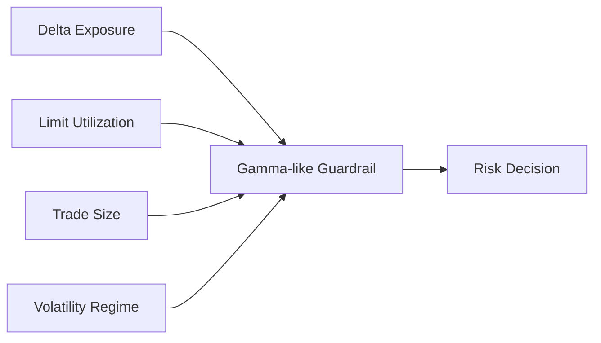
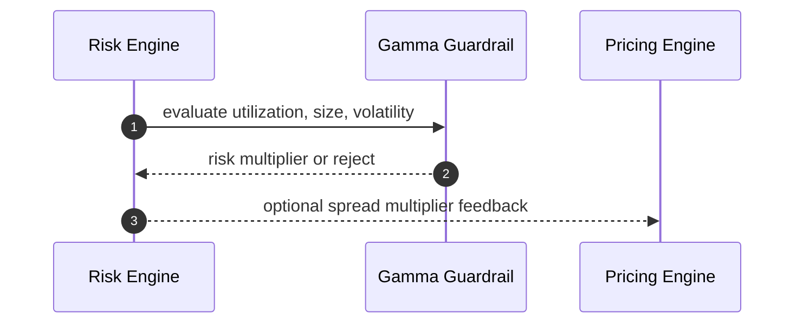
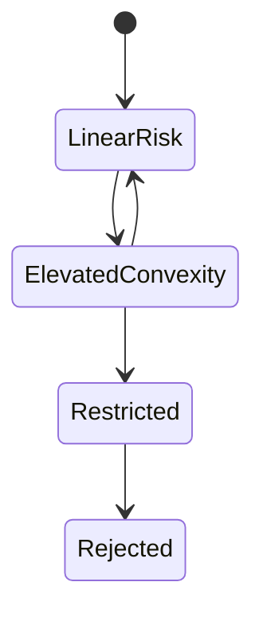

# Chapter 03: Gamma

## Abstract

Gamma 在传统衍生品中描述 delta 对价格变化的敏感度。在 RFQ 现货做市系统中，Gamma 可作为非线性库存和尺寸风险的类比指标：当价格变化或成交尺寸变化时，组合风险可能不是线性增加。虽然第一版系统不需要复杂期权 Gamma 模型，但需要识别非线性风险。

## Learning Objectives

- 理解 Gamma 在本项目中的工程化含义。
- 识别 size、volatility 和 inventory 的非线性风险。
- 定义何时使用保守 guardrail。
- 说明 Gamma 与 VaR 和 position limits 的关系。

## Background

RFQ 做市可能处理现货，但现货风险也存在非线性。例如库存接近 hard limit 时，再增加同方向 exposure 的风险比平衡状态下更高。市场波动越大，大额 quote 的 adverse selection 风险也非线性上升。

## Problem Statement

如果 Risk Engine 只做线性 delta 检查，可能低估极端市场下的组合风险。需要一个轻量方式表达非线性风险，而不把系统变成复杂衍生品风险平台。

## Requirements

### Functional Requirements

- 识别库存接近 limit 的非线性风险。
- 识别大额订单在高波动下的组合风险。
- 支持 gamma-like guardrail。
- 输出可审计 reason code。

### Non-Functional Requirements

- 第一版模型必须简单可测试。
- 不引入不可解释黑盒。
- 非线性风险应能反馈到 spread 或 reject。

## Existing Solutions

传统风险系统使用复杂 Greeks。现货 RFQ 系统通常通过分段限额、动态 spread、VaR 和 stress scenario 控制非线性风险。

## Trade-Off Analysis

完整 Gamma 模型超出第一版需求。分段 guardrail 更简单，适合生产参考实现的早期阶段。

## System Design

## Architecture Diagram

Gamma-like guardrail 位于 Delta 和 VaR 之间，作为快速风险检查。

## Sequence Diagram

## State Machine

## Data Model

`GammaGuardrailResult` 包含 `limitUtilizationBps`、`sizeBucket`、`volatilityRegime`、`riskMultiplierBps` 和 `reasonCode`。

## API Design

内部 Risk Decision 可包含 `GAMMA_GUARDRAIL_TRIGGERED`。公开 API 不暴露细节。

## Engineering Decisions

- 第一版使用分段 guardrail。
- 高 utilization + 高 volatility + 大 size 组合直接拒绝。
- 中等风险返回 spread multiplier。

## Failure Scenarios

- utilization 无法计算：拒绝或保守限额。
- volatility unknown：使用 elevated regime。
- guardrail 参数缺失：拒绝签名。

## Security Considerations

非线性风险阈值更敏感，不能对外暴露。攻击者可能通过多笔询价逼近边界。

## Performance Considerations

guardrail 应为纯函数，适合在 quote path 中快速执行。

## Testing Strategy

测试 limit utilization 分段、size bucket、volatility regime 组合和 reject threshold。

## Interview Notes

在现货 RFQ 中谈 Gamma，不必套用期权公式。重点是说明风险不是总线性的，系统需要 guardrail。

## Summary

Gamma-like guardrail 为第一版风险系统提供非线性风险控制，避免纯 delta 模型低估极端组合风险。

## References

- Greeks in risk management
- Stress testing
- Nonlinear exposure guardrails
