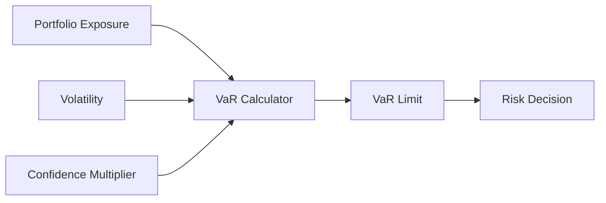
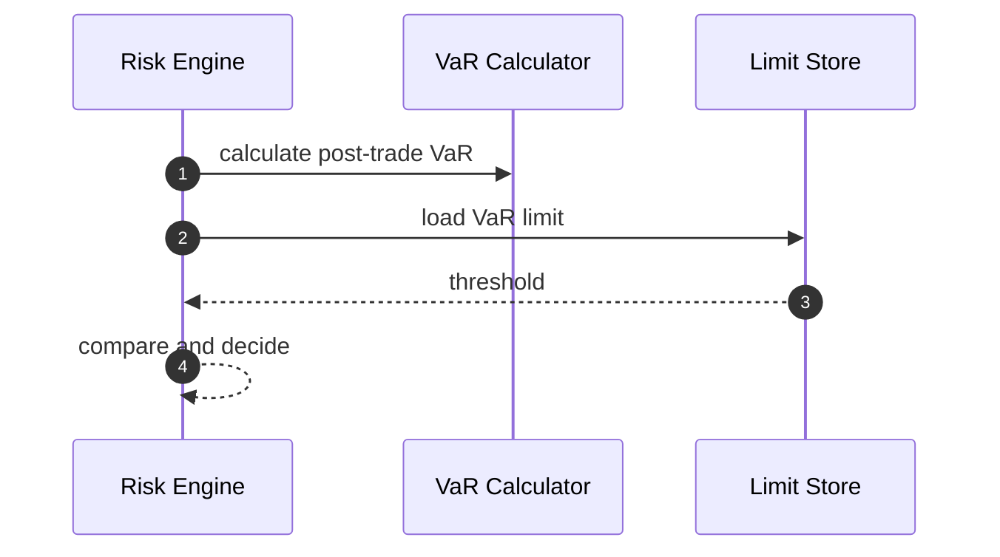
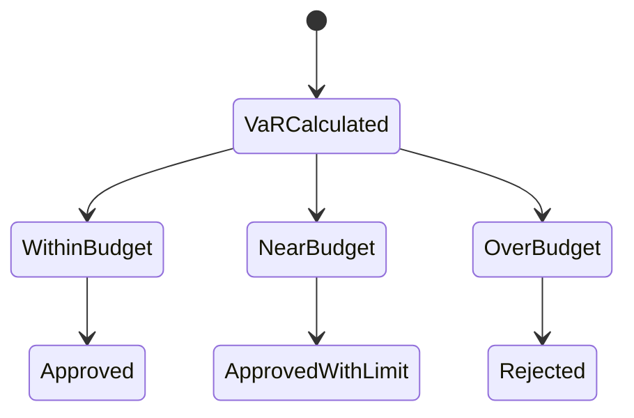

# Chapter 04: VaR

## Abstract

VaR，Value at Risk，用于估计在给定置信水平和时间窗口下可能发生的最大损失。RFQ 做市系统可以使用轻量 VaR 作为组合风险指标，辅助判断某笔 quote 是否会让组合风险超过阈值。

## Learning Objectives

- 理解 VaR 的用途和局限。
- 定义 RFQ 系统中的轻量 VaR 输入。
- 说明 VaR 如何与 position limits 配合。
- 识别 VaR 不适合单独作为风控依据的原因。

## Background

做市系统持续暴露在市场价格变化中。单笔 quote 的风险不只取决于该笔金额，还取决于当前组合和市场波动。VaR 提供一个统一尺度，把组合暴露和波动率联系起来。

## Problem Statement

只用 token-level limit 可能无法表达组合整体风险。需要一个组合层指标帮助 Risk Engine 判断系统是否接近风险预算上限。

## Requirements

### Functional Requirements

- 根据 exposure 和 volatility 计算 portfolio VaR。
- 支持 pre-trade 和 post-trade VaR。
- 支持 VaR limit。
- 输出 VaR reason code 和 policy version。

### Non-Functional Requirements

- VaR 计算必须可回放。
- 参数必须可配置和版本化。
- VaR 不应替代硬性 token limit。

## Existing Solutions

完整风险平台会使用历史模拟、蒙特卡洛或协方差矩阵。第一版 RFQ 参考实现可使用简化 VaR：`exposure * volatility * confidenceMultiplier`。

## Trade-Off Analysis

简化 VaR 可解释且容易实现，但精度有限。它适合作为 guardrail，不适合作为唯一风险模型。

## System Design

## Architecture Diagram

VaR Calculator 是 Risk Engine 的组合风险组件，通常在 delta 和 position limit 之后执行。

## Sequence Diagram

## State Machine

## Data Model

`VaRResult` 包含 `preTradeVaRUsd`、`postTradeVaRUsd`、`varLimitUsd`、`confidenceLevel`、`windowSeconds`、`modelVersion`。

## API Design

内部 Risk Decision 包含 VaR 结果摘要。公开 API 不暴露 VaR 数值。

## Engineering Decisions

- 第一版使用简化 VaR。
- post-trade VaR 超限拒绝签名。
- near budget 状态可降低 max notional。

## Failure Scenarios

- volatility 缺失：使用保守值或拒绝。
- exposure 缺失：拒绝。
- VaR 参数缺失：拒绝签名。

## Security Considerations

VaR limit 是策略参数，不能对外暴露。询价限流可以减少风险预算探测。

## Performance Considerations

VaR 应使用预聚合 exposure 和 volatility，不在实时路径扫描历史数据。

## Testing Strategy

测试 pre/post VaR、near limit、over limit、volatility fallback 和 modelVersion。

## Interview Notes

VaR 是组合风险视角，但不能代替合约级安全和 token-level hard limit。

## Summary

VaR 为 RFQ 风险系统提供组合层 guardrail，帮助系统在签名前控制整体风险预算。

## References

- Value at Risk
- Portfolio risk
- Risk budget systems
