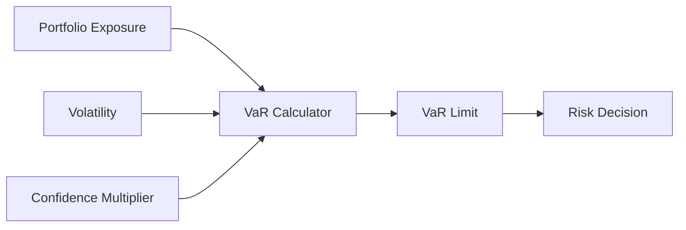
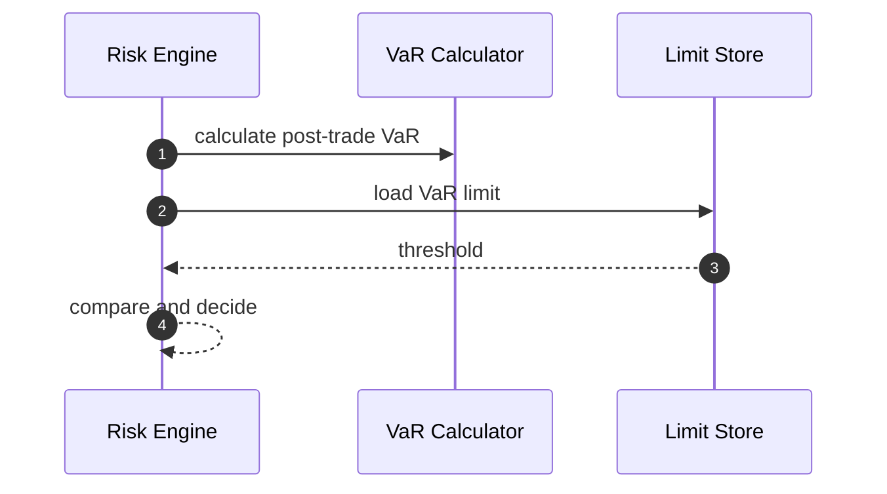
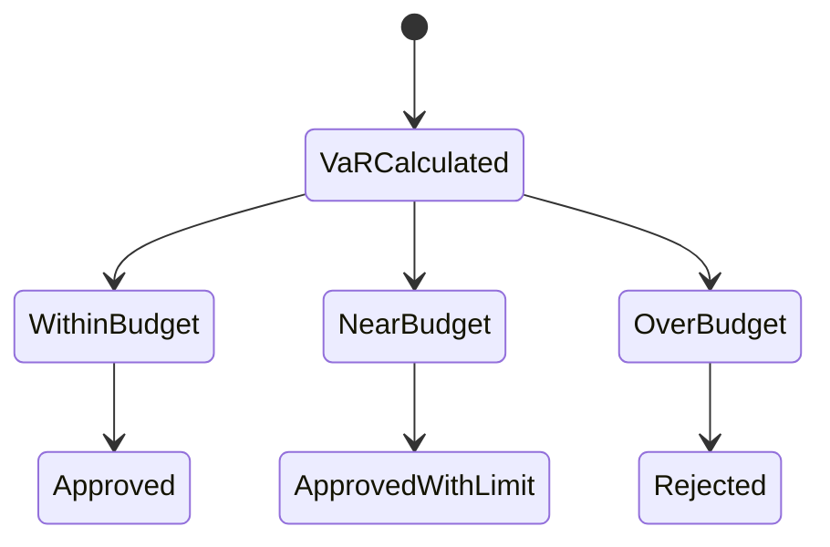

# Chapter 04: VaR

## Abstract

VaR，Value at Risk，用于估计在给定置信水平和时间窗口下可能发生的最大损失。RFQ 做市系统可以使用轻量 VaR 作为组合风险指标，辅助判断某笔 quote 是否会让组合风险超过阈值。

## Learning Objectives

- 理解 VaR 的用途和局限。
- 定义 RFQ 系统中的轻量 VaR 输入。
- 说明 VaR 如何与 position limits 配合。
- 识别 VaR 不适合单独作为风控依据的原因。

## Background

做市系统持续暴露在市场价格变化中。单笔 quote 的风险不只取决于该笔金额，还取决于当前组合和市场波动。VaR 提供一个统一尺度，把组合暴露和波动率联系起来。

## Problem Statement

只用 token-level limit 可能无法表达组合整体风险。需要一个组合层指标帮助 Risk Engine 判断系统是否接近风险预算上限。

## Requirements

### Functional Requirements

- 根据 exposure 和 volatility 计算 portfolio VaR。
- 支持 pre-trade 和 post-trade VaR。
- 支持 VaR limit。
- 输出 VaR reason code 和 policy version。

### Non-Functional Requirements

- VaR 计算必须可回放。
- 参数必须可配置和版本化。
- VaR 不应替代硬性 token limit。

## Existing Solutions

完整风险平台会使用历史模拟、蒙特卡洛或协方差矩阵。第一版 RFQ 参考实现可使用简化 VaR：`exposure * volatility * confidenceMultiplier`。

## Trade-Off Analysis

简化 VaR 可解释且容易实现，但精度有限。它适合作为 guardrail，不适合作为唯一风险模型。

### Reference Implementation: `component-sum-v1`

当前后端已经实现 `component-sum-v1`，不再把 portfolio VaR 作为文档占位。策略位于 `RFQ_RISK_POLICY_JSON.portfolioVar`，包含：

- `modelVersion`：审计和回放使用的稳定模型版本。
- `maxPortfolioVarUsd`：整数美元风险预算，启动时转换为 18 decimals 精确整数。
- `confidenceMultiplierBps`：例如 `23300` 表示 2.33 倍置信乘数，不等同于概率百分比。
- `horizonSeconds`：snapshot 中 volatility 的目标时间窗口；当前默认 86400 秒。
- `maxSnapshotAgeMs` 与 `maxFutureSkewMs`：报价前允许的行情年龄和时钟偏移。
- `valuationPairs`：每个非 USD 风险 token 到受信 USD-reference token 的显式映射；不得靠 symbol 猜测稳定币。

对每个非 USD-reference token，计算过程使用整数和有理数，不经过 JavaScript 浮点：

```text
exposureUsdE18 = roundAwayFromZero(balanceBaseUnits * normalizedMidPrice * 1e18 / 10^tokenDecimals)
componentVarUsdE18 = ceil(abs(exposureUsdE18) * volatilityBps * confidenceMultiplierBps / 10000^2)
portfolioVarUsdE18 = sum(componentVarUsdE18)
```

反向 snapshot，例如 `USDC/WETH`，先对价格有理数取倒数再估值。分量直接求和，不允许用未经治理的相关性或多空抵消降低预算，因此结果保守且可解释。USD-reference token 作为 numeraire cash 不计市场 VaR，但仍受 token absolute limit、quote notional limit 和 Treasury liquidity reservation 约束。

### 原子 pre-trade 状态

pre-trade 组合不是只读取当前交易对的两个 position，而是：

```text
inventory_positions
  + all unexpired requested/signed/failed quote deltas
  = pre-trade portfolio

pre-trade portfolio
  + candidate tokenIn/amountIn
  - candidate tokenOut/amountOut
  = post-trade portfolio
```

生产模式在 quote exposure ledger 内取得 chain-scoped Redis lease，读取 immutable hot inventory、valuation snapshots 和 ledger token deltas，并在 lease 仍有效时用 Lua 原子提交 reservation、聚合值与 stream event。库存视图超过最大年龄、lease 丢失、AOF/副本确认失败或 mirror 不健康都会阻断签名。本地内存模式使用 per-chain mutex；PostgreSQL advisory lock + inventory `SHARE` lock 实现保留为显式兼容和回滚路径，不能在 Redis 故障时由单个 pod 自动切换。

只有 `postTradeVarUsdE18 <= varLimitUsdE18` 才能插入 reservation 并进入 Signer。超限返回内部 `PORTFOLIO_VAR_LIMIT_EXCEEDED`；行情缺失、过期、未来时间、未知 token、方向错误或数据库失败统一 fail closed 为 `RISK_ENGINE_UNAVAILABLE`。

## System Design



## Architecture Diagram

VaR Calculator 是 Risk Engine 的组合风险组件，通常在 delta 和 position limit 之后执行。

## Sequence Diagram



## State Machine



## Data Model

`PortfolioVarEvaluation` 包含 `preTradeVarUsdE18`、`postTradeVarUsdE18`、`varLimitUsdE18`、`horizonSeconds`、`modelVersion`，以及 pre/post component arrays。每个 component 保存 normalized token address、base-unit balance、signed USD exposure、volatility、component VaR 和 snapshot id。生产 ledger 先保存完整证据并追加同事务 stream event；PostgreSQL mirror 随后写入 `quote_exposure_reservations.var_evaluation`、方向性 token/amount 和 append-only ledger event，因此事故调查可以按 epoch、stream position、policy version 和 snapshot 原始行重放。

同一组 component 还驱动独立的 portfolio delta 门禁。它不乘 volatility 或 confidence multiplier，而是按 chain/token 检查 absolute USD exposure，并分别求 `gross = sum(abs(exposureUsdE18))` 与 `net = sum(exposureUsdE18)`。`portfolioDelta.assetLimits` 必须与 VaR valuation assets 一一对应，另配置 gross/net soft 与 hard USD limits；post-trade 任一 asset、gross 或 net hard limit 被严格超过时返回 `PORTFOLIO_DELTA_LIMIT_EXCEEDED`，仅超过 soft limit 时继续签名并记录 component/aggregate `softLimitBreached`。pre/post gross、signed net、阈值、components 与 snapshot ids 写入独立 `delta_evaluation` JSONB，既不污染既有 VaR schema，也能复用同一事务内的 canonical inventory、active reservations 和 candidate quote 证据。

## API Design

内部 Risk Decision 包含 VaR 结果摘要。公开 API 不暴露 VaR 数值。

## Engineering Decisions

- 第一版固定使用保守的 `component-sum-v1`，模型变更必须发布新 `modelVersion`。
- post-trade VaR 超限拒绝签名。
- VaR 与 token hard limit、user/pair open notional、Treasury liquidity gate 同时生效，不互相替代。
- Portfolio delta 与 VaR 共享估值输入但独立决策：delta 限制方向性敞口，VaR 限制波动率加权风险预算。
- 当前不实现 near-budget 自动降额；自动降额需要新的可审计报价策略，而不是隐式改写请求。

## Failure Scenarios

- volatility 或 valuation snapshot 缺失：拒绝，不使用静态 fallback。
- exposure、token metadata 或 valuation pair 缺失：拒绝。
- VaR 参数缺失：拒绝签名。
- snapshot 过期或超出 future skew：拒绝。
- Redis ledger、hot inventory、valuation snapshot 或 PostgreSQL mirror health 失败：禁止调用 Signer；已经存在的 reservation 仍可执行风险降低型 release。

## Security Considerations

VaR limit 是策略参数，不能对外暴露。询价限流可以减少风险预算探测。

## Performance Considerations

VaR 不扫描历史行情，只读取每个受管 valuation pair 的最新 snapshot；组合扫描范围是当前 chain 的 inventory positions 和 TTL-bound quote reservations。资产数量增长后可维护事务内聚合表，但不能牺牲 reservation 与组合预算的原子性。

## Testing Strategy

测试覆盖 direct/reverse cross-decimal valuation、向上取整、pre/post VaR、超限拒绝、过期/未来/缺失 snapshot、未知资产、并发本地 reservation、Redis fused lease/read 与 commit/unlock、精确 token delta、mirror failure gate、PostgreSQL 兼容 chain lock 和 JSONB 回放证据。

## Interview Notes

VaR 是组合风险视角，但不能代替合约级安全和 token-level hard limit。

## Summary

VaR 为 RFQ 风险系统提供组合层 guardrail。生产语义的关键不只是公式，而是把 canonical inventory、仍可执行的签名报价和候选报价放入同一个原子预算决策，并保留可重放证据。

## References

- Value at Risk
- Portfolio risk
- Risk budget systems
