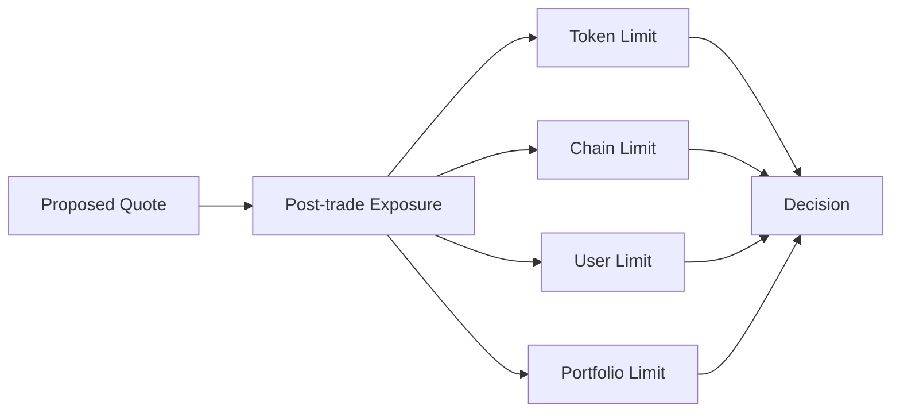
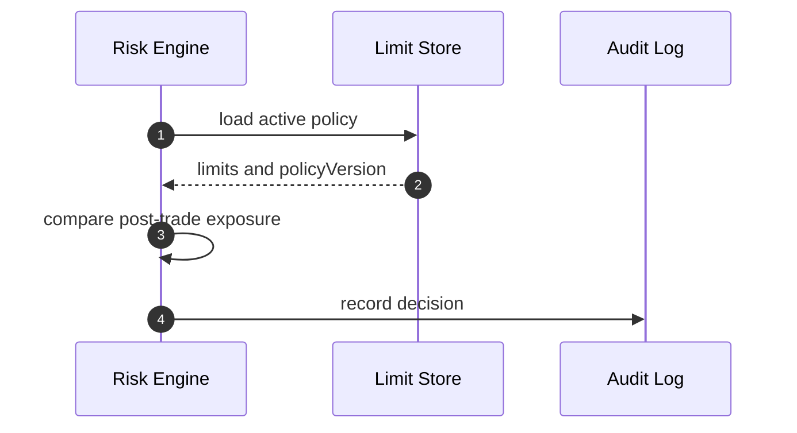
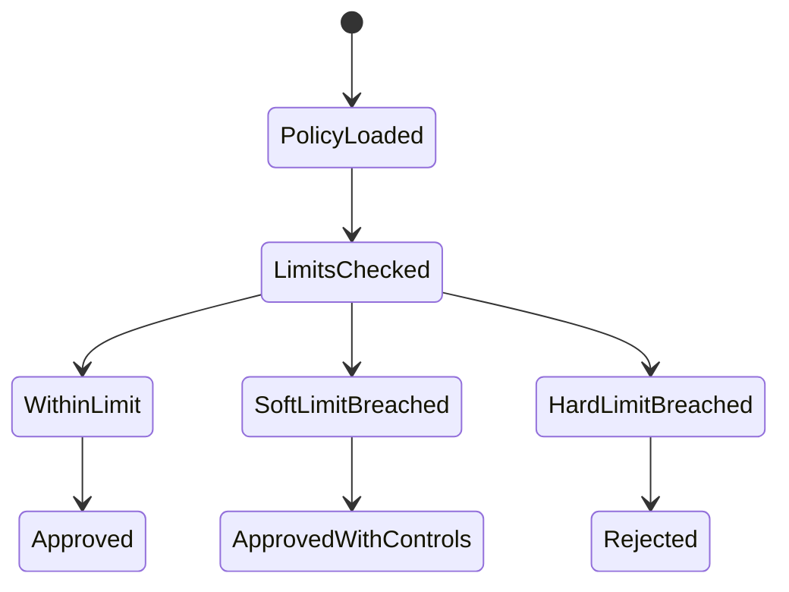

# Chapter 05: Position Limits

## Abstract

Position limits 是 Risk Engine 最直接的硬约束。无论 Pricing Engine 给出多好的价格，只要 quote 执行后会超过 hard limit，Signer Service 就不能签名。限额系统把业务风险偏好转化为可执行规则。

## Learning Objectives

- 区分 soft limit 和 hard limit。
- 定义 token、pair、chain、user 和 portfolio 维度限额。
- 说明 position limit 与 pricing skew 的关系。
- 设计限额超出时的响应。

## Background

做市系统通常为每个资产设置最大库存、最大净敞口、最大单笔 notional 和最大日成交量。RFQ 系统必须在签名前检查这些限制，因为链上合约无法知道完整链下组合状态。

## Problem Statement

没有限额时，系统可能在异常流量或定价错误下持续签名。限额是防止单点模型错误扩散成资金事故的最后业务边界。

## Requirements

### Functional Requirements

- 支持 per-token limit。
- 支持 per-pair limit。
- 支持 per-chain limit。
- 支持 per-user 或 per-counterparty limit。
- 支持 global portfolio limit。

### Non-Functional Requirements

- 限额规则必须版本化。
- 限额变更必须审计。
- hard limit 必须强制拒绝。

## Existing Solutions

简单系统只限制单笔 amount。生产系统会多维度限额，并区分软硬阈值。

## Trade-Off Analysis

限额维度越多，配置越复杂，但能更精确地控制风险。第一版应覆盖 token、chain 和 notional 三个核心维度。

## System Design

## Architecture Diagram

Limit Store 为 Risk Engine 提供版本化 policy。Quote Service 不直接读取限额。

## Sequence Diagram

## State Machine

## Data Model

`RiskLimitPolicy` 的完整目标包含 `policyVersion`、`chainId`、`tokenAddress`、`maxPosition`、`softPosition`、`maxNotionalUsd`、`maxUserNotionalUsd`、`maxQuotedSpreadBps`、`enabled`。当前默认后端已落地 `TokenLimitRiskPolicy`：`enabledChainIds` 定义 chain gate，`tokenLimits` 以 `(chainId, tokenAddress)` 唯一键分别保存 canonical uint256 `maxAmountIn`、`minAmountOut`、整数美元 `maxNotionalUsd` 和 `maxAbsoluteInventory`，公共字段保存 `maxUserOpenNotionalUsd`、`maxPairOpenNotionalUsd`、`minLiquidityUsd`、`maxVolatilityBps` 以及 slippage/spread/toxic-flow 上限。Quote Service 把定价 snapshot 与 projected tokenIn/tokenOut position 一并传给 Risk Engine；任一余额按对应 token raw-unit hard limit 超限、USD-reference 一侧按可信 decimals 计算出的单笔名义金额超过两侧较小上限、市场流动性不足、波动率越界或最终 quoted spread 超过 policy，都会拒绝签名。没有 USD-reference 的 managed pair 在启动时失败，避免把非稳定币 raw units 当成美元。

单笔门禁通过后，Quote Service 在 Signer 之前预留活动签名报价敞口。生产 `redis-stream` runtime 以 quoteId 为幂等键，把 USD-reference 一侧按可信 decimals 转成 18 位 USD 定点数；两侧均为 USD reference 时取较大值，超过 18 decimals 的极小余数向上取整，避免低估。用户作用域为 `(chainId, user)`，交易对作用域使用排序后的 `(chainId, tokenLow, tokenHigh)`，因此反向报价不能绕过 pair limit。冷启动或跨进程 generation 冲突时先用 Lua 清理过期项并返回 chain generation、完整 token delta 与 backlog；进程内基于 immutable hot inventory 和 valuation snapshot 计算 VaR/Delta。稳态联合 admission Lua 先以 decimal string 精确检查 generation、user、pair、Treasury-output、VaR/Delta 和 issuance/idempotency/authorization，再在同一 `{quote-state}` slot 内原子更新 exposure 聚合、版本化 Stream event 与 cumulative `authorized` issuance event。冲突不写 candidate 状态，必须读取新 generation 并重算，且总重试时间有界；无冲突 warm path 只执行一个联合 Redis command 和一次共享 durability `WAIT`。release 没有进程内评估，继续使用 owner-token lease。reservation 保留到签名 deadline 之后的同步 grace，覆盖库存刷新与刚结算 quote 的交接窗口。Stream consumer 把活动状态镜像到 `quote_exposure_reservations` 查询投影，并把原始事件保留在 append-only audit 表；生产准入不读取该投影。签名、审计或 signed quote 持久化失败会 best-effort 显式 release；进程崩溃时仍由 deadline 自动释放容量。PostgreSQL 的 advisory-lock 实现仅用于本地兼容、语义对照和显式回滚，不得在 Redis 故障时由单个 pod 自动启用。

名义限额之外，生产 runtime 使用 `RFQ_RECEIPT_CONFIG_JSON` 的链 RPC 在启动预热和后台刷新中读取 `RFQSettlement.treasury()` 与每个 managed token 的 `balanceOf(treasury)`；每个 target 的 Treasury 与余额来自同一 block。只有全量 chain/token target 均通过 chain identity、地址、uint256 和请求匹配校验时，新的 immutable generation 才会一次性发布。请求路径只读取该进程内 hot view，并把方向性的 `tokenOut/amountOut` 和链上观察证据交给 Redis，在 CAS commit 中检查 `(chainId, tokenOut)` 聚合和 chain generation。所有仍在 ledger deadline 内的 quote 输出数量都参与流动性限额，包括为同步 grace 保守保留的 reservation。若 `reserved + candidate > observedBalance`，记录 `TREASURY_LIQUIDITY_INSUFFICIENT` 并在 Signer 前拒绝。hot view 未预热、过期、覆盖不全，或 RPC、Redis durability、PostgreSQL mirror gate 不健康时都按 risk unavailable fail closed；请求不得同步回源 RPC 或查询 PostgreSQL 作为降级。

组合 position limit 由 `portfolioDelta` 表达。Risk Engine 在同一个 versioned chain snapshot 内复用 VaR valuation components，先按 `(chainId, tokenAddress)` 检查 absolute USD delta，再计算 pre/post gross USD delta 与 signed net USD delta。任一 asset/gross/net soft limit 被严格超过时 reservation 仍可接受，但 ledger event 持久化 component/aggregate `softLimitBreached` 并触发告警；任一 hard limit 被严格超过时返回 `PORTFOLIO_DELTA_LIMIT_EXCEEDED`，Lua commit 不会发生且 Signer 不可见该 quote。精确等于阈值不算越界。USD-reference token 作为现金腿不进入 delta component，仍由 open notional 与 Treasury liquidity 两层约束保护。

`gammaGuardrail` 不替代上述限额。它在单维 hard limit 尚未越界时，对投影库存、USD 名义金额和波动率的相对利用率进行分段组合，捕获多个维度同时接近上限的非线性风险。达到组合乘数边界返回 `GAMMA_GUARDRAIL_TRIGGERED`；缺少库存投影不得按零库存处理。

## API Design

内部管理 API 后续可支持限额更新，但必须鉴权。公开 quote API 只返回风险拒绝。

## Engineering Decisions

- hard limit 拒绝签名。
- soft limit 可以触发更宽 spread 或更短 TTL。
- policyVersion 必须写入 risk decision。
- token address 必须与 chainId 共同构成授权键；不能因为同一地址在另一个 enabled chain 获准就跨链放行。
- `RFQ_RISK_POLICY_JSON` 和 `RFQ_TOKEN_REGISTRY_JSON` 必须在启动时双向覆盖 active pair；raw-unit 限额不得跨 decimals token 复用。
- `maxUserOpenNotionalUsd` 与 `maxPairOpenNotionalUsd` 是独立正整数阈值；累计 user/pair 门禁必须在签名前完成原子预留。
- `portfolioVar` 对所有非 USD 风险 token 要求显式 valuation pair。生产组合状态是 immutable hot inventory + Redis active quote deltas + candidate；chain generation CAS 防止旧评估并发穿透，超限稳定返回 `PORTFOLIO_VAR_LIMIT_EXCEEDED`。
- `portfolioDelta` 必须与 `portfolioVar` 同时配置，复用其 valuation pair 和一致性窗口；hard breach 返回 `PORTFOLIO_DELTA_LIMIT_EXCEEDED`，soft breach 只记录证据与指标。

## Failure Scenarios

- Limit Store 不可用：拒绝签名。
- Exposure reservation store 不可用：拒绝签名；已成功预留但后续步骤失败时释放，释放失败由 deadline 自动止损。
- policy 缺失：拒绝相关 token。
- limit 配置过低：成交率下降但资金安全优先。

## Security Considerations

限额变更是高权限操作，必须审计并尽量使用多签或审批流程。

## Performance Considerations

Active policy、inventory、valuation snapshots 与 Treasury balances 应在请求外刷新，并带版本、观测时间、全量覆盖和失效机制。生产准入不查询 PostgreSQL，也不在请求中回源 Treasury RPC；Redis reserve 以 generation CAS 协调同链并发，因此必须跟踪 conflict rate、coordination wait 与 mutation latency。三次真实依赖栈并发 5 复测均零错误，exposure 平均为 `8.15-8.77 ms`，整条链路 p50 为 `25.81-28.01 ms`、p99 为 `41.74-46.83 ms`；最终一次 100 样本测量中的 79 个 generation conflict 全部在预算内收敛。相较 ADR-0022 的 p50 `32.51 ms`、p99 `76.24 ms` 有改善，但仍未达到 `p50 < 10 ms`；远程签名和三个串行 issuance journal stage 是下一阶段主要成本。

## Testing Strategy

测试 token limit、chain limit、同地址跨链隔离、USDC 6 decimals、WETH 18 decimals、每侧 inventory limit、user/portfolio limit、soft/hard 分支、policy missing 和 registry mismatch。Backend CI 在真实 Redis 上验证超 IEEE-754 精确整数、幂等重放、user/pair/Treasury 并发原子限额、release 与 Stream append，再在真实 PostgreSQL 上验证 reserve/release 的有序镜像和 append-only audit。`make quote-exposure-integration-check` 继续以两个独立 PostgreSQL session 验证兼容实现的等价并发语义；它不是生产准入链路的性能证明。

## Interview Notes

Position limit 是风险系统的硬闸门。不要用动态 spread 替代 hard limit。

## Summary

Position limits 把风险偏好转成可执行约束，是签名前风控的关键组成。

## References

- Risk limit policies
- Pre-trade risk checks
