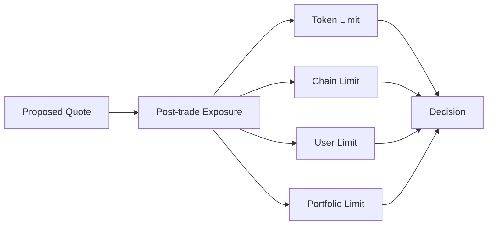
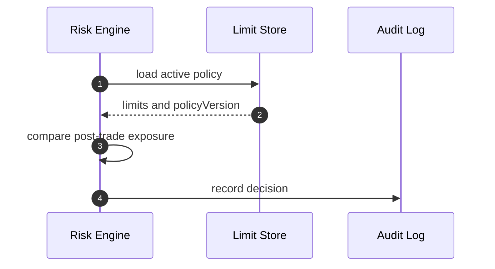
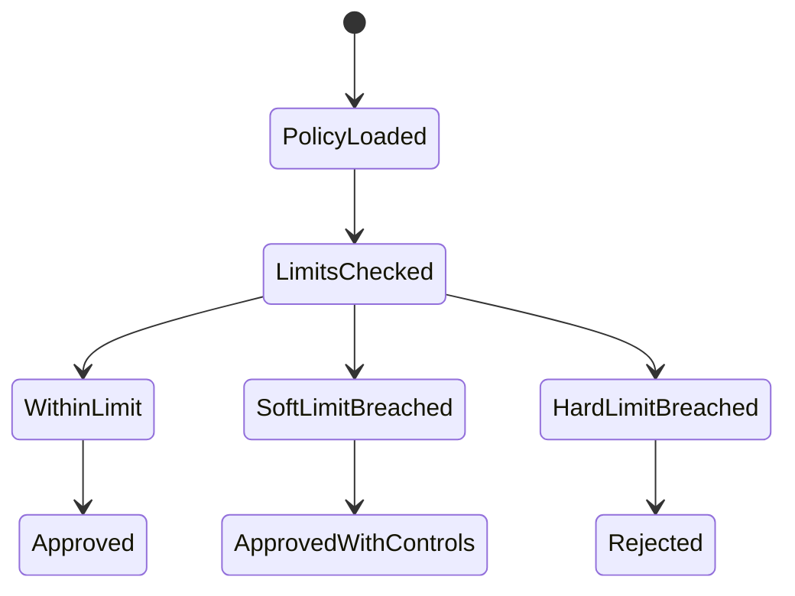

# Chapter 05: Position Limits

## Abstract

Position limits 是 Risk Engine 最直接的硬约束。无论 Pricing Engine 给出多好的价格，只要 quote 执行后会超过 hard limit，Signer Service 就不能签名。限额系统把业务风险偏好转化为可执行规则。

## Learning Objectives

- 区分 soft limit 和 hard limit。
- 定义 token、pair、chain、user 和 portfolio 维度限额。
- 说明 position limit 与 pricing skew 的关系。
- 设计限额超出时的响应。

## Background

做市系统通常为每个资产设置最大库存、最大净敞口、最大单笔 notional 和最大日成交量。RFQ 系统必须在签名前检查这些限制，因为链上合约无法知道完整链下组合状态。

## Problem Statement

没有限额时，系统可能在异常流量或定价错误下持续签名。限额是防止单点模型错误扩散成资金事故的最后业务边界。

## Requirements

### Functional Requirements

- 支持 per-token limit。
- 支持 per-pair limit。
- 支持 per-chain limit。
- 支持 per-user 或 per-counterparty limit。
- 支持 global portfolio limit。

### Non-Functional Requirements

- 限额规则必须版本化。
- 限额变更必须审计。
- hard limit 必须强制拒绝。

## Existing Solutions

简单系统只限制单笔 amount。生产系统会多维度限额，并区分软硬阈值。

## Trade-Off Analysis

限额维度越多，配置越复杂，但能更精确地控制风险。第一版应覆盖 token、chain 和 notional 三个核心维度。

## System Design

## Architecture Diagram

Limit Store 为 Risk Engine 提供版本化 policy。Quote Service 不直接读取限额。

## Sequence Diagram

## State Machine

## Data Model

`RiskLimitPolicy` 的完整目标包含 `policyVersion`、`chainId`、`tokenAddress`、`maxPosition`、`softPosition`、`maxNotionalUsd`、`maxUserNotionalUsd`、`maxQuotedSpreadBps`、`enabled`。当前默认后端已落地 `TokenLimitRiskPolicy`：`enabledChainIds` 定义 chain gate，`tokenLimits` 以 `(chainId, tokenAddress)` 唯一键分别保存 canonical uint256 `maxAmountIn`、`minAmountOut`、整数美元 `maxNotionalUsd` 和 `maxAbsoluteInventory`，公共字段保存 `maxUserOpenNotionalUsd`、`maxPairOpenNotionalUsd`、`minLiquidityUsd`、`maxVolatilityBps` 以及 slippage/spread/toxic-flow 上限。Quote Service 把定价 snapshot 与 projected tokenIn/tokenOut position 一并传给 Risk Engine；任一余额按对应 token raw-unit hard limit 超限、USD-reference 一侧按可信 decimals 计算出的单笔名义金额超过两侧较小上限、市场流动性不足、波动率越界或最终 quoted spread 超过 policy，都会拒绝签名。没有 USD-reference 的 managed pair 在启动时失败，避免把非稳定币 raw units 当成美元。

单笔门禁通过后，Quote Service 在 Signer 之前预留活动签名报价敞口。`quote_exposure_reservations` 以 quoteId 为幂等键，把 USD-reference 一侧按可信 decimals 转成 18 位 USD 定点数；两侧均为 USD reference 时取较大值，超过 18 decimals 的极小余数向上取整，避免低估。用户作用域为 `(chainId, user)`，交易对作用域使用排序后的 `(chainId, tokenLow, tokenHigh)`，因此反向报价不能绕过 pair limit。PostgreSQL 实现按稳定顺序逐个获取 transaction-scoped advisory locks，再在同一事务中求和并插入，消除多 API replica 的 check-then-insert write skew。只有 `expires_at > now()` 且 quote 状态为 `requested`、`signed` 或 `failed` 的记录计入活动敞口；submitted/settled 已有链上 nonce 消耗证据，暂不计数但保留记录，以便 reorg 将 quote 恢复为 signed 时自动重新计数。`failed` 仍可能对应用户已经拿到、链上尚可重试的签名，不能仅凭本地失败状态提前释放。签名前的签名、审计或 signed quote 持久化失败会 best-effort 显式释放；expired 记录由每次预留时的有界 `FOR UPDATE SKIP LOCKED` 清理，进程崩溃时也最多保守占用到 quote TTL。

名义限额之外，生产 runtime 使用 `RFQ_RECEIPT_CONFIG_JSON` 的链 RPC 在同一 block 读取 `RFQSettlement.treasury()` 与 `tokenOut.balanceOf(treasury)`。reservation 额外持久化方向性的 `tokenOut/amountOut` 和链上观察证据，并为 `(chainId, tokenOut)` 获取 advisory lock。所有未过期 quote 的输出数量都参与流动性 SUM，包括已经 submitted/settled 的 quote；后者保留到 TTL 是有意的保守策略，用于覆盖 RPC 读取、链上余额下降和数据库状态切换无法组成原子事务的窗口。若 `reserved + candidate > observedBalance`，记录 `TREASURY_LIQUIDITY_INSUFFICIENT` 并在 Signer 前拒绝。RPC 不可用、treasury 地址畸形或 balance 非 uint256 都按 risk unavailable fail closed。

组合 position limit 由 `portfolioDelta` 表达。Risk Engine 在 portfolio advisory lock 内复用 VaR valuation components，先按 `(chainId, tokenAddress)` 检查 absolute USD delta，再计算 pre/post gross USD delta 与 signed net USD delta。任一 asset/gross/net soft limit 被严格超过时 reservation 仍可接受，但持久化 component/aggregate `softLimitBreached` 并触发告警；任一 hard limit 被严格超过时返回 `PORTFOLIO_DELTA_LIMIT_EXCEEDED`，事务回滚且 Signer 不可见该 quote。精确等于阈值不算越界。USD-reference token 作为现金腿不进入 delta component，仍由 open notional 与 Treasury liquidity 两层约束保护。

`gammaGuardrail` 不替代上述限额。它在单维 hard limit 尚未越界时，对投影库存、USD 名义金额和波动率的相对利用率进行分段组合，捕获多个维度同时接近上限的非线性风险。达到组合乘数边界返回 `GAMMA_GUARDRAIL_TRIGGERED`；缺少库存投影不得按零库存处理。

## API Design

内部管理 API 后续可支持限额更新，但必须鉴权。公开 quote API 只返回风险拒绝。

## Engineering Decisions

- hard limit 拒绝签名。
- soft limit 可以触发更宽 spread 或更短 TTL。
- policyVersion 必须写入 risk decision。
- token address 必须与 chainId 共同构成授权键；不能因为同一地址在另一个 enabled chain 获准就跨链放行。
- `RFQ_RISK_POLICY_JSON` 和 `RFQ_TOKEN_REGISTRY_JSON` 必须在启动时双向覆盖 active pair；raw-unit 限额不得跨 decimals token 复用。
- `maxUserOpenNotionalUsd` 与 `maxPairOpenNotionalUsd` 是独立正整数阈值；累计 user/pair 门禁必须在签名前完成原子预留。
- `portfolioVar` 对所有非 USD 风险 token 要求显式 valuation pair。组合状态是 `inventory_positions + active quote reservations + candidate`；PostgreSQL 以 chain advisory lock 和 inventory `SHARE` lock 防止并发穿透，超限稳定返回 `PORTFOLIO_VAR_LIMIT_EXCEEDED`。
- `portfolioDelta` 必须与 `portfolioVar` 同时配置，复用其 valuation pair 和一致性窗口；hard breach 返回 `PORTFOLIO_DELTA_LIMIT_EXCEEDED`，soft breach 只记录证据与指标。

## Failure Scenarios

- Limit Store 不可用：拒绝签名。
- Exposure reservation store 不可用：拒绝签名；已成功预留但后续步骤失败时释放，释放失败由 deadline 自动止损。
- policy 缺失：拒绝相关 token。
- limit 配置过低：成交率下降但资金安全优先。

## Security Considerations

限额变更是高权限操作，必须审计并尽量使用多签或审批流程。

## Performance Considerations

Active policy 应缓存，但缓存必须有版本和失效机制。PostgreSQL 只串行化共享同一用户或同一无方向交易对的预留，不使用全局锁；活动求和由 user/pair + expiry 复合索引支持。

## Testing Strategy

测试 token limit、chain limit、同地址跨链隔离、USDC 6 decimals、WETH 18 decimals、每侧 inventory limit、user/portfolio limit、soft/hard 分支、policy missing 和 registry mismatch。`make quote-exposure-integration-check` 还必须在真实 PostgreSQL 的两个独立 session 中分别竞争 user、无方向 pair 和同 tokenOut Treasury 容量，断言恰好一个预留成功、另一个返回稳定 reasonCode；成功项重放不能新增记录，释放后失败项必须能够取得容量，过期 reservation 必须由正常预留路径清理。该门禁使用随机 quote/snapshot/address fixture 并在事务中清理，CI 不得用 SQL mock 结果替代它。

## Interview Notes

Position limit 是风险系统的硬闸门。不要用动态 spread 替代 hard limit。

## Summary

Position limits 把风险偏好转成可执行约束，是签名前风控的关键组成。

## References

- Risk limit policies
- Pre-trade risk checks
