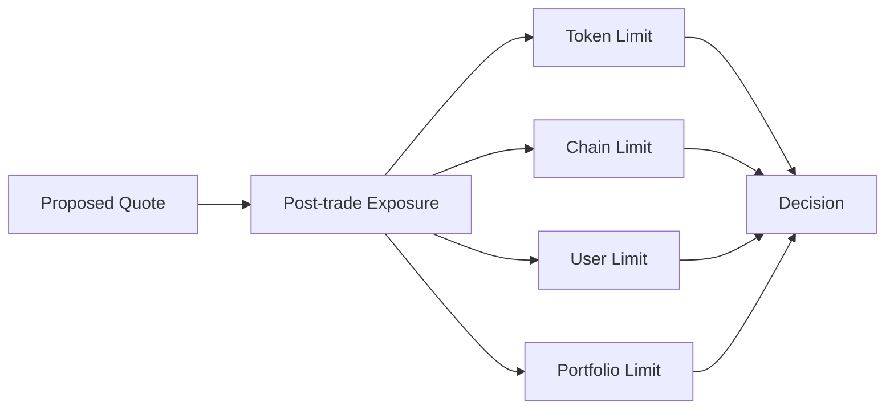
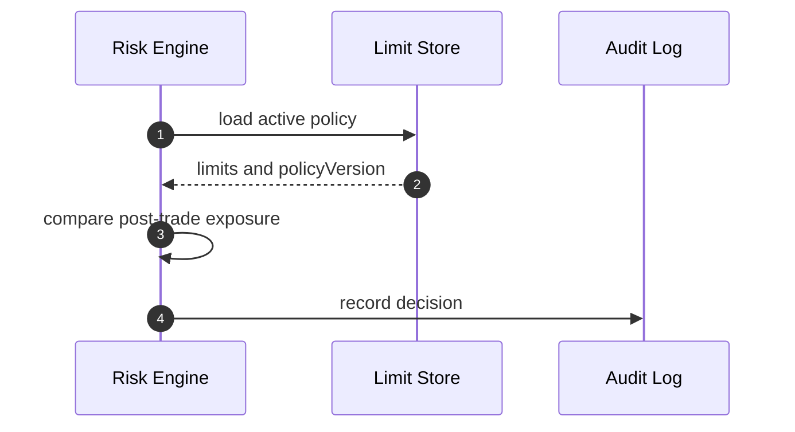
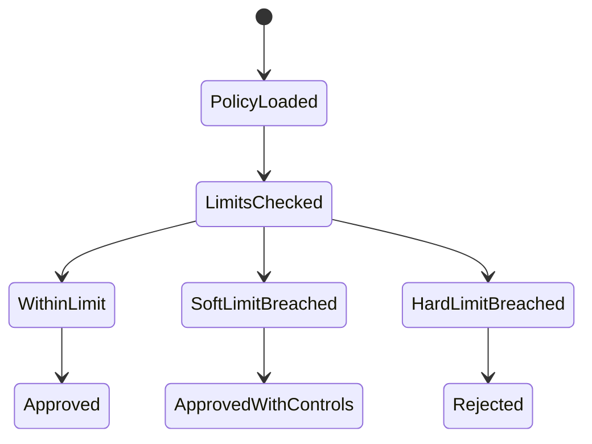

# Chapter 05: Position Limits

## Abstract

Position limits 是 Risk Engine 最直接的硬约束。无论 Pricing Engine 给出多好的价格，只要 quote 执行后会超过 hard limit，Signer Service 就不能签名。限额系统把业务风险偏好转化为可执行规则。

## Learning Objectives

- 区分 soft limit 和 hard limit。
- 定义 token、pair、chain、user 和 portfolio 维度限额。
- 说明 position limit 与 pricing skew 的关系。
- 设计限额超出时的响应。

## Background

做市系统通常为每个资产设置最大库存、最大净敞口、最大单笔 notional 和最大日成交量。RFQ 系统必须在签名前检查这些限制，因为链上合约无法知道完整链下组合状态。

## Problem Statement

没有限额时，系统可能在异常流量或定价错误下持续签名。限额是防止单点模型错误扩散成资金事故的最后业务边界。

## Requirements

### Functional Requirements

- 支持 per-token limit。
- 支持 per-pair limit。
- 支持 per-chain limit。
- 支持 per-user 或 per-counterparty limit。
- 支持 global portfolio limit。

### Non-Functional Requirements

- 限额规则必须版本化。
- 限额变更必须审计。
- hard limit 必须强制拒绝。

## Existing Solutions

简单系统只限制单笔 amount。生产系统会多维度限额，并区分软硬阈值。

## Trade-Off Analysis

限额维度越多，配置越复杂，但能更精确地控制风险。第一版应覆盖 token、chain 和 notional 三个核心维度。

## System Design

## Architecture Diagram

Limit Store 为 Risk Engine 提供版本化 policy。Quote Service 不直接读取限额。

## Sequence Diagram

## State Machine

## Data Model

`RiskLimitPolicy` 的完整目标包含 `policyVersion`、`chainId`、`tokenAddress`、`maxPosition`、`softPosition`、`maxNotionalUsd`、`maxUserNotionalUsd`、`maxQuotedSpreadBps`、`enabled`。当前默认后端已落地 `TokenLimitRiskPolicy`：`enabledChainIds` 定义 chain gate，`tokenLimits` 以 `(chainId, tokenAddress)` 唯一键分别保存 canonical uint256 `maxAmountIn`、`minAmountOut`、整数美元 `maxNotionalUsd` 和 `maxAbsoluteInventory`，公共字段保存 `minLiquidityUsd`、`maxVolatilityBps` 以及 slippage/spread/toxic-flow 上限。Quote Service 把定价 snapshot 与 projected tokenIn/tokenOut position 一并传给 Risk Engine；任一余额按对应 token raw-unit hard limit 超限、USD-reference 一侧按可信 decimals 计算出的单笔名义金额超过两侧较小上限、市场流动性不足、波动率越界或最终 quoted spread 超过 policy，都会拒绝签名。没有 USD-reference 的 managed pair 在启动时失败，避免把非稳定币 raw units 当成美元。后续再扩展数据库驱动的累计 pair/user 和 portfolio 限额。

## API Design

内部管理 API 后续可支持限额更新，但必须鉴权。公开 quote API 只返回风险拒绝。

## Engineering Decisions

- hard limit 拒绝签名。
- soft limit 可以触发更宽 spread 或更短 TTL。
- policyVersion 必须写入 risk decision。
- token address 必须与 chainId 共同构成授权键；不能因为同一地址在另一个 enabled chain 获准就跨链放行。
- `RFQ_RISK_POLICY_JSON` 和 `RFQ_TOKEN_REGISTRY_JSON` 必须在启动时双向覆盖 active pair；raw-unit 限额不得跨 decimals token 复用。

## Failure Scenarios

- Limit Store 不可用：拒绝签名。
- policy 缺失：拒绝相关 token。
- limit 配置过低：成交率下降但资金安全优先。

## Security Considerations

限额变更是高权限操作，必须审计并尽量使用多签或审批流程。

## Performance Considerations

Active policy 应缓存，但缓存必须有版本和失效机制。

## Testing Strategy

测试 token limit、chain limit、同地址跨链隔离、USDC 6 decimals、WETH 18 decimals、每侧 inventory limit、user/portfolio limit、soft/hard 分支、policy missing 和 registry mismatch。

## Interview Notes

Position limit 是风险系统的硬闸门。不要用动态 spread 替代 hard limit。

## Summary

Position limits 把风险偏好转成可执行约束，是签名前风控的关键组成。

## References

- Risk limit policies
- Pre-trade risk checks
