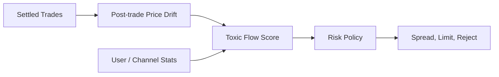
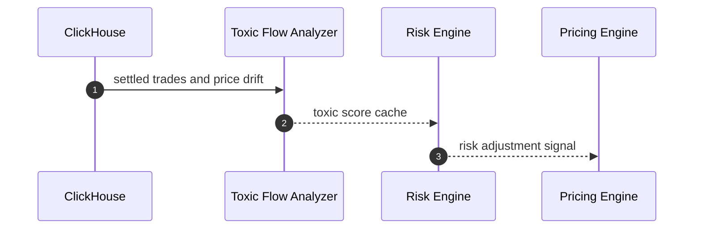
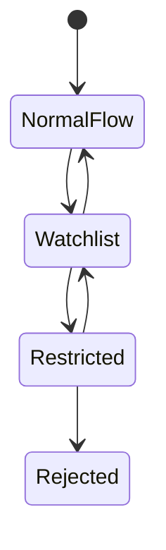

# Chapter 06: Toxic Flow

## Abstract

Toxic flow 指对做市商具有系统性不利选择的交易流。RFQ 系统如果只根据价格和库存判断，可能被延迟优势、信息优势或策略性询价捕获。Risk Engine 需要识别异常流量，并通过拒绝、扩大 spread、缩短 TTL 或降低限额缓解。

## Learning Objectives

- 理解 toxic flow 的含义。
- 识别 RFQ 场景中的不利选择。
- 定义成交后价格漂移指标。
- 设计 toxic flow 的响应策略。

## Background

做市商面对的不只是市场风险，还有交易对手选择风险。如果某些请求总是在价格即将不利变化前成交，做市商会持续亏损。RFQ 中，短 TTL 和签名前风控可以降低但不能消除这种风险。

## Problem Statement

系统需要在不歧视正常用户的前提下识别异常流量，避免被高信息优势流量持续套利。

## Requirements

### Functional Requirements

- 跟踪成交后短窗口价格漂移。
- 跟踪用户或渠道的 reject/settle/PnL 特征。
- 支持 toxic score。
- 根据 toxic score 调整 spread、TTL 或限额。

### Non-Functional Requirements

- 不泄露 toxic scoring 细节。
- 评分必须可审计。
- 响应策略必须可解释。

## Existing Solutions

传统做市系统使用 counterparty scoring、last look、spread adjustment 和 flow segmentation。Web3 RFQ 需要在更开放的钱包地址环境中采用类似思想，但要避免不可解释黑盒。

## Trade-Off Analysis

严格 toxic flow 控制能减少损失，但可能误伤正常用户。第一版应使用保守信号和人工可解释规则。

## System Design

## Architecture Diagram

Toxic Flow Analyzer 可以异步计算评分，Risk Engine 在实时路径读取最近评分。

## Sequence Diagram

## State Machine

## Data Model

`ToxicFlowSignal` 包含 `subjectType`、`subjectId`、`scoreBps`、`windowSeconds`、`postTradeDriftBps`、`sampleSize`、`policyVersion`。

## API Design

Toxic flow 不通过公开 API 暴露。Risk Decision 可以记录内部 reason code。

## Engineering Decisions

- 第一版使用规则评分，不使用黑盒模型。
- toxic score 可扩大 spread 或降低 limit。
- 严重 toxic flow 可拒绝签名。

## Failure Scenarios

- 分析任务延迟：使用上一版本评分。
- 样本不足：不做强拒绝。
- scoring 异常：回退到保守限额。

## Security Considerations

不能暴露具体评分规则，否则容易被规避。内部访问需要权限控制。

## Performance Considerations

实时 Risk Engine 只读取评分缓存，不扫描历史成交。

## Testing Strategy

测试价格漂移、样本不足、watchlist、restricted、reject 和 score cache stale。

## Interview Notes

Toxic flow 是专业做市系统与普通 API 的重要区别。要强调它是风险信号，不是单一拒绝理由。

## Summary

Toxic flow 控制帮助系统识别不利选择流量，并通过 spread、TTL、limit 和 reject 管理风险。

## References

- Adverse selection
- Post-trade markout
- Flow toxicity
