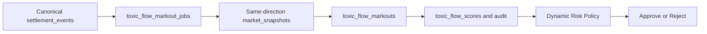
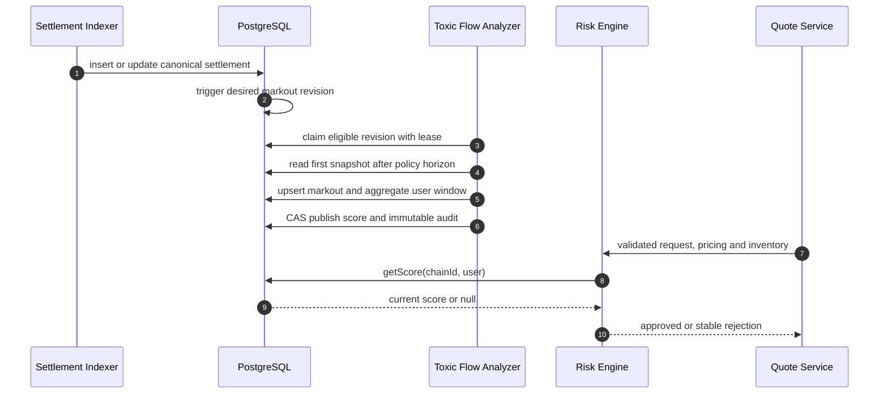
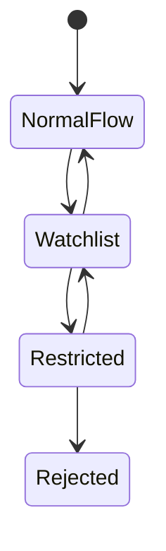

# Chapter 06: Toxic Flow

## Abstract

Toxic flow 指对做市商具有系统性不利选择的交易流。RFQ 系统如果只根据价格和库存判断，可能被延迟优势、信息优势或策略性询价捕获。Risk Engine 需要识别异常流量，并通过拒绝、扩大 spread、缩短 TTL 或降低限额缓解。

## Learning Objectives

- 理解 toxic flow 的含义。
- 识别 RFQ 场景中的不利选择。
- 定义成交后价格漂移指标。
- 设计 toxic flow 的响应策略。

## Background

做市商面对的不只是市场风险，还有交易对手选择风险。如果某些请求总是在价格即将不利变化前成交，做市商会持续亏损。RFQ 中，短 TTL 和签名前风控可以降低但不能消除这种风险。

## Problem Statement

系统需要在不歧视正常用户的前提下识别异常流量，避免被高信息优势流量持续套利。

## Requirements

### Functional Requirements

- 跟踪成交后短窗口价格漂移。
- 跟踪用户或渠道的 reject/settle/PnL 特征。
- 支持 toxic score。
- 根据 toxic score 调整 spread、TTL 或限额。

### Non-Functional Requirements

- 不泄露 toxic scoring 细节。
- 评分必须可审计。
- 响应策略必须可解释。

## Existing Solutions

传统做市系统使用 counterparty scoring、last look、spread adjustment 和 flow segmentation。Web3 RFQ 需要在更开放的钱包地址环境中采用类似思想，但要避免不可解释黑盒。

## Trade-Off Analysis

严格 toxic flow 控制能减少损失，但可能误伤正常用户。第一版应使用保守信号和人工可解释规则。

## System Design

## Architecture Diagram

Toxic Flow Analyzer 可以异步计算评分，Risk Engine 在实时路径读取最近评分。

## Sequence Diagram

## State Machine

## Data Model

当前 `ToxicFlowScoreState` 以 `(chainId, normalized user)` 为键，包含 `scoreBps`、`postTradeDriftBps`、`sampleSize`、`windowSeconds`、`policyVersion`、`observedAt`、单调 `version`、`updatedBy` 和 `updatedAt`。`toxic_flow_scores` 保存最新版本，`toxic_flow_score_audit` 保存每个成功 CAS 版本。

Migration 021 增加 `settlement_events.settled_at`、`toxic_flow_markout_jobs` 与 `toxic_flow_markouts`。receipt 和 indexer 从成交所在 canonical block 读取区块时间，不能用延迟索引时的数据库 `created_at` 代替。settlement insert 或 canonical 变化通过 trigger 递增 desired revision；多副本 analyzer 用 `FOR UPDATE SKIP LOCKED` 与 expiring lease 领取到期任务。canonical 成交在 `settled_at + horizon` 后读取窗口内首个同方向 snapshot，保存固定 policy horizon、实际 snapshot observation time、执行价、post-trade mid、maker-side drift 和 toxicity score。无法恢复权威区块时间的 legacy settlement 不自动入队，必须由受审查的回填流程补证。reorg revision 将旧 markout 标为 non-canonical，再聚合并发布新 score；窗口变为空时发布 score、drift、sample 全为零的清分版本，旧高分不会无限残留。

执行价和 post-trade mid 都使用 `tokenOut/tokenIn` 人类单位。`driftBps = (postMid - executionPrice) / executionPrice * 10000`，负值表示成交后同样 tokenIn 能换到更少 tokenOut，即 maker 遭遇不利选择。规则分数为 `clamp(-driftBps * scoreScale, 0, 10000)`，用户窗口取 canonical markout 的平均值。PostgreSQL settlement、snapshot、markout 和 score audit 是可恢复的操作事实；ClickHouse 只用于高维分析，不参与实时评分正确性。

## API Design

Toxic flow 不通过交易 API 暴露。自动 analyzer 通过受限 PostgreSQL 角色直接写相同的 CAS score store，并以 `toxic_analyzer:<workerId>` 记录 actor；受保护的 `GET/PUT /admin/toxic-flow/scores/:chainId/:user` 只用于运维读取、人工回填和受审查的纠正版本。公共 quote 响应仍只返回 `RISK_REJECTED`。Risk Decision 记录内部 reason code，并把 score version 组合到 `policyVersion` 的 `:tf<version>` 后缀中以便回放。

## Engineering Decisions

- 第一版使用规则评分，不使用黑盒模型。
- toxic score 可扩大 spread 或降低 limit。
- 严重 toxic flow 可拒绝签名。
- 当前默认 `TokenLimitRiskEngine` 与保留的 `BasicRiskEngine` 都支持 restricted user 和 per-user `toxicFlowScores`；分数超过 `maxToxicScoreBps` 时返回 `TOXIC_FLOW_SCORE_EXCEEDED`，restricted user 返回 `TOXIC_FLOW_RESTRICTED_USER`。
- 默认运行时在 `TokenLimitRiskEngine` 外层装配 `DynamicToxicFlowRiskEngine`。基础 chain、token、market、inventory 和静态策略先执行并可短路拒绝；基础批准后才读取共享动态 score。未知用户继续使用基础决定，样本量低于 `RFQ_TOXIC_FLOW_MIN_SAMPLE_SIZE` 的新 score 只参与版本审计而不触发强拒绝。
- 已知 score 必须满足 `RFQ_TOXIC_FLOW_MAX_SCORE_AGE_MS` 和 `RFQ_TOXIC_FLOW_MAX_FUTURE_SKEW_MS`。过期、来自过远未来、畸形或存储不可读都视为 `RISK_ENGINE_UNAVAILABLE` 并阻断 signer；生产多副本不得回退到 pod-local score。
- 注入自定义 `RiskEngine` 表示调用方接管完整策略，因此默认动态 wrapper 不会再次叠加；自定义实现必须自行提供等价的 freshness、审计与 fail-closed 保证。
- `RFQ_TOXIC_FLOW_MARKOUT_HORIZON_SECONDS` 固定测量时点，`RFQ_TOXIC_FLOW_MARKOUT_MAX_SNAPSHOT_LAG_SECONDS` 只允许选择 horizon 后有限窗口内首个 snapshot，不能把一个较晚但有利的价格当作目标时点。`RFQ_TOXIC_FLOW_SCORE_WINDOW_SECONDS` 必须覆盖 horizon，policy version 与 score scale 是受审查的经济参数。

## Failure Scenarios

- 分析任务延迟：仅在上一版本仍处于 freshness 窗口时继续使用；过期后 fail closed。
- 样本不足：不做强拒绝。
- scoring 或 score store 异常：已知用户拒绝签名并记录 `RISK_ENGINE_UNAVAILABLE`，不静默降级为无 score。
- horizon 窗口内没有同方向 market snapshot：任务保留 desired revision，以有界指数退避重试并触发 backlog/retry 告警；不得伪造、反向换算或从 ClickHouse 回填实时证据。
- settlement reorg：trigger 创建新 revision；analyzer 失效旧 markout、重算窗口并通过 CAS 发布更正版本，不删除 score audit 或 settlement 历史。

## Security Considerations

不能向交易客户端暴露具体评分证据，否则容易被规避。自动 analyzer 使用独立 PostgreSQL 登录，只允许读取 settlement/snapshot、领取 markout job、写 markout 和以 CAS 更新 score/audit；它不需要 admin API key、signer、RPC、Redis、CEX、Kafka 或 ClickHouse 凭据。人工诊断与回填分别使用 `admin:read` / `admin:write` API key，普通 quote、submit、浏览器和分析查询凭证不得拥有这些 scope。指标不带 user、chain、score 或 actor label，具体证据从审计表查询。

## Performance Considerations

实时 Risk Engine 只按 `(chainId, user)` 读取当前 score，不扫描历史成交。历史窗口聚合只在异步 analyzer 中执行，并由 `(chain_id, user_address, observed_at DESC) WHERE canonical=TRUE` 索引支持。

## Testing Strategy

测试跨 decimals 执行价、maker-side drift、极值 clamp、样本不足、score freshness、CAS 冲突重算、snapshot 缺失重试、lease 冲突、并发 claim、reorg 清分和多副本 backlog 指标。

## Interview Notes

Toxic flow 是专业做市系统与普通 API 的重要区别。要强调它是风险信号，不是单一拒绝理由。

## Summary

Toxic flow 控制帮助系统识别不利选择流量，并通过 spread、TTL、limit 和 reject 管理风险。

## References

- Adverse selection
- Post-trade markout
- Flow toxicity
