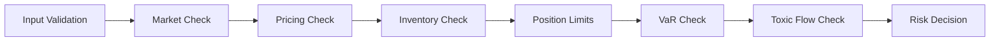
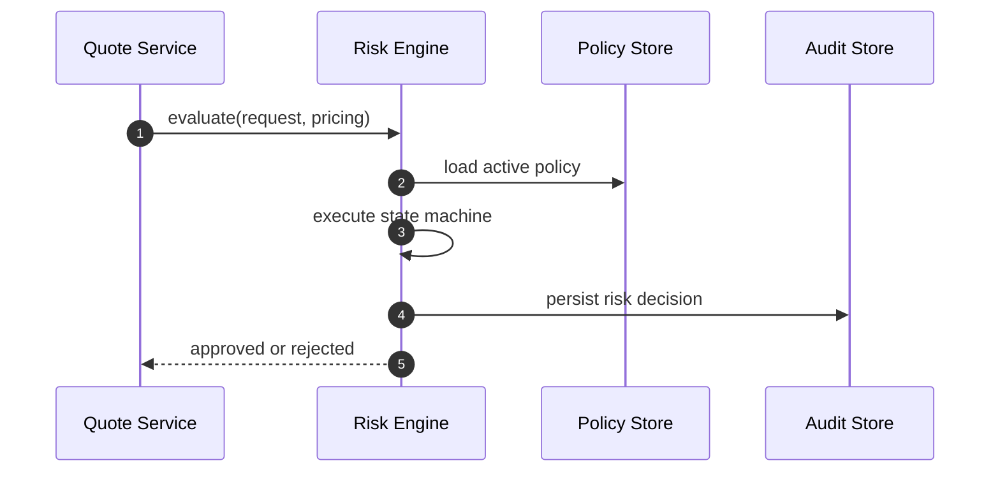
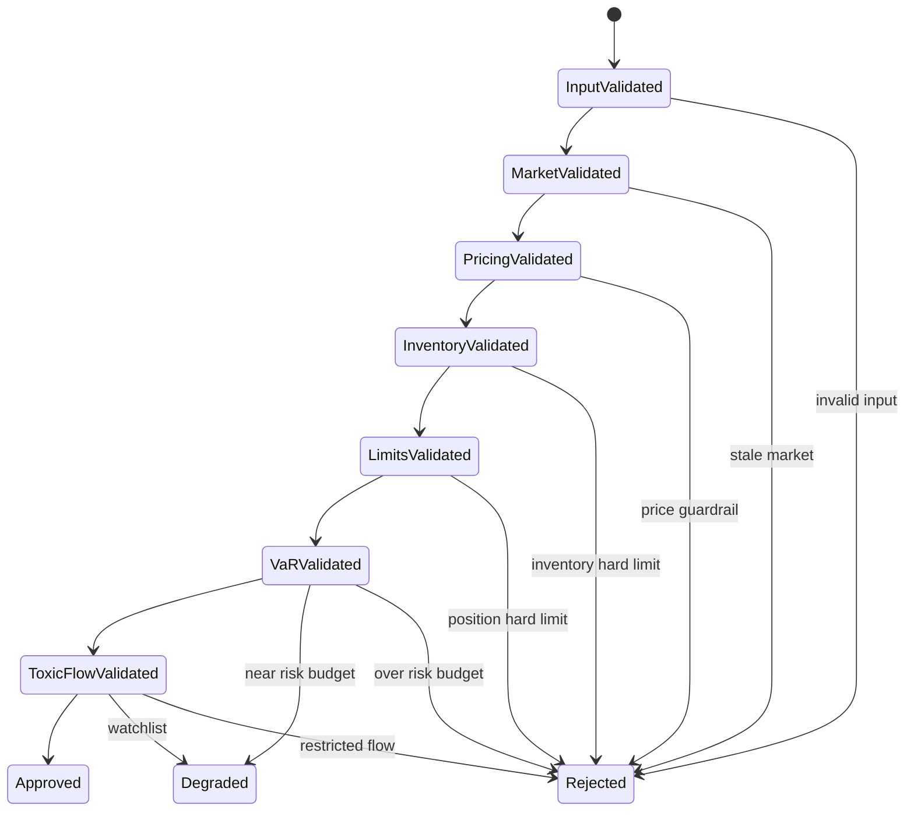

# Chapter 07: Risk State Machine

## Abstract

Risk State Machine 将 Risk Engine 的多个检查步骤串成可审计流程。它明确一笔 quote 从输入校验、市场检查、定价检查、库存检查、限额检查、有毒流量检查到最终批准或拒绝的状态变化。状态机能避免风控逻辑散落在代码中。

## Learning Objectives

- 定义 RFQ 风控状态机。
- 说明每个状态的输入和输出。
- 区分 reject、degrade 和 approve。
- 为后续代码实现提供直接蓝图。

## Background

Risk Engine 不是一个布尔函数。它需要给出决策、原因、策略版本和解释字段。状态机可以让每次拒绝都落在明确节点上，便于排查和面试表达。

## Problem Statement

如果风控逻辑以零散 if/else 存在，后续很难审计为什么某笔 quote 被签名或拒绝。需要显式状态机固定执行顺序。

## Requirements

### Functional Requirements

- 输入 QuoteRequest 和 PricingResult。
- 顺序执行 market、pricing、inventory、position、VaR、toxic checks。
- 输出 approved、rejected 或 degraded。
- 记录 reasonCode 和 policyVersion。

### Non-Functional Requirements

- 状态机必须确定性。
- 每个状态必须可测试。
- 拒绝原因必须稳定。

## Existing Solutions

很多 demo 把风控写成单个函数。生产系统通常使用规则引擎、状态机或 policy pipeline。第一版使用显式 pipeline，便于测试。

## Trade-Off Analysis

状态机增加结构，但能让风险决策可解释。对于 RFQ，解释性比少写几行代码更重要。

## System Design



## Architecture Diagram

Risk State Machine 是 Risk Engine 的核心执行器，依赖 Market Snapshot、Pricing Result、Inventory State、Limit Policy 和 Toxic Score。

## Sequence Diagram



## State Machine



## Data Model

`RiskDecision` 包含 `decision`、`reasonCode`、`policyVersion`、`checks`、`createdAt`。`checks` 可以保存每个状态的 pass/fail 和摘要。

## API Design

Risk Engine 内部接口：

```ts
evaluate(input: RiskInput): Promise<RiskDecision>
```

公开 API 只映射为 quote 成功或 `RISK_REJECTED`。

## Engineering Decisions

- Risk Engine 必须在 Signer 之前。
- 状态机顺序固定。
- 每个拒绝都有稳定 reasonCode。
- degraded 状态可反馈给 Pricing Engine 或限额系统。

## Failure Scenarios

- policy store unavailable：拒绝签名。
- check timeout：拒绝或降级，取决于策略。
- audit write failed：不应签名，因为无法回放决策。

## Security Considerations

Risk Decision 是签名授权前置证据，不能被客户端伪造。Signer 必须验证请求来自可信 Quote/Risk 路径。

## Performance Considerations

状态机每个 check 应尽量使用已加载上下文，避免长调用链。

## Testing Strategy

为每个状态写通过和失败测试；为状态顺序写集成测试；为 reasonCode 稳定性写 snapshot 或枚举测试。

## Interview Notes

用状态机解释风控，比笼统说“我们会做风险检查”更有说服力。它体现了可审计性和工程落地能力。

## Summary

Risk State Machine 固定了签名前风控流程，是后续 Risk Engine 代码实现的直接蓝图。

## References

- Pre-trade risk checks
- Policy pipeline
- State machine design
