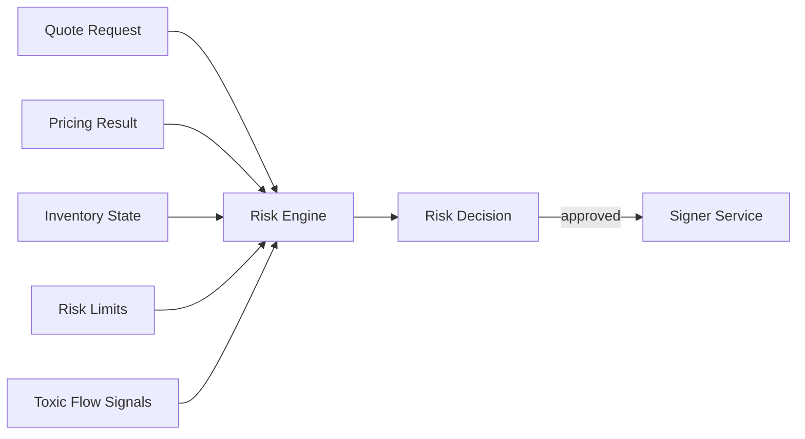

# Volume 3: Risk Engine

本卷定义 RFQ / Prop AMM 系统的风险引擎。Risk Engine 是 signed quote 之前的最后业务关口。Pricing Engine 可以给出价格，但只有 Risk Engine 批准后，Signer Service 才能生成 EIP-712 签名。

## Chapters

1. [Chapter 01: Inventory](Chapter01-Inventory.md)
2. [Chapter 02: Delta](Chapter02-Delta.md)
3. [Chapter 03: Gamma](Chapter03-Gamma.md)
4. [Chapter 04: VaR](Chapter04-VaR.md)
5. [Chapter 05: Position Limits](Chapter05-Position-Limits.md)
6. [Chapter 06: Toxic Flow](Chapter06-Toxic-Flow.md)
7. [Chapter 07: Risk State Machine](Chapter07-Risk-State-Machine.md)

## Core Principle

Risk Engine 的核心职责不是“让所有交易通过”，而是在签名前判断 quote 是否会让做市系统进入不可接受状态。风险拒绝是正常业务结果，必须可解释、可观测、可回放。

