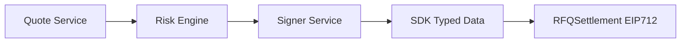
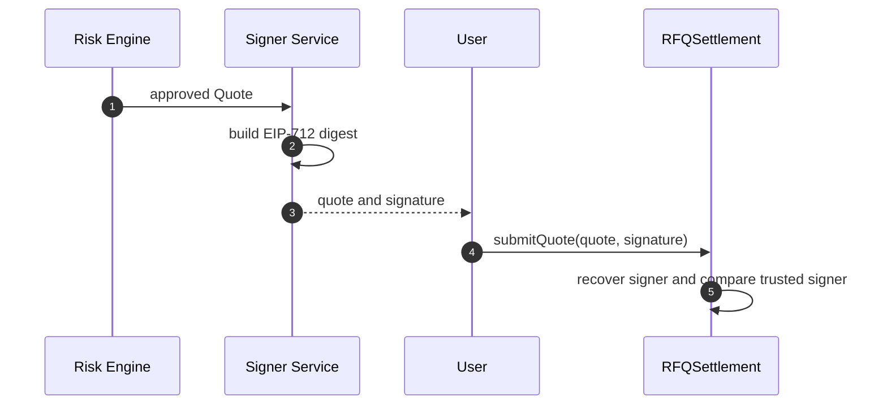
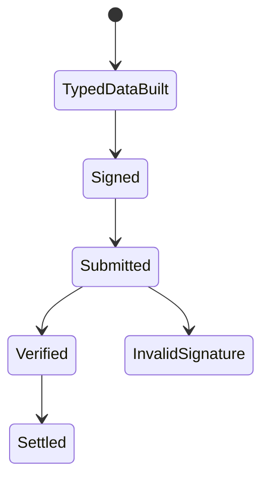

# Chapter 01: EIP712

## Abstract

EIP-712 是 RFQ quote 的签名基础。做市系统在链下完成定价和风控后，Signer Service 对结构化 Quote 进行签名。链上 `RFQSettlement` 使用同样的 domain 和 type definition 验证签名。只有签名验证通过，合约才允许结算。

## Learning Objectives

- 理解 EIP-712 domain separator 的作用。
- 明确 Quote typed data 的字段。
- 解释跨链、跨合约和跨版本重放如何被降低。
- 为 SDK、Signer 和合约保持一致类型定义。

## Background

普通 hash 签名缺少结构语义，钱包展示差，也容易出现签名域不清晰的问题。EIP-712 使用 typed structured data，使用户、后端和合约都围绕同一个结构签名。

## Problem Statement

RFQ quote 是链上资产结算授权。如果签名字段、chainId 或 verifyingContract 不清晰，攻击者可能把签名用于非预期环境。系统需要结构化签名标准。

## Requirements

### Functional Requirements

- Domain 包含 `name`、`version`、`chainId` 和 `verifyingContract`。
- Quote type 包含 user、tokenIn、tokenOut、amountIn、amountOut、minAmountOut、nonce、deadline、chainId。
- SDK、Signer 和合约共享字段顺序和类型。
- 合约只接受 trusted signer。

### Non-Functional Requirements

- 签名验证必须可测试。
- 类型变更必须版本化。
- 所有签名失败路径必须 revert。

## Existing Solutions

`eth_sign` 或 `personal_sign` 简单，但语义弱。EIP-712 是 DeFi 授权、permit 和 RFQ 系统中的成熟方案。

## Trade-Off Analysis

EIP-712 实现更复杂，但提供更强结构化授权和更好审计能力。对于资金结算合约，这个复杂度是合理的。

## System Design



## Architecture Diagram

EIP-712 是后端、SDK、前端钱包和合约之间的共享协议。任何一方字段不一致都会导致签名验证失败。

## Sequence Diagram



## State Machine



## Data Model

Quote struct:

```solidity
struct Quote {
    address user;
    address tokenIn;
    address tokenOut;
    uint256 amountIn;
    uint256 amountOut;
    uint256 minAmountOut;
    uint256 nonce;
    uint256 deadline;
    uint256 chainId;
}
```

## API Design

SDK 提供 `buildQuoteTypedData(quote, verifyingContract)`。后端 Signer 使用同样字段签名。OpenAPI 中 `SubmitQuoteRequest` 包含 quote 和 signature。

## Engineering Decisions

- 使用 EIP-712，不使用 raw hash signing。
- Domain version 初始为 `1`。
- Quote 字段变更必须同步 SDK、Signer、合约和文档。

## Failure Scenarios

- wrong signer：revert。
- wrong chainId：revert。
- wrong verifyingContract：signature recovery 不匹配。
- field tampering：signature recovery 不匹配。

## Security Considerations

Domain separator 是防重放边界。当前生产实现继承固定版本 OpenZeppelin `EIP712`，并通过 `ECDSA.tryRecover` 完成低 `s` 校验和 signer 恢复；项目代码只负责把库返回结果映射为稳定的 RFQ 错误，不再手写 `ecrecover` 安全逻辑。

## Performance Considerations

EIP-712 验证增加 gas，但相比资金安全成本可接受。Quote struct 应保持最小字段集。

## Testing Strategy

测试正确签名、错误 signer、错误 chainId、错误 token、篡改 amount 和过期 deadline。

## Interview Notes

解释 EIP-712 时要强调 typed data 和 domain separator，而不是只说“签名更安全”。

## Summary

EIP-712 是 quote 与 execution 一致性的密码学基础，是 RFQSettlement 的第一层验证。

## References

- EIP-712
- OpenZeppelin EIP712
- OpenZeppelin ECDSA
