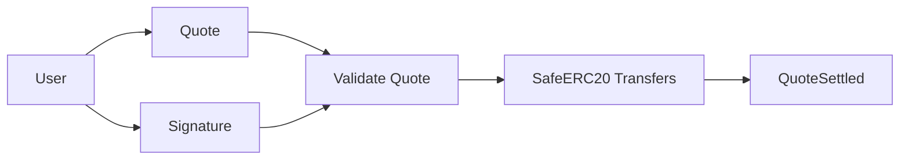
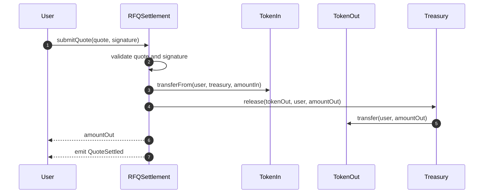
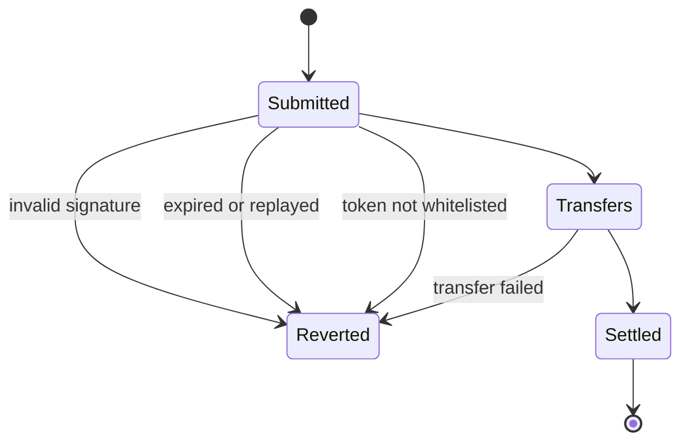

# Chapter 02: RFQSettlement

## Abstract

`RFQSettlement` 是 RFQ 系统的链上结算核心。它不计算价格、不访问市场数据、不执行链下风险模型。它只验证 signed quote 是否有效，并在验证通过后使用 SafeERC20 完成资产转移和事件记录。

## Learning Objectives

- 理解 RFQSettlement 的最小职责。
- 明确 `submitQuote` 的验证顺序。
- 区分链上验证和链下风控。
- 定义 settlement event 的作用。

## Background

RFQ 系统把复杂决策放在链下，但最终资金转移必须链上确定。合约是用户和做市商之间的结算裁判，只接受被 trusted signer 授权的 quote。

## Problem Statement

如果合约承担过多业务逻辑，会增加 gas、攻击面和审计复杂度。如果合约验证不足，则 signed quote 可能被篡改、重放或在错误环境中执行。

## Requirements

### Functional Requirements

- 验证 EIP-712 signature。
- 验证 trusted signer。
- 验证 quote.user 等于 msg.sender。
- 验证 chainId 等于 block.chainid。
- 验证 deadline 未过期。
- 验证 nonce 为非零正值且未使用。
- 验证 token whitelist。
- 使用 SafeERC20 转账。
- 发出 `QuoteSettled` 事件。

### Non-Functional Requirements

- 合约逻辑保持最小化。
- 外部调用受 ReentrancyGuard 保护。
- 管理操作受 AccessControl 保护。
- 异常情况下可 Pausable。

## Existing Solutions

一些 DEX 使用 AMM 池直接结算，一些 RFQ 系统使用 settlement proxy。此项目选择单独 RFQSettlement 合约作为清晰边界。

## Trade-Off Analysis

最小合约降低审计复杂度，但要求链下系统可靠。该取舍符合本项目“风险逻辑留链下、结算验证留链上”的原则。

## System Design



## Architecture Diagram

RFQSettlement 与 ERC20 token 和 Treasury 边界直接交互，并通过 role-based admin 管理 trusted signer、treasury、token whitelist 和 pause 状态。当前代码固定使用 OpenZeppelin Contracts `5.6.1` 的 `EIP712`、`ECDSA`、`SafeERC20`、`ReentrancyGuard`、`Pausable` 和 `AccessControl`；依赖通过 git submodule 固定到仓库提交，CI 递归检出并验证版本。`Treasury` 合约承载独立 custody 边界：RFQSettlement 把用户 `tokenIn` 转入 Treasury，并通过 settlement-only `release` 支付 `tokenOut`；owner-only `emergencyWithdraw` 只用于应急资金迁移。

## Sequence Diagram



## State Machine



## Data Model

On-chain state includes `trustedSigner`, `treasury`, `tokenWhitelist`, `usedNonces`, roles and pause state. Quote itself does not need to be permanently stored if event contains enough settlement data.

## API Design

Core function:

```solidity
function submitQuote(
    Quote calldata quote,
    bytes calldata signature
) external nonReentrant whenNotPaused returns (uint256 amountOut);
```

## Engineering Decisions

- 合约不重新计算价格。
- nonce 必须是非零正值；nonce 标记在外部 token 调用之前完成，并由 nonReentrant 防止重入提交。
- RFQSettlement 不直接保管库存资金；常规成交通过 Treasury 放款，便于把结算权限和应急管理权限分开审计。
- `QuoteSettled` 是链下库存更新的权威事件。
- 安全转账直接使用 OpenZeppelin `SafeERC20.trySafeTransferFrom` / `trySafeTransfer`：低层调用必须成功，返回 `false` 必须 revert，无返回值 ERC20 被视为成功，非合约地址会被拒绝；失败统一映射为项目 ABI 中的 `TransferFailed`。
- SafeERC20 成功不等于实际金额一致。合约在输入侧校验 `user debit == treasury credit == amountIn`，在输出侧校验 `treasury debit == user credit == amountOut`；fee-on-transfer、sender-fee、rebasing 或伪造余额语义造成的差额会以 `InputTransferAmountMismatch` / `OutputTransferAmountMismatch` 原子回滚。
- 用户在调用 `submitQuote` 前必须授权 RFQSettlement 拉取 `tokenIn.amountIn`。参考前端读取 allowance 并只授权本次 quote 的精确数量；合约不依赖无限授权，allowance 不足时 `safeTransferFrom` 原子回滚。
- `SIGNER_ADMIN_ROLE` 独立保护 `setTrustedSigner`，`TOKEN_ADMIN_ROLE` 独立保护 `setTokenWhitelist`，默认管理员只能通过 `grantRole` 和 `revokeRole` 委托或收回这些权限。
- `DEFAULT_ADMIN_ROLE` 使用成员计数防止最后一个默认管理员被撤销；`transferOwnership` 先授予新 owner 全量管理角色，再撤销旧 owner 角色，避免 role administration 被永久锁死。

## Failure Scenarios

- 签名无效：revert。
- nonce 为 0 或已使用：revert。
- token 不支持：revert。
- ERC20 transfer 失败：revert。
- 合约 paused：revert。

## Security Considerations

当前实现不再维护本地安全组件：OpenZeppelin `SafeERC20` 负责兼容 bool / no-return ERC20，`ReentrancyGuard` 保护两个资产转移入口，`Pausable` 提供应急停止状态，`AccessControl` 提供标准角色存储与事件，`EIP712` / `ECDSA` 负责签名域和恢复约束。项目层继续固定签名校验、正 nonce、deadline、白名单和转账顺序，并通过四组余额差额证明事件金额等于实际资产变化，保留“先标记 nonce、任一差额失败时整笔交易回滚”的原子性。

## Performance Considerations

Quote 字段应保持最小，避免 gas 膨胀。事件字段应足够索引，但不要过度冗余。

## Testing Strategy

测试 happy path、wrong signer、wrong user、expired deadline、replay nonce、unsupported token、pause、transfer failure 和 event emission。SafeERC20 语义必须覆盖 no-return ERC20 成功路径、false-return `tokenIn` 失败回滚、false-return `tokenOut` 失败回滚和非合约 token 拒绝；余额差额测试必须覆盖 fee-on-transfer 输入与输出，并证明 nonce、两侧余额及前序转账全部回滚。AccessControl 测试必须覆盖 signer admin 与 token admin 分离、角色撤销后失效、无权限账户无法更新 signer 或 token whitelist。

## Interview Notes

回答 RFQSettlement 设计时，重点说明它是“授权验证与结算合约”，不是“链上定价引擎”。

## Summary

RFQSettlement 将链下 signed quote 转化为链上确定结算，是整个 RFQ 系统的可信执行边界。

## References

- OpenZeppelin SafeERC20
- OpenZeppelin ReentrancyGuard
- RFQ settlement contracts
