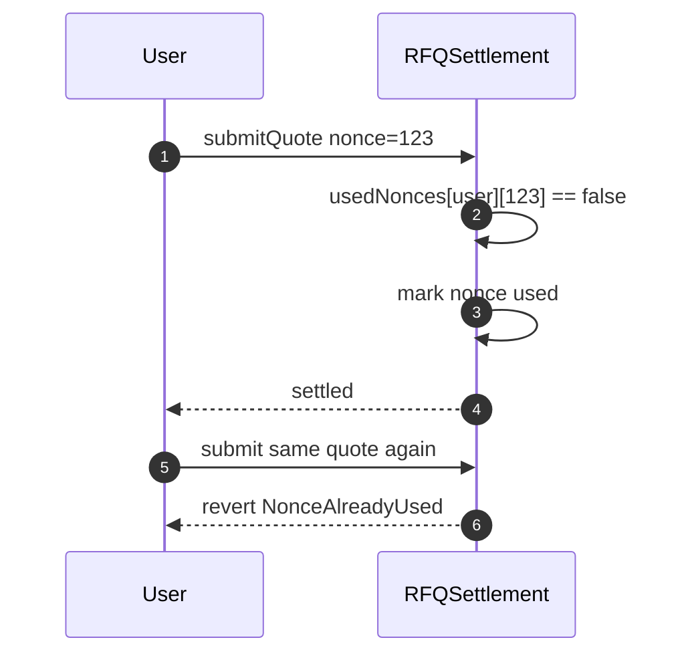
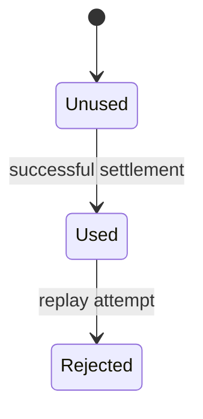

# Chapter 03: Nonce And Replay

## Abstract

Nonce 防重放是 RFQ 合约的核心安全机制。Signed quote 是做市商的执行授权，如果同一 quote 能被多次提交，用户或攻击者可以重复结算同一授权。合约必须在链上记录已使用 nonce，并拒绝重复使用。

## Learning Objectives

- 理解 replay attack 在 RFQ 中的风险。
- 比较 per-user nonce、global nonce 和 bitmap。
- 明确 nonce 与 deadline 的关系。
- 设计幂等事件消费和链上 nonce 状态。

## Background

RFQ quote 通常短生命周期，但 TTL 不能替代 nonce。只要在有效期内，攻击者仍可能重复提交同一签名。Nonce 是每个 quote 的唯一执行标识。

## Problem Statement

需要保证每个 signed quote 最多执行一次，同时避免 nonce 设计造成过高 gas 或复杂状态。

## Requirements

### Functional Requirements

- 每个 quote 包含非零正 nonce。
- 合约检查 nonce 未使用。
- 成功 settlement 后标记 nonce 已使用。
- 重复 nonce 必须 revert。

### Non-Functional Requirements

- nonce scope 必须清晰。
- nonce storage 必须可审计。
- nonce 为 0 必须视为无效 quote，而不是可执行的有效 nonce。
- nonce 与事件字段可关联。

## Existing Solutions

简单 mapping 最容易实现：`mapping(address user => mapping(uint256 nonce => bool used))`。Bitmap 更省 gas，但实现复杂。第一版可使用 mapping，后续再优化。

## Trade-Off Analysis

Per-user nonce 允许不同用户使用相同 nonce 值，状态清晰。Global nonce 简单但需要更强协调。Bitmap 节省 gas 但增加复杂度。本项目第一版采用 per-user mapping。

## System Design


## Architecture Diagram

Nonce 属于链上 settlement 状态，不依赖链下数据库。链下 quote 状态可以缓存 nonce，但不能作为防重放权威。

## Sequence Diagram



## State Machine



## Data Model

链上状态：

```solidity
mapping(address user => mapping(uint256 nonce => bool used)) public usedNonces;
```

事件中应包含 nonce，方便链下索引和审计。

## API Design

Quote response 返回正整数 `nonce` 字符串。Submit request 必须包含同一 nonce。后端不得在 submit 时替换 nonce，也不得接受 `nonce="0"` 进入执行、签名哈希或 settlement event replay 路径。

## Engineering Decisions

- 第一版使用 per-user nonce mapping。
- deadline 和非零正 nonce 同时使用。
- nonce 只在成功验证后标记。

## Failure Scenarios

- nonce 为 0 或已使用：revert。
- nonce 缺失：quote 结构无效。
- 链下数据库认为未使用但链上已使用：以链上为准。

## Security Considerations

标记 nonce 与外部转账顺序必须配合 ReentrancyGuard。若转账失败并 revert，nonce 状态也应回滚。

## Performance Considerations

Mapping 简单但每个 nonce 需要 storage write。未来高频场景可考虑 bitmap。

## Testing Strategy

测试首次提交成功、重复提交失败、nonce 为 0 失败、不同用户相同 nonce、过期 quote 不标记 nonce 和 transfer revert 回滚 nonce。

## Interview Notes

TTL 不能替代 nonce。TTL 限制时间窗口，nonce 限制执行次数。

## Summary

Nonce 是 RFQ 防重放的链上权威机制。第一版采用 per-user mapping，优先保证正确性和可审计性。

## References

- Replay protection
- Permit nonce patterns
- Bitmap nonce optimization
