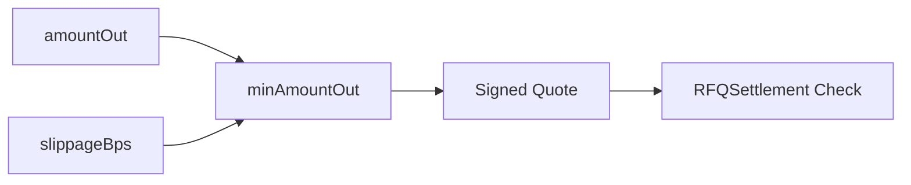
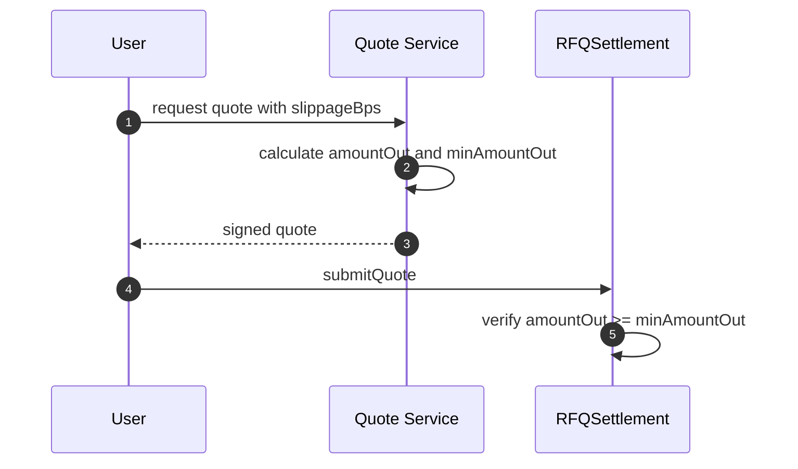
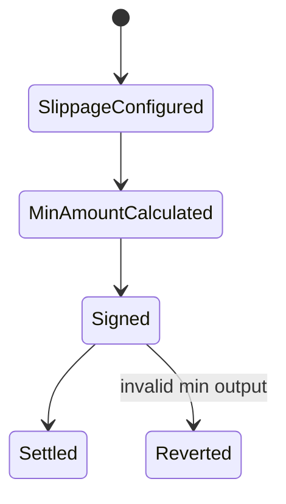

# Chapter 04: Slippage

## Abstract

RFQ 与 AMM 的滑点语义不同。AMM 中滑点保护通常防止池状态在交易前变化导致成交价变差。RFQ 中 `amountOut` 是做市商签名承诺，`minAmountOut` 是用户接受的最低输出。合约必须确保结算输出不低于用户保护边界。

## Learning Objectives

- 区分 RFQ slippage 与 AMM slippage。
- 理解 `amountOut` 和 `minAmountOut`。
- 说明 deadline、TTL 与 slippage 的关系。
- 明确前端和 SDK 如何展示滑点。

## Background

用户请求 quote 时传入 `slippageBps`。后端根据 `amountOut` 计算 `minAmountOut`，并把两者纳入 signed quote。用户提交链上交易时，合约验证 quote 字段和签名，确保这些值未被篡改。

## Problem Statement

如果 `minAmountOut` 未被签名绑定，用户或中间人可能修改保护条件。如果合约不验证输出金额，用户可能在异常实现中收到低于预期的资产。

## Requirements

### Functional Requirements

- Quote 包含 `amountOut` 和 `minAmountOut`。
- `minAmountOut` 由用户 slippage 设置派生。
- 合约验证 `amountOut >= minAmountOut`。
- 实际转账不得低于 `minAmountOut`。

### Non-Functional Requirements

- 前端必须清晰展示 deadline 和 min output。
- slippageBps 应有上限。
- 所有金额使用 base unit。

## Existing Solutions

AMM swap 通常使用 `amountOutMin`。RFQ 也使用类似保护，但 quote 本身已经固定 amountOut，因此 slippage 更多是用户保护和异常防线。

## Trade-Off Analysis

过低 slippage 容易导致交易失败，过高 slippage 会降低用户保护。RFQ 中由于 amountOut 被签名，默认 slippage 可以更保守。

## System Design

## Architecture Diagram

Slippage 计算在后端和 SDK 层发生，合约只验证 signed quote 中的结果。

## Sequence Diagram

## State Machine

## Data Model

Quote includes `amountOut` and `minAmountOut`. API request includes `slippageBps`; API response includes `minAmountOut`.

## API Design

`slippageBps` 是 `POST /quote` 的请求字段。服务端应限制最大 slippage，例如 1000 bps 或策略配置值。

## Engineering Decisions

- `minAmountOut` 纳入签名。
- slippage 过高拒绝 quote request。
- 前端展示 min output 和 deadline。

## Failure Scenarios

- minAmountOut > amountOut：拒绝签名或 revert。
- slippageBps 超过上限：API 返回 `INVALID_REQUEST`。
- token decimals 错误：拒绝报价。

## Security Considerations

`minAmountOut` 必须是 EIP-712 Quote 的一部分，避免 submit 前被替换。

## Performance Considerations

slippage 计算是纯数学，不应引入 IO。

## Testing Strategy

测试正常 slippage、0 slippage、过高 slippage、min > amountOut 和 signed field tampering。

## Interview Notes

RFQ 的滑点保护与 AMM 类似但语义不同：RFQ 的价格由签名承诺固定，滑点主要是用户保护和异常防线。

## Summary

Slippage 在 RFQ 中通过 `minAmountOut` 表达，并被签名绑定。合约必须确保执行结果不低于该保护。

## References

- AMM amountOutMin
- RFQ quote protection
