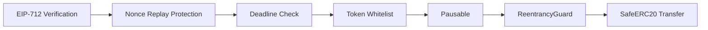
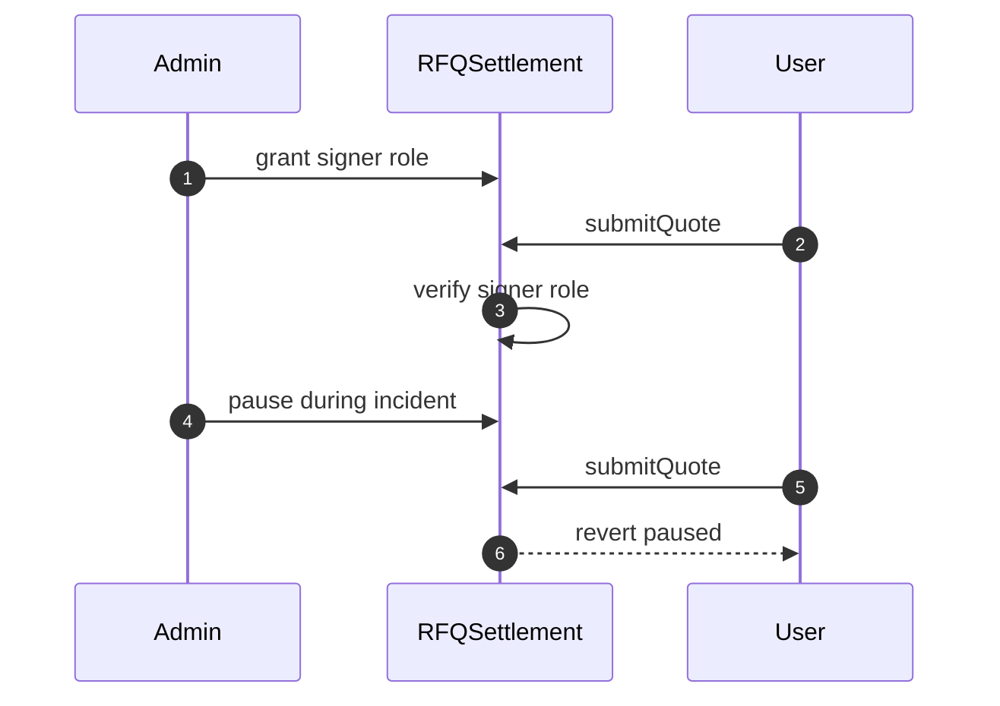
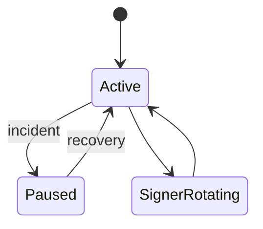

# Chapter 05: Security

## Abstract

RFQSettlement 的安全目标是防止未授权结算、重复结算、过期结算、错误资产结算和重入攻击。合约安全不能依赖链下服务善意，所有影响资产转移的条件都必须在链上验证。

## Learning Objectives

- 识别 RFQSettlement 的主要攻击面。
- 理解 OpenZeppelin 安全组件的作用。
- 设计权限、暂停和 token whitelist。
- 明确合约与 signer key 的安全关系。

## Background

RFQ 系统的高价值资产包括用户授权、treasury 资金和 signer 权限。攻击者可能尝试伪造签名、重放 quote、操纵 token、利用重入或滥用管理权限。

## Problem Statement

合约必须在最小逻辑中实现足够安全控制，同时不把复杂链下风险搬到链上。

## Requirements

### Functional Requirements

- 使用 EIP-712 验证签名。
- 使用 nonce 防重放。
- 使用 deadline 防过期。
- 使用 token whitelist 限制资产。
- 使用 Pausable 应急暂停。
- 使用 AccessControl 管理权限。
- 使用 ReentrancyGuard 防重入。
- 使用 SafeERC20 处理 token 转账。

### Non-Functional Requirements

- 管理操作必须可审计。
- 事件必须支持链下追踪。
- 合约状态应保持最小。

## Existing Solutions

OpenZeppelin 提供成熟安全组件，优先使用而不是手写。自研签名和转账库容易引入细微漏洞。

## Trade-Off Analysis

引入 OpenZeppelin 增加依赖和字节码，但显著降低安全风险。对于生产合约，这是合理选择。

## System Design

## Architecture Diagram

合约安全边界与链下 signer key 管理共同组成系统安全模型。链下 signer 出问题时，链上必须能移除 signer 或暂停。

## Sequence Diagram

## State Machine

## Data Model

状态包括 roles、trusted signers、token whitelist、used nonce 和 paused flag。生产实现可以支持多个 signer role，而不是单一地址。

## API Design

管理函数应包括 signer 管理、token whitelist 管理、pause/unpause。所有管理函数受角色控制。生产部署通过 `RFQDeploymentFactory` 在单笔交易中创建和配置 Settlement/Treasury，再把 owner 与全部管理角色交给显式 `RFQ_CONTRACT_ADMIN`；最终地址应是 multisig 或治理执行器，factory 不得保留任何角色。

## Engineering Decisions

- 使用 OpenZeppelin 组件。
- trusted signer 更新必须可审计。
- 事件字段支持库存和审计。

## Failure Scenarios

- signer key 泄露：pause、移除 signer、等待旧 quote 过期。
- token 行为异常：移除 whitelist。
- 重入尝试：ReentrancyGuard revert。
- 管理员误操作：多签和延迟治理缓解。

## Security Considerations

不要支持不标准 token，尤其 fee-on-transfer、rebasing、黑名单 token，除非专门适配。白名单配置不是唯一防线：settlement 必须比较转账前后 user 与 Treasury 的实际余额差额，确保输入和输出两条腿都与签名金额精确一致，否则原子回滚。Treasury 权限必须单独审计：`release` 只能由 settlement 调用，`emergencyWithdraw` 只能由 owner 调用，两条路径都必须使用安全转账和重入保护。

## Performance Considerations

安全检查增加 gas，但 settlement 函数不是高频链上撮合，正确性优先。

## Testing Strategy

测试权限、pause、token whitelist、reentrancy mock、SafeERC20 failure、signer rotation、Treasury release 和 emergency withdrawal path。

## Interview Notes

安全章节回答要具体到攻击面和控件，不要泛泛说“用 OpenZeppelin 就安全”。

## Summary

RFQSettlement 安全依赖链上验证、成熟库、权限隔离和应急暂停。合约必须拒绝所有未被明确授权的结算路径。

## References

- OpenZeppelin Contracts
- Smart contract incident response
- ERC20 compatibility risks
