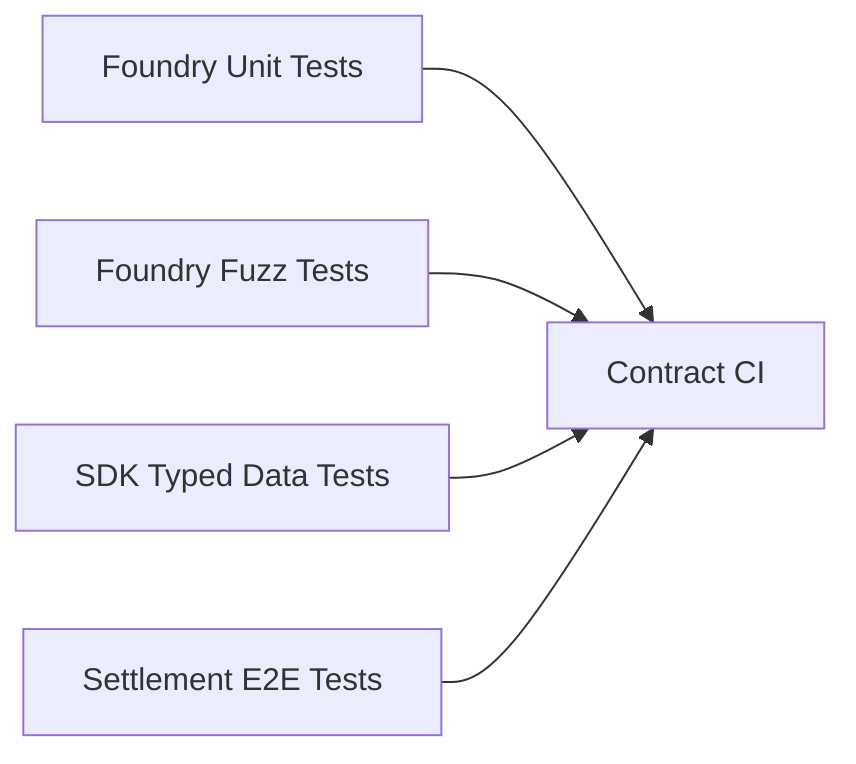
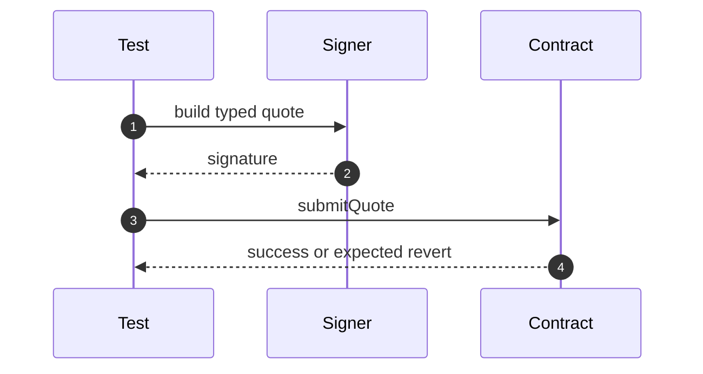
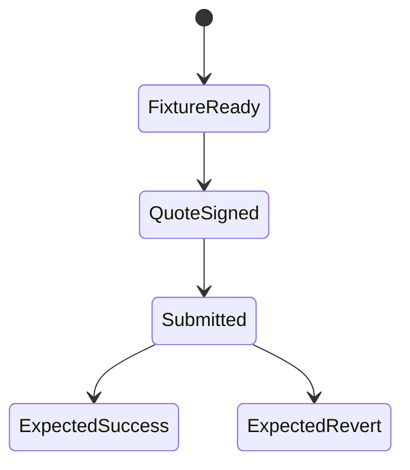

# Chapter 06: Testing

## Abstract

RFQSettlement 的测试重点不是 happy path，而是拒绝无效 quote。合约必须在错误 signer、错误 chainId、过期 deadline、nonce replay、token 不支持、pause 和转账失败时可靠 revert。测试是合约安全边界的可执行文档。

## Learning Objectives

- 定义 RFQSettlement 测试矩阵。
- 区分单元测试、性质测试和集成测试。
- 说明 EIP-712 签名测试如何构造。
- 明确事件和库存消费测试要求。

## Background

RFQ 合约的正确性主要体现在拒绝错误输入。只有当所有约束都满足时，合约才应转账和发事件。因此测试应覆盖每个保护条件。

## Problem Statement

如果只测试成功成交，无法证明合约能防止重放、伪造、过期和错误资产。需要系统化测试矩阵。

## Requirements

### Functional Requirements

- 测试 `submitQuote` happy path。
- 测试 EIP-712 signature recovery。
- 测试 nonce replay。
- 测试 deadline expiry。
- 测试 wrong chainId。
- 测试 token whitelist。
- 测试 pause。
- 测试 SafeERC20 failure。
- 测试 Treasury release、emergency withdrawal 和 reentrancy rejection。

### Non-Functional Requirements

- 测试必须可重复。
- 测试 fixture 应清晰。
- 签名 helper 与 SDK 字段一致。

## Existing Solutions

Foundry 适合 Solidity 单元测试和 fuzzing。TypeScript 可以补充 SDK typed data 与合约 hash 的一致性测试。

## Trade-Off Analysis

Foundry 测试合约行为最快。跨语言 typed data 测试能捕捉 SDK 与合约字段不一致。两者都需要。

## System Design

## Architecture Diagram

测试覆盖合约、SDK 和后端 Signer 的共同边界。EIP-712 字段一致性是重点。

## Sequence Diagram

## State Machine

## Data Model

测试 fixture 包含 user、trustedSigner、tokenIn、tokenOut、treasury、nonce、deadline、amountIn、amountOut、minAmountOut 和 chainId。

## API Design

测试应调用公开合约接口，不依赖内部函数，除非测试 hash helper。

## Engineering Decisions

- Foundry 作为合约测试框架。
- SDK typed data helper 必须有单独测试。
- 每个 revert reason 或 custom error 都应覆盖。
- Deploy script test must assert both `RFQSettlement` and `Treasury` are deployed, and that Treasury trusts the deployed settlement address.
- Deploy script must fail fast before contract creation when `RFQ_TRUSTED_SIGNER` is zero, `RFQ_TOKEN_WHITELIST_JSON` yields an empty whitelist, contains a zero token, or repeats a token.

## Failure Scenarios

- 错误签名未 revert：严重漏洞。
- nonce replay 成功：严重漏洞。
- pause 后仍可成交：严重漏洞。
- token transfer failure 未 revert：资金风险。

## Security Considerations

测试不能替代审计，但能让核心安全假设持续执行。CI 必须运行合约测试。

## Performance Considerations

单元测试应快速运行。复杂 fuzz 和 invariant tests 可在 nightly 或 PR 扩展阶段运行。

## Testing Strategy

测试矩阵：

| Case | Expected |
| --- | --- |
| valid quote | settle and emit event |
| wrong signer | revert |
| expired deadline | revert |
| used nonce | revert |
| unsupported token | revert |
| wrong chainId | revert |
| amountOut < minAmountOut | revert |
| paused contract | revert |
| transferFrom failure | revert |
| treasury unauthorized release | revert |
| treasury emergency withdrawal | transfer funds |
| treasury reentrant release | revert |

## Interview Notes

合约测试回答应强调 negative tests。RFQ 合约的价值在于拒绝未授权结算。

## Summary

RFQSettlement 测试矩阵应覆盖所有安全边界。后续实现 OpenZeppelin 版本后，测试必须成为 CI 的核心 gate。

## References

- Foundry Book
- OpenZeppelin test patterns
- EIP-712 test vectors
