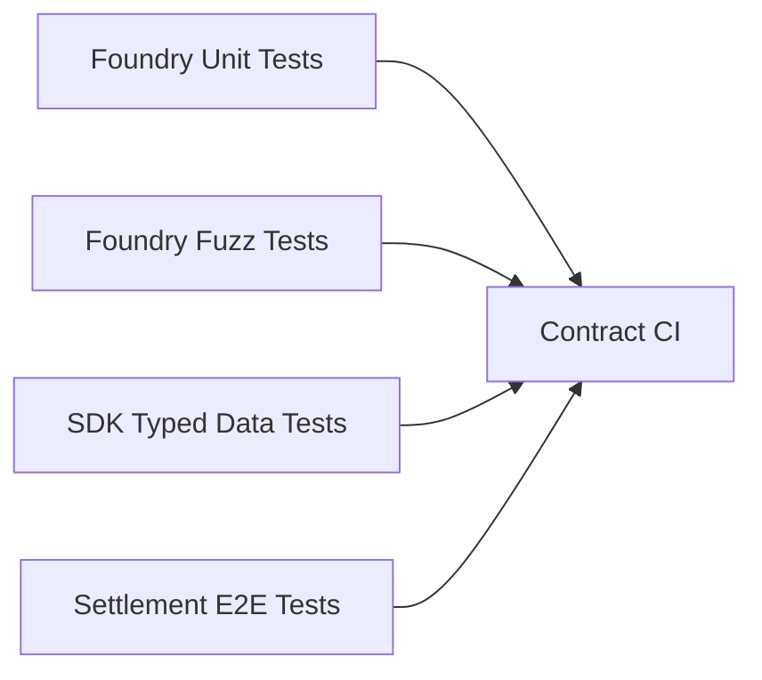
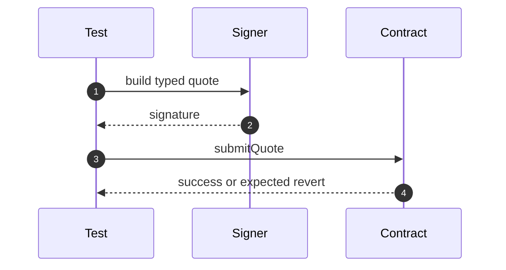
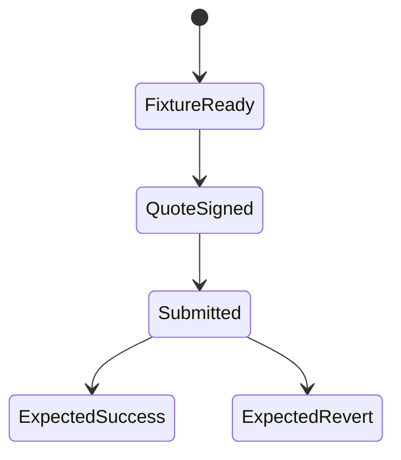

# Chapter 06: Testing

## Abstract

RFQSettlement 的测试重点不是 happy path，而是拒绝无效 quote。合约必须在错误 signer、错误 chainId、过期 deadline、nonce replay、token 不支持、pause 和转账失败时可靠 revert。测试是合约安全边界的可执行文档。

## Learning Objectives

- 定义 RFQSettlement 测试矩阵。
- 区分单元测试、性质测试和集成测试。
- 说明 EIP-712 签名测试如何构造。
- 明确事件和库存消费测试要求。

## Background

RFQ 合约的正确性主要体现在拒绝错误输入。只有当所有约束都满足时，合约才应转账和发事件。因此测试应覆盖每个保护条件。

## Problem Statement

如果只测试成功成交，无法证明合约能防止重放、伪造、过期和错误资产。需要系统化测试矩阵。

## Requirements

### Functional Requirements

- 测试 `submitQuote` happy path。
- 测试 EIP-712 signature recovery。
- 测试 nonce replay。
- 测试 deadline expiry。
- 测试 wrong chainId。
- 测试 token whitelist。
- 测试 pause。
- 测试 SafeERC20 failure。
- 测试 Treasury release、emergency withdrawal 和 reentrancy rejection。

### Non-Functional Requirements

- 测试必须可重复。
- 测试 fixture 应清晰。
- 签名 helper 与 SDK 字段一致。

## Existing Solutions

Foundry 适合 Solidity 单元测试和 fuzzing。TypeScript 可以补充 SDK typed data 与合约 hash 的一致性测试。

## Trade-Off Analysis

Foundry 测试合约行为最快。跨语言 typed data 测试能捕捉 SDK 与合约字段不一致。两者都需要。

## System Design

## Architecture Diagram

测试覆盖合约、SDK 和后端 Signer 的共同边界。EIP-712 字段一致性是重点。

## Sequence Diagram

## State Machine

## Data Model

测试 fixture 包含 user、trustedSigner、tokenIn、tokenOut、treasury、nonce、deadline、amountIn、amountOut、minAmountOut 和 chainId。

## API Design

测试应调用公开合约接口，不依赖内部函数，除非测试 hash helper。

## Engineering Decisions

- Foundry 作为合约测试框架。
- SDK typed data helper 必须有单独测试。
- 每个 revert reason 或 custom error 都应覆盖。
- `RFQSettlement.t.sol` includes focused fuzz tests for bounded valid settlement amounts, `amountOut < minAmountOut` rejection, expired-deadline rejection, and per-user nonce isolation. The valid fuzz path signs random bounded quote amounts/nonces and asserts exact token deltas plus nonce consumption; rejection fuzz paths assert `AmountOutBelowMinimum` and `QuoteExpired` leave nonce and balances unchanged; the nonce isolation path proves two distinct users may settle signed quotes that intentionally reuse the same nonce value without colliding.
- Deploy script test must assert the atomic `RFQDeploymentFactory` creates both `RFQSettlement` and `Treasury`, wires Treasury to Settlement, applies every whitelist token, transfers both owners and `DEFAULT_ADMIN_ROLE` to `RFQ_CONTRACT_ADMIN`, and retains no factory admin role.
- Deploy script test must also prove the configured initial signer is primary, authorized, and the only member of the signer set.
- Signer rotation tests must prove old/new overlap settlement, explicit old-key retirement, primary and last-signer guards, idempotent membership updates, and the `MAX_TRUSTED_SIGNERS = 5` bound.
- Deploy script must fail fast before factory creation when `RFQ_TRUSTED_SIGNER` or `RFQ_CONTRACT_ADMIN` is zero, or when `RFQ_TOKEN_WHITELIST_JSON` yields an empty whitelist, contains a zero token, or repeats a token.
- `tokenWhitelistCount()` and `roleMemberCount(role)` make the deployed authorization surface auditable without enumeration: a target-chain verifier must prove every expected member is present and the count is exact, so an extra signer, token or role holder cannot hide behind positive mapping lookups.

## Failure Scenarios

- 错误签名未 revert：严重漏洞。
- nonce replay 成功：严重漏洞。
- pause 后仍可成交：严重漏洞。
- token transfer failure 未 revert：资金风险。

## Security Considerations

测试不能替代审计，但能让核心安全假设持续执行。CI 必须运行合约测试。

## Performance Considerations

单元测试应快速运行。复杂 fuzz 和 invariant tests 可在 nightly 或 PR 扩展阶段运行。

## Testing Strategy

测试矩阵：

| Case | Expected |
| --- | --- |
| valid quote | settle and emit event |
| wrong signer | revert |
| old signer during configured overlap | settle |
| retired old signer | revert |
| sixth authorized signer | revert |
| expired deadline | revert |
| used nonce | revert |
| unsupported token | revert |
| wrong chainId | revert |
| amountOut < minAmountOut | revert |
| paused contract | revert |
| transferFrom failure | revert |
| treasury unauthorized release | revert |
| treasury emergency withdrawal | transfer funds |
| treasury reentrant release | revert |

单元和 fuzz tests 之外，`make settlement-e2e` 在临时 Anvil 上部署真实 token，再通过 `RFQDeploymentFactory` 原子创建、绑定和交接 Treasury/RFQSettlement。测试先对真实 RPC 执行同一部署 canary，再经过后端 `/quote` 生成 EIP-712 signature，由用户账户实际广播 `submitQuote`。后端必须从 RPC 独立验证 transaction calldata、成功 receipt 和唯一匹配事件，随后测试链上余额、used nonce 与链下 inventory/hedge/PnL。该跨层门禁能捕捉 factory、Solidity runtime、ABI、typed data、运行时 chain/token policy 和 receipt decoder 之间的组合漂移，Contract CI 必须执行。

`make settlement-indexer-e2e` 在另一条隔离 Anvil 链和 disposable PostgreSQL 上继续跨越链下边界：真实 `/submit` 必须创建可 claim 的 queued hedge，独立 indexer 对同一 log 必须幂等，production `HedgeWorker`/`HedgeFeeWorker` 通过校验 HMAC 的 Binance fixture 写入精确成交额、手续费、库存与 net PnL。随后 wallet-only transaction 和 replacement-chain reorg 验证丢失 callback 的恢复以及 terminal CEX evidence 不被链回滚删除。Contract CI 用这一门禁捕捉 Solidity event、Execution Service response contract、PostgreSQL projection 和 worker lifecycle 的组合漂移。

目标链部署还必须执行 `RFQ_CHAIN_INTEGRATION_CONFIRM=yes make contract-deployment-integration-check`。它在同一最新区块读取 chain state，要求区块时间新鲜；对 Settlement、Treasury、factory runtime code 与当前 release artifact 做 immutable-aware 字节级比较；核对双向 wiring、owner、五类 admin role 的唯一成员、完整 trusted-signer set、完整 token whitelist、pause 状态与本地重算的 EIP-712 domain separator。`make contract-deployment-check` 使用确定性 JSON-RPC fixture 覆盖成功、隐藏 signer 和 bytecode drift，并由 Contract CI 强制执行；fixture 通过不代替目标环境 canary。

## Interview Notes

合约测试回答应强调 negative tests。RFQ 合约的价值在于拒绝未授权结算。

## Summary

RFQSettlement 测试矩阵覆盖所有安全边界。OpenZeppelin 版本已经由 Foundry negative/fuzz tests、SDK ABI consistency、Anvil receipt-confirmed E2E 和专用 Contract CI 共同守护；CI 使用递归 submodule checkout，避免缺失或漂移的安全依赖被静默跳过。

## References

- Foundry Book
- OpenZeppelin test patterns
- EIP-712 test vectors
