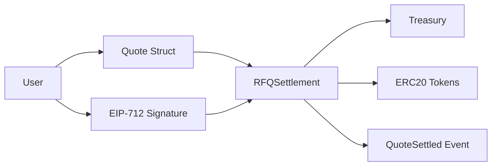

# Volume 4: Smart Contracts

本卷定义 RFQ / Prop AMM 系统的链上结算层。合约不负责复杂定价和风控，而是负责最小、确定、可审计的授权验证和资产结算。核心合约是 `RFQSettlement`，核心函数是 `submitQuote(Quote calldata quote, bytes calldata signature)`。

## Chapters

1. [Chapter 01: EIP712](Chapter01-EIP712.md)
2. [Chapter 02: RFQSettlement](Chapter02-RFQSettlement.md)
3. [Chapter 03: Nonce And Replay](Chapter03-Nonce-And-Replay.md)
4. [Chapter 04: Slippage](Chapter04-Slippage.md)
5. [Chapter 05: Security](Chapter05-Security.md)
6. [Chapter 06: Testing](Chapter06-Testing.md)

## Core Principle

Smart contracts should be minimal and deterministic. 风险逻辑留在链下，链上只验证 quote 是否被授权、是否过期、是否未重放、资产是否允许、转账是否成功。

`Treasury` 是独立 custody 边界：只有已配置的 `settlement` 地址可以调用 `release(token, to, amount)` 放款，`owner` 只保留 `emergencyWithdraw(token, to, amount)` 和 settlement 配置能力。这样可以把常规结算权限和应急管理权限分开审计。

