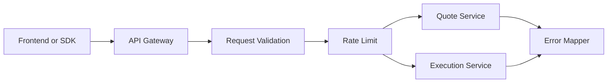
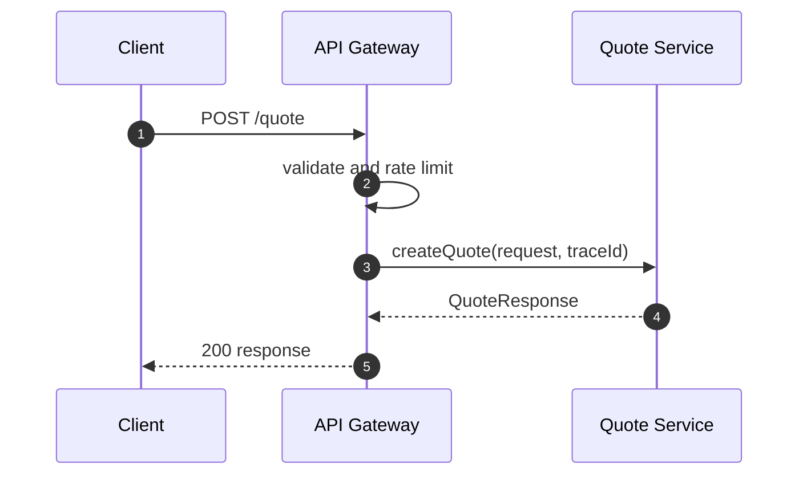
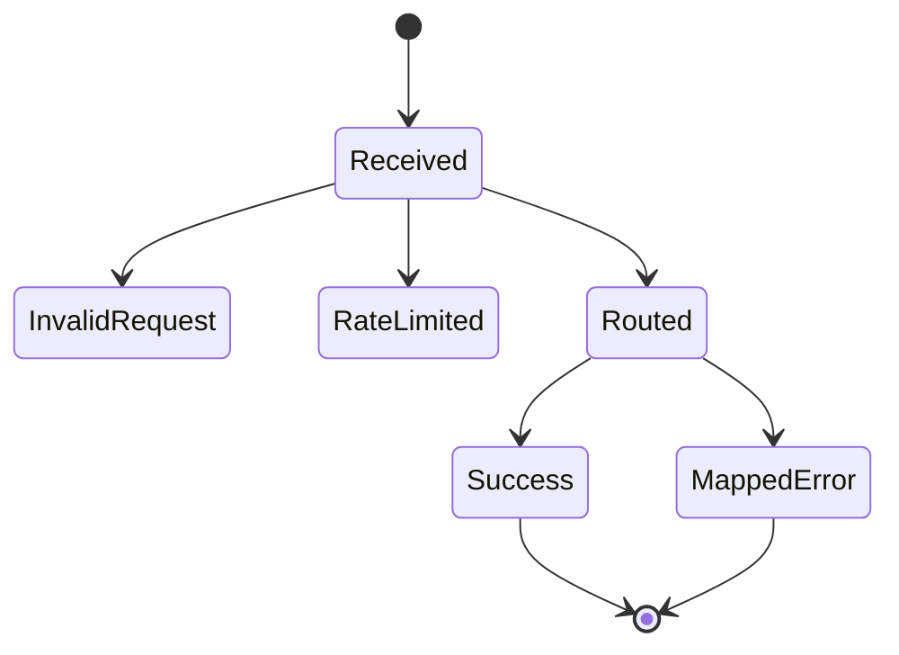

# Chapter 01: API Gateway

## Abstract

API Gateway 是 RFQ 系统的公开入口。它接收用户请求，执行基础校验、鉴权、限流、trace 注入和错误映射，然后把请求交给内部服务。Gateway 不应实现定价、风控或签名逻辑。

## Learning Objectives

- 明确 API Gateway 的职责边界。
- 定义公开 API 和错误响应。
- 说明 traceId、rate limit 和 metrics 的作用。
- 设计 Gateway 与 Quote/Execution Service 的调用关系。

## Background

RFQ API 需要同时服务前端、SDK 和集成方。公开接口必须稳定，并且不能泄露内部风控细节。Gateway 是保护内部服务的第一层。

## Problem Statement

如果 Gateway 直接处理业务逻辑，会导致代码边界混乱。如果 Gateway 缺少限流和输入校验，内部 Pricing、Risk 和 Signer 会暴露在异常流量下。

## Requirements

### Functional Requirements

- 暴露 `POST /quote`、`POST /submit`、`GET /quote/:id`、`GET /settlements/:id`、`GET /hedges/:id`、`GET /pnl`、`GET /health`、`GET /ready`、`GET /metrics`。
- 校验地址、chainId、amount 和 slippageBps。
- 注入 traceId。
- 统一错误响应格式。
- 调用 Quote Service 和 Execution Service。

### Non-Functional Requirements

- 公开 API 需要限流。
- 错误码稳定且可观测。
- health 和 readiness 分离：`/health` 只表示进程存活，`/ready` 表示关键组件已经可服务。
- metrics 不应阻塞业务请求。

## Existing Solutions

可以使用 NestJS 或 Fastify。当前 skeleton 选择 Fastify，因为启动快、插件模型简单、适合逐步搭建 API。

## Trade-Off Analysis

Fastify 更轻量，但需要自行组织模块结构。NestJS 更规范，但初始样板更多。本项目早期使用 Fastify，保持服务边界清晰即可。

## System Design

## Architecture Diagram

Gateway 是公开边界，内部服务不直接暴露公网。Signer Service 不允许由 Gateway 直接调用。

## Sequence Diagram

## State Machine

## Data Model

Gateway 只处理 DTO：`QuoteRequest`、`QuoteResponse`、`SubmitQuoteRequest`、`ErrorResponse`。它不拥有业务数据库写模型。

## API Design

OpenAPI 是公开接口来源。Gateway 实现必须对齐 `docs/api/openapi.yaml` 和 `docs/api/errors.md`。

## Engineering Decisions

- Gateway 不直接调用 Signer。
- Gateway 不返回内部 risk threshold。
- traceId 必须贯穿后端调用链。
- 当前 Fastify 实现使用 `InMemoryRateLimiter` 保护 `/quote`、`/submit`、`/quote/:id`、`/settlements/:id`、`/hedges/:id` 和 `/pnl`；生产部署可替换为 Redis-backed distributed rate limit，并保持 `RATE_LIMITED` 错误契约不变。

## Failure Scenarios

- 请求格式错误：返回 `INVALID_REQUEST`。
- 限流：返回 HTTP 429、`RATE_LIMITED` 和 `Retry-After`。
- Quote Service 超时：返回 503。
- 内部异常：返回 `INTERNAL_ERROR` 和 traceId。

## Security Considerations

Gateway 需要输入校验、限流、CORS 策略和日志脱敏。不能把签名服务或内部管理接口暴露到公网。

## Performance Considerations

Gateway 应保持薄层，不执行重计算。序列化和校验必须足够快，避免成为 quote path 瓶颈。

## Testing Strategy

测试 request validation、error mapping、rate limit、health、readiness、metrics、`/quote` 路由、settlement event 查询、hedge intent 查询和 PnL summary 查询。

## Interview Notes

API Gateway 的关键是保护内部服务和稳定公开契约，不是堆业务逻辑。

## Summary

Gateway 是 RFQ 后端的公开入口，负责协议层和保护层。业务决策应下沉到明确服务。

## References

- Fastify
- OpenAPI
- API rate limiting
