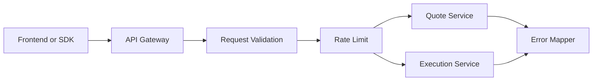
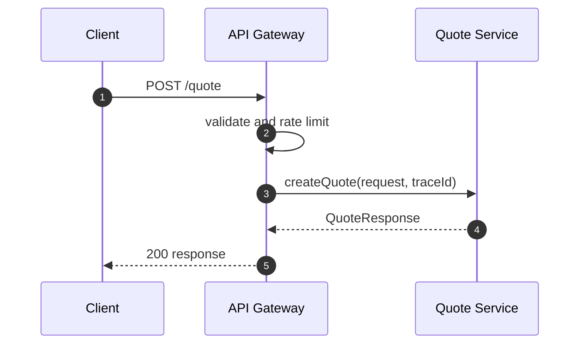
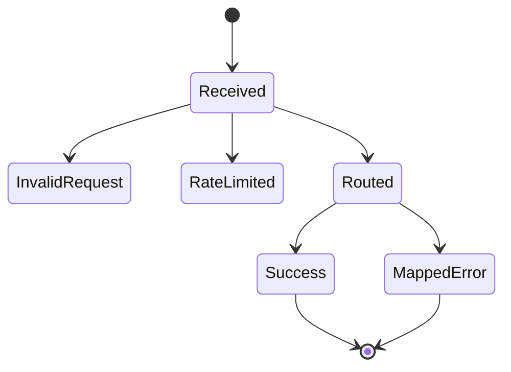

# Chapter 01: API Gateway

## Abstract

API Gateway 是 RFQ 系统的公开入口。它接收用户请求，执行基础校验、鉴权、限流、trace 注入和错误映射，然后把请求交给内部服务。Gateway 不应实现定价、风控或签名逻辑。

## Learning Objectives

- 明确 API Gateway 的职责边界。
- 定义公开 API 和错误响应。
- 说明 traceId、rate limit 和 metrics 的作用。
- 设计 Gateway 与 Quote/Execution Service 的调用关系。

## Background

RFQ API 需要同时服务前端、SDK 和集成方。公开接口必须稳定，并且不能泄露内部风控细节。Gateway 是保护内部服务的第一层。

## Problem Statement

如果 Gateway 直接处理业务逻辑，会导致代码边界混乱。如果 Gateway 缺少限流和输入校验，内部 Pricing、Risk 和 Signer 会暴露在异常流量下。

## Requirements

### Functional Requirements

- 暴露 `POST /quote`、`POST /submit`、`GET /quote/:id`、`GET /settlements/:id`、`GET /hedges/:id`、`GET /pnl`、`GET /health`、`GET /ready`、`GET /metrics`。
- 校验地址、chainId、amount 和 slippageBps。
- 注入 traceId。
- 统一错误响应格式。
- 调用 Quote Service 和 Execution Service。

### Non-Functional Requirements

- 公开 API 需要限流。
- 错误码稳定且可观测。
- health 和 readiness 分离：`/health` 只表示进程存活，`/ready` 表示关键组件已经可服务；当依赖 degraded 时返回 HTTP 503 和组件状态。
- metrics 不应阻塞业务请求。

## Existing Solutions

可以使用 NestJS 或 Fastify。当前 skeleton 选择 Fastify，因为启动快、插件模型简单、适合逐步搭建 API。

## Trade-Off Analysis

Fastify 更轻量，但需要自行组织模块结构。NestJS 更规范，但初始样板更多。本项目早期使用 Fastify，保持服务边界清晰即可。

## System Design

## Architecture Diagram

Gateway 是公开边界，内部服务不直接暴露公网。Signer Service 不允许由 Gateway 直接调用。

## Sequence Diagram

## State Machine

## Data Model

Gateway 只处理 DTO：`QuoteRequest`、`QuoteResponse`、`SubmitQuoteRequest`、`ErrorResponse`。它不拥有业务数据库写模型。

## API Design

OpenAPI 是公开接口来源。Gateway 实现必须对齐 `docs/api/openapi.yaml` 和 `docs/api/errors.md`。

## Engineering Decisions

- Gateway 不直接调用 Signer。
- Gateway 不返回内部 risk threshold、policyVersion、internal reasonCode、inventory limit、toxic-flow score 或 pricing adjustment breakdown；这些字段只能进入审计日志、指标标签和运维排障上下文。
- traceId 必须贯穿后端调用链；当前 Fastify gateway 在 `onRequest` hook 中为所有 HTTP 响应写入 `x-trace-id`，错误响应 body 的 `traceId` 必须与该 header 保持一致。
- Fastify parser 和框架级错误必须经过统一 error handler 映射为 `ErrorResponse`；malformed JSON 返回 `INVALID_REQUEST`/400，body too large 返回 `INVALID_REQUEST`/413，unsupported content type 返回 `INVALID_REQUEST`/415。
- Standalone server startup validates `HOST` and `PORT` before calling Fastify `listen`; `HOST` defaults to `127.0.0.1` without whitespace and `PORT` defaults to 3000 with a required range of 1 to 65535.
- `RFQ_BODY_LIMIT_BYTES` 控制 gateway 接收的最大 JSON body，默认 32768 bytes，启动时必须校验为 1024 到 1048576 的整数，避免异常 payload 消耗 parser 和内存资源。
- `RFQ_CORS_ALLOWED_ORIGINS` 控制浏览器来源 allowlist，默认允许本地 Vite 前端 `http://localhost:5173`。Gateway 只为匹配来源写入 `access-control-allow-origin`；预检请求来源不匹配时返回结构化 `INVALID_REQUEST`/403。
- Gateway 为所有响应写入 baseline security headers：`cache-control: no-store`、`x-content-type-options: nosniff`、`x-frame-options: DENY`、`referrer-policy: no-referrer` 和限制性的 `permissions-policy`。`RFQ_ENABLE_HSTS` 只应在 HTTPS 入口后开启，开启后写入 `strict-transport-security`。
- Standalone backend process registers graceful shutdown handlers for `SIGTERM` and `SIGINT`; the first signal closes Fastify and sets process exit code, while duplicate signals do not trigger duplicate close attempts.
- Gateway uses a not-found handler so unknown routes and unsupported HTTP methods return structured `INVALID_REQUEST`/404 responses instead of Fastify default error objects.
- Status endpoint path identifiers are part of the public contract: OpenAPI marks `quoteId`, `hedgeOrderId` and `settlementEventId` as non-empty strings, and the Gateway rejects blank decoded values before any store lookup.
- `/ready` 当前检查 market data freshness、routing probe、pricing probe、risk probe、signer sign/verify probe，以及 quote repository、inventory、execution/hedge store、settlement event store、PnL store 和 metrics exporter 的轻量 health probe。stale snapshot 会让 `marketData` 组件变为 `degraded`；routing、pricing 或 risk probe 失败会让 `routing`、`pricing` 或 `risk` 组件变为 `degraded`；signer 无法签名或签名无法被同一 trusted signer 验证时，`signer` 组件变为 `degraded`；存储或执行依赖探针失败时对应 `quoteRepository`、`execution`、`settlementEventStore`、`pnl` 或 `metrics` 组件变为 `degraded`，用于阻止 Kubernetes 在错误价格输入、不可路由、不可签名、不可定价、不可风控或关键状态依赖不可用时继续导流。`ReadinessServiceConfig` 的 `maxSnapshotAgeMs` 和 `maxSnapshotFutureSkewMs` 在构造期 fail fast，必须是正安全整数，避免错误 freshness 参数让实例永久 ready 或永久 degraded；`ReadinessService` snapshots `ReadinessServiceConfig` at construction after validation，避免外部调用方在启动后篡改 freshness 或 probe payload 并静默改变 `/ready` 结果。
- `ReadinessService` snapshots its dependency map at construction. Mutating the original deps object after startup must not silently replace market data, routing, pricing, risk, signer, storage or metrics probes used by `/ready`.
- 当前 Fastify 实现使用 `InMemoryRateLimiter` 保护 `/quote`、`/submit`、`/quote/:id`、`/settlements/:id`、`/hedges/:id` 和 `/pnl`；默认窗口为 60 秒，默认限额为 quote 120 requests / 60 seconds、submit 60 requests / 60 seconds、status 300 requests / 60 seconds。限流窗口和每个 endpoint limit 必须是正安全整数，错误配置会在启动期 fail fast；`InMemoryRateLimiter` snapshots `RateLimitConfig` at construction after validation，避免外部配置对象在启动后被篡改并静默放宽窗口或阈值；运行期 limiter 输入也必须校验 endpoint、非空 clientId 和非负安全整数时间戳，避免错误调用落入错误 bucket、写出不安全 reset timestamp 或绕过限流语义。内存 limiter 在每次检查前会 evicts expired client buckets before checking，避免大量一次性 client identity 让过期 bucket 长期占用进程内存。默认 `RFQ_TRUST_PROXY=false`，限流身份使用直接 socket IP；只有在可信反向代理或 ingress 清洗外部 `x-forwarded-for` 并写入规范客户端地址后，才能启用 `RFQ_TRUST_PROXY=true` 并按第一段 `x-forwarded-for` 分桶。生产部署可替换为 Redis-backed distributed rate limit，并保持 `RATE_LIMITED`、HTTP 429 和 `Retry-After` 错误契约不变。

## Failure Scenarios

- 请求格式错误、malformed JSON、unsupported content type 或 body too large：返回 `INVALID_REQUEST`，并按具体场景使用 HTTP 400、413 或 415。
- CORS preflight origin 不在 allowlist：返回 `INVALID_REQUEST` 和 HTTP 403，不写入 allow-origin header。
- Unknown route or unsupported method：返回 `INVALID_REQUEST` 和 HTTP 404，仍包含 traceId 和 security headers。
- 限流：返回 HTTP 429、`RATE_LIMITED` 和 `Retry-After`。
- Market data unavailable、invalid 或 stale：`/ready` 返回 HTTP 503/degraded，`POST /quote` 返回 `MARKET_DATA_UNAVAILABLE`。
- Routing, pricing or risk readiness probe failed：`/ready` 返回 HTTP 503/degraded，并通过 `rfq_dependency_status` 指明 `routing`、`pricing` 或 `risk`；`POST /quote` 仍会在实际报价时返回 `ROUTING_UNAVAILABLE`、`PRICING_UNAVAILABLE` 或 fail-closed `RISK_REJECTED`。
- Signer readiness probe failed：`/ready` 返回 HTTP 503/degraded，`POST /quote` 仍会在实际签名时返回 `SIGNER_UNAVAILABLE`。
- Storage or execution health probe failed：`/ready` 返回 HTTP 503/degraded，并通过 `rfq_dependency_status` 指明 quote repository、execution、settlement event store、PnL 或 metrics 组件；组件恢复前不应把新 quote 流量导入该实例。
- Quote status store unavailable：`GET /quote/:id` 返回 HTTP 503、`QUOTE_STORE_UNAVAILABLE` 和 traceId，不能落入 Fastify 默认 500。
- Hedge status store unavailable：`GET /hedges/:id` 返回 HTTP 503、`HEDGE_STORE_UNAVAILABLE` 和 traceId，区分查询依赖故障与 `HEDGE_NOT_FOUND`。
- Settlement event store unavailable：`GET /settlements/:id` 返回 HTTP 503、`SETTLEMENT_EVENT_STORE_UNAVAILABLE` 和 traceId，区分索引器/存储故障与 `SETTLEMENT_EVENT_NOT_FOUND`。
- Status endpoints reject empty dynamic identifiers before store lookup: blank `quoteId`, `hedgeOrderId` or `settlementEventId` returns `INVALID_REQUEST` instead of being treated as a missing resource or dependency failure.
- PnL store unavailable：`GET /pnl` 返回 HTTP 503、`PNL_STORE_UNAVAILABLE` 和 traceId；`POST /submit` 中 settlement 已应用后的 PnL 归因写入失败不回滚 settlement。
- Quote Service 超时：返回 503。
- 内部异常：返回 `INTERNAL_ERROR` 和 traceId。

## Security Considerations

Gateway 需要输入校验、限流、CORS allowlist、安全响应头和日志脱敏。不能把签名服务或内部管理接口暴露到公网。

## Performance Considerations

Gateway 应保持薄层，不执行重计算。序列化和校验必须足够快，避免成为 quote path 瓶颈。

## Testing Strategy

测试 request validation、Fastify parser error mapping、not-found handler、body limit、CORS allowed origin、CORS preflight rejection、security headers、HSTS toggle、graceful shutdown signal handling、error mapping、rate limit、health、readiness market data degraded、readiness config fail-fast、readiness routing degraded、readiness pricing degraded、readiness risk degraded、readiness signer degraded、readiness storage dependency degraded、metrics、`/quote` 路由、settlement event 查询、hedge intent 查询、PnL summary 查询，以及成功和失败响应的 `x-trace-id` 传播。

## Interview Notes

API Gateway 的关键是保护内部服务和稳定公开契约，不是堆业务逻辑。

## Summary

Gateway 是 RFQ 后端的公开入口，负责协议层和保护层。业务决策应下沉到明确服务。

## References

- Fastify
- OpenAPI
- API rate limiting
