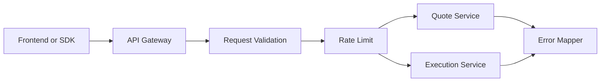
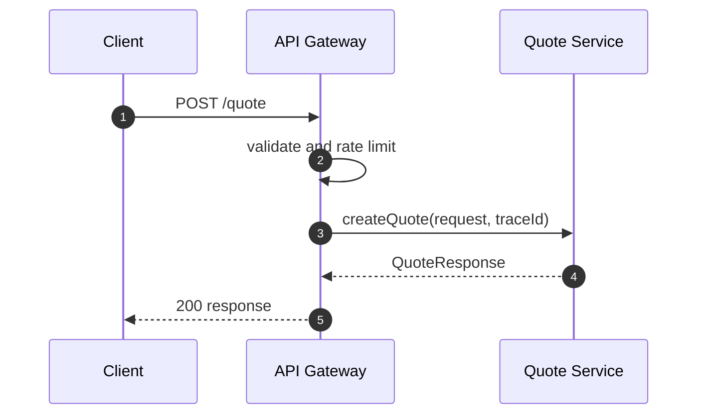
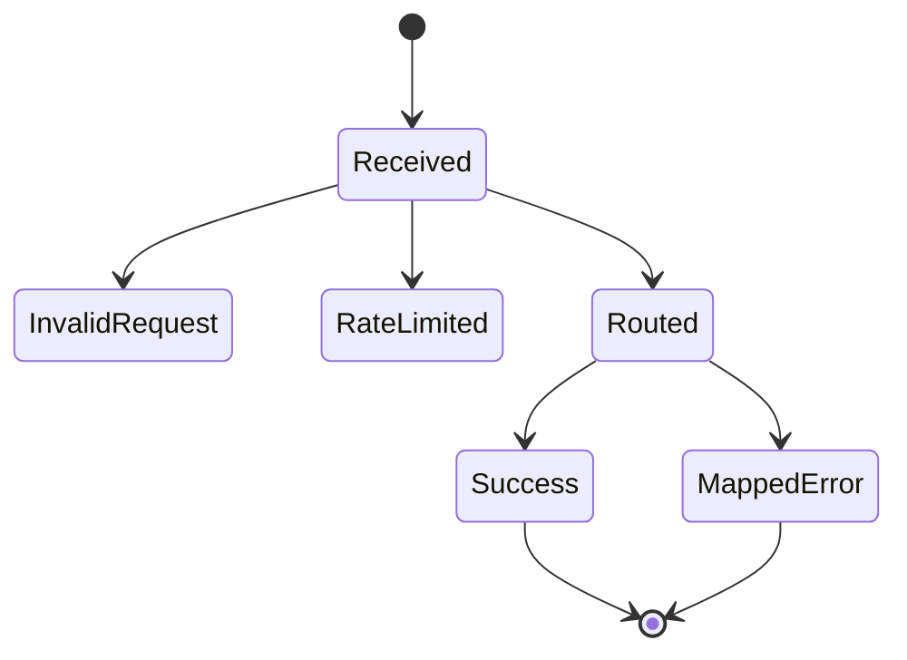

# Chapter 01: API Gateway

## Abstract

API Gateway 是 RFQ 系统的公开入口。它接收用户请求，执行基础校验、鉴权、限流、trace 注入和错误映射，然后把请求交给内部服务。Gateway 不应实现定价、风控或签名逻辑。

## Learning Objectives

- 明确 API Gateway 的职责边界。
- 定义公开 API 和错误响应。
- 说明 traceId、rate limit 和 metrics 的作用。
- 设计 Gateway 与 Quote/Execution Service 的调用关系。

## Background

RFQ API 需要同时服务前端、SDK 和集成方。公开接口必须稳定，并且不能泄露内部风控细节。Gateway 是保护内部服务的第一层。

## Problem Statement

如果 Gateway 直接处理业务逻辑，会导致代码边界混乱。如果 Gateway 缺少限流和输入校验，内部 Pricing、Risk 和 Signer 会暴露在异常流量下。

## Requirements

### Functional Requirements

- 暴露 `POST /quote`、`POST /submit`、`GET /quote/:id`、`GET /settlements/:id`、`GET /hedges/:id`、`GET /pnl`、`GET /health`、`GET /ready`、`GET /metrics`。
- 校验 required fields、unknown fields、地址、chainId、amount 和 slippageBps，并按 OpenAPI schema 拒绝错误 JSON primitive 类型；Gateway 不应把字符串数字、布尔值或数字形式的 uint 字段隐式转换后继续处理，直接调用共享 validator 时也不能把 boxed `String` 字段隐式解包后进入 regex 校验。
- 注入 traceId。
- 统一错误响应格式。
- 调用 Quote Service 和 Execution Service。

### Non-Functional Requirements

- 公开 API 需要限流。
- 错误码稳定且可观测。
- health 和 readiness 分离：`/health` 只表示进程存活，`/ready` 表示关键组件已经可服务；当依赖 degraded 时返回 HTTP 503 和组件状态。
- metrics 不应阻塞业务请求。

## Existing Solutions

Node.js 服务可以使用 NestJS 或 Fastify。当前实现选择 Fastify，因为启动开销低、插件边界清晰，并允许 gateway composition root 直接组合同步报价链路与独立 worker 所共享的模块。

## Trade-Off Analysis

Fastify 更轻量，但需要自行约束模块结构；NestJS 提供更多框架级组织能力，但引入额外容器和样板。本项目通过显式 composition root、模块接口与独立 worker 入口维持边界，因此当前没有仅为框架一致性迁移 NestJS 的收益。

## System Design

## Architecture Diagram

Gateway 是公开边界，内部服务不直接暴露公网。Signer Service 不允许由 Gateway 直接调用。

## Sequence Diagram

## State Machine

## Data Model

Gateway 只处理 DTO：`QuoteRequest`、`QuoteResponse`、`SubmitQuoteRequest`、`ErrorResponse`。它不拥有业务数据库写模型。

## API Design

OpenAPI 是公开接口来源。Gateway 实现必须对齐 `docs/api/openapi.yaml` 和 `docs/api/errors.md`。

## Engineering Decisions

- `backend/src/main.ts` is a process-only entrypoint: it re-exports `buildServer()` for tests, binds the listen socket and installs signal handling. `backend/src/runtime/gateway-application.ts` is the bounded composition root for shared stores/services and lifecycle hooks, delegating HTTP policy to `backend/src/api/http-boundary.ts` and endpoints to `backend/src/api/trading-routes.ts` plus the admin route registrars. `backend/src/runtime/gateway-market-data.ts` owns cache、CEX monitor、price updater and durable snapshot-sampler lifecycle. `backend/src/runtime/gateway-runtime.ts` owns `BuildServerOptions` validation and gateway dependency selection, while `backend/src/runtime/market-runtime.ts` owns market data、pricing、token-registry and risk-policy configuration. `make api-composition-check` caps `main.ts` at 100 lines and the application composition root at 350 lines, and rejects direct endpoint registration in both files.
- Gateway 不直接调用 Signer。
- Gateway 不返回内部 risk threshold、policyVersion、internal reasonCode、inventory limit、toxic-flow score 或 pricing adjustment breakdown；这些字段只能进入审计日志、指标标签和运维排障上下文。
- Gateway successful response bodies must be closed field sets matching OpenAPI for `HealthResponse`, `ReadinessResponse`, `QuoteResponse`, `SubmitQuoteResponse`, `QuoteStatus`, `SettlementEventStatus`, `HedgeIntentStatus`, `PnlSummary` and nested `PnlTradeRecord`; the main RFQ API flow test asserts exact response keys so internal routing, risk, hedge, settlement or PnL fields cannot leak to public clients.
- Gateway error response bodies must be closed `ErrorResponse` field sets containing only `code`, `message` and `traceId`; validation errors, missing resources, framework parser errors and internal errors are covered by the closed error response test so internal exception details or framework fields cannot leak to public clients.
- traceId 必须贯穿后端调用链；当前 Fastify gateway 在 `onRequest` hook 中为所有 HTTP 响应写入 `x-trace-id`，错误响应 body 的 `traceId` 必须与该 header 保持一致。调用方传入的 `tr_` 前缀 `x-trace-id` 只有在长度不超过 128 且只包含字母、数字、`.`、`_`、`:`、`-` 时才会被回显，否则 gateway 回退到内部生成的 `tr_<request.id>`。
- Fastify parser 和框架级错误必须经过统一 error handler 映射为 `ErrorResponse`；malformed JSON 返回 `INVALID_REQUEST`/400，body too large 返回 `INVALID_REQUEST`/413，unsupported content type 返回 `INVALID_REQUEST`/415。框架错误映射只信任 error 对象自有的 `code` 和 `statusCode` 字段，避免原型污染或继承字段把内部异常伪装成 parser/body-limit 错误。
- Standalone server startup validates `HOST` and `PORT` before calling Fastify `listen`; `HOST` defaults to `127.0.0.1` without whitespace and `PORT` defaults to 3000 with a required base-10 integer range of 1 to 65535.
- Gateway startup reads environment configuration only from own fields. Prototype-backed `HOST`, `PORT`, signer, TTL, body-limit, CORS, HSTS or trust-proxy values are treated as unset before defaults or production-required checks are applied, so an embedded process-like object or polluted environment prototype cannot silently change listen, signer, quote lifetime or browser security behavior.
- `RFQ_BODY_LIMIT_BYTES` 控制 gateway 接收的最大 JSON body，默认 32768 bytes，启动时必须校验为 1024 到 1048576 的 base-10 integer，避免 `1e6`、`32768.0` 或 `0x8000` 这类非十进制字面量消耗 parser 和内存资源。
- Direct `buildServer(options)` embedding requires a non-array options object, rejects inherited supported option fields, uses the same fail-fast runtime bounds for `bodyLimitBytes` and `quoteTtlSeconds`, rejects non-boolean `logger`, `enableHsts` or `trustProxy` values, and requires `rateLimit` to be `false` or an object whose partial rate-limit fields are own fields before creating rate-limit state. Tests may inject a validated `rateLimiter`, but cannot provide it together with `rateLimit`. This prevents tests, benchmark harnesses or embedded deployments from bypassing the env reader with unsafe direct options or prototype-backed dependency injection.
- `RFQ_CORS_ALLOWED_ORIGINS` 控制浏览器来源 allowlist，默认允许本地 Vite 前端 `http://localhost:5173`。Gateway 在启动期只接受 HTTP(S) URL origin，拒绝 path、query、fragment、credentials 和 wildcard，并用 `URL.origin` 归一化大小写、默认端口和重复项。Gateway 只为匹配来源写入 `access-control-allow-origin`；预检请求来源不匹配时返回结构化 `INVALID_REQUEST`/403。
- `RFQ_API_KEY_CONFIG_JSON` 在非本地环境是必填 Secret。每个 `keyId.secret` 只持久化 `SHA-256(secret)`，unknown key id 也执行固定 dummy digest 比较；所有认证失败统一为 `AUTHENTICATION_REQUIRED`/401。Route scope 固定为 `/quote -> quote:write`、`/submit -> submit:write`、状态查询 `-> status:read`、`/pnl -> pnl:read`、读取 quote control `-> admin:read`、更新 quote control `-> admin:write`，scope 不足返回 `AUTHORIZATION_DENIED`/403。交易客户端不得持有 admin scope；探针、metrics 和 CORS preflight 不要求 key，但应由集群网络边界限制访问。
- Gateway 为所有响应写入 baseline security headers：`cache-control: no-store`、`x-content-type-options: nosniff`、`x-frame-options: DENY`、`referrer-policy: no-referrer` 和限制性的 `permissions-policy`。`RFQ_ENABLE_HSTS` 只应在 HTTPS 入口后开启，开启后写入 `strict-transport-security`。
- Standalone backend process registers graceful shutdown handlers for `SIGTERM` and `SIGINT`; the first signal closes Fastify and sets process exit code, while duplicate signals do not trigger duplicate close attempts.
- Gateway uses a not-found handler so unknown routes and unsupported HTTP methods return structured `INVALID_REQUEST`/404 responses instead of Fastify default error objects.
- Status endpoint path identifiers are part of the public contract: OpenAPI marks `quoteId`, `hedgeOrderId` and `settlementEventId` as primitive-string `SafeIdentifier` values with 1-128 characters matching `[A-Za-z0-9_:-]`, and the Gateway rejects non-primitive, blank, unsafe or overlong decoded values before any store lookup.
- `/ready` 当前检查 market data freshness、routing probe、pricing probe、risk probe、signer sign/verify probe，以及 quote repository、Redis rate-limit store、inventory、execution/hedge store、submit reservation store、settlement event store、PnL store 和 metrics exporter 的轻量 health probe。stale snapshot 会让 `marketData` 组件变为 `degraded`；routing、pricing 或 risk probe 失败会让 `routing`、`pricing` 或 `risk` 组件变为 `degraded`；signer 无法签名或签名无法被同一 trusted signer 验证时，`signer` 组件变为 `degraded`；Redis `PING` 失败会让 `rateLimitStore` 变为 `degraded`；hedge 或 submit reservation 探针失败都会让 `execution` 组件变为 `degraded`；其他存储依赖探针失败时对应组件变为 `degraded`，用于阻止 Kubernetes 在错误价格输入、不可路由、不可签名、不可定价、不可风控、无法全局限流或关键状态依赖不可用时继续导流。`ReadinessServiceConfig` 的 required own `maxSnapshotAgeMs` / `maxSnapshotFutureSkewMs` 和 nested probe payload required fields 在构造期 fail fast，freshness 字段必须是正安全整数，避免 inherited config fields 或错误 freshness 参数让实例永久 ready、永久 degraded，或静默替换 probe payload；`ReadinessService` snapshots `ReadinessServiceConfig` at construction after validation，避免外部调用方在启动后篡改 freshness 或 probe payload 并静默改变 `/ready` 结果。
- `quoteControl` 是独立 readiness 组件：每次 probe 读取并验证全局共享状态，同时以轻量子查询证明 migration 019 的 pair 控制表存在，并刷新 `rfq_quote_paused`；状态可读时保持 `ok`，即使当前处于有意 pause，存储、表或状态格式异常时变为 `degraded`。这一区分避免把运维暂停误报为基础设施故障，同时保证重启副本的 gauge 快速收敛，且无法证明 enabled 时所有新 quote fail closed。
- `ReadinessService` snapshots its dependency map at construction. Required dependency entries must be own fields before method validation, so inherited deps cannot silently replace market data, routing, pricing, risk, signer, storage or metrics probes used by `/ready`; mutating the original deps object after startup must not replace those probes either.
- `ReadinessService` validates dependency methods at construction. Missing readiness probe methods such as `marketDataService.getSnapshot`, `routingEngine.selectRoute`, `pricingEngine.price`, `riskEngine.evaluate`, `signerService.verifyQuoteSignature`, or storage `checkHealth()` methods must fail during startup instead of letting `/ready` return misleading component status.
- `ReadinessService` rejects malformed config, inherited config fields, malformed dependency map, inherited dependency entries and malformed dependency entries before reading freshness fields or probe methods, so readiness cannot start with array-shaped or prototype-backed dependency payloads that later produce misleading degraded components.
- Fastify 使用统一 `RateLimiter` 接口保护 `/quote`、`/submit`、状态查询以及全局/pair quote-control 管理接口；默认窗口为 60 秒，默认限额为 quote 120 requests / 60 seconds、submit 60 requests / 60 seconds、status 300 requests / 60 seconds。Local development 可使用 `InMemoryRateLimiter`，但任何非本地 `NODE_ENV` 都强制 `RFQ_RATE_LIMIT_BACKEND=redis` 并要求合法 `RFQ_REDIS_URL`。`RedisRateLimiter` 使用单个 Lua script 原子读取计数和 TTL、创建 fixed window、在阈值内递增并返回决策；超限后不继续递增计数。Malformed config、dependency、script result、runtime input 和 unsafe client identity 都会在写状态或返回决策前被拒绝；配置在构造期 snapshot。默认 `RFQ_TRUST_PROXY=false`，限流身份使用直接 socket IP；只有可信代理清洗 `x-forwarded-for` 后才可启用代理身份。trusted forwarded identity exceeding 128 characters or outside `[A-Za-z0-9_.:-]` returns `INVALID_REQUEST`/400 before limiter state mutation。Redis error 不会 fail open，而是返回 `RATE_LIMIT_UNAVAILABLE`/503，并通过 `rateLimitStore` readiness 和 `rfq_dependency_status` 暴露；正常超限保持 `RATE_LIMITED`、HTTP 429、`Retry-After` 和 `x-ratelimit-remaining` 契约。

## Failure Scenarios

- 请求格式错误、malformed JSON、unsupported content type 或 body too large：返回 `INVALID_REQUEST`，并按具体场景使用 HTTP 400、413 或 415。
- CORS preflight origin 不在 allowlist：返回 `INVALID_REQUEST` 和 HTTP 403，不写入 allow-origin header。
- Unknown route or unsupported method：返回 `INVALID_REQUEST` 和 HTTP 404，仍包含 traceId 和 security headers。
- API key 缺失、格式错误、secret 错误、unknown 或 expired：返回同一个 `AUTHENTICATION_REQUIRED`/401；scope 不足返回 `AUTHORIZATION_DENIED`/403，均不得记录 plaintext key。
- Quote control paused：`POST /quote` 先检查全局状态，再对已验证请求检查规范化的 `chainId + token pair` 状态；任一 paused 都在定价和签名前返回 `QUOTE_PAUSED`/503。Pair 控制对两个 token 方向同时生效，既有 signed quote 的 `/submit` 和状态查询不被该开关阻断。
- Quote control store unavailable：`POST /quote` 返回 `QUOTE_CONTROL_UNAVAILABLE`/503 且 `/ready.components.quoteControl=degraded`，不得退回 pod-local enabled 默认值。管理更新 version 冲突返回 `QUOTE_CONTROL_CONFLICT`/409，操作员必须重新读取后复核。
- 限流：返回 HTTP 429、`RATE_LIMITED` 和 `Retry-After`。
- Redis rate-limit store unavailable：受保护端点 fail-closed 返回 HTTP 503、`RATE_LIMIT_UNAVAILABLE` 和 traceId，`/ready.components.rateLimitStore` 同时变为 `degraded`；不得临时切换到各 pod 独立内存桶继续承接生产流量。
- Submit reservation store unavailable：`POST /submit` fail-closed 返回 HTTP 503、`SUBMIT_RESERVATION_UNAVAILABLE` 和 traceId，`/ready.components.execution` 同时变为 `degraded`；不得绕过租约或临时退回各 pod 独立内存 reservation。
- Market data unavailable、invalid 或 stale：`/ready` 返回 HTTP 503/degraded，`POST /quote` 返回 `MARKET_DATA_UNAVAILABLE`。
- Routing, pricing or risk readiness probe failed：`/ready` 返回 HTTP 503/degraded，并通过 `rfq_dependency_status` 指明 `routing`、`pricing` 或 `risk`；`POST /quote` 仍会在实际报价时返回 `ROUTING_UNAVAILABLE`、`PRICING_UNAVAILABLE` 或 fail-closed `RISK_REJECTED`。
- Signer readiness probe failed：`/ready` 返回 HTTP 503/degraded，`POST /quote` 仍会在实际签名时返回 `SIGNER_UNAVAILABLE`。
- Storage or execution health probe failed：`/ready` 返回 HTTP 503/degraded，并通过 `rfq_dependency_status` 指明 quote repository、execution、settlement event store、PnL 或 metrics 组件；组件恢复前不应把新 quote 流量导入该实例。
- Quote status store unavailable：`GET /quote/:id` 返回 HTTP 503、`QUOTE_STORE_UNAVAILABLE` 和 traceId，不能落入 Fastify 默认 500。
- Hedge status store unavailable：`GET /hedges/:id` 返回 HTTP 503、`HEDGE_STORE_UNAVAILABLE` 和 traceId，区分查询依赖故障与 `HEDGE_NOT_FOUND`。
- Settlement event store unavailable：`GET /settlements/:id` 返回 HTTP 503、`SETTLEMENT_EVENT_STORE_UNAVAILABLE` 和 traceId，区分索引器/存储故障与 `SETTLEMENT_EVENT_NOT_FOUND`。
- Status endpoints reject unsafe dynamic identifiers before store lookup: non-primitive, blank `quoteId`, `hedgeOrderId` or `settlementEventId`, identifiers longer than 128 characters, or identifiers outside letters, numbers, underscore, colon and hyphen return `INVALID_REQUEST` instead of being treated as a missing resource or dependency failure.
- PnL store unavailable：`GET /pnl` 返回 HTTP 503、`PNL_STORE_UNAVAILABLE` 和 traceId；`POST /submit` 中 settlement 已应用后的 PnL 归因写入失败不回滚 settlement。
- Quote Service 超时：返回 503。
- 内部异常：返回 `INTERNAL_ERROR` 和 traceId。

## Security Considerations

Gateway 需要输入校验、限流、CORS allowlist、安全响应头和日志脱敏。不能把签名服务或内部管理接口暴露到公网。

## Performance Considerations

Gateway 应保持薄层，不执行重计算。序列化和校验必须足够快，避免成为 quote path 瓶颈。

## Testing Strategy

测试 request validation、API key 摘要、expiry、scope、生产必填、认证限流身份、SDK header 隔离、Fastify parser error mapping、not-found handler、body limit、CORS allowed origin、CORS preflight rejection、security headers、HSTS toggle、graceful shutdown signal handling、error mapping、内存与 Redis rate limit、Redis Lua decision validation、Redis failure fail-closed、health、readiness、metrics、`/quote` 路由和状态查询，以及成功和失败响应的 `x-trace-id` 传播。

## Interview Notes

API Gateway 的关键是保护内部服务和稳定公开契约，不是堆业务逻辑。

## Summary

Gateway 是 RFQ 后端的公开入口，负责协议层和保护层。业务决策应下沉到明确服务。

## References

- Fastify
- OpenAPI
- API rate limiting
