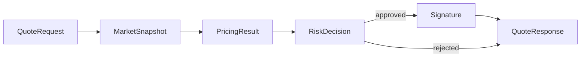
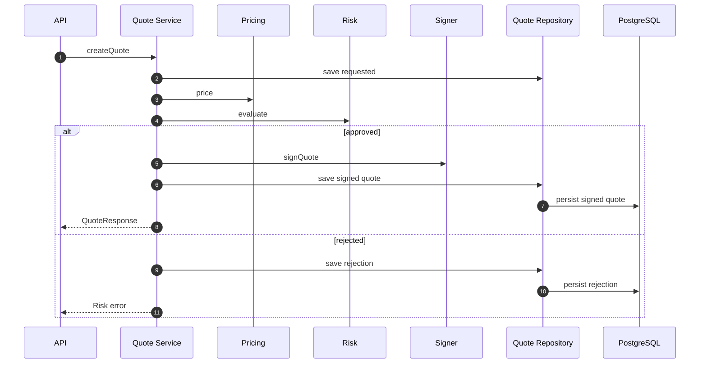
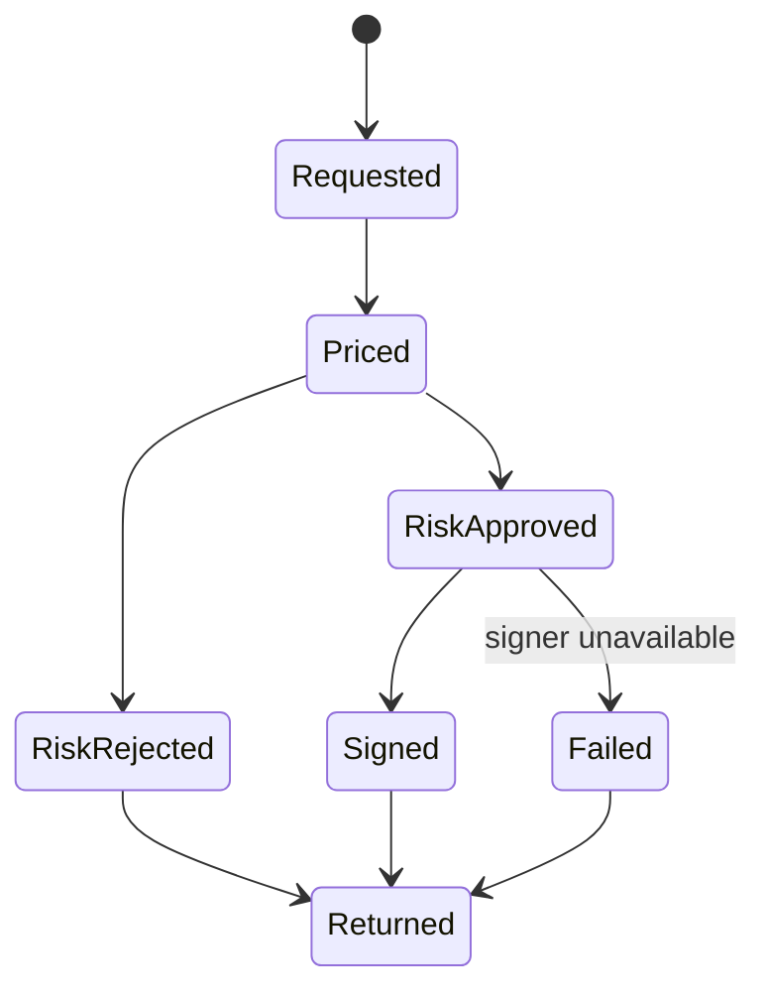

# Chapter 02: Quote Service

## Abstract

Quote Service 是 `/quote` 实时路径的编排者。它读取 market snapshot，调用 Pricing Engine，调用 Risk Engine，在风险通过后调用 Signer Service，并通过 Quote Repository 持久化 quote、snapshotId、pricingVersion 和 riskPolicyVersion。Quote Service 不能绕过 Risk Engine。

## Learning Objectives

- 理解 Quote Service 的编排职责。
- 明确 market data、pricing、risk、signer 的调用顺序。
- 定义 quote persistence 和 status。
- 识别 quote path 的性能瓶颈。

## Background

用户只看到一次 `/quote` 请求，但后端内部涉及多个决策步骤。Quote Service 把这些步骤串起来，并负责生成可审计上下文。

## Problem Statement

如果 Quote Service 未记录中间决策，后续无法解释报价。如果 Quote Service 在 signer 前没有强制风险检查，就破坏核心不变量。

## Requirements

### Functional Requirements

- 接收 `QuoteRequest`。
- 获取 `MarketSnapshot`。
- 调用 Pricing Engine。
- 调用 Risk Engine。
- 仅在风险批准后调用 Signer Service。
- 返回 `QuoteResponse`。
- 持久化 quote 和拒绝原因。

### Non-Functional Requirements

- quote path p99 延迟可监控。
- 每个 quote 有 `quoteId` 和 `snapshotId`。
- 风控拒绝必须可审计。
- Signer 不可用时不能返回签名。

## Existing Solutions

简单实现可能把定价、风控和签名写在一个函数里。生产系统需要编排层和决策层分离。

## Trade-Off Analysis

编排层增加代码结构，但让每个模块可测试、可替换。对于 RFQ，这是必要复杂度。

## System Design



## Architecture Diagram

Quote Service 依赖 Market Data、Pricing、Risk、Signer、Quote Repository 和 Metrics。当前代码使用 `InMemoryQuoteRepository` 跑通本地 skeleton；生产版应以同一接口替换为 PostgreSQL repository，并可用 Redis 做短 TTL quote cache。当前实现会在 pricing 和 signing 之前校验 market snapshot 的 `observedAt`，超过 freshness window 的 stale market data 或明显来自未来的 snapshot 会返回 `MARKET_DATA_UNAVAILABLE`，避免签出过期价格或接受错误时钟的数据源。

## Sequence Diagram



## State Machine



## Data Model

Quote record includes `quoteId`, `chainId`, `user`, `tokenIn`, `tokenOut`, `snapshotId`, `pricingVersion`, `riskPolicyVersion`, `signature`, `deadline`, `nonce`, `status`, `rejectCode` and optional `txHash`, `settlementEventId`, `hedgeOrderId`, `pnlId`.

## API Design

Internal interface:

```ts
createQuote(request: QuoteRequest): Promise<QuoteResponse>
getQuoteStatus(quoteId: string): Promise<QuoteStatusResponse | undefined>
markQuoteStatus(quoteId, status, metadata): Promise<void>
```

## Engineering Decisions

- Risk before signing 是强制顺序。
- Quote Service 生成 quoteId。
- `createQuote()` revalidates and snapshots the quote request at the service boundary before market data, routing, pricing, inventory projection, risk evaluation, signer or quote store side effects. Direct service callers must get the same malformed-request behavior as `POST /quote`.
- `requireSubmittableSignedQuote()` revalidates the submit quote and canonical signature at the service boundary before quote store lookup or signer verification. It allows expired-but-well-formed quotes through validation so the existing signed quote record can still be marked `expired` before returning `QUOTE_EXPIRED`.
- Rejected quote 也要 best-effort 记录，但记录失败不能掩盖原始 risk decision。
- Risk Engine 抛错时按 fail-closed 处理，返回 `RISK_REJECTED`，内部拒绝原因为 `RISK_ENGINE_UNAVAILABLE`，不调用 Signer。
- Risk rejected 后 rejected 状态持久化失败时，API 仍返回原始 `RISK_REJECTED`，不调用 Signer；遗留的 `requested` quote 由 reconciliation 处理。
- Requested and rejected quote persistence validates `quoteId`, `snapshotId`, request chain id, user/token addresses, distinct token pair, positive `amountIn`, bounded `slippageBps`, and non-empty reject metadata before writing quote state. Direct repository calls must not be able to persist malformed request or rejection records.
- PostgreSQL requires `quotes.snapshot_id` for every persisted quote and keeps it as a foreign key to `market_snapshots.id`, so requested, rejected, signed, failed, expired, submitted and settled records remain replayable from their pricing snapshot.
- Signer failure 映射为 503，并 best-effort 将已 requested 的 quote 标记为 `failed`，`errorCode` 记录 `SIGNER_UNAVAILABLE`，避免状态长期停留在 `requested`。
- 如果 signer failure 后的 failed 状态持久化也失败，API 仍保留原始 `SIGNER_UNAVAILABLE`，不能用 `QUOTE_STORE_UNAVAILABLE` 掩盖真实故障；遗留的 `requested` quote 由 reconciliation 从审计日志和 signer error metric 中恢复。
- Signed quote TTL 由 `RFQ_QUOTE_TTL_SECONDS` 控制，默认 30 秒，启动时必须校验为 1 到 3600 的整数。TTL 过长会增加 stale price 被执行的窗口，TTL 过短会降低钱包确认和链上提交成功率。
- `QuoteServiceConfig` 在构造期 fail fast：`maxSnapshotAgeMs`、`maxSnapshotFutureSkewMs` 和 `quoteTtlSeconds` 必须是正安全整数。这样可以避免直接依赖注入或测试路径绕过 env reader 后生成永不过期、立即过期或无法正确判断 freshness 的 quote。
- `QuoteService` snapshots `QuoteServiceConfig` at construction after validation. External callers must not be able to mutate snapshot freshness windows or quote TTL after construction and silently change quote validity.
- `QuoteService` snapshots its dependency map at construction. External callers must not be able to replace market data, routing, pricing, inventory, risk, signer or quote repository dependencies by mutating the original deps object after the quote service has been created.
- `failed` quote 是终态，后续 `/submit` 必须返回 `QUOTE_FAILED`，不能重新进入 settlement path。
- Quote Repository 抛错时返回 `QUOTE_STORE_UNAVAILABLE`，避免 repository dependency failure 落入通用 500；签名前持久化失败必须阻断 signer。
- Quote persistence 通过 `QuoteRepository` 抽象，避免编排层直接绑定 PostgreSQL 或内存 Map。
- Requested quote storage is write-once by `quoteId`: exact replays are no-ops, but a different request or snapshot is rejected. Rejected quote storage must start from the matching requested quote and may only replay the exact same rejection payload.
- Quote status lookup persists `expired` when a signed quote is read after its deadline, and `requireSubmittableSignedQuote()` rejects expired records before signature verification. Expiry is therefore a service invariant, not only an HTTP request validation detail.
- `markStatus()` is intentionally narrow: requested quotes cannot be marked submitted, settled or expired through the status updater; requested-to-signed/rejected uses dedicated persistence methods, and requested-to-failed uses `markFailed()` for signer failures.
- `markFailed()` is intentionally narrow: only requested or signed quotes can enter `failed`; an already failed quote may replay the same `errorCode`, but a different failure reason is rejected so incident history cannot be overwritten.
- Quote Repository enforces terminal status invariants: `failed`, `rejected` and `expired` quotes cannot transition to submitted or settled, and `settled` quotes cannot transition back to submitted or failed. A settled quote may receive idempotent metadata completion, such as a late `pnlId`, without changing the terminal status.
- Quote status metadata is validated before persistence: `txHash` must be a 32-byte hex string, and `settlementEventId`、`hedgeOrderId`、`pnlId` must be non-empty when present. Invalid metadata must fail before `/quote/:id` can expose malformed settlement, hedge or PnL pointers.
- Quote status `txHash` is normalized to lowercase before persistence so `/quote/:id` and settlement reconciliation use the same canonical transaction hash shape.
- Quote status pointers are immutable once set. Replaying the same `txHash`, `settlementEventId`, `hedgeOrderId` or `pnlId` is idempotent, but a different value is rejected so reconciliation cannot silently point a quote at another settlement, hedge or PnL record.
- Quote Repository requires `txHash` and `settlementEventId` before a quote can become `submitted` or `settled`; in-memory status transitions must not create a settlement lifecycle state without chain pointers.
- Non-settlement status updates such as `expired` must not include or retain `txHash`, `settlementEventId`, `hedgeOrderId`, or `pnlId`. This mirrors the database payload consistency constraint and prevents status pages from exposing post-trade pointers on unfilled quotes.
- Failed quote metadata is validated before persistence: `errorCode` must be non-empty so status pages, reconciliation jobs and incident metrics can recover the actual failure reason instead of a terminal state with no root cause.
- The PostgreSQL schema mirrors these invariants with quote status payload consistency checks: signed payload fields must be all present or all absent, requested/rejected states must not carry signed payload fields, signed lifecycle states must keep the signed quote payload, `pricing_version` / `risk_policy_version` / `reject_code` must be non-empty whenever present, only rejected/failed states may carry `reject_code`, non-settlement states cannot expose settlement pointers, and submitted/settled states must keep `tx_hash` plus `settlement_event_id` while `hedge_order_id` and `pnl_id` remain optional for best-effort post-trade recovery.
- PostgreSQL stores `quotes.deadline` as BIGINT Unix seconds in the JavaScript safe integer range, matching `SignedQuote.deadline`, EIP-712 `uint256 deadline`, signer verification and settlement verification. It must not be stored as `timestamptz`, because timezone conversion would obscure the exact signed integer.
- Signed quote storage enforces the same `chainId:user:nonce` uniqueness as the database partial unique index. An already signed quote may only replay the exact same signed payload, including snapshot, pricing/risk versions and signature; a different payload is rejected. `saveSigned()` must not move submitted, settled, failed, rejected or expired quotes back to `signed`.
- When `saveSigned()` upgrades a requested quote, it must bind to the same requested `quoteId`, `snapshotId`, chain, user, token pair and `amountIn`; a signer or repository caller cannot use an existing requested quote id for a different request.
- `InMemoryQuoteRepository` returns defensive copies from signed quote lookup operations so submit, status, reconciliation and tests cannot mutate the stored signed quote payload or settlement pointers by editing a returned `QuoteRecord`.
- `QuoteIdentityGenerator` uses Web Crypto `getRandomValues` for the per-process 64-bit instance component of quoteId/nonce generation. The implementation must fail fast when Web Crypto is unavailable and must not fall back to `Math.random()`, because weak random instance ids can collide across hot restarts or horizontally scaled API replicas and weaken replay/audit assumptions.
- Signed quote persistence validates `quoteId`, `snapshotId`, pricing/risk versions, chain id, user/token addresses, distinct token pair, positive uint amount fields, positive deadline, `amountOut >= minAmountOut` and a 65-byte canonical low-s EIP-712 signature before writing the `chainId:user:nonce` index. Invalid signed quote records must fail before they can become submittable state.
- `/submit` 查找本地签发记录时必须使用 `chainId:user:nonce`，不能只用 `user:nonce`。链上合约的 nonce 是 per-user，但链下系统还负责多链 quote 状态映射；把 `chainId` 纳入索引可以避免同一用户在不同链上使用相同 nonce 时覆盖本地记录。

## Failure Scenarios

- Routing unavailable：返回 `ROUTING_UNAVAILABLE`，不进入 pricing/risk/signer，不返回签名。
- Pricing unavailable：返回 `PRICING_UNAVAILABLE`，不调用 Signer，不返回签名。
- Risk rejected：返回 `RISK_REJECTED`。
- Risk engine unavailable：返回 `RISK_REJECTED`，记录 `RISK_ENGINE_UNAVAILABLE`，不调用 Signer，不返回签名。
- Rejected quote persistence unavailable after risk rejection：仍返回 `RISK_REJECTED`，quote 可暂时停留在 `requested`，不调用 Signer。
- Signer unavailable：返回 `SIGNER_UNAVAILABLE`，quote 状态 best-effort 变为 `failed`。
- Failed status persistence unavailable after signer failure：仍返回 `SIGNER_UNAVAILABLE`，quote 可暂时停留在 `requested`，后续由 reconciliation 处理。
- Persistence failed：返回 `QUOTE_STORE_UNAVAILABLE`；如果发生在签名前，不调用 Signer，不返回签名。
- Status lookup persistence failed：`GET /quote/:id` 返回 `QUOTE_STORE_UNAVAILABLE`，保留 traceId，避免状态页或 SDK 收到非结构化 500。
- Market data unavailable、invalid、stale 或 future timestamp 超出允许 clock skew：不进入 routing/pricing/risk/signer，直接返回 `MARKET_DATA_UNAVAILABLE`。

## Security Considerations

Quote Service 不能接受客户端传入 risk decision。Signer request 必须包含 quoteId、snapshotId 和 risk context。

## Performance Considerations

同步路径应避免慢查询。Pricing 和 Risk 依赖的上下文应缓存或预计算。

当前仓库提供 `make benchmark-quote` 作为 quote path 的本地回归门禁。它使用 Fastify injection 对 `POST /quote` 执行固定样本请求，不绑定网络端口，默认 100 samples、p95 <= 50 ms、错误数为 0。该 benchmark 不替代生产压测，但能防止 Quote Service、Pricing、Risk、Signer 或 Repository 的代码改动引入明显本地延迟回归。

## Testing Strategy

测试 approved path、risk rejected、pricing failure、quote store failure、signer failure、persistence failure、requested/rejected quote persistence validation、expired quote persistence and submit rejection、terminal quote status invariants、quote status metadata validation、signed quote persistence validation、runtime config fail-fast 和 metrics。

## Interview Notes

Quote Service 是编排层，不是“大而全”的业务类。它的核心价值是强制顺序和保留审计上下文。

## Summary

Quote Service 连接用户请求与 signed quote，是后端实时路径的中心，但它不拥有所有业务决策。

## References

- RFQ quote lifecycle
- Service orchestration
