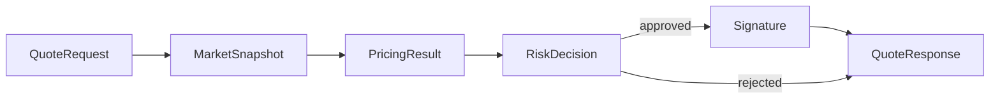
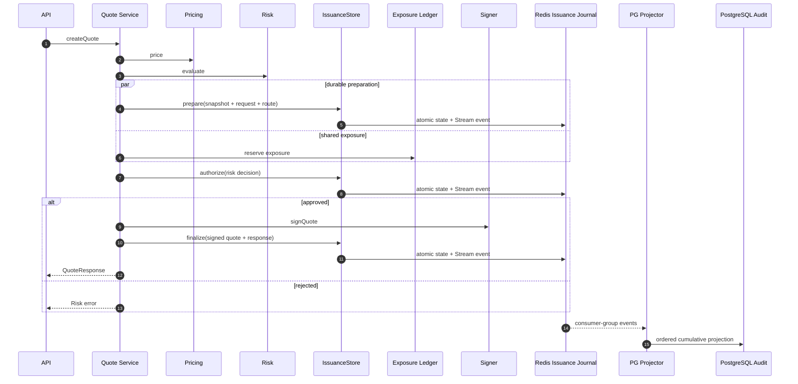
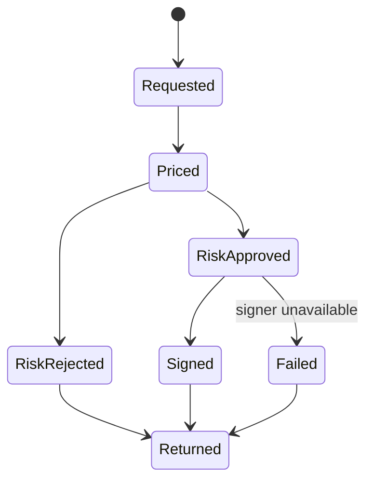

# Chapter 02: Quote Service

## Abstract

Quote Service 是 `/quote` 实时路径的编排者。它读取 market snapshot，调用 Pricing Engine，调用 Risk Engine，在风险通过后调用 Signer Service，并通过 Quote Repository 持久化 quote、snapshotId、pricingVersion 和 riskPolicyVersion。Quote Service 不能绕过 Risk Engine。

## Learning Objectives

- 理解 Quote Service 的编排职责。
- 明确 market data、pricing、risk、signer 的调用顺序。
- 定义 quote persistence 和 status。
- 识别 quote path 的性能瓶颈。

## Background

用户只看到一次 `/quote` 请求，但后端内部涉及多个决策步骤。Quote Service 把这些步骤串起来，并负责生成可审计上下文。

## Problem Statement

如果 Quote Service 未记录中间决策，后续无法解释报价。如果 Quote Service 在 signer 前没有强制风险检查，就破坏核心不变量。

## Requirements

### Functional Requirements

- 接收 `QuoteRequest`。
- 获取 `MarketSnapshot`。
- 调用 Pricing Engine。
- 调用 Risk Engine。
- 仅在风险批准后调用 Signer Service。
- 返回 `QuoteResponse`。
- 持久化 quote 和拒绝原因。

### Non-Functional Requirements

- quote path p99 延迟可监控。
- 每个 quote 有 `quoteId` 和 `snapshotId`。
- 风控拒绝必须可审计。
- Signer 不可用时不能返回签名。

## Existing Solutions

简单实现可能把定价、风控和签名写在一个函数里。生产系统需要编排层和决策层分离。

## Trade-Off Analysis

编排层增加代码结构，但让每个模块可测试、可替换。对于 RFQ，这是必要复杂度。

## System Design



## Architecture Diagram

Quote Service 依赖 Market Data、MarketSnapshotStore、Pricing、Risk、Signer、Quote Repository、RiskDecisionStore 和 Metrics。无 `DATABASE_URL` 的本地开发使用 in-memory repositories；非本地 runtime 同时要求 PostgreSQL 与 Redis/Valkey。生产 composition 使用 `RedisQuoteIssuanceStore` 作为幂等、nonce 和 cumulative `prepared/authorized/finalized/failed` 热状态权威，Lua 原子转换同步追加 Stream，`QuoteIssuanceJournalMirror` 再有序投影 PostgreSQL。显式本地兼容模式保留 `PostgresQuoteIssuanceStore` 的三条 fused 语句；只要注入任一自定义 repository，就保留原有逐仓储路径，避免混用多套 ownership。当前实现会在 pricing 和 signing 之前校验 market snapshot 的 `observedAt`，该字段必须是 `Date.prototype.toISOString()` 生成的 canonical UTC ISO timestamp；超过 freshness window 的 stale market data、明显来自未来的 snapshot、date-only/natural-language timestamp 或会被 JavaScript 自动归一化的非法日期都会返回 `MARKET_DATA_UNAVAILABLE`，避免签出过期价格或接受错误时钟的数据源。

代码按职责拆分：`quote.service.ts` 只保留 quote/status/submit 编排；`quote-service-contract.ts` 定义并验证构造配置、依赖和 principal context；`quote-service-errors.ts` 负责稳定的依赖错误映射和 snapshot 可用性；`quote-service-result-validation.ts` 校验 routing、pricing、inventory、exposure/VaR 与 risk adapter 返回值。`make api-composition-check` 将编排文件限制在 600 行以内，并分别将 contract、errors、result-validation 边界限制在 250、100、500 行以内，防止跨层防御逻辑重新聚合成单一大类。

Quote Repository 同样采用显式职责边界：`quote-repository-contract.ts` 只定义持久化接口和记录类型，`quote-repository-invariants.ts` 集中输入校验、幂等和状态迁移不变量，内存与 PostgreSQL 实现必须复用同一组规则；`in-memory-quote.repository.ts` 只维护内存索引与状态，`postgres-quote-row.ts` 只负责 SQL 行映射，`postgres-quote.repository.ts` 负责连接、SQL 和并发控制，`quote.repository.ts` 作为兼容出口保留既有 import path。PostgreSQL 的 failed 写入使用状态条件更新，普通状态写入同时比较 lifecycle status 与全部 settlement pointers，避免先读后写窗口把并发结算或 reorg 修复覆盖。数据库一致性门禁读取这组组合源码，并限制各模块行数和依赖方向，避免契约、纯校验与有状态实现再次聚合。

## Sequence Diagram



## State Machine



## Data Model

Quote record includes `quoteId`, `chainId`, `user`, `tokenIn`, `tokenOut`, `snapshotId`, `pricingVersion`, `riskPolicyVersion`, `signature`, `deadline`, `nonce`, `status`, `rejectCode` and optional `txHash`, `settlementEventId`, `hedgeOrderId`, `pnlId`.

## API Design

Internal interface:

```ts
createQuote(request: QuoteRequest): Promise<QuoteResponse>
getQuoteStatus(quoteId: string): Promise<QuoteStatusResponse | undefined>
markQuoteStatus(quoteId, status, metadata): Promise<void>
```

## Engineering Decisions

- Risk before signing 是强制顺序。
- Quote Service 生成 quoteId。
- `QuoteService` rejects malformed config, inherited config fields, malformed dependency map, inherited required dependency entries, inherited optional `hedgeService`, and malformed dependency entries before reading runtime fields or service methods. A quote worker must fail at construction when market data, routing, pricing, inventory, risk, signer, quote store or optional hedge dependency envelopes are prototype-backed or array-shaped instead of starting a partially wired quote path.
- `createQuote()` revalidates and snapshots the quote request at the service boundary before market data, routing, pricing, inventory projection, risk evaluation, signer or quote store side effects. Direct service callers must get the same malformed-request behavior as `POST /quote`.
- 生产 Redis 路径在 base risk 计算后并发启动 issuance `prepare` 与 exposure reserve。prepare Lua 原子写入 cumulative quote hot state、idempotency quote binding 和 Stream event；只有两个操作都成功后才允许 `authorize`。若 prepare 失败而 exposure 已成功，服务先 best-effort release，再返回 `QUOTE_STORE_UNAVAILABLE`，不得调用 Signer。PostgreSQL exposure projector 在写外键子记录前等待 `prepared` projection marker，因此异步审计顺序不进入报价响应延迟，也不会产生可恢复的外键告警风暴。
- 自定义 repository 路径继续在 routing 前并行保存 market snapshot 与绑定 idempotency，再分别保存 requested quote 和 route decision。两种路径都保持相同 fail-closed 错误映射；Inventory skew 和两条 hedge-risk penalty 仍并发计算。
- 默认 fused 路径在 routing/pricing 失败时使用 legacy repository best-effort 补写 requested/route failure audit；自定义路径直接把已有 requested quote 标记为 `failed`。API 始终保留原始 `ROUTING_UNAVAILABLE` 或 `PRICING_UNAVAILABLE`。
- `QuoteService` validates `RoutePlan` returned by the routing adapter before inventory skew, pricing, risk evaluation or signing. The route must be an own-field envelope with only `routeId`, `venue`, `tokenIn`, `tokenOut` and `expectedLiquidityUsd`; `routeId` must be a safe identifier, `venue` must be `internal_inventory`, token pair must match the validated quote request, and expected liquidity must be a canonical positive uint string. Malformed route output is treated as `ROUTING_UNAVAILABLE`, best-effort marks the requested quote as `failed`, and blocks pricing plus signer access.
- Internal inventory `routeId` uses the full normalized `tokenIn` and `tokenOut` addresses plus `chainId`; address prefixes are not sufficient because two assets can share the same first bytes. 默认 fused 路径把 route decision 纳入后续 `prepare`；自定义 repository 路径在 route validation 后调用 `QuoteRepository.saveRouteDecision()`。持久化失败映射为 `QUOTE_STORE_UNAVAILABLE` 并阻断 signer。
- Route attribution is immutable and quote-bound. `route_id`、`route_venue`、`route_expected_liquidity_usd` and `route_decided_at` are either all absent or all present; the quote principal、snapshot and directional token pair must match the requested record. Exact replays are no-ops, while changed route ids, venue or liquidity evidence are rejected even after the quote has progressed. PostgreSQL emits `quote.routing.v1` once when the route becomes durable, so risk-rejected and later-failed quotes retain the same routing evidence as signed quotes.
- `QuoteService` validates pricing adjustment inputs before calling Pricing Service. `InventoryService.calculateQuoteSkewBps()` must return a safe integer with absolute value at most 10000 bps; optional `HedgeService.quoteRiskPenaltyBps()` must return a non-negative safe integer no greater than 10000 bps; and their combined adjustment must still be within +/-10000 bps. Malformed inventory skew, malformed hedge penalty or an overflowing combined adjustment is treated as `PRICING_UNAVAILABLE`, best-effort marks the requested quote as `failed`, and blocks pricing plus signer access.
- `QuoteService` validates `PricingResult` returned by the pricing adapter before inventory projection, risk evaluation or signing. The result must be an own-field envelope with only `amountOut`, `minAmountOut`, `spreadBps`, `sizeImpactBps`, `marketSpreadBps`, `inventorySkewBps`, `volatilityPremiumBps`, `hedgeCostBps` and `pricingVersion`; amount fields must be canonical positive uint strings, `amountOut >= minAmountOut`, non-skew bps fields must be bounded non-negative integers, inventory skew must be bounded by 10000 bps in either direction, and `pricingVersion` must be a safe identifier. Malformed pricing output is treated as `PRICING_UNAVAILABLE`, best-effort marks the requested quote as `failed`, and blocks signer access.
- `QuoteService` validates `InventoryProjection` returned by the inventory adapter before risk evaluation or signer access. The projection must contain only own `tokenIn` and `tokenOut` positions; each position must contain own `chainId`, `token` and `balance`, match the validated quote request chain/token, and expose `balance` as a bigint. Malformed projected inventory is treated as risk unavailable: Quote Service records a rejected risk decision with `RISK_ENGINE_UNAVAILABLE`, persists a rejected quote when possible, and blocks custom risk adapters plus Signer.
- `requireSubmittableSignedQuote()` revalidates the submit quote and canonical signature at the service boundary before quote store lookup or signer verification. It allows expired-but-well-formed quotes through validation so the existing signed quote record can still be marked `expired` before returning `QUOTE_EXPIRED`. The internal `allowExpired` validation option must be an own boolean field, so prototype-backed direct callers or string flags cannot bypass TTL checks.
- `QuoteService` persists risk authorization before signer access. 生产 Redis 路径以 `authorize` Lua 原子推进 cumulative state 并追加包含完整 approved/rejected evidence 的事件；PostgreSQL 兼容路径仍使用 fused SQL，自定义路径写 `RiskDecisionStore`。Approved 和 rejected decision 返回记录都必须与输入的 quote、decision、reason 和 policy 完全一致；approved 记录的 `riskDecisionId`、`policyVersion` 与网关 `traceId` 随后作为不可拆分的授权上下文传入远程 Signer。审计失败或畸形/冲突证据按 `QUOTE_STORE_UNAVAILABLE` 处理、释放已完成的 exposure reservation，并阻断 Signer。
- 签名成功后，生产 Redis 路径以 `finalize` Lua 原子写 signed payload、nonce index、terminal idempotency response 和 cumulative Stream event；自定义路径继续调用 `saveSigned` 和独立 idempotency completion。报价成功返回不等待 PostgreSQL projection。`GET /quote/:id` 仅在 projection 落后时读取 hot status；`POST /submit` 则等待同一 quote 的 `finalized` marker，确保后交易 PostgreSQL 外键和查询边界已经可见。
- approved risk decision 进入 Signer 前，生产 runtime 必须从已经预热的 Treasury hot view 读取目标 token 的新鲜 balance/block evidence，再将证据与 `amountOut` 交给 Redis/Valkey quote exposure ledger。后台 refresher 对全部 managed chain/token target 完成校验后才原子发布 generation；请求不回源 RPC，缺失、过期或不完整状态一律 fail closed。ledger 以 chain-scoped lease 串行化多副本 VaR/Delta 评估：fused acquire/read Lua 返回一致 token delta，fused commit/unlock Lua 原子检查 `(chainId, tokenOut)` Treasury 聚合、写入 exposure/Stream 并释放 owner。余额不足返回内部 `TREASURY_LIQUIDITY_INSUFFICIENT`，hot state 或 Redis durability 异常返回 `RISK_ENGINE_UNAVAILABLE`，都不能调用 Signer。动态 toxic-flow、daily-loss、USD-reference、hedge penalty、quote-control 和 settlement-indexer evidence 同样在启动时预热并按 `RFQ_HOT_STATE_REFRESH_INTERVAL_MS` 后台更新；报价只读不可变 process-local generation。PostgreSQL/RPC 因此退出默认报价计算路径，保留为控制面、审计源和后台刷新依赖；Redis/Valkey 仍承担跨副本 exposure、issuance 与 rate-limit 一致性。
- `QuoteService` validates `RiskDecision` returned by the risk adapter before audit persistence or signer access. The decision must be an own-field `approved` or `rejected` envelope with a non-empty primitive-string `policyVersion`; approved decisions must not include `reasonCode`, while rejected decisions must include a stable `RiskRejectReasonCode` and no unknown fields. Malformed risk output is treated the same as risk engine dependency failure: fail closed as rejected with internal reason `RISK_ENGINE_UNAVAILABLE`, persist the rejected audit decision, and block Signer.
- Rejected quote 也要 best-effort 记录，但记录失败不能掩盖原始 risk decision。
- Risk Engine 抛错时按 fail-closed 处理，返回 `RISK_REJECTED`，内部拒绝原因为 `RISK_ENGINE_UNAVAILABLE`，不调用 Signer。
- Risk rejected 后 rejected 状态持久化失败时，API 仍返回原始 `RISK_REJECTED`，不调用 Signer；遗留的 `requested` quote 由 reconciliation 处理。
- Requested and rejected quote persistence rejects malformed root payloads and missing `request` objects before field access, then validates `quoteId` and `snapshotId` as primitive-string `SafeIdentifier` values with 1-128 characters matching `[A-Za-z0-9_:-]`, plus request chain id, user/token addresses, distinct token pair, positive `amountIn`, bounded `slippageBps`, and non-empty reject metadata before writing quote state. Direct repository calls must not be able to persist malformed request or rejection records or rely on boxed `String` wrappers before quote persistence.
- PostgreSQL requires `quotes.snapshot_id` for every persisted quote and keeps it as a foreign key to `market_snapshots.id`, so requested, rejected, signed, failed, expired, submitted and settled records remain replayable from their pricing snapshot.
- Signer failure 映射为 503，并 best-effort 将已 requested 的 quote 标记为 `failed`，`errorCode` 记录 `SIGNER_UNAVAILABLE`，避免状态长期停留在 `requested`。
- 如果 signer failure 后的 failed 状态持久化也失败，API 仍保留原始 `SIGNER_UNAVAILABLE`，不能用 `QUOTE_STORE_UNAVAILABLE` 掩盖真实故障；遗留的 `requested` quote 由 reconciliation 从审计日志和 signer error metric 中恢复。
- Signed quote TTL 由 `RFQ_QUOTE_TTL_SECONDS` 控制，默认 30 秒，启动时必须校验为 1 到 3600 的 base-10 integer。`1e2`、`30.0`、`0x1e` 这类非十进制字面量必须在启动期失败，避免部署配置和审计记录对 quote lifetime 产生歧义。TTL 过长会增加 stale price 被执行的窗口，TTL 过短会降低钱包确认和链上提交成功率。
- 非本地 `POST /quote` 必须携带 principal-scoped `Idempotency-Key`。服务端对标准化 request 做 SHA-256 fingerprint：同 key、同 payload 精确重放已持久化 `QuoteResponse`，同 key、不同 payload 返回 `IDEMPOTENCY_KEY_CONFLICT`，未过期 owner lease 返回 `IDEMPOTENCY_REQUEST_IN_PROGRESS`。key 不能跨 principal 共享状态。
- 生产 Redis 幂等记录先原子抢占 `(principal_id, idempotency_key)` owner lease，再在 prepare 阶段绑定 `quote_id`。进程若在签名链路中崩溃，未绑定且过期的租约可以换 owner；已绑定租约不能重新签名。terminal success/failure 与 cumulative issuance event 在同一 Lua mutation 中提交；精确 replay 返回原 response，payload hash、quote identity、nonce 或 terminal payload 冲突均 fail closed。
- PostgreSQL 幂等表现在是 Redis event 的有序审计投影。Projector 使用 stream position 与 quote/idempotency scoped transaction lock 防止回退，允许旧 processing event 在 terminal state 之后作为 stale evidence 留档而不覆盖结果。显式 PostgreSQL compatibility backend 继续保留 ADR-0020 的 one-statement claim 与三阶段 fused SQL，不允许 incident 期间自动与 Redis authority 混用。
- `RFQ_QUOTE_IDEMPOTENCY_LEASE_MS` 必须是 10000 到 3900000 的 base-10 integer，并严格大于 `RFQ_QUOTE_TTL_SECONDS * 1000`。这保证一个正常签名窗口内不会由另一个副本重新获得同一逻辑请求；幂等表不可用时 `POST /quote` fail closed 为 `QUOTE_STORE_UNAVAILABLE`，并使 `/ready.components.quoteRepository` degraded。
- `QuoteServiceConfig` 在构造期 fail fast：required own `maxSnapshotAgeMs`、`maxSnapshotFutureSkewMs` 和 `quoteTtlSeconds` 必须是正安全整数。这样可以避免直接依赖注入或测试路径绕过 env reader 后通过 inherited config fields 生成永不过期、立即过期或无法正确判断 freshness 的 quote。
- `QuoteService` snapshots `QuoteServiceConfig` at construction after validation. External callers must not be able to mutate snapshot freshness windows or quote TTL after construction and silently change quote validity.
- `QuoteService` snapshots its dependency map at construction. Required dependency entries must be own fields before method validation, and optional `hedgeService`、`quoteExposureStore`、`treasuryLiquidityProvider` must be own fields when provided. A treasury provider without a reservation store is rejected at construction because an RPC balance check alone cannot prevent multi-replica oversubscription.
- `QuoteService` validates dependency methods at construction. Missing quote-path or submit-path methods such as `marketDataService.getSnapshot`, `marketSnapshotStore.saveSnapshot`, `routingEngine.selectRoute`, `quoteRepository.saveRouteDecision`, `pricingEngine.price`, `inventoryService.projectSettlement`, `riskEngine.evaluate`, `riskDecisionStore.saveDecision`, `signerService.signQuote`, `signerService.verifyQuoteSignature` or `quoteRepository.findSignedQuoteByChainUserNonce` must fail during startup instead of surfacing as an unclassified runtime `TypeError`.
- `failed` quote 是终态，后续 `/submit` 必须返回 `QUOTE_FAILED`，不能重新进入 settlement path。
- Quote Repository 抛错时返回 `QUOTE_STORE_UNAVAILABLE`，避免 repository dependency failure 落入通用 500；签名前持久化失败必须阻断 signer。
- Quote persistence 通过 `QuoteRepository` 抽象，避免编排层直接绑定 PostgreSQL 或内存 Map。
- Requested quote storage is write-once by `quoteId`: exact replays are no-ops, but a different request, including a different `slippageBps`, or snapshot is rejected. Requested and rejected persistence require own top-level fields and own request fields before writing quote state. Rejected quote storage must start from the matching requested quote and may only replay the exact same rejection payload; inherited optional `riskPolicyVersion` is rejected before it can affect the stored audit payload.
- Quote status lookup persists `expired` when a signed quote is read after its deadline, and `requireSubmittableSignedQuote()` rejects expired records before signature verification. Expiry is therefore a service invariant, not only an HTTP request validation detail.
- `markStatus()` is intentionally narrow: requested quotes cannot be marked submitted, settled or expired through the status updater; requested-to-signed/rejected uses dedicated persistence methods, and requested-to-failed uses `markFailed()` for signer failures.
- `markFailed()` is intentionally narrow: only requested or signed quotes can enter `failed`; an already failed quote may replay the same `errorCode`, but a different failure reason is rejected so incident history cannot be overwritten.
- Quote Repository enforces terminal status invariants: `failed`, `rejected` and `expired` quotes cannot transition to submitted or settled, and `settled` quotes cannot transition back to submitted or failed. A settled quote may receive idempotent metadata completion, such as a late `pnlId`, without changing the terminal status.
- Quote status metadata is validated before persistence: `txHash` must be a 32-byte hex string, and `settlementEventId`、`hedgeOrderId`、`pnlId` must be primitive-string `SafeIdentifier` values with 1-128 characters matching `[A-Za-z0-9_:-]` when present. Invalid metadata must fail before `/quote/:id` can expose malformed settlement, hedge or PnL pointers, and boxed `String` metadata cannot pass through JavaScript regex coercion.
- Quote status `txHash` is normalized to lowercase before persistence so `/quote/:id` and settlement reconciliation use the same canonical transaction hash shape.
- Quote status pointers are immutable once set. Replaying the same `txHash`, `settlementEventId`, `hedgeOrderId` or `pnlId` is idempotent, but a different value is rejected so reconciliation cannot silently point a quote at another settlement, hedge or PnL record.
- Quote Repository requires `txHash` and `settlementEventId` before a quote can become `submitted` or `settled`; in-memory status transitions must not create a settlement lifecycle state without chain pointers.
- Non-settlement status updates such as `expired` must not include or retain `txHash`, `settlementEventId`, `hedgeOrderId`, or `pnlId`. This mirrors the database payload consistency constraint and prevents status pages from exposing post-trade pointers on unfilled quotes.
- Failed quote metadata is validated before persistence: `errorCode` must be non-empty so status pages, reconciliation jobs and incident metrics can recover the actual failure reason instead of a terminal state with no root cause.
- The PostgreSQL schema mirrors these invariants with quote status payload consistency checks: signed payload fields and pricing bps components must be all present or all absent, requested/rejected states must not carry signed payload fields, signed lifecycle states must keep the signed quote payload plus pricing metadata, `pricing_version` / `risk_policy_version` / `reject_code` must be non-empty whenever present, only rejected/failed states may carry `reject_code`, non-settlement states cannot expose settlement pointers, and submitted/settled states must keep `tx_hash` plus `settlement_event_id` while `hedge_order_id` and `pnl_id` remain optional for best-effort post-trade recovery.
- PostgreSQL stores `quotes.deadline` as BIGINT Unix seconds in the JavaScript safe integer range, matching `SignedQuote.deadline`, EIP-712 `uint256 deadline`, signer verification and settlement verification. It must not be stored as `timestamptz`, because timezone conversion would obscure the exact signed integer.
- PostgreSQL stores `quotes.slippage_bps` as the original `QuoteRequest.slippageBps` in the `0..10000` bps range. The signed EIP-712 payload carries `minAmountOut`, not the user's raw tolerance, so replay, risk audit and dispute handling need the database copy to explain how `minAmountOut` was derived.
- PostgreSQL stores the selected route separately from signed pricing fields because routing completes before risk evaluation. This preserves route evidence on rejected or failed quotes without pretending historical rows have recoverable routing data; migration `034` leaves unknown legacy attribution null and constrains every new decision to an atomic, positive-liquidity `internal_inventory` record.
- PostgreSQL stores `quotes.spread_bps`, `quotes.size_impact_bps`, `quotes.inventory_skew_bps`, `quotes.volatility_premium_bps` and `quotes.hedge_cost_bps` for signed quote replay. These fields preserve the Formula Pricing components behind `amountOut` without combining inventory state and hedge failure pressure, so operators can explain a signed quote without recomputing from mutable configuration.
- Signed quote storage enforces the same `chainId:user:nonce` uniqueness as the database partial unique index. An already signed quote may only replay the exact same signed payload, including snapshot, request `slippageBps`, pricing bps components, pricing/risk versions and signature; a different payload is rejected. `saveSigned()` must not move submitted, settled, failed, rejected or expired quotes back to `signed`.
- When `saveSigned()` upgrades a requested quote, it must bind to the same requested `quoteId`, `snapshotId`, chain, user, token pair, `amountIn` and `slippageBps`; a signer or repository caller cannot use an existing requested quote id for a different request.
- `InMemoryQuoteRepository` returns defensive copies from signed quote lookup operations so submit, status, reconciliation and tests cannot mutate the stored signed quote payload or settlement pointers by editing a returned `QuoteRecord`.
- `QuoteIdentityGenerator` uses Web Crypto `getRandomValues` for the per-process 64-bit instance component of quoteId/nonce generation. The implementation must fail fast when Web Crypto is unavailable and must not fall back to `Math.random()`, because weak random instance ids can collide across hot restarts or horizontally scaled API replicas and weaken replay/audit assumptions.
- Signed quote persistence rejects malformed root payloads, missing `quote` objects, inherited top-level fields and inherited signed quote fields before field access, then validates `quoteId`, `snapshotId`, bounded request `slippageBps`, bounded pricing bps components, pricing/risk versions, own chain id, own user/token addresses, distinct token pair, own canonical positive uint amount fields without leading zeros, positive deadline, `amountOut >= minAmountOut` and a 65-byte canonical low-s EIP-712 signature before writing the `chainId:user:nonce` index. Invalid signed quote records must fail before they can become submittable state.
- Quote Repository rejects non-string address, signature, `txHash` and uint-like values before regex validation, so direct service callers cannot rely on JavaScript `RegExp.test()` coercion to persist numbers or `String` wrapper objects into quote audit state.
- `/submit` 查找本地签发记录时必须使用 `chainId:user:nonce`，不能只用 `user:nonce`。链上合约的 nonce 是 per-user，但链下系统还负责多链 quote 状态映射；把 `chainId` 纳入索引可以避免同一用户在不同链上使用相同 nonce 时覆盖本地记录。

## Failure Scenarios

- Routing unavailable：返回 `ROUTING_UNAVAILABLE`，best-effort 将 requested quote 标记为 `failed`，不进入 pricing/risk/signer，不返回签名。
- Route attribution persistence unavailable：返回 `QUOTE_STORE_UNAVAILABLE`，best-effort 将 requested quote 标记为 `failed`，不进入 pricing/risk/signer，不返回签名。
- Pricing unavailable：返回 `PRICING_UNAVAILABLE`，best-effort 将 requested quote 标记为 `failed`，不调用 Signer，不返回签名。
- Risk rejected：返回 `RISK_REJECTED`。
- Risk engine unavailable：返回 `RISK_REJECTED`，记录 `RISK_ENGINE_UNAVAILABLE`，不调用 Signer，不返回签名。
- Market snapshot persistence unavailable：返回 `QUOTE_STORE_UNAVAILABLE`，不进入 routing/pricing/risk/signer，不返回签名。
- Risk decision audit persistence unavailable：返回 `QUOTE_STORE_UNAVAILABLE`，best-effort 将 requested quote 标记为 `failed`，不调用 Signer，不返回签名。
- Rejected quote persistence unavailable after risk rejection：仍返回 `RISK_REJECTED`，quote 可暂时停留在 `requested`，不调用 Signer。
- Signer unavailable：返回 `SIGNER_UNAVAILABLE`，quote 状态 best-effort 变为 `failed`。
- Failed status persistence unavailable after signer failure：仍返回 `SIGNER_UNAVAILABLE`，quote 可暂时停留在 `requested`，后续由 reconciliation 处理。
- Persistence failed：返回 `QUOTE_STORE_UNAVAILABLE`；如果发生在签名前，不调用 Signer，不返回签名。
- Status lookup persistence failed：`GET /quote/:id` 返回 `QUOTE_STORE_UNAVAILABLE`，保留 traceId，避免状态页或 SDK 收到非结构化 500。
- Market data unavailable、invalid、stale 或 future timestamp 超出允许 clock skew：不进入 routing/pricing/risk/signer，直接返回 `MARKET_DATA_UNAVAILABLE`。

## Security Considerations

Quote Service 不能接受客户端传入 risk decision。Signer request 必须包含 quoteId、snapshotId 和 risk context。

## Performance Considerations

同步路径应避免慢查询。Pricing 和 Risk 依赖的上下文应缓存或预计算。

当前仓库提供 `make benchmark-quote` 作为 quote path 的本地回归门禁。它先执行 10 次预热，再使用 Fastify injection 以默认并发 5 对 `POST /quote` 执行 100 个计时样本，不绑定网络端口，并输出 throughput、p50、p95、p99 与 max。默认门禁为 p50 <= 10 ms、p99 <= 50 ms、错误数为 0；并发度、预热量、样本量和阈值都可通过 `RFQ_BENCHMARK_QUOTE_*` 调整。该结果只代表进程内、内存依赖和本地 signer 基线，不能证明真实 PostgreSQL、Redis、RPC、远程 signer、TLS 与生产并发链路达到 SLO。`make benchmark-submit` 会为每个样本先生成 fresh signed quote，再测量 `POST /submit` 的 settlement verification、inventory、hedge 和 PnL 接受路径，默认 50 measured samples、p95 <= 100 ms、错误数为 0。

`make benchmark-quote-http` 面向已经运行的 API，默认对 loopback Compose 栈执行同样的 10 次预热、100 个样本和并发 5，也可通过 HTTPS 与 API key 指向受控目标环境。它测量客户端真实 HTTP 延迟，并在计时窗口前后读取 `/metrics`，计算 pricing cache hit/miss 和固定 quote stage histogram 的差分。默认继续执行 p50 <= 10 ms、p99 <= 50 ms、errors = 0 门禁；诊断模式可以暂时关闭 enforcement，但必须保留 violations，不能把 profile 结果表述为通过。Compose 路径包含 PostgreSQL、Redis 和独立 signer service，仍不等同于目标 RPC、AWS KMS、跨可用区网络和生产 TLS。

ADR-0021 已以 replicated Redis/Valkey issuance journal 承担同步 idempotency、nonce、authorization 和 hot quote state，再异步投影 PostgreSQL；ADR-0022 又将 dynamic toxic-flow、daily-loss、USD-reference、hedge penalty、quote-control 与 settlement-indexer evidence 迁入 versioned hot state。重建真实依赖栈后，以 10 次预热和 100 次 measured quote 得到：concurrency 1 为 p50 19.50 ms / p99 28.72 ms，concurrency 5 为 p50 32.51 ms / p99 76.24 ms，两轮均为零错误。迁移前 concurrency 5 的 8 个 base-risk fail-closed 已消失，但延迟门禁仍失败。risk 平均 0.10-0.11 ms，market/pricing hot read 约 0.01 ms；remote signer 平均 7.45-9.22 ms，exposure 与 Redis issuance 阶段在并发下占据剩余主要预算。因此当前仍不能声称满足 p50 < 10 ms / p99 < 50 ms，下一阶段应减少 signer 与 Redis round trip，同时保留 durable authorization、nonce 和 exposure admission 语义。

## Testing Strategy

测试 approved path、risk rejected、routing/pricing failed quote persistence、market snapshot persistence failure、quote store failure、risk decision audit persistence failure、signer failure、persistence failure、requested/rejected quote persistence validation、expired quote persistence and submit rejection、terminal quote status invariants、quote status metadata validation、signed quote persistence validation、runtime config fail-fast 和 metrics。

## Interview Notes

Quote Service 是编排层，不是“大而全”的业务类。它的核心价值是强制顺序和保留审计上下文。

## Summary

Quote Service 连接用户请求与 signed quote，是后端实时路径的中心，但它不拥有所有业务决策。

## References

- RFQ quote lifecycle
- Service orchestration
