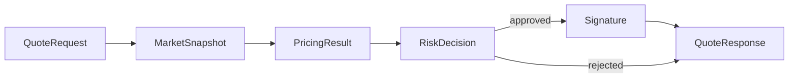
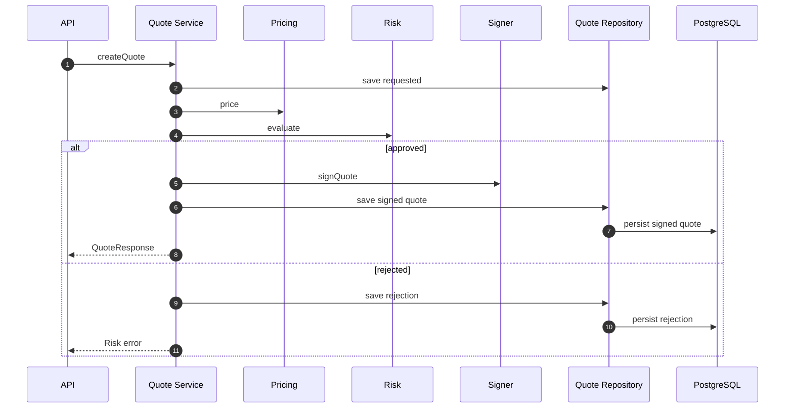
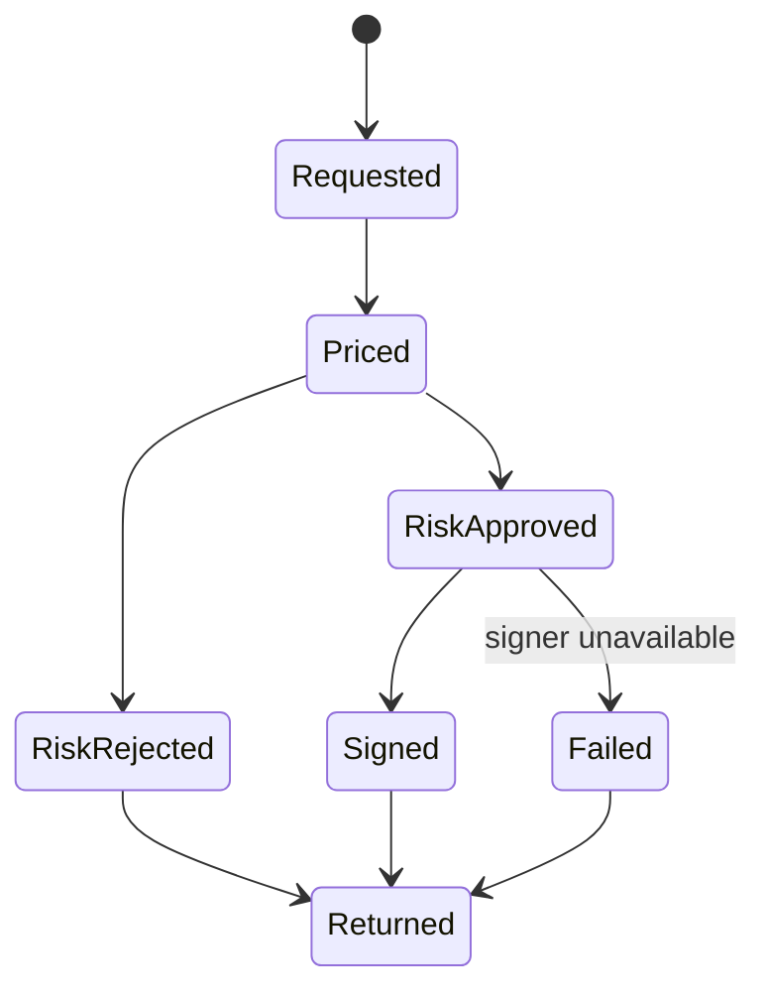

# Chapter 02: Quote Service

## Abstract

Quote Service 是 `/quote` 实时路径的编排者。它读取 market snapshot，调用 Pricing Engine，调用 Risk Engine，在风险通过后调用 Signer Service，并通过 Quote Repository 持久化 quote、snapshotId、pricingVersion 和 riskPolicyVersion。Quote Service 不能绕过 Risk Engine。

## Learning Objectives

- 理解 Quote Service 的编排职责。
- 明确 market data、pricing、risk、signer 的调用顺序。
- 定义 quote persistence 和 status。
- 识别 quote path 的性能瓶颈。

## Background

用户只看到一次 `/quote` 请求，但后端内部涉及多个决策步骤。Quote Service 把这些步骤串起来，并负责生成可审计上下文。

## Problem Statement

如果 Quote Service 未记录中间决策，后续无法解释报价。如果 Quote Service 在 signer 前没有强制风险检查，就破坏核心不变量。

## Requirements

### Functional Requirements

- 接收 `QuoteRequest`。
- 获取 `MarketSnapshot`。
- 调用 Pricing Engine。
- 调用 Risk Engine。
- 仅在风险批准后调用 Signer Service。
- 返回 `QuoteResponse`。
- 持久化 quote 和拒绝原因。

### Non-Functional Requirements

- quote path p99 延迟可监控。
- 每个 quote 有 `quoteId` 和 `snapshotId`。
- 风控拒绝必须可审计。
- Signer 不可用时不能返回签名。

## Existing Solutions

简单实现可能把定价、风控和签名写在一个函数里。生产系统需要编排层和决策层分离。

## Trade-Off Analysis

编排层增加代码结构，但让每个模块可测试、可替换。对于 RFQ，这是必要复杂度。

## System Design



## Architecture Diagram

Quote Service 依赖 Market Data、Pricing、Risk、Signer、Quote Repository 和 Metrics。当前代码使用 `InMemoryQuoteRepository` 跑通本地 skeleton；生产版应以同一接口替换为 PostgreSQL repository，并可用 Redis 做短 TTL quote cache。当前实现会在 pricing 和 signing 之前校验 market snapshot 的 `observedAt`，超过 freshness window 的 stale market data 会返回 `MARKET_DATA_UNAVAILABLE`，避免签出过期价格。

## Sequence Diagram



## State Machine



## Data Model

Quote record includes `quoteId`, `chainId`, `user`, `tokenIn`, `tokenOut`, `snapshotId`, `pricingVersion`, `riskPolicyVersion`, `signature`, `deadline`, `nonce`, `status`, `rejectCode` and optional `txHash`.

## API Design

Internal interface:

```ts
createQuote(request: QuoteRequest): Promise<QuoteResponse>
getQuoteStatus(quoteId: string): Promise<QuoteStatusResponse | undefined>
markQuoteStatus(quoteId, status, txHash): Promise<void>
```

## Engineering Decisions

- Risk before signing 是强制顺序。
- Quote Service 生成 quoteId。
- Rejected quote 也要记录。
- Risk Engine 抛错时按 fail-closed 处理，返回 `RISK_REJECTED`，内部拒绝原因为 `RISK_ENGINE_UNAVAILABLE`，不调用 Signer。
- Signer failure 映射为 503，并将已 requested 的 quote 标记为 `failed`，`errorCode` 记录 `SIGNER_UNAVAILABLE`，避免状态长期停留在 `requested`。
- `failed` quote 是终态，后续 `/submit` 必须返回 `QUOTE_FAILED`，不能重新进入 settlement path。
- Quote persistence 通过 `QuoteRepository` 抽象，避免编排层直接绑定 PostgreSQL 或内存 Map。

## Failure Scenarios

- Pricing unavailable：返回 `PRICING_UNAVAILABLE`，不调用 Signer，不返回签名。
- Risk rejected：返回 `RISK_REJECTED`。
- Risk engine unavailable：返回 `RISK_REJECTED`，记录 `RISK_ENGINE_UNAVAILABLE`，不调用 Signer，不返回签名。
- Signer unavailable：返回 `SIGNER_UNAVAILABLE`，quote 状态变为 `failed`。
- Persistence failed：不返回签名。
- Market data stale：不进入 pricing/risk/signer，直接返回 `MARKET_DATA_UNAVAILABLE`。

## Security Considerations

Quote Service 不能接受客户端传入 risk decision。Signer request 必须包含 quoteId、snapshotId 和 risk context。

## Performance Considerations

同步路径应避免慢查询。Pricing 和 Risk 依赖的上下文应缓存或预计算。

## Testing Strategy

测试 approved path、risk rejected、pricing failure、signer failure、persistence failure 和 metrics。

## Interview Notes

Quote Service 是编排层，不是“大而全”的业务类。它的核心价值是强制顺序和保留审计上下文。

## Summary

Quote Service 连接用户请求与 signed quote，是后端实时路径的中心，但它不拥有所有业务决策。

## References

- RFQ quote lifecycle
- Service orchestration
