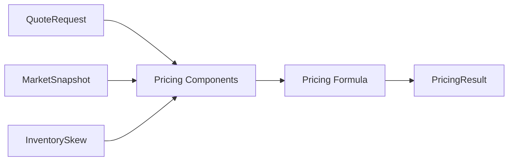
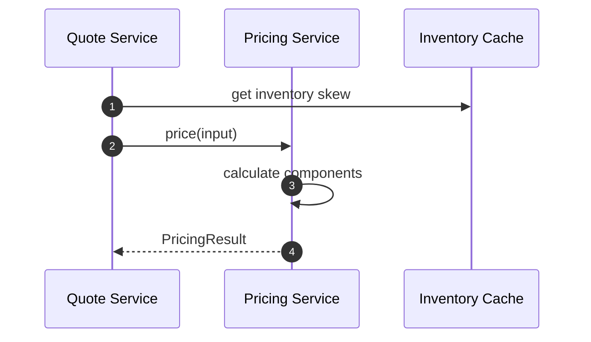
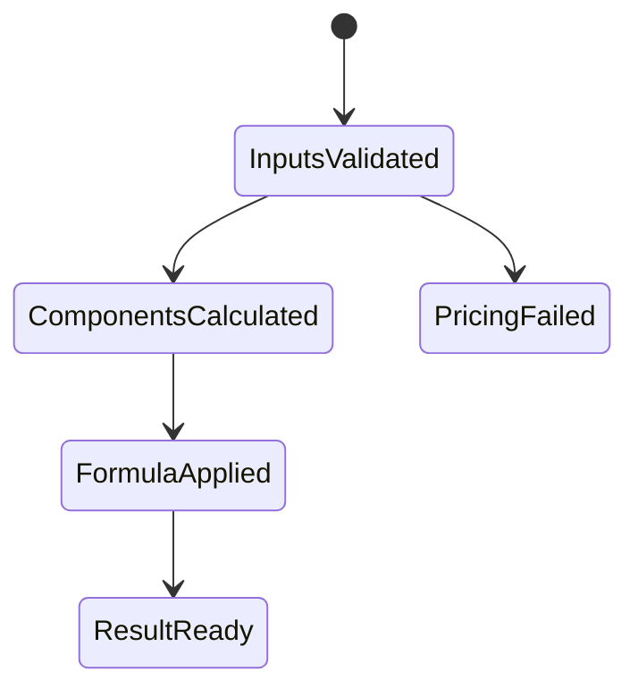

# Chapter 03: Pricing Service

## Abstract

Pricing Service 实现 Prop AMM 报价模型。它接收 QuoteRequest、MarketSnapshot 和 Inventory State，输出 amountOut、minAmountOut 和解释字段。Pricing Service 不决定是否签名，最终批准权在 Risk Service。

## Learning Objectives

- 理解 Pricing Service 的输入输出。
- 明确 pricing formula 与 risk limit 的边界。
- 说明 pricingVersion 的作用。
- 设计可测试的定价模块。

## Background

Volume2 已定义市场数据和定价公式。后端实现需要把这些设计转化为接口、纯函数和可观测结果。

## Problem Statement

如果定价逻辑散落在 Quote Service 中，后续很难替换模型、测试参数和做 PnL 归因。Pricing Service 必须独立。

## Requirements

### Functional Requirements

- 输入 request、snapshot、inventory skew。
- 计算 spread、size impact、volatility premium、hedge cost。
- 输出 amountOut、minAmountOut 和 pricingVersion。
- 支持模型版本切换。

### Non-Functional Requirements

- 定价函数应尽量纯函数化。
- 参数必须版本化。
- 中间解释字段必须记录。

## Existing Solutions

固定 spread 模型简单但不足。复杂机器学习模型难以解释。第一版使用可解释 bps 模型。

## Trade-Off Analysis

可解释模型比黑盒模型更适合开源参考实现和面试项目。后续可以在接口不变的情况下增强模型。

## System Design



## Architecture Diagram

Pricing Service 依赖 Market Data、Routing plan 和 Inventory projection，但不直接访问 Signer。Routing Engine 选择报价路径失败或返回 malformed route plan 时，Quote Service 应在调用 Pricing Service 前返回 `ROUTING_UNAVAILABLE`，避免 pricing adapter 在错误 token pair、错误 venue 或不可解释 liquidity 上继续生成可签名报价。

## Sequence Diagram



## State Machine



## Data Model

`PricingResult` includes amount fields and complete component bps fields. It matches backend `pricing.engine.ts` and keeps executable market spread, volatility plus hedge cost separate from inventory state.

当前 `formula-v4` 返回 `amountOut`、`minAmountOut`、`spreadBps`、`sizeImpactBps`、`marketSpreadBps`、`inventorySkewBps`、`volatilityPremiumBps`、`hedgeCostBps` 和 `pricingVersion`。`spreadBps` 表示聚合后的总报价调整；`marketSpreadBps` 表示快照中 mid 到当前 RFQ 方向外部最优可执行价格的成本，base-to-quote 使用 bid，quote-to-base 使用 inverse ask，并与 size impact、inventory、volatility 和 hedge failure pressure 独立保存。`amountOut` 和 `minAmountOut` 始终是 tokenOut base units。

## API Design

Internal interface:

```ts
price(input: PricingInput): Promise<PricingResult>
```

## Engineering Decisions

- Pricing Service 不调用 Signer。
- PricingResult 进入 Risk Service。
- pricingVersion、spreadBps、sizeImpactBps、marketSpreadBps、inventorySkewBps、volatilityPremiumBps 和 hedgeCostBps 写入 signed quote record，用于报价回放、风险审计和用户争议解释。
- Routing failure 是 quote dependency failure，不应落入通用 500，也不应继续执行 pricing/risk/signer。
- Routing input is validated before route-plan creation: malformed root payloads and missing required own top-level `request` / `snapshot` fields fail before nested field access, then request and routing snapshot required fields must be own fields before request chain id、user/token addresses、distinct token pair、canonical positive `amountIn` without leading zeros、bounded `slippageBps`, `snapshot.snapshotId` as a primitive-string `SafeIdentifier` with 1-128 characters, and snapshot mid price / canonical liquidity / market spread / volatility are checked. Direct routing callers cannot pass inherited object properties or boxed `String` wrappers and rely on JavaScript regex coercion before route-plan creation.
- Pricing input is validated before formula execution: malformed root payloads and missing required own top-level `request` / `snapshot` / `routePlan` / `inventorySkewBps` / `hedgeCostBps` fields fail before nested field access, then request, snapshot and route-plan required fields must be own fields before request addresses and amounts, `snapshot.snapshotId` and `routePlan.routeId` as primitive-string `SafeIdentifier` values with 1-128 characters, market fields, route venue/liquidity, route token pair alignment, slippage bps, inventory skew and hedge cost bounds are checked. Snapshot mid price must be a canonical positive decimal string without leading zeros, and request amount plus liquidity fields must be real strings in canonical decimal form without leading zeros, so internal callers cannot bypass `/quote` validation with inherited object properties, boxed `String` wrappers, JavaScript regex coercion or alternate numeric encodings before pricing math runs.
- `FormulaPricingEngine` rejects malformed pricing config objects and inherited config fields before reading numeric fields, then snapshots `FormulaPricingConfig` at construction after validation. External callers must not be able to mutate base spread, inventory buffer, volatility divisor or adjustment caps after construction and silently change quote economics.
- `ConfiguredTokenRegistry` 在启动时 exact-field 校验 `chainId/tokenAddress/symbol/decimals/isWhitelisted/riskTier/usdReference`，拒绝 chain/address 重复项并复制配置。Pricing Engine 对每个请求重新按 chain/address 解析两侧 metadata，缺失、禁用、返回错 token 或 malformed custom registry output 都 fail closed。
- `formula-v4` 把 human tokenOut-per-tokenIn price 转为 tokenOut base units，最多接受 18 位价格小数且不静默截断。size impact 使用 rational USD notional；两侧均非 USD reference 的 pair 在具备独立 USD valuation feed 前不报价。

## Failure Scenarios

- Snapshot stale：pricing failed。
- Routing unavailable：return `ROUTING_UNAVAILABLE` before pricing。
- Decimals missing：pricing failed。
- amountOut zero：pricing failed。
- Guardrail exceeded：pricing failed or risk rejected。

## Security Considerations

定价参数是策略信息，不应通过公开 API 暴露。内部日志需要脱敏。

## Performance Considerations

实时定价应避免 IO 密集操作，依赖预加载 snapshot 和缓存 inventory。

## Testing Strategy

测试 fixed inputs、component bps、slippage、decimals、guardrails 和 pricingVersion。

## Interview Notes

Pricing Service 给出价格，不代表可以签名。Risk Service 是签名前 gate。

## Summary

Pricing Service 是 Prop AMM 的工程实现边界，输出必须可解释并可被 Risk Service 审查。

## References

- Volume2 Market Data And Pricing
- Inventory-based pricing
